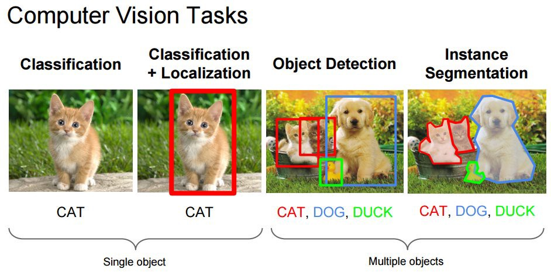
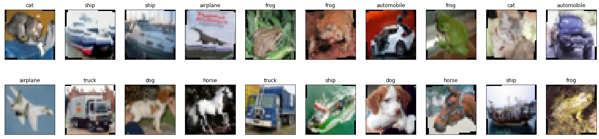
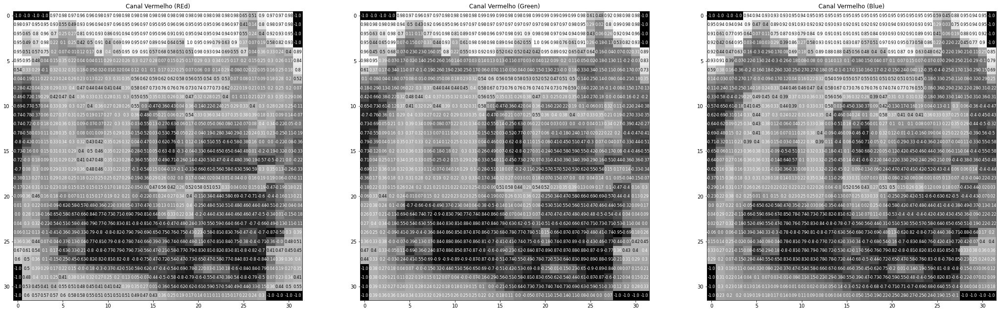
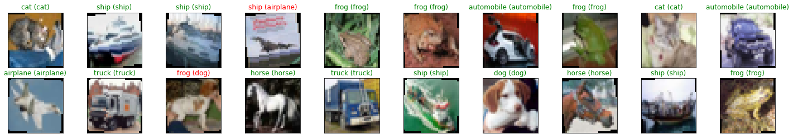

## Machine Learning


```python
# Versão da Linguagem Python
from platform import python_version
print("Versão da Linguagem Python Usada Neste Jupyter Notebook: ", python_version())
```

    Versão da Linguagem Python Usada Neste Jupyter Notebook:  3.9.4


### Classificação de Imagens com Deep Learning e PyTorch


## Definição do Problema



## Instalando e Carregando os Pacotes


```python
# import Packega
import torch
import torchvision
import torch.nn as nn
import torch.optim as optim
import torch.nn.functional as F
import torchvision.transforms as transforms
from torchvision import datasets
from torch.utils.data.sampler import SubsetRandomSampler
import numpy as np
import matplotlib
import matplotlib.pyplot as plt
import tensorflow
import warnings
warnings.filterwarnings("ignore")
%matplotlib inline
```

    INFO:tensorflow:Enabling eager execution
    INFO:tensorflow:Enabling v2 tensorshape
    INFO:tensorflow:Enabling resource variables
    INFO:tensorflow:Enabling tensor equality
    INFO:tensorflow:Enabling control flow v2


```python
# Versões dos pacotes usados neste jupyter notebook
%reload_ext watermark
%watermark -a "Rodolfo Terra | Ciência de Dados" --iversions
```

    Author: Rodolfo Terra | Ciência de Dados
    
    torchvision: 0.9.1
    tensorflow : 2.5.0rc0
    numpy      : 1.19.5
    torch      : 1.8.1
    matplotlib : 3.4.1


​    

### Verificando a GPU

Pode ser útil acelerar o tempo de treinamento usando uma GPU. CUDA é uma plataforma da Nvidia que permite usarmos as GPUs (Nvidia) para processamento paralelo). Os frameworks de Deep Learning dependem da plataforma CUDA para o processamento em GPU.


```python
# Executar somente se a máquina tiver GPU e Plataforma CUDA instalada
#!nvidia-smi
```


```python
# Verificando se a plataforma CUDA está disponível
train_on_gpu = torch.cuda.is_available()
```


```python
# Mensgagem para o usurário
if not train_on_gpu:
    print("Plataforma CUDA não está disponível! O treinamento será realizado com a CPU...")
else:
    print("Plataforma CUDA está dfisponível! O treinamento será realizado com a GPU...")
```

    Plataforma CUDA não está disponível! O treinamento será realizado com a CPU...


## Checando o Hardware Disponível no Servidor - CPU E GPUs


```python
# Lista todos os dispositivos disponíveis
from tensorflow.python.client import device_lib
print(device_lib.list_local_devices())
```

    [name: "/device:CPU:0"
    device_type: "CPU"
    memory_limit: 268435456
    locality {
    }
    incarnation: 5198956467157036812
    ]


```python
print("Número Disponível de GPUs:", len(tensorflow.config.experimental.list_physical_devices("GPU")))
print("Número Disponível de CPUs:", len(tensorflow.config.experimental.list_physical_devices("CPU")))
```

    Número Disponível de GPUs: 0
    Número Disponível de CPUs: 1


```python
tensorflow.config.experimental.list_physical_devices("CPU")
```


    [PhysicalDevice(name='/physical_device:CPU:0', device_type='CPU')]


## Carregando o Dataset

http://pytorch.org/docs/stable/torchvision/datasets.html

O download pode demorar um minuto. Carregamos os dados de treinamento e teste, dividimos os dados de treinamento em um conjunto de treinamento e validação e, em seguida, criamos DataLoaders para cada um desses conjuntos de dados.

Dataset usado: https://www.cs.toronto.edu/~kriz/cifar.html


```python
# Função que converte os dados em um tensor normalizado
transform = transforms.Compose([transforms.RandomHorizontalFlip(), # Randomização horizontal
                             transforms.RandomRotation(10), # Randomização na rotação
                             transforms.ToTensor(), # converter as imagen em tensor
                             transforms.Normalize((0.5, 0.5, 0.5), (0.5, 0.5, 0.5))])  # normalizar as imagens
```


```python
# Download dos Dados treinado
dados_treino = datasets.CIFAR10('dados',
                                 train = True,
                                 download = True,
                                 transform = transform)
```

    Files already downloaded and verified


```python
dados_teste = datasets.CIFAR10('dados',
                                 train = False,
                                 download = True,
                                 transform = transform)
```

    Files already downloaded and verified


## Preparando os Dados Loaders


```python
# Dados de Treino
dados_treino
```


    Dataset CIFAR10
        Number of datapoints: 50000
        Root location: dados
        Split: Train
        StandardTransform
    Transform: Compose(
                   RandomHorizontalFlip(p=0.5)
                   RandomRotation(degrees=[-10.0, 10.0], interpolation=nearest, expand=False, fill=0)
                   ToTensor()
                   Normalize(mean=(0.5, 0.5, 0.5), std=(0.5, 0.5, 0.5))
               )


```python
# Dados de Teste
dados_teste
```


    Dataset CIFAR10
        Number of datapoints: 10000
        Root location: dados
        Split: Test
        StandardTransform
    Transform: Compose(
                   RandomHorizontalFlip(p=0.5)
                   RandomRotation(degrees=[-10.0, 10.0], interpolation=nearest, expand=False, fill=0)
                   ToTensor()
                   Normalize(mean=(0.5, 0.5, 0.5), std=(0.5, 0.5, 0.5))
               )


```python
# Número de amostra de treino
num_amostra_treino = len(dados_treino)
num_amostra_treino
```


    50000


```python
# Criando um índice e o tornamos rendômico
indices = list(range(num_amostra_treino))
np.random.shuffle(indices)
```


```python
# Percentual dos dados de treino que usaremos no dataset de validação
valid_size = 0.2
```


```python
# Agora fazemos o split para os dados de trino e validação
split = int(np.floor(valid_size * num_amostra_treino))
idx_treino, idx_valid = indices[split:], indices[:split]
```


```python
# Definimos as amostras de treino
amostras_treino = SubsetRandomSampler(idx_treino)
```


```python
# Definimos as amostras de validação
amostras_valid = SubsetRandomSampler(idx_valid)
```

#### Agora preparamos os data loaders


```python
# Número de subprocessos para carregar os dados
num_workers = 0

# Número de amostras por batch
batch_size = 20
```


```python
# Data Loader de dados de Treino
loader_treino = torch.utils.data.DataLoader(dados_treino,
                                           batch_size = batch_size,
                                           sampler = amostras_treino,
                                           num_workers = num_workers)
```


```python
# Data Loader de dados de Validação
loader_valid = torch.utils.data.DataLoader(dados_treino,
                                           batch_size = batch_size,
                                           sampler = amostras_valid,
                                           num_workers = num_workers)
```


```python
# Data Loader de dados de Teste
loader_teste = torch.utils.data.DataLoader(dados_teste,
                                           batch_size = batch_size,
                                           num_workers = num_workers)
```


```python
# Lista de classes das imagens
classes = ['airplane', 'automobile', 'bird', 'cat', 'deer', 'dog', 'frog', 'horse', 'ship', 'truck']
```

## Visualizando os Dados


```python
# Função para desnormalização das imagens
def imshow(img):
    
    # Desfaz a normalização
    img = img / 2 + 0.5
    
    # Converte en tensor e imprime
    plt.imshow(np.transpose(img, (1, 2, 0)))
```


```python
# Obtém um batch de dados de treino
dataiter = iter(loader_treino)
imagens, labels = dataiter.next()
```


```python
# Converte as imagens em formato NumPy
imagens = imagens.numpy()
```


```python
# Plot de um batch de imagens de treino

# Área de plotagem
fig = plt.figure(figsize = (25, 6))

# Loop e print
for idx in np.arange(20):
    
    # Cria os subplot
    ax = fig.add_subplot(2, 20/2, idx + 1, xticks=[], yticks=[])
    
    #Desfgaz a normalização
    imshow(imagens[idx])
    
    #Coloca o título
    ax.set_title(classes[labels[idx]])
```



    


## Visualizar uma imagem com mais detalhe


```python
# Extraímops os canais de cores
rgb_img = np.squeeze(imagens[11])
channels = ['Canal Vermelho (REd)', "Canal Vermelho (Green)", "Canal Vermelho (Blue)"]
```


```python
# Loop e print

# Área de plotagem
fig = plt.figure(figsize = (36, 36))

# Loop pelas imaghens
for idx in np.arange(rgb_img.shape[0]):
    
    # Subplot
    ax = fig.add_subplot(1,3, idx + 1)
    
    # Índice
    img  = rgb_img[idx]
    
    # Mostra a imagem em escala de cinza
    ax.imshow(img, cmap = 'gray')
    
    # Título 
    ax.set_title(channels[idx])
    
    # Largura e altura da imagem
    width, height = img.shape
    
    #Limite
    thresh = img.max()/2.5
    
    # Loop
    for x in range(width):
        for y in range(height):
            val = round(img[x][y],2) if img[x][y] !=0 else 0
            ax.annotate(str(val),
                       xy = (y,x),
                       horizontalalignment = 'center',
                       verticalalignment = 'center',
                       size = 8,
                       color = 'white' if img[x][y] < thresh else 'black')
    
```



    


## Definindo a Arquitetura da Rede

http://pytorch.org/docs/stable/nn.html

Vamos definir uma arquitetura CNN (Convolutional Neural Network). 

* [Camadas convolucionais](https://pytorch.org/docs/stable/nn.html#conv2d), podem ser consideradas como uma pilha de imagens filtradas.

* [Camadas de Maxpool](https://pytorch.org/docs/stable/nn.html#maxpool2d), reduzem o tamanho x-y de uma entrada, mantendo apenas os pixels mais _ativos_ da camada anterior.

* As camadas Linear + Dropout podem evitar sobreajuste e produzir uma saída de 10 dimensões.


```python
# Arquitetura do Modelo
class ModeloCNN(nn.Module):
    
    # Método construtor
    def __init__(self):
        super(ModeloCNN, self).__init__()
        
        # Camada Convolucional de entrada 
        self.conv1 = nn.Conv2d(3, 16, 3, padding = 1)
        
        # Camada Convolucional oculta 
        self.conv2 = nn.Conv2d(16, 32, 3, padding = 1)
        
        # Camada Convolucional oculta 
        self.conv3 = nn.Conv2d(32, 64, 3, padding = 1)
        
        # Camada de Max Pooling
        self.pool = nn.MaxPool2d(2, 2)
        
        # Camada Totalmente Conectada 1
        self.fc1 = nn.Linear(64 * 4 * 4, 500)
        
        # Camada Totalmente Conectada 2
        self.fc2 = nn.Linear(500, 10)
        
        # Camada de Dropout (Regularização)
        self.dropout = nn.Dropout(0.5)

    # Método Forward
    def forward(self, x):
        
        # Adiciona uma camada de ativação Relu para cada camada convolucional
        x = self.pool(F.relu(self.conv1(x)))
        x = self.pool(F.relu(self.conv2(x)))
        x = self.pool(F.relu(self.conv3(x)))
        
        # Faz o "achatamento" da matriz resultante da convolução e cria um vetor
        x = x.view(-1, 64 * 4 * 4)
        
        # Adiciona uma camada de dropout para regularização
        x = self.dropout(x)
        
        # Adiciona a 1ª camada oculta, com função de ativação relu
        x = F.relu(self.fc1(x))
        
        # Adiciona uma camada de dropout para regularização
        x = self.dropout(x)
        
        # Adiciona a 2ª camada oculta (classificação feita pelo modelo)
        x = self.fc2(x)
        return x
```


```python
# Cria o modelo
modelo = ModeloCNN() ; print(modelo)
```

    ModeloCNN(
      (conv1): Conv2d(3, 16, kernel_size=(3, 3), stride=(1, 1), padding=(1, 1))
      (conv2): Conv2d(16, 32, kernel_size=(3, 3), stride=(1, 1), padding=(1, 1))
      (conv3): Conv2d(32, 64, kernel_size=(3, 3), stride=(1, 1), padding=(1, 1))
      (pool): MaxPool2d(kernel_size=2, stride=2, padding=0, dilation=1, ceil_mode=False)
      (fc1): Linear(in_features=1024, out_features=500, bias=True)
      (fc2): Linear(in_features=500, out_features=10, bias=True)
      (dropout): Dropout(p=0.5, inplace=False)
    )


```python
# Movemos o modelo para a GPU se disponível ou CPU
if train_on_gpu:
    modelo.cuda()
```

## Função de perda


```python
# Loss function como categorical cross-entropy
criterion = nn.CrossEntropyLoss()
```

## Otimizar


```python
# Hiperparâmtero
taxa_aprendizado = 0.01
```


```python
# Otimizador com SGD
optimizer = optim.SGD(modelo.parameters(), lr = taxa_aprendizado)
```

## Treinamento

Lembre-se de observar como a perda em treinamento e validação diminui com o tempo; se a perda em validação aumentar, isso indica um possível sobreajuste (overfitting)


```python
# Número de épocas para treinar o modelo
num_epochs = 70
```


```python
# hiperparâmetro para controlar a ,mudança do erro em validação
erro_valid_min = np.Inf
```

#### Treinando o modelo 


```python
%%time
for epoch in range(1, num_epochs + 1):

    # Parâmetros para acompanhar o erro total em treinamento e validação
    erro_treino = 0.0
    erro_valid = 0.0
    
    # Inicia o treinamento do modelo
    modelo.train()
    
    # Loop pelos batches de dados de treino
    for batch_idx, (data, target) in enumerate(loader_treino):
        
        # Move os tensores para a GPU se disponível
        if train_on_gpu:
            data, target = data.cuda(), target.cuda()
        
        # Limpa os gradientes de todas as variáveis otimizadas
        optimizer.zero_grad()
        
        # Forward: calcula as saídas previstas
        output = modelo(data)
        
        # Calcula o erro no batch
        loss = criterion(output, target)
        
        # Backward: calcula o gradiente da perda em relação aos parâmetros do modelo
        loss.backward()
        
        # Realiza uma única etapa de otimização (atualização dos parâmetros)
        optimizer.step()
        
        # Atualiza o erro total em treino
        erro_treino += loss.item() * data.size(0)
        
    # Inicia a validação do modelo
    modelo.eval()
    
    # Loop pelos batches de dados de validação
    for batch_idx, (data, target) in enumerate(loader_valid):
        
        # Move os tensores para a GPU se disponível
        if train_on_gpu:
            data, target = data.cuda(), target.cuda()
        
        # Forward: calcula as saídas previstas
        output = modelo(data)
        
        # Calcula o erro no batch
        loss = criterion(output, target)
        
        # Atualiza o erro total de validação
        erro_valid += loss.item() * data.size(0)
    
    # Calcula o erro médio
    erro_treino = erro_treino / len(loader_treino.dataset)
    erro_valid = erro_valid / len(loader_valid.dataset)
        
    # Print
    print('\nEpoch: {} \tErro em Treinamento: {:.6f} \tErro em Validação: {:.6f}'.format(epoch, 
                                                                                         erro_treino, 
                                                                                         erro_valid))
    
    # Salva o modelo sempre que a perda em validação diminuir
    if erro_valid <= erro_valid_min:
        print('Erro em Validação foi Reduzido ({:.6f} --> {:.6f}). Salvando o modelo...'.format(erro_valid_min,
                                                                                                 erro_valid))
        torch.save(modelo.state_dict(), 'modelos/modelo_final.pt')
        erro_valid_min = erro_valid
```


    Epoch: 1 	Erro em Treinamento: 1.218102 	Erro em Validação: 0.238239
    Erro em Validação foi Reduzido (inf --> 0.238239). Salvando o modelo...
    
    Epoch: 2 	Erro em Treinamento: 1.210779 	Erro em Validação: 0.235755
    Erro em Validação foi Reduzido (0.238239 --> 0.235755). Salvando o modelo...
    
    Epoch: 3 	Erro em Treinamento: 1.201173 	Erro em Validação: 0.234992
    Erro em Validação foi Reduzido (0.235755 --> 0.234992). Salvando o modelo...
    
    Epoch: 4 	Erro em Treinamento: 1.193852 	Erro em Validação: 0.232532
    Erro em Validação foi Reduzido (0.234992 --> 0.232532). Salvando o modelo...
    
    Epoch: 5 	Erro em Treinamento: 1.182027 	Erro em Validação: 0.236036
    
    Epoch: 6 	Erro em Treinamento: 1.172761 	Erro em Validação: 0.228521
    Erro em Validação foi Reduzido (0.232532 --> 0.228521). Salvando o modelo...
    
    Epoch: 7 	Erro em Treinamento: 1.148507 	Erro em Validação: 0.226475
    Erro em Validação foi Reduzido (0.228521 --> 0.226475). Salvando o modelo...
    
    Epoch: 8 	Erro em Treinamento: 1.151190 	Erro em Validação: 0.224620
    Erro em Validação foi Reduzido (0.226475 --> 0.224620). Salvando o modelo...
    
    Epoch: 9 	Erro em Treinamento: 1.139415 	Erro em Validação: 0.222992
    Erro em Validação foi Reduzido (0.224620 --> 0.222992). Salvando o modelo...
    
    Epoch: 10 	Erro em Treinamento: 1.132095 	Erro em Validação: 0.222469
    Erro em Validação foi Reduzido (0.222992 --> 0.222469). Salvando o modelo...
    
    Epoch: 11 	Erro em Treinamento: 1.110534 	Erro em Validação: 0.222724
    
    Epoch: 12 	Erro em Treinamento: 1.107487 	Erro em Validação: 0.215979
    Erro em Validação foi Reduzido (0.222469 --> 0.215979). Salvando o modelo...
    
    Epoch: 13 	Erro em Treinamento: 1.095799 	Erro em Validação: 0.217484
    
    Epoch: 14 	Erro em Treinamento: 1.095472 	Erro em Validação: 0.214241
    Erro em Validação foi Reduzido (0.215979 --> 0.214241). Salvando o modelo...
    
    Epoch: 15 	Erro em Treinamento: 1.093768 	Erro em Validação: 0.210750
    Erro em Validação foi Reduzido (0.214241 --> 0.210750). Salvando o modelo...
    
    Epoch: 16 	Erro em Treinamento: 1.073101 	Erro em Validação: 0.210665
    Erro em Validação foi Reduzido (0.210750 --> 0.210665). Salvando o modelo...
    
    Epoch: 17 	Erro em Treinamento: 1.065585 	Erro em Validação: 0.214959
    
    Epoch: 18 	Erro em Treinamento: 1.076112 	Erro em Validação: 0.210174
    Erro em Validação foi Reduzido (0.210665 --> 0.210174). Salvando o modelo...
    
    Epoch: 19 	Erro em Treinamento: 1.053909 	Erro em Validação: 0.206660
    Erro em Validação foi Reduzido (0.210174 --> 0.206660). Salvando o modelo...
    
    Epoch: 20 	Erro em Treinamento: 1.045528 	Erro em Validação: 0.206801
    
    Epoch: 21 	Erro em Treinamento: 1.029394 	Erro em Validação: 0.207000
    
    Epoch: 22 	Erro em Treinamento: 1.038549 	Erro em Validação: 0.202217
    Erro em Validação foi Reduzido (0.206660 --> 0.202217). Salvando o modelo...
    
    Epoch: 23 	Erro em Treinamento: 1.022304 	Erro em Validação: 0.205551
    
    Epoch: 24 	Erro em Treinamento: 1.017999 	Erro em Validação: 0.203446
    
    Epoch: 25 	Erro em Treinamento: 1.001646 	Erro em Validação: 0.198571
    Erro em Validação foi Reduzido (0.202217 --> 0.198571). Salvando o modelo...
    
    Epoch: 26 	Erro em Treinamento: 1.006233 	Erro em Validação: 0.197526
    Erro em Validação foi Reduzido (0.198571 --> 0.197526). Salvando o modelo...
    
    Epoch: 27 	Erro em Treinamento: 0.992239 	Erro em Validação: 0.196990
    Erro em Validação foi Reduzido (0.197526 --> 0.196990). Salvando o modelo...
    
    Epoch: 28 	Erro em Treinamento: 0.986836 	Erro em Validação: 0.198809
    
    Epoch: 29 	Erro em Treinamento: 0.988771 	Erro em Validação: 0.201224
    
    Epoch: 30 	Erro em Treinamento: 0.976320 	Erro em Validação: 0.196676
    Erro em Validação foi Reduzido (0.196990 --> 0.196676). Salvando o modelo...
    
    Epoch: 31 	Erro em Treinamento: 0.967539 	Erro em Validação: 0.196591
    Erro em Validação foi Reduzido (0.196676 --> 0.196591). Salvando o modelo...
    
    Epoch: 32 	Erro em Treinamento: 0.959823 	Erro em Validação: 0.193129
    Erro em Validação foi Reduzido (0.196591 --> 0.193129). Salvando o modelo...
    
    Epoch: 33 	Erro em Treinamento: 0.953015 	Erro em Validação: 0.193412
    
    Epoch: 34 	Erro em Treinamento: 0.948308 	Erro em Validação: 0.194294
    
    Epoch: 35 	Erro em Treinamento: 0.949923 	Erro em Validação: 0.192389
    Erro em Validação foi Reduzido (0.193129 --> 0.192389). Salvando o modelo...
    
    Epoch: 36 	Erro em Treinamento: 0.938575 	Erro em Validação: 0.189360
    Erro em Validação foi Reduzido (0.192389 --> 0.189360). Salvando o modelo...
    
    Epoch: 37 	Erro em Treinamento: 0.930209 	Erro em Validação: 0.188520
    Erro em Validação foi Reduzido (0.189360 --> 0.188520). Salvando o modelo...
    
    Epoch: 38 	Erro em Treinamento: 0.912987 	Erro em Validação: 0.194107
    
    Epoch: 39 	Erro em Treinamento: 0.929633 	Erro em Validação: 0.187772
    Erro em Validação foi Reduzido (0.188520 --> 0.187772). Salvando o modelo...
    
    Epoch: 40 	Erro em Treinamento: 0.919359 	Erro em Validação: 0.192839
    
    Epoch: 41 	Erro em Treinamento: 0.909318 	Erro em Validação: 0.188233
    
    Epoch: 42 	Erro em Treinamento: 0.899597 	Erro em Validação: 0.187917
    
    Epoch: 43 	Erro em Treinamento: 0.907485 	Erro em Validação: 0.187269
    Erro em Validação foi Reduzido (0.187772 --> 0.187269). Salvando o modelo...
    
    Epoch: 44 	Erro em Treinamento: 0.913502 	Erro em Validação: 0.187876
    
    Epoch: 45 	Erro em Treinamento: 0.892902 	Erro em Validação: 0.186106
    Erro em Validação foi Reduzido (0.187269 --> 0.186106). Salvando o modelo...
    
    Epoch: 46 	Erro em Treinamento: 0.895947 	Erro em Validação: 0.191024
    
    Epoch: 47 	Erro em Treinamento: 0.878869 	Erro em Validação: 0.184607
    Erro em Validação foi Reduzido (0.186106 --> 0.184607). Salvando o modelo...
    
    Epoch: 48 	Erro em Treinamento: 0.878043 	Erro em Validação: 0.188318
    
    Epoch: 49 	Erro em Treinamento: 0.878185 	Erro em Validação: 0.183968
    Erro em Validação foi Reduzido (0.184607 --> 0.183968). Salvando o modelo...
    
    Epoch: 50 	Erro em Treinamento: 0.864358 	Erro em Validação: 0.182421
    Erro em Validação foi Reduzido (0.183968 --> 0.182421). Salvando o modelo...
    
    Epoch: 51 	Erro em Treinamento: 0.867398 	Erro em Validação: 0.184123
    
    Epoch: 52 	Erro em Treinamento: 0.857139 	Erro em Validação: 0.183512
    
    Epoch: 53 	Erro em Treinamento: 0.865112 	Erro em Validação: 0.179748
    Erro em Validação foi Reduzido (0.182421 --> 0.179748). Salvando o modelo...
    
    Epoch: 54 	Erro em Treinamento: 0.853092 	Erro em Validação: 0.182766
    
    Epoch: 55 	Erro em Treinamento: 0.852006 	Erro em Validação: 0.178903
    Erro em Validação foi Reduzido (0.179748 --> 0.178903). Salvando o modelo...
    
    Epoch: 56 	Erro em Treinamento: 0.847562 	Erro em Validação: 0.180624
    
    Epoch: 57 	Erro em Treinamento: 0.843911 	Erro em Validação: 0.176786
    Erro em Validação foi Reduzido (0.178903 --> 0.176786). Salvando o modelo...
    
    Epoch: 58 	Erro em Treinamento: 0.840094 	Erro em Validação: 0.178135
    
    Epoch: 59 	Erro em Treinamento: 0.830691 	Erro em Validação: 0.179541
    
    Epoch: 60 	Erro em Treinamento: 0.832808 	Erro em Validação: 0.178511
    
    Epoch: 61 	Erro em Treinamento: 0.814541 	Erro em Validação: 0.176940
    
    Epoch: 62 	Erro em Treinamento: 0.814334 	Erro em Validação: 0.178289
    
    Epoch: 63 	Erro em Treinamento: 0.823440 	Erro em Validação: 0.182315
    
    Epoch: 64 	Erro em Treinamento: 0.812947 	Erro em Validação: 0.175465
    Erro em Validação foi Reduzido (0.176786 --> 0.175465). Salvando o modelo...
    
    Epoch: 65 	Erro em Treinamento: 0.811045 	Erro em Validação: 0.175888
    
    Epoch: 66 	Erro em Treinamento: 0.796933 	Erro em Validação: 0.177917
    
    Epoch: 67 	Erro em Treinamento: 0.809892 	Erro em Validação: 0.176426
    
    Epoch: 68 	Erro em Treinamento: 0.793385 	Erro em Validação: 0.173572
    Erro em Validação foi Reduzido (0.175465 --> 0.173572). Salvando o modelo...
    
    Epoch: 69 	Erro em Treinamento: 0.788577 	Erro em Validação: 0.177565
    
    Epoch: 70 	Erro em Treinamento: 0.806566 	Erro em Validação: 0.175011
    Wall time: 23min 28s


## Carrega o Modelo Final


```python
# Carrega o modelo 
modelo.load_state_dict(torch.load('modelos/modelo_final.pt'))
```


    <All keys matched successfully>


## Testando e Avaliando o Modelo

Testamos o modelo treinado em dados nunca visto anteriormente! Um resultado "bom" será uma CNN que obtenha cerca de 70% (ou mais) de precisão nas imagens de teste.


```python
# Erro em teste
erro_teste = 0.0
```


```python
# Controle de acerto do modelo
class_correct = list(0. for i in range(10))
class_total = list(0. for i in range(10))
```


```python
# Inicia a avaliação do modelo
modelo.eval()

# Loop pelos batches de dados de teste
for batch_idx, (data, target) in enumerate(loader_teste):
    
    # Move os tensores para GPU se disponível
    if train_on_gpu:
        data, target = data.cuda(), target.cuda()
    
    # Forward
    output = modelo(data)
    
    # Calcula o erro
    loss = criterion(output, target)
    
    # Atualiza o erro em teste
    erro_teste += loss.item() * data.size(0)
    
    # Converte probabilidades de saída em classe prevista
    _, pred = torch.max(output, 1)    
    
    # Compara as previsões com o rótulo verdadeiro
    correct_tensor = pred.eq(target.data.view_as(pred))
    correct = np.squeeze(correct_tensor.numpy()) if not train_on_gpu else np.squeeze(correct_tensor.cpu().numpy())
    
    # Calcula a precisão do teste para cada classe
    for i in range(batch_size):
        label = target.data[i]
        class_correct[label] += correct[i].item()
        class_total[label] += 1

# Erro médio em teste
erro_teste = erro_teste / len(loader_teste.dataset)
print('\nErro em Teste: {:.6f}\n'.format(erro_teste))

# Calcula a acurácia para cada classe
for i in range(10):
    if class_total[i] > 0:
        print('Acurácia em Teste da classe %5s: %2d%% (%2d/%2d)' % (classes[i], 
                                                             100 * class_correct[i] / class_total[i],
                                                             np.sum(class_correct[i]), 
                                                             np.sum(class_total[i])))
    else:
        print('Acurácia em Teste de %5s:)' % (classes[i]))

# Calcula a acurácia total
print('\nAcurácia em Teste (Total): %2d%% (%2d/%2d)' % (100. * np.sum(class_correct) / np.sum(class_total),
                                                        np.sum(class_correct), 
                                                        np.sum(class_total)))
```


    Erro em Teste: 0.586590
    
    Acurácia em Teste da classe airplane: 83% (837/1000)
    Acurácia em Teste da classe automobile: 93% (938/1000)
    Acurácia em Teste da classe  bird: 70% (707/1000)
    Acurácia em Teste da classe   cat: 65% (652/1000)
    Acurácia em Teste da classe  deer: 78% (785/1000)
    Acurácia em Teste da classe   dog: 74% (746/1000)
    Acurácia em Teste da classe  frog: 89% (894/1000)
    Acurácia em Teste da classe horse: 83% (832/1000)
    Acurácia em Teste da classe  ship: 93% (938/1000)
    Acurácia em Teste da classe truck: 83% (830/1000)
    
    Acurácia em Teste (Total): 81% (8159/10000)


## Previsões com Modelo Treinado


```python
# Obtém um batch de dados de teste
dataiter = iter(loader_teste)
images, labels = dataiter.next()
images.numpy()
```


    array([[[[-1.        , -1.        , -1.        , ...,  0.18431377,
               0.19215691, -1.        ],
             [-0.01176471,  0.07450986,  0.12156868, ...,  0.18431377,
               0.18431377, -1.        ],
             [-0.01960784,  0.06666672,  0.12156868, ...,  0.21568632,
               0.21568632, -1.        ],
             ...,
             [-1.        , -0.6       , -0.88235295, ..., -0.6627451 ,
              -0.7254902 , -0.6156863 ],
             [-1.        , -0.6862745 , -0.8980392 , ..., -0.6627451 ,
              -0.64705884, -0.56078434],
             [-1.        , -0.84313726, -0.77254903, ..., -1.        ,
              -1.        , -1.        ]],
    
            [[-1.        , -1.        , -1.        , ..., -0.1372549 ,
              -0.12156862, -1.        ],
             [-0.2862745 , -0.25490195, -0.23921567, ..., -0.14509803,
              -0.1372549 , -1.        ],
             [-0.2862745 , -0.25490195, -0.23137254, ..., -0.1372549 ,
              -0.1607843 , -1.        ],
             ...,
             [-1.        , -0.27058822, -0.5294118 , ..., -0.2862745 ,
              -0.3333333 , -0.19999999],
             [-1.        , -0.3333333 , -0.4980392 , ..., -0.32549018,
              -0.30196077, -0.17647058],
             [-1.        , -0.4980392 , -0.35686272, ..., -1.        ,
              -1.        , -1.        ]],
    
            [[-1.        , -1.        , -1.        , ..., -0.6862745 ,
              -0.6       , -1.        ],
             [-0.7176471 , -0.7176471 , -0.7019608 , ..., -0.7411765 ,
              -0.6313726 , -1.        ],
             [-0.7490196 , -0.75686276, -0.73333335, ..., -0.7490196 ,
              -0.6862745 , -1.        ],
             ...,
             [-1.        ,  0.06666672, -0.19215685, ...,  0.12156868,
               0.03529418,  0.16078436],
             [-1.        , -0.00392157, -0.15294117, ...,  0.05098045,
               0.03529418,  0.1686275 ],
             [-1.        , -0.1607843 , -0.01176471, ..., -1.        ,
              -1.        , -1.        ]]],


​    
           [[[-1.        , -1.        , -1.        , ...,  0.8352941 ,
              -1.        , -1.        ],
             [-1.        , -1.        , -1.        , ...,  0.84313726,
              -1.        , -1.        ],
             [ 0.81960785,  0.81960785,  0.81960785, ...,  0.8509804 ,
              -1.        , -1.        ],
             ...,
             [-1.        , -1.        , -0.3490196 , ...,  0.1686275 ,
               0.23921573,  0.3176471 ],
             [-1.        , -1.        , -0.27843136, ..., -1.        ,
              -1.        , -1.        ],
             [-1.        , -1.        , -0.31764704, ..., -1.        ,
              -1.        , -1.        ]],
    
            [[-1.        , -1.        , -1.        , ...,  0.8352941 ,
              -1.        , -1.        ],
             [-1.        , -1.        , -1.        , ...,  0.84313726,
              -1.        , -1.        ],
             [ 0.81960785,  0.81960785,  0.81960785, ...,  0.8509804 ,
              -1.        , -1.        ],
             ...,
             [-1.        , -1.        , -0.26274508, ...,  0.27058828,
               0.3411765 ,  0.43529415],
             [-1.        , -1.        , -0.19999999, ..., -1.        ,
              -1.        , -1.        ],
             [-1.        , -1.        , -0.2235294 , ..., -1.        ,
              -1.        , -1.        ]],
    
            [[-1.        , -1.        , -1.        , ...,  0.8352941 ,
              -1.        , -1.        ],
             [-1.        , -1.        , -1.        , ...,  0.84313726,
              -1.        , -1.        ],
             [ 0.81960785,  0.81960785,  0.81960785, ...,  0.8509804 ,
              -1.        , -1.        ],
             ...,
             [-1.        , -1.        , -0.35686272, ...,  0.20000005,
               0.27843142,  0.39607847],
             [-1.        , -1.        , -0.27058822, ..., -1.        ,
              -1.        , -1.        ],
             [-1.        , -1.        , -0.30196077, ..., -1.        ,
              -1.        , -1.        ]]],


​    
           [[[-1.        , -1.        ,  0.92156863, ..., -1.        ,
              -1.        , -1.        ],
             [-1.        , -1.        ,  0.9137255 , ..., -1.        ,
              -1.        , -1.        ],
             [-1.        , -1.        ,  0.8980392 , ...,  0.30196083,
               0.03529418,  0.09019613],
             ...,
             [-0.9607843 , -0.8039216 , -0.73333335, ..., -0.7647059 ,
              -1.        , -1.        ],
             [-1.        , -1.        , -1.        , ..., -0.7411765 ,
              -1.        , -1.        ],
             [-1.        , -1.        , -1.        , ..., -0.75686276,
              -1.        , -1.        ]],
    
            [[-1.        , -1.        ,  0.9137255 , ..., -1.        ,
              -1.        , -1.        ],
             [-1.        , -1.        ,  0.8980392 , ..., -1.        ,
              -1.        , -1.        ],
             [-1.        , -1.        ,  0.8745098 , ...,  0.5137255 ,
               0.23921573,  0.30196083],
             ...,
             [-0.9529412 , -0.75686276, -0.654902  , ..., -0.64705884,
              -1.        , -1.        ],
             [-1.        , -1.        , -1.        , ..., -0.6627451 ,
              -1.        , -1.        ],
             [-1.        , -1.        , -1.        , ..., -0.6862745 ,
              -1.        , -1.        ]],
    
            [[-1.        , -1.        ,  0.9372549 , ..., -1.        ,
              -1.        , -1.        ],
             [-1.        , -1.        ,  0.90588236, ..., -1.        ,
              -1.        , -1.        ],
             [-1.        , -1.        ,  0.88235295, ...,  0.7411765 ,
               0.45882356,  0.52156866],
             ...,
             [-0.9372549 , -0.70980394, -0.5921569 , ..., -0.5372549 ,
              -1.        , -1.        ],
             [-1.        , -1.        , -1.        , ..., -0.60784316,
              -1.        , -1.        ],
             [-1.        , -1.        , -1.        , ..., -0.64705884,
              -1.        , -1.        ]]],


​    
           ...,


​    
           [[[-1.        , -1.        , -1.        , ...,  0.45098042,
              -1.        , -1.        ],
             [-1.        , -1.        , -1.        , ...,  0.48235297,
              -1.        , -1.        ],
             [-0.44313723, -0.36470586, -0.27843136, ...,  0.1686275 ,
              -1.        , -1.        ],
             ...,
             [-1.        , -1.        , -0.44313723, ...,  0.7254902 ,
               0.6784314 ,  0.654902  ],
             [-1.        , -1.        , -0.52156866, ..., -1.        ,
              -1.        , -1.        ],
             [-1.        , -1.        , -0.21568626, ..., -1.        ,
              -1.        , -1.        ]],
    
            [[-1.        , -1.        , -1.        , ...,  0.5686275 ,
              -1.        , -1.        ],
             [-1.        , -1.        , -1.        , ...,  0.58431375,
              -1.        , -1.        ],
             [-0.00392157, -0.01960784,  0.05882359, ...,  0.28627455,
              -1.        , -1.        ],
             ...,
             [-1.        , -1.        , -0.5529412 , ...,  0.7019608 ,
               0.654902  ,  0.6313726 ],
             [-1.        , -1.        , -0.6156863 , ..., -1.        ,
              -1.        , -1.        ],
             [-1.        , -1.        , -0.29411763, ..., -1.        ,
              -1.        , -1.        ]],
    
            [[-1.        , -1.        , -1.        , ...,  0.5921569 ,
              -1.        , -1.        ],
             [-1.        , -1.        , -1.        , ...,  0.5921569 ,
              -1.        , -1.        ],
             [ 0.17647064,  0.12941182,  0.1686275 , ...,  0.33333337,
              -1.        , -1.        ],
             ...,
             [-1.        , -1.        , -0.6784314 , ...,  0.654902  ,
               0.60784316,  0.5529412 ],
             [-1.        , -1.        , -0.75686276, ..., -1.        ,
              -1.        , -1.        ],
             [-1.        , -1.        , -0.41176468, ..., -1.        ,
              -1.        , -1.        ]]],


​    
           [[[-1.        , -1.        , -1.        , ...,  0.81960785,
               0.7882353 , -1.        ],
             [ 0.7490196 ,  0.7647059 ,  0.7882353 , ...,  0.8352941 ,
               0.79607844, -1.        ],
             [ 0.7647059 ,  0.78039217,  0.8039216 , ...,  0.827451  ,
               0.8039216 , -1.        ],
             ...,
             [-1.        , -0.8901961 , -0.8980392 , ..., -0.8117647 ,
              -0.7647059 , -0.77254903],
             [-1.        , -0.9137255 , -0.9372549 , ..., -0.827451  ,
              -0.79607844, -0.78039217],
             [-1.        , -0.92156863, -0.92156863, ..., -1.        ,
              -1.        , -1.        ]],
    
            [[-1.        , -1.        , -1.        , ...,  0.8509804 ,
               0.8117647 , -1.        ],
             [ 0.7647059 ,  0.7882353 ,  0.8039216 , ...,  0.8666667 ,
               0.827451  , -1.        ],
             [ 0.78039217,  0.8039216 ,  0.81960785, ...,  0.85882354,
               0.8352941 , -1.        ],
             ...,
             [-1.        , -0.8901961 , -0.8745098 , ..., -0.5764706 ,
              -0.4823529 , -0.46666664],
             [-1.        , -0.9372549 , -0.92156863, ..., -0.56078434,
              -0.52156866, -0.49019605],
             [-1.        , -0.92941177, -0.9137255 , ..., -1.        ,
              -1.        , -1.        ]],
    
            [[-1.        , -1.        , -1.        , ...,  0.94509804,
               0.9372549 , -1.        ],
             [ 0.9137255 ,  0.90588236,  0.92156863, ...,  0.9372549 ,
               0.92156863, -1.        ],
             [ 0.94509804,  0.94509804,  0.94509804, ...,  0.9372549 ,
               0.92941177, -1.        ],
             ...,
             [-1.        , -0.8352941 , -0.7882353 , ..., -0.4352941 ,
              -0.372549  , -0.3333333 ],
             [-1.        , -0.8745098 , -0.8509804 , ..., -0.41176468,
              -0.38039213, -0.34117645],
             [-1.        , -0.88235295, -0.84313726, ..., -1.        ,
              -1.        , -1.        ]]],


​    
           [[[-1.        , -1.        , -1.        , ...,  0.12156868,
               0.082353  , -1.        ],
             [-0.6       , -0.60784316, -0.6       , ..., -0.19999999,
               0.02745104, -1.        ],
             [-0.64705884, -0.5764706 , -0.4823529 , ..., -0.05882353,
               0.15294123, -1.        ],
             ...,
             [-1.        , -0.15294117, -0.23921567, ...,  0.6313726 ,
               0.67058825,  0.69411767],
             [-1.        , -0.01176471,  0.04313731, ...,  0.5686275 ,
               0.77254903,  0.77254903],
             [-1.        ,  0.11372554,  0.0196079 , ..., -1.        ,
              -1.        , -1.        ]],
    
            [[-1.        , -1.        , -1.        , ..., -0.12156862,
              -0.16862744, -1.        ],
             [-0.7411765 , -0.75686276, -0.7176471 , ..., -0.41960782,
              -0.18431371, -1.        ],
             [-0.7882353 , -0.7254902 , -0.60784316, ..., -0.17647058,
               0.11372554, -1.        ],
             ...,
             [-1.        , -0.32549018, -0.372549  , ...,  0.48235297,
               0.5294118 ,  0.4901961 ],
             [-1.        , -0.19999999, -0.1607843 , ...,  0.4039216 ,
               0.654902  ,  0.67058825],
             [-1.        , -0.12941176, -0.26274508, ..., -1.        ,
              -1.        , -1.        ]],
    
            [[-1.        , -1.        , -1.        , ..., -0.3490196 ,
              -0.38039213, -1.        ],
             [-0.654902  , -0.64705884, -0.654902  , ..., -0.5921569 ,
              -0.36470586, -1.        ],
             [-0.7019608 , -0.6392157 , -0.58431375, ..., -0.27058822,
               0.09803927, -1.        ],
             ...,
             [-1.        , -0.5529412 , -0.54509807, ...,  0.09803927,
              -0.05882353,  0.09019613],
             [-1.        , -0.42745095, -0.47450978, ..., -0.01960784,
               0.20784318,  0.254902  ],
             [-1.        , -0.42745095, -0.5686275 , ..., -1.        ,
              -1.        , -1.        ]]]], dtype=float32)


```python
# Move as imagens para a GPU se disponível
if train_on_gpu:
    images = images.cuda()
```


```python
# Faz as previsões com o modelo treinado
output = modelo(images)
```


```python
# Converte probabilidades de saída em classe prevista
_, preds_tensor = torch.max(output, 1)
preds = np.squeeze(preds_tensor.numpy()) if not train_on_gpu else np.squeeze(preds_tensor.cpu().numpy())
```


```python
# Plot das previsões
fig = plt.figure(figsize = (25, 4))
print("\nEntre parênteses a classe real. Vermelho indica erro do modelo.\n")
for idx in np.arange(20):
    ax = fig.add_subplot(2, 20/2, idx+1, xticks=[], yticks=[])
    imshow(images[idx].cpu())
    ax.set_title("{} ({})".format(classes[preds[idx]], classes[labels[idx]]), 
                 color = ("green" if preds[idx] == labels[idx].item() else "red"))
```


    Entre parênteses a classe real. Vermelho indica erro do modelo.


​    


​    

​    


## Crédito de Imagem

CIFAR-10 dataset (https://www.cs.toronto.edu/~kriz/cifar.html)


## Fonte de Conteúdo:

<p style="text-align: left;">Site: <a href="http://www.rodolfoterra.com">Rodolfo Terra | Ciência de dados</a></p>

<p style="text-align: left;">Blog: <a href="https://rodolffoterra.github.io/">Aprenda Gratuitamente Linguagem R & Python</a></p>


<p style="text-align: left;">Github: <a href="https://github.com/rodolffoterra">rodolffoterra</a></p>

<p></p><br><br><br><br><br>


