# Data Quality Report e Detecção de Fraudes em Transações Imobiliárias

A Prevensão de Fraude é uma estratégia eficaz que podem ser tomada para evitar ou reduzir a fraude. O projeto aqui é construir um score de fraude para um conjunto de dados real de transação imobiliária. 

Um.a empresa forneceseguros para imóveis na cidade de Nova Iorque nos EUA. Visando calcular o valor do seguro da melhor forma possível,realizaremos uma análise e detecção de fraude nos dados de transações imobiliárias de toda cidade. Os dados são públicos e fornecidos pelo portal de dados abertos da cidade de Nova Iorque.

O projeto demonstrará um relatório confiáveis e coerentese que a qualidade da informação que eles oferecempode ser usada para prever possíveis fraudes.

Sendo assim, iremos apresentar um DQR –Data Quality Report. e na segunda etapa criaremos score para cada transaçãoa fim de checar aquelas commaior possibilidadede ter alguma fraude. O Score de Fraude (Fraud Score) deve ser o mais preciso possívele deve ser gerado um score para cada transação.Não há informação prévia se uma transação foi ou não fraudulenta.


## 1. Data Quality Report (DQR)

<details>

O DQR é um relatório analítico com o objetivo de compreender a organização dos dados, se estão coerentes, se há alguma anomalia amplamente visível e resumir os dados (ou pelo menos as variáveis mais importantes) com base na compreensão do problema de negócio.


### 1.1 Instalando os Pacotes


```python
# Import
import numpy as np
import pandas as pd
import matplotlib.pyplot as plt
import matplotlib.pyplot as pyplot
import seaborn as sns
import warnings
warnings.filterwarnings("ignore")
pd.set_option('display.float_format', lambda x : '%.2f' % x)
%matplotlib inline
```


```python
# Versão da Linguagem Python
from platform import python_version
print('Versão da Linguagem Python Usada Neste Jupyter Notebook:', python_version())
```

    Versão da Linguagem Python Usada Neste Jupyter Notebook: 3.9.4


```python
# Versões dos pacotes usados neste jupyter notebook
%reload_ext watermark
%watermark -a "Rodolfo Terra | Ciência de dados" --iversions
```

    Author: Rodolfo Terra | Ciência de dados
    
    numpy     : 1.19.5
    matplotlib: 3.4.1
    pandas    : 1.2.3
    seaborn   : 0.11.1


​    

### 1.2. Carregando os Dados 


```python
dados = pd.read_csv('dados/dataset.csv', index_col = 0)
```


```python
# Shape 
dados.shape
```


    (1070994, 31)


```python
# Visualiza
dados.head()
```


<div>
<style scoped>
    .dataframe tbody tr th:only-of-type {
        vertical-align: middle;
    }

    .dataframe tbody tr th {
        vertical-align: top;
    }
    
    .dataframe thead th {
        text-align: right;
    }
</style>
<table border="1" class="dataframe">
  <thead>
    <tr style="text-align: right;">
      <th></th>
      <th>BBLE</th>
      <th>B</th>
      <th>BLOCK</th>
      <th>LOT</th>
      <th>EASEMENT</th>
      <th>OWNER</th>
      <th>BLDGCL</th>
      <th>TAXCLASS</th>
      <th>LTFRONT</th>
      <th>LTDEPTH</th>
      <th>...</th>
      <th>BLDFRONT</th>
      <th>BLDDEPTH</th>
      <th>AVLAND2</th>
      <th>AVTOT2</th>
      <th>EXLAND2</th>
      <th>EXTOT2</th>
      <th>EXCD2</th>
      <th>PERIOD</th>
      <th>YEAR</th>
      <th>VALTYPE</th>
    </tr>
    <tr>
      <th>RECORD</th>
      <th></th>
      <th></th>
      <th></th>
      <th></th>
      <th></th>
      <th></th>
      <th></th>
      <th></th>
      <th></th>
      <th></th>
      <th></th>
      <th></th>
      <th></th>
      <th></th>
      <th></th>
      <th></th>
      <th></th>
      <th></th>
      <th></th>
      <th></th>
      <th></th>
    </tr>
  </thead>
  <tbody>
    <tr>
      <th>1</th>
      <td>1000010101</td>
      <td>1</td>
      <td>1</td>
      <td>101</td>
      <td>NaN</td>
      <td>U S GOVT LAND &amp; BLDGS</td>
      <td>P7</td>
      <td>4</td>
      <td>500</td>
      <td>1046</td>
      <td>...</td>
      <td>0</td>
      <td>0</td>
      <td>3775500.00</td>
      <td>8613000.00</td>
      <td>3775500.00</td>
      <td>8613000.00</td>
      <td>NaN</td>
      <td>FINAL</td>
      <td>2010/11</td>
      <td>AC-TR</td>
    </tr>
    <tr>
      <th>2</th>
      <td>1000010201</td>
      <td>1</td>
      <td>1</td>
      <td>201</td>
      <td>NaN</td>
      <td>U S GOVT LAND &amp; BLDGS</td>
      <td>Z9</td>
      <td>4</td>
      <td>27</td>
      <td>0</td>
      <td>...</td>
      <td>0</td>
      <td>0</td>
      <td>11111400.00</td>
      <td>80690400.00</td>
      <td>11111400.00</td>
      <td>80690400.00</td>
      <td>NaN</td>
      <td>FINAL</td>
      <td>2010/11</td>
      <td>AC-TR</td>
    </tr>
    <tr>
      <th>3</th>
      <td>1000020001</td>
      <td>1</td>
      <td>2</td>
      <td>1</td>
      <td>NaN</td>
      <td>DEPT OF GENERAL SERVI</td>
      <td>Y7</td>
      <td>4</td>
      <td>709</td>
      <td>564</td>
      <td>...</td>
      <td>709</td>
      <td>564</td>
      <td>32321790.00</td>
      <td>40179510.00</td>
      <td>32321790.00</td>
      <td>40179510.00</td>
      <td>NaN</td>
      <td>FINAL</td>
      <td>2010/11</td>
      <td>AC-TR</td>
    </tr>
    <tr>
      <th>4</th>
      <td>1000020023</td>
      <td>1</td>
      <td>2</td>
      <td>23</td>
      <td>NaN</td>
      <td>DEPARTMENT OF BUSINES</td>
      <td>T2</td>
      <td>4</td>
      <td>793</td>
      <td>551</td>
      <td>...</td>
      <td>85</td>
      <td>551</td>
      <td>13644000.00</td>
      <td>15750000.00</td>
      <td>13644000.00</td>
      <td>15750000.00</td>
      <td>NaN</td>
      <td>FINAL</td>
      <td>2010/11</td>
      <td>AC-TR</td>
    </tr>
    <tr>
      <th>5</th>
      <td>1000030001</td>
      <td>1</td>
      <td>3</td>
      <td>1</td>
      <td>NaN</td>
      <td>PARKS AND RECREATION</td>
      <td>Q1</td>
      <td>4</td>
      <td>323</td>
      <td>1260</td>
      <td>...</td>
      <td>89</td>
      <td>57</td>
      <td>106348680.00</td>
      <td>107758350.00</td>
      <td>106348680.00</td>
      <td>107758350.00</td>
      <td>NaN</td>
      <td>FINAL</td>
      <td>2010/11</td>
      <td>AC-TR</td>
    </tr>
  </tbody>
</table>
<p>5 rows × 31 columns</p>
</div>


```python
# Resumo
print('_ __ __ __ __ __ __ \n')
print(" RESUMO DOS DADOS  \n")
print('_-_-_-_-_-_-_-_-_-_\n')
print("Linhas: ", dados.shape[0])
print("Colunas: ", dados.shape[1])
print('\n-_-_-_-_-_-_-_-_-_-_')
print('\nVariáveis: \n\n', dados.columns.tolist())
print('\n-_-_-_-_-_-_-_-_-_-_-_-_-_-_-_-_-_-_-_-_-_-_-_-_-_-')
print('\nValores Ausentes: \n\n', dados.isnull().sum())
print('\n-_-_-_-_-_-_-_-_-_-_')
print('\nValores Únicos: \n\n', dados.nunique())
print('_ __ __ __ __ __ __ ')


```

    _ __ __ __ __ __ __ 
    
     RESUMO DOS DADOS  
    
    _-_-_-_-_-_-_-_-_-_
    
    Linhas:  1070994
    Colunas:  31
    
    -_-_-_-_-_-_-_-_-_-_
    
    Variáveis: 
    
     ['BBLE', 'B', 'BLOCK', 'LOT', 'EASEMENT', 'OWNER', 'BLDGCL', 'TAXCLASS', 'LTFRONT', 'LTDEPTH', 'EXT', 'STORIES', 'FULLVAL', 'AVLAND', 'AVTOT', 'EXLAND', 'EXTOT', 'EXCD1', 'STADDR', 'ZIP', 'EXMPTCL', 'BLDFRONT', 'BLDDEPTH', 'AVLAND2', 'AVTOT2', 'EXLAND2', 'EXTOT2', 'EXCD2', 'PERIOD', 'YEAR', 'VALTYPE']
    
    -_-_-_-_-_-_-_-_-_-_-_-_-_-_-_-_-_-_-_-_-_-_-_-_-_-
    
    Valores Ausentes: 
    
     BBLE              0
    B                 0
    BLOCK             0
    LOT               0
    EASEMENT    1066358
    OWNER         31745
    BLDGCL            0
    TAXCLASS          0
    LTFRONT           0
    LTDEPTH           0
    EXT          716689
    STORIES       56264
    FULLVAL           0
    AVLAND            0
    AVTOT             0
    EXLAND            0
    EXTOT             0
    EXCD1        432506
    STADDR          676
    ZIP           29890
    EXMPTCL     1055415
    BLDFRONT          0
    BLDDEPTH          0
    AVLAND2      788268
    AVTOT2       788262
    EXLAND2      983545
    EXTOT2       940166
    EXCD2        978046
    PERIOD            0
    YEAR              0
    VALTYPE           0
    dtype: int64
    
    -_-_-_-_-_-_-_-_-_-_
    
    Valores Únicos: 
    
     BBLE        1070994
    B                 5
    BLOCK         13984
    LOT            6366
    EASEMENT         12
    OWNER        863346
    BLDGCL          200
    TAXCLASS         11
    LTFRONT        1297
    LTDEPTH        1370
    EXT               3
    STORIES         111
    FULLVAL      109324
    AVLAND        70921
    AVTOT        112914
    EXLAND        33419
    EXTOT         64255
    EXCD1           129
    STADDR       839280
    ZIP             196
    EXMPTCL          14
    BLDFRONT        612
    BLDDEPTH        621
    AVLAND2       58591
    AVTOT2       111360
    EXLAND2       22195
    EXTOT2        48348
    EXCD2            60
    PERIOD            1
    YEAR              1
    VALTYPE           1
    dtype: int64
    _ __ __ __ __ __ __ 


```python
dados.info()
```

    <class 'pandas.core.frame.DataFrame'>
    Int64Index: 1070994 entries, 1 to 1070994
    Data columns (total 31 columns):
     #   Column    Non-Null Count    Dtype  
    ---  ------    --------------    -----  
     0   BBLE      1070994 non-null  object 
     1   B         1070994 non-null  int64  
     2   BLOCK     1070994 non-null  int64  
     3   LOT       1070994 non-null  int64  
     4   EASEMENT  4636 non-null     object 
     5   OWNER     1039249 non-null  object 
     6   BLDGCL    1070994 non-null  object 
     7   TAXCLASS  1070994 non-null  object 
     8   LTFRONT   1070994 non-null  int64  
     9   LTDEPTH   1070994 non-null  int64  
     10  EXT       354305 non-null   object 
     11  STORIES   1014730 non-null  float64
     12  FULLVAL   1070994 non-null  float64
     13  AVLAND    1070994 non-null  float64
     14  AVTOT     1070994 non-null  float64
     15  EXLAND    1070994 non-null  float64
     16  EXTOT     1070994 non-null  float64
     17  EXCD1     638488 non-null   float64
     18  STADDR    1070318 non-null  object 
     19  ZIP       1041104 non-null  float64
     20  EXMPTCL   15579 non-null    object 
     21  BLDFRONT  1070994 non-null  int64  
     22  BLDDEPTH  1070994 non-null  int64  
     23  AVLAND2   282726 non-null   float64
     24  AVTOT2    282732 non-null   float64
     25  EXLAND2   87449 non-null    float64
     26  EXTOT2    130828 non-null   float64
     27  EXCD2     92948 non-null    float64
     28  PERIOD    1070994 non-null  object 
     29  YEAR      1070994 non-null  object 
     30  VALTYPE   1070994 non-null  object 
    dtypes: float64(13), int64(7), object(11)
    memory usage: 261.5+ MB


```python
# Colunas numéricas (Quanyitativas)
num_cols = ['LTFRONT', 'LTDEPTH', 'STORIES', 'FULLVAL', 'AVLAND', 'AVTOT', 'EXLAND', 'EXTOT', 'BLDFRONT', 'BLDDEPTH', \
            'AVLAND2', 'AVTOT2', 'EXLAND2', 'EXTOT2']

# Colunas Catgóricas
cat_cols = ['BBLE', 'B', 'BLOCK', 'LOT', 'EASEMENT', 'OWNER', 'BLDGCL', 'TAXCLASS', 'EXT', 'EXCD1', 'STADDR', 'ZIP',\
            'EXMPTCL', 'EXCD2', 'PERIOD', 'YEAR', 'VALTYPE']
```


```python
# Verificando se o total de variáveis está coberta nos objetos anteriores
len(num_cols) + len(cat_cols) == dados.shape[1]
```


    True


```python
# Dataframe com os tipos diferentes de variáveis
df_num = dados[num_cols]
df_cat = dados[cat_cols]
```


```python
# Sumário estatístico das variáveis numéricas
summ_num = pd.DataFrame(index = df_num.columns)
summ_num['Tipo de Dado'] = df_num.dtypes.values
summ_num['# Registros Não Nulos'] = df_num.count().values
summ_num['# Registros Não Zero'] = df_num.astype(bool).sum(axis = 0)
summ_num['% Populado'] = round(summ_num['# Registros Não Nulos'] / df_num.shape[0]*100,2)
summ_num['# Valores Únicos'] = df_num.nunique().values
summ_num['Mean'] = round(df_num.mean(),2)
summ_num['Std'] = round(df_num.std(),2)
summ_num['Min'] = round(df_num.min(),2)
summ_num['Max'] = round(df_num.max(),2)
summ_num
```


<div>
<style scoped>
    .dataframe tbody tr th:only-of-type {
        vertical-align: middle;
    }

    .dataframe tbody tr th {
        vertical-align: top;
    }
    
    .dataframe thead th {
        text-align: right;
    }
</style>
<table border="1" class="dataframe">
  <thead>
    <tr style="text-align: right;">
      <th></th>
      <th>Tipo de Dado</th>
      <th># Registros Não Nulos</th>
      <th># Registros Não Zero</th>
      <th>% Populado</th>
      <th># Valores Únicos</th>
      <th>Mean</th>
      <th>Std</th>
      <th>Min</th>
      <th>Max</th>
    </tr>
  </thead>
  <tbody>
    <tr>
      <th>LTFRONT</th>
      <td>int64</td>
      <td>1070994</td>
      <td>901886</td>
      <td>100.00</td>
      <td>1297</td>
      <td>36.64</td>
      <td>74.03</td>
      <td>0.00</td>
      <td>9999.00</td>
    </tr>
    <tr>
      <th>LTDEPTH</th>
      <td>int64</td>
      <td>1070994</td>
      <td>900866</td>
      <td>100.00</td>
      <td>1370</td>
      <td>88.86</td>
      <td>76.40</td>
      <td>0.00</td>
      <td>9999.00</td>
    </tr>
    <tr>
      <th>STORIES</th>
      <td>float64</td>
      <td>1014730</td>
      <td>1070994</td>
      <td>94.75</td>
      <td>111</td>
      <td>5.01</td>
      <td>8.37</td>
      <td>1.00</td>
      <td>119.00</td>
    </tr>
    <tr>
      <th>FULLVAL</th>
      <td>float64</td>
      <td>1070994</td>
      <td>1057987</td>
      <td>100.00</td>
      <td>109324</td>
      <td>874264.51</td>
      <td>11582430.99</td>
      <td>0.00</td>
      <td>6150000000.00</td>
    </tr>
    <tr>
      <th>AVLAND</th>
      <td>float64</td>
      <td>1070994</td>
      <td>1057985</td>
      <td>100.00</td>
      <td>70921</td>
      <td>85067.92</td>
      <td>4057260.06</td>
      <td>0.00</td>
      <td>2668500000.00</td>
    </tr>
    <tr>
      <th>AVTOT</th>
      <td>float64</td>
      <td>1070994</td>
      <td>1057987</td>
      <td>100.00</td>
      <td>112914</td>
      <td>227238.17</td>
      <td>6877529.31</td>
      <td>0.00</td>
      <td>4668308947.00</td>
    </tr>
    <tr>
      <th>EXLAND</th>
      <td>float64</td>
      <td>1070994</td>
      <td>579295</td>
      <td>100.00</td>
      <td>33419</td>
      <td>36423.89</td>
      <td>3981575.79</td>
      <td>0.00</td>
      <td>2668500000.00</td>
    </tr>
    <tr>
      <th>EXTOT</th>
      <td>float64</td>
      <td>1070994</td>
      <td>638422</td>
      <td>100.00</td>
      <td>64255</td>
      <td>91186.98</td>
      <td>6508402.82</td>
      <td>0.00</td>
      <td>4668308947.00</td>
    </tr>
    <tr>
      <th>BLDFRONT</th>
      <td>int64</td>
      <td>1070994</td>
      <td>842179</td>
      <td>100.00</td>
      <td>612</td>
      <td>23.04</td>
      <td>35.58</td>
      <td>0.00</td>
      <td>7575.00</td>
    </tr>
    <tr>
      <th>BLDDEPTH</th>
      <td>int64</td>
      <td>1070994</td>
      <td>842141</td>
      <td>100.00</td>
      <td>621</td>
      <td>39.92</td>
      <td>42.71</td>
      <td>0.00</td>
      <td>9393.00</td>
    </tr>
    <tr>
      <th>AVLAND2</th>
      <td>float64</td>
      <td>282726</td>
      <td>1070994</td>
      <td>26.40</td>
      <td>58591</td>
      <td>246235.72</td>
      <td>6178962.56</td>
      <td>3.00</td>
      <td>2371005000.00</td>
    </tr>
    <tr>
      <th>AVTOT2</th>
      <td>float64</td>
      <td>282732</td>
      <td>1070994</td>
      <td>26.40</td>
      <td>111360</td>
      <td>713911.44</td>
      <td>11652528.95</td>
      <td>3.00</td>
      <td>4501180002.00</td>
    </tr>
    <tr>
      <th>EXLAND2</th>
      <td>float64</td>
      <td>87449</td>
      <td>1070994</td>
      <td>8.17</td>
      <td>22195</td>
      <td>351235.68</td>
      <td>10802212.67</td>
      <td>1.00</td>
      <td>2371005000.00</td>
    </tr>
    <tr>
      <th>EXTOT2</th>
      <td>float64</td>
      <td>130828</td>
      <td>1070994</td>
      <td>12.22</td>
      <td>48348</td>
      <td>656768.28</td>
      <td>16072510.17</td>
      <td>7.00</td>
      <td>4501180002.00</td>
    </tr>
  </tbody>
</table>
</div>


```python
# sumário estatístico das variáveis categóricas
summ_cat = pd.DataFrame(index = df_cat.columns)
summ_cat['Tipo de Dado'] = df_cat.dtypes.values
summ_cat['# Registros Não Nulos'] = df_cat.count().values
summ_cat['% Populado'] = round(summ_cat['# Registros Não Nulos'] / df_cat.shape[0]*100,2)
summ_cat['# Valores Únicos'] = df_cat.nunique().values
```


```python
# Adiciona mais uma coluna com valores mais comuns
temp = []
for col in cat_cols:
    temp.append(df_cat[col].value_counts().idxmax())
summ_cat['Valores Mais Comuns'] = temp

summ_cat
```


<div>
<style scoped>
    .dataframe tbody tr th:only-of-type {
        vertical-align: middle;
    }

    .dataframe tbody tr th {
        vertical-align: top;
    }
    
    .dataframe thead th {
        text-align: right;
    }
</style>
<table border="1" class="dataframe">
  <thead>
    <tr style="text-align: right;">
      <th></th>
      <th>Tipo de Dado</th>
      <th># Registros Não Nulos</th>
      <th>% Populado</th>
      <th># Valores Únicos</th>
      <th>Valores Mais Comuns</th>
    </tr>
  </thead>
  <tbody>
    <tr>
      <th>BBLE</th>
      <td>object</td>
      <td>1070994</td>
      <td>100.00</td>
      <td>1070994</td>
      <td>2044920061</td>
    </tr>
    <tr>
      <th>B</th>
      <td>int64</td>
      <td>1070994</td>
      <td>100.00</td>
      <td>5</td>
      <td>4</td>
    </tr>
    <tr>
      <th>BLOCK</th>
      <td>int64</td>
      <td>1070994</td>
      <td>100.00</td>
      <td>13984</td>
      <td>3944</td>
    </tr>
    <tr>
      <th>LOT</th>
      <td>int64</td>
      <td>1070994</td>
      <td>100.00</td>
      <td>6366</td>
      <td>1</td>
    </tr>
    <tr>
      <th>EASEMENT</th>
      <td>object</td>
      <td>4636</td>
      <td>0.43</td>
      <td>12</td>
      <td>E</td>
    </tr>
    <tr>
      <th>OWNER</th>
      <td>object</td>
      <td>1039249</td>
      <td>97.04</td>
      <td>863346</td>
      <td>PARKCHESTER PRESERVAT</td>
    </tr>
    <tr>
      <th>BLDGCL</th>
      <td>object</td>
      <td>1070994</td>
      <td>100.00</td>
      <td>200</td>
      <td>R4</td>
    </tr>
    <tr>
      <th>TAXCLASS</th>
      <td>object</td>
      <td>1070994</td>
      <td>100.00</td>
      <td>11</td>
      <td>1</td>
    </tr>
    <tr>
      <th>EXT</th>
      <td>object</td>
      <td>354305</td>
      <td>33.08</td>
      <td>3</td>
      <td>G</td>
    </tr>
    <tr>
      <th>EXCD1</th>
      <td>float64</td>
      <td>638488</td>
      <td>59.62</td>
      <td>129</td>
      <td>1017.0</td>
    </tr>
    <tr>
      <th>STADDR</th>
      <td>object</td>
      <td>1070318</td>
      <td>99.94</td>
      <td>839280</td>
      <td>501 SURF AVENUE</td>
    </tr>
    <tr>
      <th>ZIP</th>
      <td>float64</td>
      <td>1041104</td>
      <td>97.21</td>
      <td>196</td>
      <td>10314.0</td>
    </tr>
    <tr>
      <th>EXMPTCL</th>
      <td>object</td>
      <td>15579</td>
      <td>1.45</td>
      <td>14</td>
      <td>X1</td>
    </tr>
    <tr>
      <th>EXCD2</th>
      <td>float64</td>
      <td>92948</td>
      <td>8.68</td>
      <td>60</td>
      <td>1017.0</td>
    </tr>
    <tr>
      <th>PERIOD</th>
      <td>object</td>
      <td>1070994</td>
      <td>100.00</td>
      <td>1</td>
      <td>FINAL</td>
    </tr>
    <tr>
      <th>YEAR</th>
      <td>object</td>
      <td>1070994</td>
      <td>100.00</td>
      <td>1</td>
      <td>2010/11</td>
    </tr>
    <tr>
      <th>VALTYPE</th>
      <td>object</td>
      <td>1070994</td>
      <td>100.00</td>
      <td>1</td>
      <td>AC-TR</td>
    </tr>
  </tbody>
</table>
</div>


### 1.3 Indentificação, Exploração e Visualização das Variáveis


```python
# Variáveis
dados.columns
```


    Index(['BBLE', 'B', 'BLOCK', 'LOT', 'EASEMENT', 'OWNER', 'BLDGCL', 'TAXCLASS',
           'LTFRONT', 'LTDEPTH', 'EXT', 'STORIES', 'FULLVAL', 'AVLAND', 'AVTOT',
           'EXLAND', 'EXTOT', 'EXCD1', 'STADDR', 'ZIP', 'EXMPTCL', 'BLDFRONT',
           'BLDDEPTH', 'AVLAND2', 'AVTOT2', 'EXLAND2', 'EXTOT2', 'EXCD2', 'PERIOD',
           'YEAR', 'VALTYPE'],
          dtype='object')


```python
# Visaulização
dados.head()
```


<div>
<style scoped>
    .dataframe tbody tr th:only-of-type {
        vertical-align: middle;
    }

    .dataframe tbody tr th {
        vertical-align: top;
    }
    
    .dataframe thead th {
        text-align: right;
    }
</style>
<table border="1" class="dataframe">
  <thead>
    <tr style="text-align: right;">
      <th></th>
      <th>BBLE</th>
      <th>B</th>
      <th>BLOCK</th>
      <th>LOT</th>
      <th>EASEMENT</th>
      <th>OWNER</th>
      <th>BLDGCL</th>
      <th>TAXCLASS</th>
      <th>LTFRONT</th>
      <th>LTDEPTH</th>
      <th>...</th>
      <th>BLDFRONT</th>
      <th>BLDDEPTH</th>
      <th>AVLAND2</th>
      <th>AVTOT2</th>
      <th>EXLAND2</th>
      <th>EXTOT2</th>
      <th>EXCD2</th>
      <th>PERIOD</th>
      <th>YEAR</th>
      <th>VALTYPE</th>
    </tr>
    <tr>
      <th>RECORD</th>
      <th></th>
      <th></th>
      <th></th>
      <th></th>
      <th></th>
      <th></th>
      <th></th>
      <th></th>
      <th></th>
      <th></th>
      <th></th>
      <th></th>
      <th></th>
      <th></th>
      <th></th>
      <th></th>
      <th></th>
      <th></th>
      <th></th>
      <th></th>
      <th></th>
    </tr>
  </thead>
  <tbody>
    <tr>
      <th>1</th>
      <td>1000010101</td>
      <td>1</td>
      <td>1</td>
      <td>101</td>
      <td>NaN</td>
      <td>U S GOVT LAND &amp; BLDGS</td>
      <td>P7</td>
      <td>4</td>
      <td>500</td>
      <td>1046</td>
      <td>...</td>
      <td>0</td>
      <td>0</td>
      <td>3775500.00</td>
      <td>8613000.00</td>
      <td>3775500.00</td>
      <td>8613000.00</td>
      <td>NaN</td>
      <td>FINAL</td>
      <td>2010/11</td>
      <td>AC-TR</td>
    </tr>
    <tr>
      <th>2</th>
      <td>1000010201</td>
      <td>1</td>
      <td>1</td>
      <td>201</td>
      <td>NaN</td>
      <td>U S GOVT LAND &amp; BLDGS</td>
      <td>Z9</td>
      <td>4</td>
      <td>27</td>
      <td>0</td>
      <td>...</td>
      <td>0</td>
      <td>0</td>
      <td>11111400.00</td>
      <td>80690400.00</td>
      <td>11111400.00</td>
      <td>80690400.00</td>
      <td>NaN</td>
      <td>FINAL</td>
      <td>2010/11</td>
      <td>AC-TR</td>
    </tr>
    <tr>
      <th>3</th>
      <td>1000020001</td>
      <td>1</td>
      <td>2</td>
      <td>1</td>
      <td>NaN</td>
      <td>DEPT OF GENERAL SERVI</td>
      <td>Y7</td>
      <td>4</td>
      <td>709</td>
      <td>564</td>
      <td>...</td>
      <td>709</td>
      <td>564</td>
      <td>32321790.00</td>
      <td>40179510.00</td>
      <td>32321790.00</td>
      <td>40179510.00</td>
      <td>NaN</td>
      <td>FINAL</td>
      <td>2010/11</td>
      <td>AC-TR</td>
    </tr>
    <tr>
      <th>4</th>
      <td>1000020023</td>
      <td>1</td>
      <td>2</td>
      <td>23</td>
      <td>NaN</td>
      <td>DEPARTMENT OF BUSINES</td>
      <td>T2</td>
      <td>4</td>
      <td>793</td>
      <td>551</td>
      <td>...</td>
      <td>85</td>
      <td>551</td>
      <td>13644000.00</td>
      <td>15750000.00</td>
      <td>13644000.00</td>
      <td>15750000.00</td>
      <td>NaN</td>
      <td>FINAL</td>
      <td>2010/11</td>
      <td>AC-TR</td>
    </tr>
    <tr>
      <th>5</th>
      <td>1000030001</td>
      <td>1</td>
      <td>3</td>
      <td>1</td>
      <td>NaN</td>
      <td>PARKS AND RECREATION</td>
      <td>Q1</td>
      <td>4</td>
      <td>323</td>
      <td>1260</td>
      <td>...</td>
      <td>89</td>
      <td>57</td>
      <td>106348680.00</td>
      <td>107758350.00</td>
      <td>106348680.00</td>
      <td>107758350.00</td>
      <td>NaN</td>
      <td>FINAL</td>
      <td>2010/11</td>
      <td>AC-TR</td>
    </tr>
  </tbody>
</table>
<p>5 rows × 31 columns</p>
</div>


#### 1.3.1, Variável: BBLE

**Descrição**: Concatenação de código Borough, código de bloco, código LOT; um número exclusivo para cada registro.

#### 1.3.2. Variável: B

**Descrição**: Códigos Borough.


```python
dados["B"] = dados["B"].replace([1],'Manhattan')
dados["B"] = dados["B"].replace([2],'Bronx')
dados["B"] = dados["B"].replace([3],'Brooklyn')
dados["B"] = dados["B"].replace([4],'Queens')
dados["B"] = dados["B"].replace([5],'Staten Island')
```


```python
# Visualização da variável 2
sns.set_theme(style = "whitegrid")
plt.figure(figsize = (12,6))
fig1 = sns.countplot(x  = 'B', data = dados, order = dados["B"].value_counts().index)
plt.title('Número de Propriedades em Diferentes Bairros')
```


    Text(0.5, 1.0, 'Número de Propriedades em Diferentes Bairros')


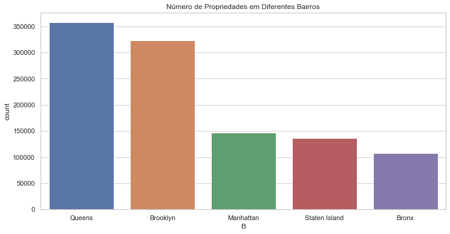
    


#### 1.3.3. Variável: BLOCK

**Descrição**: Número de até 5 dígitos que representam códigos de bloco em diferentes bairros


```python
# Contagem
block = df_cat["BLOCK"].value_counts().rename_axis("Números Únicos: Block").reset_index(name = "Quantidade")
block[:15]
```


<div>
<style scoped>
    .dataframe tbody tr th:only-of-type {
        vertical-align: middle;
    }

    .dataframe tbody tr th {
        vertical-align: top;
    }
    
    .dataframe thead th {
        text-align: right;
    }
</style>
<table border="1" class="dataframe">
  <thead>
    <tr style="text-align: right;">
      <th></th>
      <th>Números Únicos: Block</th>
      <th>Quantidade</th>
    </tr>
  </thead>
  <tbody>
    <tr>
      <th>0</th>
      <td>3944</td>
      <td>3888</td>
    </tr>
    <tr>
      <th>1</th>
      <td>16</td>
      <td>3786</td>
    </tr>
    <tr>
      <th>2</th>
      <td>3943</td>
      <td>3424</td>
    </tr>
    <tr>
      <th>3</th>
      <td>3938</td>
      <td>2794</td>
    </tr>
    <tr>
      <th>4</th>
      <td>1171</td>
      <td>2535</td>
    </tr>
    <tr>
      <th>5</th>
      <td>3937</td>
      <td>2275</td>
    </tr>
    <tr>
      <th>6</th>
      <td>1833</td>
      <td>1774</td>
    </tr>
    <tr>
      <th>7</th>
      <td>2450</td>
      <td>1651</td>
    </tr>
    <tr>
      <th>8</th>
      <td>1047</td>
      <td>1480</td>
    </tr>
    <tr>
      <th>9</th>
      <td>7279</td>
      <td>1302</td>
    </tr>
    <tr>
      <th>10</th>
      <td>5893</td>
      <td>1295</td>
    </tr>
    <tr>
      <th>11</th>
      <td>8720</td>
      <td>1281</td>
    </tr>
    <tr>
      <th>12</th>
      <td>936</td>
      <td>1151</td>
    </tr>
    <tr>
      <th>13</th>
      <td>1115</td>
      <td>1090</td>
    </tr>
    <tr>
      <th>14</th>
      <td>1320</td>
      <td>1049</td>
    </tr>
  </tbody>
</table>
</div>


#### 1.3.4. Variável: LOT

**Descrição**: Número de até 4 dígitos que representam códigos de lote em diferentes Borough & Block


```python
lot = df_cat["LOT"].value_counts().rename_axis('Números Únicos: Block').reset_index(name = "Quantidade")[:15]
lot
```


<div>
<style scoped>
    .dataframe tbody tr th:only-of-type {
        vertical-align: middle;
    }

    .dataframe tbody tr th {
        vertical-align: top;
    }
    
    .dataframe thead th {
        text-align: right;
    }
</style>
<table border="1" class="dataframe">
  <thead>
    <tr style="text-align: right;">
      <th></th>
      <th>Números Únicos: Block</th>
      <th>Quantidade</th>
    </tr>
  </thead>
  <tbody>
    <tr>
      <th>0</th>
      <td>1</td>
      <td>24367</td>
    </tr>
    <tr>
      <th>1</th>
      <td>20</td>
      <td>12294</td>
    </tr>
    <tr>
      <th>2</th>
      <td>15</td>
      <td>12171</td>
    </tr>
    <tr>
      <th>3</th>
      <td>12</td>
      <td>12143</td>
    </tr>
    <tr>
      <th>4</th>
      <td>14</td>
      <td>12074</td>
    </tr>
    <tr>
      <th>5</th>
      <td>16</td>
      <td>12042</td>
    </tr>
    <tr>
      <th>6</th>
      <td>17</td>
      <td>11982</td>
    </tr>
    <tr>
      <th>7</th>
      <td>18</td>
      <td>11979</td>
    </tr>
    <tr>
      <th>8</th>
      <td>25</td>
      <td>11949</td>
    </tr>
    <tr>
      <th>9</th>
      <td>21</td>
      <td>11840</td>
    </tr>
    <tr>
      <th>10</th>
      <td>23</td>
      <td>11705</td>
    </tr>
    <tr>
      <th>11</th>
      <td>22</td>
      <td>11665</td>
    </tr>
    <tr>
      <th>12</th>
      <td>6</td>
      <td>11646</td>
    </tr>
    <tr>
      <th>13</th>
      <td>19</td>
      <td>11640</td>
    </tr>
    <tr>
      <th>14</th>
      <td>30</td>
      <td>11596</td>
    </tr>
  </tbody>
</table>
</div>


#### 1.3.5. Variável: EASEMENT

**Descrição**: Tipos de easement


```python
# Visualização da viariável EASEMENT
sns.set_theme(style = 'whitegrid')
plt.figure(figsize = (12,6))
fig2 = sns.countplot(x = 'EASEMENT', data = dados, order = dados['EASEMENT'].value_counts().index)
fig2.set_yscale('log')
fig2.set_title('Quantidade de Imóveis com Diversos Tipos de Easement')
```


    Text(0.5, 1.0, 'Quantidade de Imóveis com Diversos Tipos de Easement')


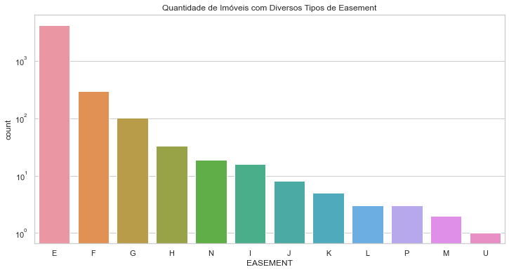
    


#### 1.3.6. Variável: OWNER

**Descrição**: Proprietários dos imóveis


```python
# Contagem
OWNER = df_cat['OWNER'].value_counts().rename_axis('Números Únicos: Owner').reset_index(name = 'Quantidade')
OWNER.head()
```


<div>
<style scoped>
    .dataframe tbody tr th:only-of-type {
        vertical-align: middle;
    }

    .dataframe tbody tr th {
        vertical-align: top;
    }
    
    .dataframe thead th {
        text-align: right;
    }
</style>
<table border="1" class="dataframe">
  <thead>
    <tr style="text-align: right;">
      <th></th>
      <th>Números Únicos: Owner</th>
      <th>Quantidade</th>
    </tr>
  </thead>
  <tbody>
    <tr>
      <th>0</th>
      <td>PARKCHESTER PRESERVAT</td>
      <td>6020</td>
    </tr>
    <tr>
      <th>1</th>
      <td>PARKS AND RECREATION</td>
      <td>4255</td>
    </tr>
    <tr>
      <th>2</th>
      <td>DCAS</td>
      <td>2169</td>
    </tr>
    <tr>
      <th>3</th>
      <td>HOUSING PRESERVATION</td>
      <td>1904</td>
    </tr>
    <tr>
      <th>4</th>
      <td>CITY OF NEW YORK</td>
      <td>1450</td>
    </tr>
  </tbody>
</table>
</div>


```python
OWNER.tail()
```


<div>
<style scoped>
    .dataframe tbody tr th:only-of-type {
        vertical-align: middle;
    }

    .dataframe tbody tr th {
        vertical-align: top;
    }
    
    .dataframe thead th {
        text-align: right;
    }
</style>
<table border="1" class="dataframe">
  <thead>
    <tr style="text-align: right;">
      <th></th>
      <th>Números Únicos: Owner</th>
      <th>Quantidade</th>
    </tr>
  </thead>
  <tbody>
    <tr>
      <th>863341</th>
      <td>MICHAEL J. SIECK, TRU</td>
      <td>1</td>
    </tr>
    <tr>
      <th>863342</th>
      <td>KEVIN D CARNEY</td>
      <td>1</td>
    </tr>
    <tr>
      <th>863343</th>
      <td>ESCOFF, GINA</td>
      <td>1</td>
    </tr>
    <tr>
      <th>863344</th>
      <td>JACOB &amp; MARGUERITE HA</td>
      <td>1</td>
    </tr>
    <tr>
      <th>863345</th>
      <td>PASTRANA, ROBERT</td>
      <td>1</td>
    </tr>
  </tbody>
</table>
</div>


#### 1.3.7. Variável: BLDGCL

**Descrição**: Classe do Imóvel


```python
# Contagem
BLDGCL = df_cat["BLDGCL"].value_counts().rename_axis('Números Únicos: BLDGCL').reset_index(name = 'Quantidade')
```


```python
BLDGCL.head()
```


<div>
<style scoped>
    .dataframe tbody tr th:only-of-type {
        vertical-align: middle;
    }

    .dataframe tbody tr th {
        vertical-align: top;
    }
    
    .dataframe thead th {
        text-align: right;
    }
</style>
<table border="1" class="dataframe">
  <thead>
    <tr style="text-align: right;">
      <th></th>
      <th>Números Únicos: BLDGCL</th>
      <th>Quantidade</th>
    </tr>
  </thead>
  <tbody>
    <tr>
      <th>0</th>
      <td>R4</td>
      <td>139879</td>
    </tr>
    <tr>
      <th>1</th>
      <td>A1</td>
      <td>123369</td>
    </tr>
    <tr>
      <th>2</th>
      <td>A5</td>
      <td>96984</td>
    </tr>
    <tr>
      <th>3</th>
      <td>B1</td>
      <td>84208</td>
    </tr>
    <tr>
      <th>4</th>
      <td>B2</td>
      <td>77598</td>
    </tr>
  </tbody>
</table>
</div>


```python
BLDGCL.tail()
```


<div>
<style scoped>
    .dataframe tbody tr th:only-of-type {
        vertical-align: middle;
    }

    .dataframe tbody tr th {
        vertical-align: top;
    }
    
    .dataframe thead th {
        text-align: right;
    }
</style>
<table border="1" class="dataframe">
  <thead>
    <tr style="text-align: right;">
      <th></th>
      <th>Números Únicos: BLDGCL</th>
      <th>Quantidade</th>
    </tr>
  </thead>
  <tbody>
    <tr>
      <th>195</th>
      <td>I2</td>
      <td>4</td>
    </tr>
    <tr>
      <th>196</th>
      <td>I3</td>
      <td>4</td>
    </tr>
    <tr>
      <th>197</th>
      <td>H7</td>
      <td>3</td>
    </tr>
    <tr>
      <th>198</th>
      <td>E6</td>
      <td>1</td>
    </tr>
    <tr>
      <th>199</th>
      <td>Y5</td>
      <td>1</td>
    </tr>
  </tbody>
</table>
</div>


#### 1.3.8. Variável: TAXCLASS

**Descrição**: Código de classe de imposto de propriedade


```python
# Visualização da variável TAXCLASS
sns.set_theme(style = 'darkgrid')
plt.figure(figsize = (14,6))
fig3 = sns.countplot(x = 'TAXCLASS', data = dados, order = dados['TAXCLASS'].value_counts().index)
fig3.set_yscale('log')
fig3.set_title("Número de Propriedades com Vários Tipos de Classes")
```


    Text(0.5, 1.0, 'Número de Propriedades com Vários Tipos de Classes')


​    
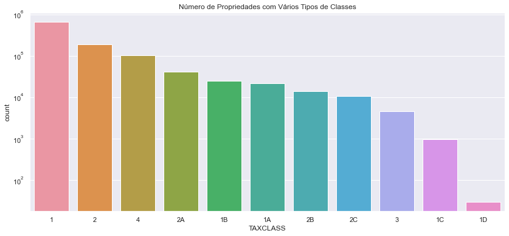
​    


#### 1.3.9. Variável: LTFRONT

**Descrição**: Frente do lote em pés (feet)


```python
# Divide em percentis
dados["LTFRONT"].describe(percentiles = [0.5,0.75,0.999])
```


    count   1070994.00
    mean         36.64
    std          74.03
    min           0.00
    50%          25.00
    75%          40.00
    99.9%       740.00
    max        9999.00
    Name: LTFRONT, dtype: float64


```python
# Filtar por valores iguais ou menores que 375
tmp = dados[dados['LTFRONT'] <= 375]
```


```python
# Visualização da variável
sns.set_theme(style = 'white')
plt.figure(figsize = (10,5))
fig4 = sns.distplot(tmp.LTFRONT, bins = 50)
fig4.set_title('Distribuição da Variável LTFRONT')
```


    Text(0.5, 1.0, 'Distribuição da Variável LTFRONT')


​    
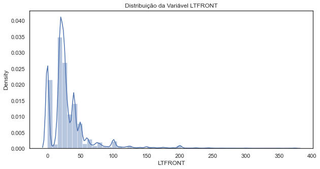
​    


#### 1.3.10. Variável: LTDEPTH

**Descrição**: Profundidade do lote em pés (feet)


```python
# Divide em percentis
dados['LTDEPTH'].describe(percentiles = [0.1, 0.2, 0.3, 0.4, 0.5, 0.6, 0.7, 0.8, 0.9, 0.95, 0.9995])
```


    count    1070994.00
    mean          88.86
    std           76.40
    min            0.00
    10%            0.00
    20%           64.00
    30%           90.00
    40%          100.00
    50%          100.00
    60%          100.00
    70%          100.00
    80%          100.00
    90%          116.00
    95%          142.00
    99.95%      1056.50
    max         9999.00
    Name: LTDEPTH, dtype: float64


```python
# Filtra por valores iguais ou menores que 600
tmp = dados[dados['LTDEPTH'] <= 600]
```


```python
# Visualização da variável 10
sns.set_theme(style = 'whitegrid')
plt.figure(figsize = (12, 6))
fig5 = sns.distplot(tmp.LTDEPTH, bins = 50)
fig5.set_yscale("log")
fig5.set_title('Distribuição da Variável LTDEPTH')
```


    Text(0.5, 1.0, 'Distribuição da Variável LTDEPTH')


​    
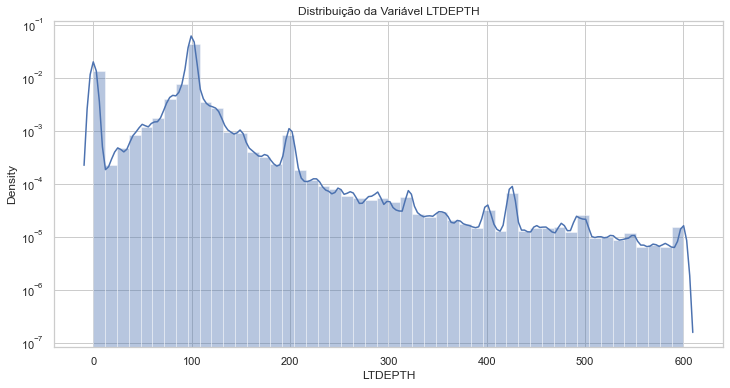
​    


#### 1.3.11. Variável: EXT

**Descrição**: E- Extension, G- Garage, EG- Extension e Garage


```python
# Visualização da variável EXT
sns.set_theme(style = 'whitegrid')
plt.figure(figsize = (12,6))
fig6 = sns.countplot(x = 'EXT', data = dados, order = dados['EXT'].value_counts().index)
fig6.set_title('Número de Propriedade com Vários tipos de Extensões / Garagem')
```


    Text(0.5, 1.0, 'Número de Propriedade com Vários tipos de Extensões / Garagem')


​    
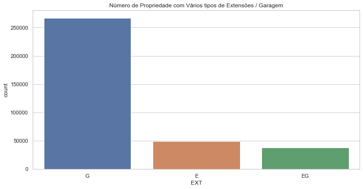
​    


#### 1.3.12. Variável: STORIES

**Descrição**: Número de andares do edifício


```python
# Divide em percentis
dados['STORIES'].describe(percentiles = [0.5,0.75,0.995])
```


    count   1014730.00
    mean          5.01
    std           8.37
    min           1.00
    50%           2.00
    75%           3.00
    99.5%        50.00
    max         119.00
    Name: STORIES, dtype: float64


```python
# Filtra 
tmp = dados[dados['STORIES'] <= 50]
```


```python
# Visualização da variável 12
sns.set_theme(style = 'whitegrid')
plt.figure(figsize = (12, 6))
fig7 = sns.distplot(tmp['STORIES'], kde = False, bins = 50)
fig7.set_yscale('log', basey = 2)
fig7.set_title('Distribuição de Andares das Propriedades')
```


    Text(0.5, 1.0, 'Distribuição de Andares das Propriedades')


​    
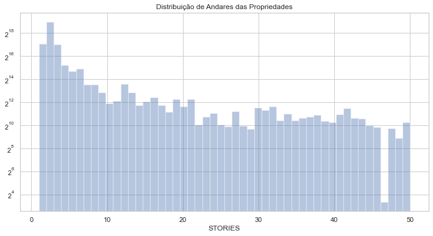
​    


#### 1.3.13. Variável: FULLVAL

**Descrição**: Valor de Mercado Total


```python
# Divide em percentis
dados['FULLVAL'].describe(percentiles = [0.5,0.75,0.95, 0.999])
```


    count      1070994.00
    mean        874264.51
    std       11582430.99
    min              0.00
    50%         447000.00
    75%         619000.00
    95%        1530000.00
    99.9%     58800700.00
    max     6150000000.00
    Name: FULLVAL, dtype: float64


```python
# Visualiza os dados
dados['FULLVAL'].head()
```


    RECORD
    1    21400000.00
    2   193800000.00
    3   104686000.00
    4    39200000.00
    5   272300000.00
    Name: FULLVAL, dtype: float64


```python
# Filtra os dados para simplificar a visualização e evitar valores extremos
tmp = dados[dados['FULLVAL'] <= 3000000]
```


```python
# Visualização da variável 13
dimensoes = (12, 8)
fig, ax = pyplot.subplots(figsize = dimensoes)
fig8 = sns.distplot(tmp.FULLVAL, kde = False, bins = 70)
fig8.set_title('Distribuição do Valor de Mercado Total das Propriedades')
```


    Text(0.5, 1.0, 'Distribuição do Valor de Mercado Total das Propriedades')


​    
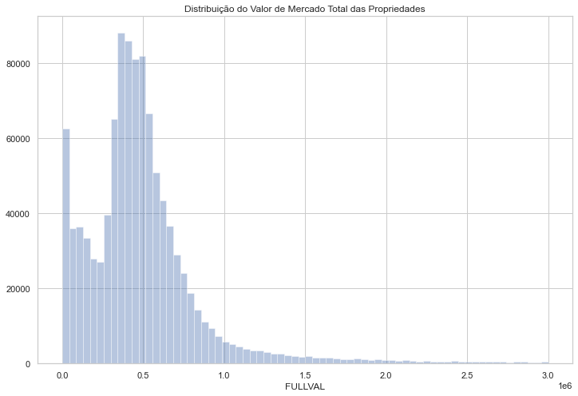
​    


#### 1.3.14. Variável: AVLAND

**Descrição**: Valor de mercado do terreno


```python
# Divide em percentis
dados['AVLAND'].describe(percentiles = [0.5,0.75,0.95])
```


    count      1070994.00
    mean         85067.92
    std        4057260.06
    min              0.00
    50%          13678.00
    75%          19740.00
    95%         131388.75
    max     2668500000.00
    Name: AVLAND, dtype: float64


```python
# Filtra os dados
tmp = dados[dados['AVLAND'] <= 50000]
```


```python
# Visualização da variável 14
dimensoes = (12, 8)
fig, ax = pyplot.subplots(figsize = dimensoes)
fig9 = sns.distplot(tmp.AVLAND, kde = False, bins = 80)
fig9.set_title('Distribuição do Valor de Mercado do Terreno das Propriedades')
```


    Text(0.5, 1.0, 'Distribuição do Valor de Mercado do Terreno das Propriedades')


​    
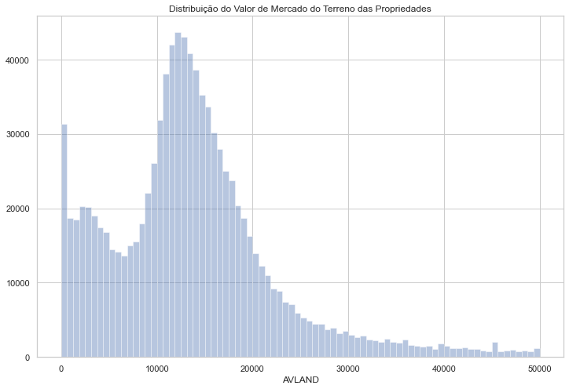
​    


#### 1.3.15. Variável: EXLAND

**Descrição**: Valor provisório do terreno isenção temporária


```python
# Divide em percentis
dados['EXLAND'].describe(percentiles = [0.5,0.75,0.95])
```


    count      1070994.00
    mean         36423.89
    std        3981575.79
    min              0.00
    50%           1620.00
    75%           1620.00
    95%          14489.00
    max     2668500000.00
    Name: EXLAND, dtype: float64


```python
# Filtro
tmp = dados[dados['EXLAND'] <= 20000]
```


```python
# Visualização da variável
dimensoes = (14, 8)
fig, ax = pyplot.subplots(figsize = dimensoes)
fig11 = sns.distplot(tmp.EXLAND, kde = False, bins = 100)
fig11.set_yscale('log', basey = 2)
fig11.set_title('Valor Provisório do Terreno com Isenção Temporária')

```


    Text(0.5, 1.0, 'Valor Provisório do Terreno com Isenção Temporária')


​    
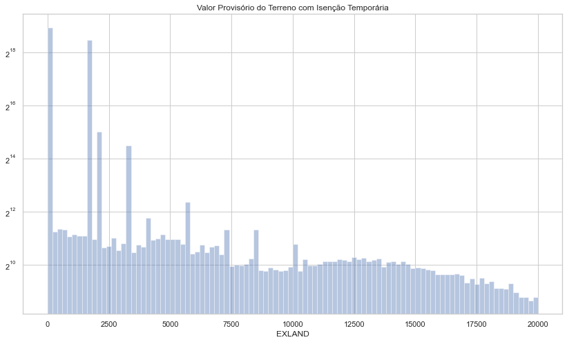
​    

</details>

## 2. Modelagem

<details>

* Existem diversas técnicas para análise e detecção de fraude.
* Aplicaremos aqui uma abordagem via aprendizado não supervisionado criando scores (pontuações) de fraude para cada transação imobiliária.
* Serão criados 2 scores com técnicas diferentes de Machine Learning e depois vamos unir os scores e apresentar o score final.
* A Engenharia de Atributos será parte fundamental do processo.


```python
# Imports
import math
import numpy as np
import pandas as pd
import matplotlib.pyplot as plt
import seaborn as sns
pd.set_option('display.max_columns', None)
pd.set_option('display.max_rows', None)
import warnings
warnings.filterwarnings("ignore")

df = pd.read_csv('dados/dataset.csv')
```


```python
# Shape
df.shape
```


    (1070994, 32)


```python
df.head()
```


<div>
<style scoped>
    .dataframe tbody tr th:only-of-type {
        vertical-align: middle;
    }

    .dataframe tbody tr th {
        vertical-align: top;
    }
    
    .dataframe thead th {
        text-align: right;
    }
</style>
<table border="1" class="dataframe">
  <thead>
    <tr style="text-align: right;">
      <th></th>
      <th>RECORD</th>
      <th>BBLE</th>
      <th>B</th>
      <th>BLOCK</th>
      <th>LOT</th>
      <th>EASEMENT</th>
      <th>OWNER</th>
      <th>BLDGCL</th>
      <th>TAXCLASS</th>
      <th>LTFRONT</th>
      <th>LTDEPTH</th>
      <th>EXT</th>
      <th>STORIES</th>
      <th>FULLVAL</th>
      <th>AVLAND</th>
      <th>AVTOT</th>
      <th>EXLAND</th>
      <th>EXTOT</th>
      <th>EXCD1</th>
      <th>STADDR</th>
      <th>ZIP</th>
      <th>EXMPTCL</th>
      <th>BLDFRONT</th>
      <th>BLDDEPTH</th>
      <th>AVLAND2</th>
      <th>AVTOT2</th>
      <th>EXLAND2</th>
      <th>EXTOT2</th>
      <th>EXCD2</th>
      <th>PERIOD</th>
      <th>YEAR</th>
      <th>VALTYPE</th>
    </tr>
  </thead>
  <tbody>
    <tr>
      <th>0</th>
      <td>1</td>
      <td>1000010101</td>
      <td>1</td>
      <td>1</td>
      <td>101</td>
      <td>NaN</td>
      <td>U S GOVT LAND &amp; BLDGS</td>
      <td>P7</td>
      <td>4</td>
      <td>500</td>
      <td>1046</td>
      <td>NaN</td>
      <td>NaN</td>
      <td>21400000.00</td>
      <td>4225500.00</td>
      <td>9630000.00</td>
      <td>4225500.00</td>
      <td>9630000.00</td>
      <td>4600.00</td>
      <td>1 LIBERTY ISLAND</td>
      <td>10004.00</td>
      <td>X3</td>
      <td>0</td>
      <td>0</td>
      <td>3775500.00</td>
      <td>8613000.00</td>
      <td>3775500.00</td>
      <td>8613000.00</td>
      <td>NaN</td>
      <td>FINAL</td>
      <td>2010/11</td>
      <td>AC-TR</td>
    </tr>
    <tr>
      <th>1</th>
      <td>2</td>
      <td>1000010201</td>
      <td>1</td>
      <td>1</td>
      <td>201</td>
      <td>NaN</td>
      <td>U S GOVT LAND &amp; BLDGS</td>
      <td>Z9</td>
      <td>4</td>
      <td>27</td>
      <td>0</td>
      <td>NaN</td>
      <td>NaN</td>
      <td>193800000.00</td>
      <td>14310000.00</td>
      <td>87210000.00</td>
      <td>14310000.00</td>
      <td>87210000.00</td>
      <td>4600.00</td>
      <td>1 ELLIS ISLAND</td>
      <td>10004.00</td>
      <td>X3</td>
      <td>0</td>
      <td>0</td>
      <td>11111400.00</td>
      <td>80690400.00</td>
      <td>11111400.00</td>
      <td>80690400.00</td>
      <td>NaN</td>
      <td>FINAL</td>
      <td>2010/11</td>
      <td>AC-TR</td>
    </tr>
    <tr>
      <th>2</th>
      <td>3</td>
      <td>1000020001</td>
      <td>1</td>
      <td>2</td>
      <td>1</td>
      <td>NaN</td>
      <td>DEPT OF GENERAL SERVI</td>
      <td>Y7</td>
      <td>4</td>
      <td>709</td>
      <td>564</td>
      <td>E</td>
      <td>3.00</td>
      <td>104686000.00</td>
      <td>39008700.00</td>
      <td>47108700.00</td>
      <td>39008700.00</td>
      <td>47108700.00</td>
      <td>2191.00</td>
      <td>MARGINAL STREET</td>
      <td>10004.00</td>
      <td>X1</td>
      <td>709</td>
      <td>564</td>
      <td>32321790.00</td>
      <td>40179510.00</td>
      <td>32321790.00</td>
      <td>40179510.00</td>
      <td>NaN</td>
      <td>FINAL</td>
      <td>2010/11</td>
      <td>AC-TR</td>
    </tr>
    <tr>
      <th>3</th>
      <td>4</td>
      <td>1000020023</td>
      <td>1</td>
      <td>2</td>
      <td>23</td>
      <td>NaN</td>
      <td>DEPARTMENT OF BUSINES</td>
      <td>T2</td>
      <td>4</td>
      <td>793</td>
      <td>551</td>
      <td>NaN</td>
      <td>2.00</td>
      <td>39200000.00</td>
      <td>15255000.00</td>
      <td>17640000.00</td>
      <td>15255000.00</td>
      <td>17640000.00</td>
      <td>2191.00</td>
      <td>PIER 6</td>
      <td>10004.00</td>
      <td>X1</td>
      <td>85</td>
      <td>551</td>
      <td>13644000.00</td>
      <td>15750000.00</td>
      <td>13644000.00</td>
      <td>15750000.00</td>
      <td>NaN</td>
      <td>FINAL</td>
      <td>2010/11</td>
      <td>AC-TR</td>
    </tr>
    <tr>
      <th>4</th>
      <td>5</td>
      <td>1000030001</td>
      <td>1</td>
      <td>3</td>
      <td>1</td>
      <td>NaN</td>
      <td>PARKS AND RECREATION</td>
      <td>Q1</td>
      <td>4</td>
      <td>323</td>
      <td>1260</td>
      <td>NaN</td>
      <td>1.00</td>
      <td>272300000.00</td>
      <td>121050000.00</td>
      <td>122535000.00</td>
      <td>121050000.00</td>
      <td>122535000.00</td>
      <td>2231.00</td>
      <td>BATTERY PARK</td>
      <td>10004.00</td>
      <td>X1</td>
      <td>89</td>
      <td>57</td>
      <td>106348680.00</td>
      <td>107758350.00</td>
      <td>106348680.00</td>
      <td>107758350.00</td>
      <td>NaN</td>
      <td>FINAL</td>
      <td>2010/11</td>
      <td>AC-TR</td>
    </tr>
  </tbody>
</table>
</div>


```python
# Vamos trabalhar com uma cópia do dataframe
df_temp = df.copy()
```

## 2.1. Limpeza e Transformação dos Dados

### 2.1.1. Limpando Valores Ausentes da Variável ZIP


```python
# Contagem de valores ausentes
df_temp['ZIP'].isna().sum()
```


    29890


```python
# Vamos calcular o valor da variável zip que aparece com maior frequência (calcular a moda)
# Se não houver nenhum valor de moda, substitua por 1
def calcula_moda(x):
    m = pd.Series.mode(x)
    if m.empty:
        x = np.array(range(1,11))
        return x[0]
    else:
        return m.values[0]
```


```python
# Definindo a função de contagem para calcular a frequência do valor da moda de cada grupo (que vamos definir)
def contagem(x):
    return x.value_counts().head(1)
```


```python
# Agrupando valores pela variável 'B' e 'BLOCK' e usando as duas funções acima para criar dataframe auxiliar
# Teremos o valor da moda da variável ZIP para cada grupo com registros com as variáveis B e Block
df_zip_group = df_temp.groupby(['B','BLOCK'])['ZIP'].agg(ZIP = calcula_moda, Count = contagem).reset_index()
```


```python
# Verificando os 25 primeiros registros
df_zip_group.head(25)
```


<div>
<style scoped>
    .dataframe tbody tr th:only-of-type {
        vertical-align: middle;
    }

    .dataframe tbody tr th {
        vertical-align: top;
    }
    
    .dataframe thead th {
        text-align: right;
    }
</style>
<table border="1" class="dataframe">
  <thead>
    <tr style="text-align: right;">
      <th></th>
      <th>B</th>
      <th>BLOCK</th>
      <th>ZIP</th>
      <th>Count</th>
    </tr>
  </thead>
  <tbody>
    <tr>
      <th>0</th>
      <td>1</td>
      <td>1</td>
      <td>10004.00</td>
      <td>2</td>
    </tr>
    <tr>
      <th>1</th>
      <td>1</td>
      <td>2</td>
      <td>10004.00</td>
      <td>2</td>
    </tr>
    <tr>
      <th>2</th>
      <td>1</td>
      <td>3</td>
      <td>10004.00</td>
      <td>4</td>
    </tr>
    <tr>
      <th>3</th>
      <td>1</td>
      <td>4</td>
      <td>10004.00</td>
      <td>53</td>
    </tr>
    <tr>
      <th>4</th>
      <td>1</td>
      <td>5</td>
      <td>10004.00</td>
      <td>9</td>
    </tr>
    <tr>
      <th>5</th>
      <td>1</td>
      <td>6</td>
      <td>10004.00</td>
      <td>2</td>
    </tr>
    <tr>
      <th>6</th>
      <td>1</td>
      <td>7</td>
      <td>10004.00</td>
      <td>15</td>
    </tr>
    <tr>
      <th>7</th>
      <td>1</td>
      <td>8</td>
      <td>10004.00</td>
      <td>6</td>
    </tr>
    <tr>
      <th>8</th>
      <td>1</td>
      <td>9</td>
      <td>10004.00</td>
      <td>4</td>
    </tr>
    <tr>
      <th>9</th>
      <td>1</td>
      <td>10</td>
      <td>10004.00</td>
      <td>8</td>
    </tr>
    <tr>
      <th>10</th>
      <td>1</td>
      <td>11</td>
      <td>10004.00</td>
      <td>16</td>
    </tr>
    <tr>
      <th>11</th>
      <td>1</td>
      <td>12</td>
      <td>10004.00</td>
      <td>2</td>
    </tr>
    <tr>
      <th>12</th>
      <td>1</td>
      <td>13</td>
      <td>10004.00</td>
      <td>4</td>
    </tr>
    <tr>
      <th>13</th>
      <td>1</td>
      <td>15</td>
      <td>10280.00</td>
      <td>285</td>
    </tr>
    <tr>
      <th>14</th>
      <td>1</td>
      <td>16</td>
      <td>10280.00</td>
      <td>3252</td>
    </tr>
    <tr>
      <th>15</th>
      <td>1</td>
      <td>17</td>
      <td>10006.00</td>
      <td>19</td>
    </tr>
    <tr>
      <th>16</th>
      <td>1</td>
      <td>18</td>
      <td>10006.00</td>
      <td>455</td>
    </tr>
    <tr>
      <th>17</th>
      <td>1</td>
      <td>19</td>
      <td>10006.00</td>
      <td>7</td>
    </tr>
    <tr>
      <th>18</th>
      <td>1</td>
      <td>20</td>
      <td>10006.00</td>
      <td>6</td>
    </tr>
    <tr>
      <th>19</th>
      <td>1</td>
      <td>21</td>
      <td>10006.00</td>
      <td>3</td>
    </tr>
    <tr>
      <th>20</th>
      <td>1</td>
      <td>22</td>
      <td>10004.00</td>
      <td>5</td>
    </tr>
    <tr>
      <th>21</th>
      <td>1</td>
      <td>23</td>
      <td>10004.00</td>
      <td>3</td>
    </tr>
    <tr>
      <th>22</th>
      <td>1</td>
      <td>24</td>
      <td>10004.00</td>
      <td>172</td>
    </tr>
    <tr>
      <th>23</th>
      <td>1</td>
      <td>25</td>
      <td>10004.00</td>
      <td>329</td>
    </tr>
    <tr>
      <th>24</th>
      <td>1</td>
      <td>26</td>
      <td>10005.00</td>
      <td>403</td>
    </tr>
  </tbody>
</table>
</div>


```python
# Para os grupos sem valor de moda, comparamos a frequência do grupo, um grupo abaixo e um grupo acima
# Inserimos o valor do ZIP do grupo com maior frequência
for i in range(len(df_zip_group)):
    if (df_zip_group.loc[i,'ZIP'] == 1):
        if df_zip_group.loc[i - 1,'Count'] > df_zip_group.loc[i + 1,'Count']:
            val = df_zip_group.loc[i - 1,'ZIP']
        else:
            val = df_zip_group.loc[i + 1,'ZIP']
        df_zip_group.loc[i,'ZIP'] = val
```


```python
# Verificando os 25 primeiros registros
df_zip_group.head(25)
```


<div>
<style scoped>
    .dataframe tbody tr th:only-of-type {
        vertical-align: middle;
    }

    .dataframe tbody tr th {
        vertical-align: top;
    }
    
    .dataframe thead th {
        text-align: right;
    }
</style>
<table border="1" class="dataframe">
  <thead>
    <tr style="text-align: right;">
      <th></th>
      <th>B</th>
      <th>BLOCK</th>
      <th>ZIP</th>
      <th>Count</th>
    </tr>
  </thead>
  <tbody>
    <tr>
      <th>0</th>
      <td>1</td>
      <td>1</td>
      <td>10004.00</td>
      <td>2</td>
    </tr>
    <tr>
      <th>1</th>
      <td>1</td>
      <td>2</td>
      <td>10004.00</td>
      <td>2</td>
    </tr>
    <tr>
      <th>2</th>
      <td>1</td>
      <td>3</td>
      <td>10004.00</td>
      <td>4</td>
    </tr>
    <tr>
      <th>3</th>
      <td>1</td>
      <td>4</td>
      <td>10004.00</td>
      <td>53</td>
    </tr>
    <tr>
      <th>4</th>
      <td>1</td>
      <td>5</td>
      <td>10004.00</td>
      <td>9</td>
    </tr>
    <tr>
      <th>5</th>
      <td>1</td>
      <td>6</td>
      <td>10004.00</td>
      <td>2</td>
    </tr>
    <tr>
      <th>6</th>
      <td>1</td>
      <td>7</td>
      <td>10004.00</td>
      <td>15</td>
    </tr>
    <tr>
      <th>7</th>
      <td>1</td>
      <td>8</td>
      <td>10004.00</td>
      <td>6</td>
    </tr>
    <tr>
      <th>8</th>
      <td>1</td>
      <td>9</td>
      <td>10004.00</td>
      <td>4</td>
    </tr>
    <tr>
      <th>9</th>
      <td>1</td>
      <td>10</td>
      <td>10004.00</td>
      <td>8</td>
    </tr>
    <tr>
      <th>10</th>
      <td>1</td>
      <td>11</td>
      <td>10004.00</td>
      <td>16</td>
    </tr>
    <tr>
      <th>11</th>
      <td>1</td>
      <td>12</td>
      <td>10004.00</td>
      <td>2</td>
    </tr>
    <tr>
      <th>12</th>
      <td>1</td>
      <td>13</td>
      <td>10004.00</td>
      <td>4</td>
    </tr>
    <tr>
      <th>13</th>
      <td>1</td>
      <td>15</td>
      <td>10280.00</td>
      <td>285</td>
    </tr>
    <tr>
      <th>14</th>
      <td>1</td>
      <td>16</td>
      <td>10280.00</td>
      <td>3252</td>
    </tr>
    <tr>
      <th>15</th>
      <td>1</td>
      <td>17</td>
      <td>10006.00</td>
      <td>19</td>
    </tr>
    <tr>
      <th>16</th>
      <td>1</td>
      <td>18</td>
      <td>10006.00</td>
      <td>455</td>
    </tr>
    <tr>
      <th>17</th>
      <td>1</td>
      <td>19</td>
      <td>10006.00</td>
      <td>7</td>
    </tr>
    <tr>
      <th>18</th>
      <td>1</td>
      <td>20</td>
      <td>10006.00</td>
      <td>6</td>
    </tr>
    <tr>
      <th>19</th>
      <td>1</td>
      <td>21</td>
      <td>10006.00</td>
      <td>3</td>
    </tr>
    <tr>
      <th>20</th>
      <td>1</td>
      <td>22</td>
      <td>10004.00</td>
      <td>5</td>
    </tr>
    <tr>
      <th>21</th>
      <td>1</td>
      <td>23</td>
      <td>10004.00</td>
      <td>3</td>
    </tr>
    <tr>
      <th>22</th>
      <td>1</td>
      <td>24</td>
      <td>10004.00</td>
      <td>172</td>
    </tr>
    <tr>
      <th>23</th>
      <td>1</td>
      <td>25</td>
      <td>10004.00</td>
      <td>329</td>
    </tr>
    <tr>
      <th>24</th>
      <td>1</td>
      <td>26</td>
      <td>10005.00</td>
      <td>403</td>
    </tr>
  </tbody>
</table>
</div>


```python
# Definindo a função que preenche os registros com valor ZIP ausente por meio do dataframe auxiliar
def preenche_moda(x):
    if pd.isnull(x['ZIP']):
        return df_zip_group[(df_zip_group['B'] == x['B']) & (df_zip_group['BLOCK'] == x['BLOCK'])]['ZIP'].values[0]
    else:
        return x['ZIP']
```


```python
# Usando a função para preencher os valores ZIP ausentes
df_temp['ZIP'] = df_temp.apply(preenche_moda, axis = 1)
```


```python
# Verificando se há algum valor ZIP restante com valor NA
print('Quantidade de valores missing: ',df_temp['ZIP'].isna().sum())
```

    Quantidade de valores missing:  0


```python
# Verificando manualmente uma das ocorrências para checar se a fórmula funcionou corretamente
df_temp[(df_temp['B']=='Manhattan') & (df_temp['BLOCK']==36)]['ZIP']
```


    Series([], Name: ZIP, dtype: float64)


```python
# Visualiza
df_temp.head()
```


<div>
<style scoped>
    .dataframe tbody tr th:only-of-type {
        vertical-align: middle;
    }

    .dataframe tbody tr th {
        vertical-align: top;
    }
    
    .dataframe thead th {
        text-align: right;
    }
</style>
<table border="1" class="dataframe">
  <thead>
    <tr style="text-align: right;">
      <th></th>
      <th>RECORD</th>
      <th>BBLE</th>
      <th>B</th>
      <th>BLOCK</th>
      <th>LOT</th>
      <th>EASEMENT</th>
      <th>OWNER</th>
      <th>BLDGCL</th>
      <th>TAXCLASS</th>
      <th>LTFRONT</th>
      <th>LTDEPTH</th>
      <th>EXT</th>
      <th>STORIES</th>
      <th>FULLVAL</th>
      <th>AVLAND</th>
      <th>AVTOT</th>
      <th>EXLAND</th>
      <th>EXTOT</th>
      <th>EXCD1</th>
      <th>STADDR</th>
      <th>ZIP</th>
      <th>EXMPTCL</th>
      <th>BLDFRONT</th>
      <th>BLDDEPTH</th>
      <th>AVLAND2</th>
      <th>AVTOT2</th>
      <th>EXLAND2</th>
      <th>EXTOT2</th>
      <th>EXCD2</th>
      <th>PERIOD</th>
      <th>YEAR</th>
      <th>VALTYPE</th>
    </tr>
  </thead>
  <tbody>
    <tr>
      <th>0</th>
      <td>1</td>
      <td>1000010101</td>
      <td>1</td>
      <td>1</td>
      <td>101</td>
      <td>NaN</td>
      <td>U S GOVT LAND &amp; BLDGS</td>
      <td>P7</td>
      <td>4</td>
      <td>500</td>
      <td>1046</td>
      <td>NaN</td>
      <td>NaN</td>
      <td>21400000.00</td>
      <td>4225500.00</td>
      <td>9630000.00</td>
      <td>4225500.00</td>
      <td>9630000.00</td>
      <td>4600.00</td>
      <td>1 LIBERTY ISLAND</td>
      <td>10004.00</td>
      <td>X3</td>
      <td>0</td>
      <td>0</td>
      <td>3775500.00</td>
      <td>8613000.00</td>
      <td>3775500.00</td>
      <td>8613000.00</td>
      <td>NaN</td>
      <td>FINAL</td>
      <td>2010/11</td>
      <td>AC-TR</td>
    </tr>
    <tr>
      <th>1</th>
      <td>2</td>
      <td>1000010201</td>
      <td>1</td>
      <td>1</td>
      <td>201</td>
      <td>NaN</td>
      <td>U S GOVT LAND &amp; BLDGS</td>
      <td>Z9</td>
      <td>4</td>
      <td>27</td>
      <td>0</td>
      <td>NaN</td>
      <td>NaN</td>
      <td>193800000.00</td>
      <td>14310000.00</td>
      <td>87210000.00</td>
      <td>14310000.00</td>
      <td>87210000.00</td>
      <td>4600.00</td>
      <td>1 ELLIS ISLAND</td>
      <td>10004.00</td>
      <td>X3</td>
      <td>0</td>
      <td>0</td>
      <td>11111400.00</td>
      <td>80690400.00</td>
      <td>11111400.00</td>
      <td>80690400.00</td>
      <td>NaN</td>
      <td>FINAL</td>
      <td>2010/11</td>
      <td>AC-TR</td>
    </tr>
    <tr>
      <th>2</th>
      <td>3</td>
      <td>1000020001</td>
      <td>1</td>
      <td>2</td>
      <td>1</td>
      <td>NaN</td>
      <td>DEPT OF GENERAL SERVI</td>
      <td>Y7</td>
      <td>4</td>
      <td>709</td>
      <td>564</td>
      <td>E</td>
      <td>3.00</td>
      <td>104686000.00</td>
      <td>39008700.00</td>
      <td>47108700.00</td>
      <td>39008700.00</td>
      <td>47108700.00</td>
      <td>2191.00</td>
      <td>MARGINAL STREET</td>
      <td>10004.00</td>
      <td>X1</td>
      <td>709</td>
      <td>564</td>
      <td>32321790.00</td>
      <td>40179510.00</td>
      <td>32321790.00</td>
      <td>40179510.00</td>
      <td>NaN</td>
      <td>FINAL</td>
      <td>2010/11</td>
      <td>AC-TR</td>
    </tr>
    <tr>
      <th>3</th>
      <td>4</td>
      <td>1000020023</td>
      <td>1</td>
      <td>2</td>
      <td>23</td>
      <td>NaN</td>
      <td>DEPARTMENT OF BUSINES</td>
      <td>T2</td>
      <td>4</td>
      <td>793</td>
      <td>551</td>
      <td>NaN</td>
      <td>2.00</td>
      <td>39200000.00</td>
      <td>15255000.00</td>
      <td>17640000.00</td>
      <td>15255000.00</td>
      <td>17640000.00</td>
      <td>2191.00</td>
      <td>PIER 6</td>
      <td>10004.00</td>
      <td>X1</td>
      <td>85</td>
      <td>551</td>
      <td>13644000.00</td>
      <td>15750000.00</td>
      <td>13644000.00</td>
      <td>15750000.00</td>
      <td>NaN</td>
      <td>FINAL</td>
      <td>2010/11</td>
      <td>AC-TR</td>
    </tr>
    <tr>
      <th>4</th>
      <td>5</td>
      <td>1000030001</td>
      <td>1</td>
      <td>3</td>
      <td>1</td>
      <td>NaN</td>
      <td>PARKS AND RECREATION</td>
      <td>Q1</td>
      <td>4</td>
      <td>323</td>
      <td>1260</td>
      <td>NaN</td>
      <td>1.00</td>
      <td>272300000.00</td>
      <td>121050000.00</td>
      <td>122535000.00</td>
      <td>121050000.00</td>
      <td>122535000.00</td>
      <td>2231.00</td>
      <td>BATTERY PARK</td>
      <td>10004.00</td>
      <td>X1</td>
      <td>89</td>
      <td>57</td>
      <td>106348680.00</td>
      <td>107758350.00</td>
      <td>106348680.00</td>
      <td>107758350.00</td>
      <td>NaN</td>
      <td>FINAL</td>
      <td>2010/11</td>
      <td>AC-TR</td>
    </tr>
  </tbody>
</table>
</div>


```python
# Vamos salvar o dataframe resultante em disco
df_temp.to_csv('dados/dataset_zip_limpo.csv')
```


```python
df_temp['ZIP'] = df_temp['ZIP'].astype(int).astype(str)
```


```python
# Cria cópia da estrutura do dataframe
df_temp2 = df_temp.copy()
```


```python
# Carrega os dados do disco
df_temp2 = pd.read_csv('dados/dataset_zip_limpo.csv')
```

### 2.1.2. Limpando Valores Ausentes da Variável:

FULLVAL, AVLAND, AVTOT, BLDFRONT, BLDDEPTH, LTFRONT e LTDEPTH


```python
# Substituindo valores vazios por valores NaN para garantir que a função fillna funcione nas etapas posteriores
df_temp2.replace(0, np.nan, inplace = True)
```


```python
# Definindo a lista de variáveis a serem preenchidas
list_fill = ['FULLVAL', 'AVLAND', 'AVTOT', 'BLDFRONT', 'BLDDEPTH', 'LTFRONT', 'LTDEPTH']
```


```python
# Contando o número de valores NA para cada uma das variáveis
for i in list_fill:
    print(i, '--> Número de valores ausentes: ', df_temp2[i].isna().sum(),'\n')
```

    FULLVAL --> Número de valores ausentes:  13007 
    
    AVLAND --> Número de valores ausentes:  13009 
    
    AVTOT --> Número de valores ausentes:  13007 
    
    BLDFRONT --> Número de valores ausentes:  228815 
    
    BLDDEPTH --> Número de valores ausentes:  228853 
    
    LTFRONT --> Número de valores ausentes:  169108 
    
    LTDEPTH --> Número de valores ausentes:  170128 


​    


```python
# Preenchendo os registros vazios com a mediana do grupo ZIP e BLDGCL se o tamanho do grupo for maior ou igual a 5
for i in list_fill:
    df_temp2[i] = df_temp2.groupby(['ZIP','BLDGCL'])[i].apply(lambda x: x.fillna(x.median()) if len(x) >= 5 else x)
```


```python
# Contando o número de valores NA para cada uma das variáveis
for i in list_fill:
    print(i, "--> Número de valores ausentes:", df_temp2[i].isna().sum()," ↘\n")
```

    FULLVAL --> Número de valores ausentes: 10294  ↘
    
    AVLAND --> Número de valores ausentes: 10294  ↘
    
    AVTOT --> Número de valores ausentes: 10294  ↘
    
    BLDFRONT --> Número de valores ausentes: 75202  ↘
    
    BLDDEPTH --> Número de valores ausentes: 75218  ↘
    
    LTFRONT --> Número de valores ausentes: 16025  ↘
    
    LTDEPTH --> Número de valores ausentes: 17764  ↘


​    


```python
# Preenchendo os registros vazios com a mediana do grupo ZIP e TAXCLASS se o tamanho do grupo for maior ou igual a 5
for i in list_fill:
    df_temp2[i] = df_temp2.groupby(['ZIP','TAXCLASS'])[i].apply(lambda x: x.fillna(x.median()) if len(x) >= 5 else x)
```


```python
# Contando o número de valores NA para cada uma das variáveis
for i in list_fill:
    print(i, "--> Número de valores ausentes:", df_temp2[i].isna().sum()," ↘\n")
```

    FULLVAL --> Número de valores ausentes: 3915  ↘
    
    AVLAND --> Número de valores ausentes: 3915  ↘
    
    AVTOT --> Número de valores ausentes: 3915  ↘
    
    BLDFRONT --> Número de valores ausentes: 31226  ↘
    
    BLDDEPTH --> Número de valores ausentes: 31130  ↘
    
    LTFRONT --> Número de valores ausentes: 3092  ↘
    
    LTDEPTH --> Número de valores ausentes: 3146  ↘


​    


```python
# Preenchendo os registros ausentes com a mediana do grupo B e TAXCLASS se o tamanho do grupo for maior ou igual a 5
for i in list_fill:
    df_temp2[i] = df_temp2.groupby(['B','TAXCLASS'])[i].apply(lambda x: x.fillna(x.median()) if len(x) >= 5 else x)
```


```python
# Contando o número de valores NA para cada uma das variáveis
for i in list_fill:
    print(i, "--> Número de valores ausentes:", df_temp2[i].isna().sum()," ↘\n")
```

    FULLVAL --> Número de valores ausentes: 678  ↘
    
    AVLAND --> Número de valores ausentes: 678  ↘
    
    AVTOT --> Número de valores ausentes: 678  ↘
    
    BLDFRONT --> Número de valores ausentes: 22317  ↘
    
    BLDDEPTH --> Número de valores ausentes: 18831  ↘
    
    LTFRONT --> Número de valores ausentes: 2  ↘
    
    LTDEPTH --> Número de valores ausentes: 2  ↘


​    


```python
# Preenchendo os registros ausentes com a mediana do grupo B se o tamanho do grupo for maior ou igual a 5
for i in list_fill:
    df_temp2[i] = df_temp2.groupby(['B'])[i].apply(lambda x: x.fillna(x.median()) if len(x) >= 5 else x)
```


```python
# Contando o número de valores NA para cada uma das variáveis
for i in list_fill:
    print(i, "--> Número de valores ausentes:", df_temp2[i].isna().sum(),"\n")
```

    FULLVAL --> Número de valores ausentes: 0 
    
    AVLAND --> Número de valores ausentes: 0 
    
    AVTOT --> Número de valores ausentes: 0 
    
    BLDFRONT --> Número de valores ausentes: 0 
    
    BLDDEPTH --> Número de valores ausentes: 0 
    
    LTFRONT --> Número de valores ausentes: 0 
    
    LTDEPTH --> Número de valores ausentes: 0 


​    

### 2.1.3. Limpando Valores Ausentes da Variável: STORIES


```python
# Checa valores ausentes
print('STORIES', "--> Número de valores ausentes:", df_temp2['STORIES'].isna().sum())
```

    STORIES --> Número de valores ausentes: 56264


```python
# Imputação da mediana com base nos grupos de ZIP e BLDGCL
df_temp2['STORIES'] = df_temp2.groupby(['ZIP','BLDGCL'])['STORIES'].apply(lambda x: x.fillna(x.median()) if len(x) >= 5 else x)
```


```python
# Checa valores ausentes
print('STORIES', "--> Número de valores ausentes:", df_temp2['STORIES'].isna().sum())
```

    STORIES --> Número de valores ausentes: 42102


```python
# Imputação da mediana com base nos grupos de BLDGCL e STORIES
df_temp2['STORIES'] = df_temp2.groupby(['BLDGCL'])['STORIES'].apply(lambda x: x.fillna(x.median()) if len(x) >= 5 else x)
```


```python
# Checa valores ausentes
print('STORIES', "--> Número de valores ausentes:", df_temp2['STORIES'].isna().sum())
```

    STORIES --> Número de valores ausentes: 4280


```python
# Imputação da mediana com base nos grupos de TAXCLASS e STORIES
df_temp2['STORIES'] = df_temp2.groupby(['TAXCLASS'])['STORIES'].apply(lambda x: x.fillna(x.median()) if len(x) >= 5 else x)
```


```python
# Checa valores ausentes
print('STORIES', "--> Número de valores ausentes:", df_temp2['STORIES'].isna().sum())
```

    STORIES --> Número de valores ausentes: 0


```python
# Salvando resultado em disco
df_temp2.to_csv('dados/dataset_variaveis_limpo.csv')
```

</details>

## 3. Engenharia de Atributos

<details>

Vamos criar algumas variáveis a partir de operações com as variáveis existentes


```python
# Cópia do dataframe
df_proc = df_temp2.copy()
```


```python
# LTFRONT * LTDEPTH
df_proc['AREA1'] = df_proc['LTFRONT'] * df_proc['LTDEPTH']
```


```python
# Visualiza amosta
df_proc[['AREA1', 'LTFRONT', 'LTDEPTH']].head()
```


<div>
<style scoped>
    .dataframe tbody tr th:only-of-type {
        vertical-align: middle;
    }

    .dataframe tbody tr th {
        vertical-align: top;
    }
    
    .dataframe thead th {
        text-align: right;
    }
</style>
<table border="1" class="dataframe">
  <thead>
    <tr style="text-align: right;">
      <th></th>
      <th>AREA1</th>
      <th>LTFRONT</th>
      <th>LTDEPTH</th>
    </tr>
  </thead>
  <tbody>
    <tr>
      <th>0</th>
      <td>523000.00</td>
      <td>500.00</td>
      <td>1046.00</td>
    </tr>
    <tr>
      <th>1</th>
      <td>9585.00</td>
      <td>27.00</td>
      <td>355.00</td>
    </tr>
    <tr>
      <th>2</th>
      <td>399876.00</td>
      <td>709.00</td>
      <td>564.00</td>
    </tr>
    <tr>
      <th>3</th>
      <td>436943.00</td>
      <td>793.00</td>
      <td>551.00</td>
    </tr>
    <tr>
      <th>4</th>
      <td>406980.00</td>
      <td>323.00</td>
      <td>1260.00</td>
    </tr>
  </tbody>
</table>
</div>


```python
# BLDFRONT * BLDDEPTH
df_proc['AREA2'] = df_proc['BLDFRONT'] * df_proc['BLDDEPTH']
```


```python
# Visualiza amostra
df_proc[['AREA2', 'BLDFRONT', 'BLDDEPTH']].head()
```


<div>
<style scoped>
    .dataframe tbody tr th:only-of-type {
        vertical-align: middle;
    }

    .dataframe tbody tr th {
        vertical-align: top;
    }
    
    .dataframe thead th {
        text-align: right;
    }
</style>
<table border="1" class="dataframe">
  <thead>
    <tr style="text-align: right;">
      <th></th>
      <th>AREA2</th>
      <th>BLDFRONT</th>
      <th>BLDDEPTH</th>
    </tr>
  </thead>
  <tbody>
    <tr>
      <th>0</th>
      <td>121476.00</td>
      <td>382.00</td>
      <td>318.00</td>
    </tr>
    <tr>
      <th>1</th>
      <td>121476.00</td>
      <td>382.00</td>
      <td>318.00</td>
    </tr>
    <tr>
      <th>2</th>
      <td>399876.00</td>
      <td>709.00</td>
      <td>564.00</td>
    </tr>
    <tr>
      <th>3</th>
      <td>46835.00</td>
      <td>85.00</td>
      <td>551.00</td>
    </tr>
    <tr>
      <th>4</th>
      <td>5073.00</td>
      <td>89.00</td>
      <td>57.00</td>
    </tr>
  </tbody>
</table>
</div>


```python
# AREA2 * STORIES
df_proc['AREA3'] = df_proc['AREA2'] * df_proc['STORIES']
```


```python
# Visualiza amostra
df_proc[['AREA2', 'STORIES', 'AREA3']].head()
```


<div>
<style scoped>
    .dataframe tbody tr th:only-of-type {
        vertical-align: middle;
    }

    .dataframe tbody tr th {
        vertical-align: top;
    }
    
    .dataframe thead th {
        text-align: right;
    }
</style>
<table border="1" class="dataframe">
  <thead>
    <tr style="text-align: right;">
      <th></th>
      <th>AREA2</th>
      <th>STORIES</th>
      <th>AREA3</th>
    </tr>
  </thead>
  <tbody>
    <tr>
      <th>0</th>
      <td>121476.00</td>
      <td>4.00</td>
      <td>485904.00</td>
    </tr>
    <tr>
      <th>1</th>
      <td>121476.00</td>
      <td>1.00</td>
      <td>121476.00</td>
    </tr>
    <tr>
      <th>2</th>
      <td>399876.00</td>
      <td>3.00</td>
      <td>1199628.00</td>
    </tr>
    <tr>
      <th>3</th>
      <td>46835.00</td>
      <td>2.00</td>
      <td>93670.00</td>
    </tr>
    <tr>
      <th>4</th>
      <td>5073.00</td>
      <td>1.00</td>
      <td>5073.00</td>
    </tr>
  </tbody>
</table>
</div>


```python
# Dividindo FULLVAL, AVLAND e AVTOT pelas variáveis recém criadas AREA1, AREA2 e AREA3 para gerar um índice
k = 1
for i in ['FULLVAL', 'AVLAND', 'AVTOT']:
    for j in ['AREA1', 'AREA2', 'AREA3']:
        indice_area = 'ind' + str(k)
        df_proc[indice_area] = df_proc[i] / df_proc[j]
        print(indice_area + ' é a combinação feita entre:', i, j)
        k += 1
```

    ind1 é a combinação feita entre: FULLVAL AREA1
    ind2 é a combinação feita entre: FULLVAL AREA2
    ind3 é a combinação feita entre: FULLVAL AREA3
    ind4 é a combinação feita entre: AVLAND AREA1
    ind5 é a combinação feita entre: AVLAND AREA2
    ind6 é a combinação feita entre: AVLAND AREA3
    ind7 é a combinação feita entre: AVTOT AREA1
    ind8 é a combinação feita entre: AVTOT AREA2
    ind9 é a combinação feita entre: AVTOT AREA3


```python
# Visualiza amostra
df_proc.head()
```


<div>
<style scoped>
    .dataframe tbody tr th:only-of-type {
        vertical-align: middle;
    }

    .dataframe tbody tr th {
        vertical-align: top;
    }
    
    .dataframe thead th {
        text-align: right;
    }
</style>
<table border="1" class="dataframe">
  <thead>
    <tr style="text-align: right;">
      <th></th>
      <th>Unnamed: 0</th>
      <th>RECORD</th>
      <th>BBLE</th>
      <th>B</th>
      <th>BLOCK</th>
      <th>LOT</th>
      <th>EASEMENT</th>
      <th>OWNER</th>
      <th>BLDGCL</th>
      <th>TAXCLASS</th>
      <th>LTFRONT</th>
      <th>LTDEPTH</th>
      <th>EXT</th>
      <th>STORIES</th>
      <th>FULLVAL</th>
      <th>AVLAND</th>
      <th>AVTOT</th>
      <th>EXLAND</th>
      <th>EXTOT</th>
      <th>EXCD1</th>
      <th>STADDR</th>
      <th>ZIP</th>
      <th>EXMPTCL</th>
      <th>BLDFRONT</th>
      <th>BLDDEPTH</th>
      <th>AVLAND2</th>
      <th>AVTOT2</th>
      <th>EXLAND2</th>
      <th>EXTOT2</th>
      <th>EXCD2</th>
      <th>PERIOD</th>
      <th>YEAR</th>
      <th>VALTYPE</th>
      <th>AREA1</th>
      <th>AREA2</th>
      <th>AREA3</th>
      <th>ind1</th>
      <th>ind2</th>
      <th>ind3</th>
      <th>ind4</th>
      <th>ind5</th>
      <th>ind6</th>
      <th>ind7</th>
      <th>ind8</th>
      <th>ind9</th>
    </tr>
  </thead>
  <tbody>
    <tr>
      <th>0</th>
      <td>NaN</td>
      <td>1</td>
      <td>1000010101</td>
      <td>1</td>
      <td>1</td>
      <td>101</td>
      <td>NaN</td>
      <td>U S GOVT LAND &amp; BLDGS</td>
      <td>P7</td>
      <td>4</td>
      <td>500.00</td>
      <td>1046.00</td>
      <td>NaN</td>
      <td>4.00</td>
      <td>21400000.00</td>
      <td>4225500.00</td>
      <td>9630000.00</td>
      <td>4225500.00</td>
      <td>9630000.00</td>
      <td>4600.00</td>
      <td>1 LIBERTY ISLAND</td>
      <td>10004.00</td>
      <td>X3</td>
      <td>382.00</td>
      <td>318.00</td>
      <td>3775500.00</td>
      <td>8613000.00</td>
      <td>3775500.00</td>
      <td>8613000.00</td>
      <td>NaN</td>
      <td>FINAL</td>
      <td>2010/11</td>
      <td>AC-TR</td>
      <td>523000.00</td>
      <td>121476.00</td>
      <td>485904.00</td>
      <td>40.92</td>
      <td>176.17</td>
      <td>44.04</td>
      <td>8.08</td>
      <td>34.78</td>
      <td>8.70</td>
      <td>18.41</td>
      <td>79.27</td>
      <td>19.82</td>
    </tr>
    <tr>
      <th>1</th>
      <td>1.00</td>
      <td>2</td>
      <td>1000010201</td>
      <td>1</td>
      <td>1</td>
      <td>201</td>
      <td>NaN</td>
      <td>U S GOVT LAND &amp; BLDGS</td>
      <td>Z9</td>
      <td>4</td>
      <td>27.00</td>
      <td>355.00</td>
      <td>NaN</td>
      <td>1.00</td>
      <td>193800000.00</td>
      <td>14310000.00</td>
      <td>87210000.00</td>
      <td>14310000.00</td>
      <td>87210000.00</td>
      <td>4600.00</td>
      <td>1 ELLIS ISLAND</td>
      <td>10004.00</td>
      <td>X3</td>
      <td>382.00</td>
      <td>318.00</td>
      <td>11111400.00</td>
      <td>80690400.00</td>
      <td>11111400.00</td>
      <td>80690400.00</td>
      <td>NaN</td>
      <td>FINAL</td>
      <td>2010/11</td>
      <td>AC-TR</td>
      <td>9585.00</td>
      <td>121476.00</td>
      <td>121476.00</td>
      <td>20219.09</td>
      <td>1595.38</td>
      <td>1595.38</td>
      <td>1492.96</td>
      <td>117.80</td>
      <td>117.80</td>
      <td>9098.59</td>
      <td>717.92</td>
      <td>717.92</td>
    </tr>
    <tr>
      <th>2</th>
      <td>2.00</td>
      <td>3</td>
      <td>1000020001</td>
      <td>1</td>
      <td>2</td>
      <td>1</td>
      <td>NaN</td>
      <td>DEPT OF GENERAL SERVI</td>
      <td>Y7</td>
      <td>4</td>
      <td>709.00</td>
      <td>564.00</td>
      <td>E</td>
      <td>3.00</td>
      <td>104686000.00</td>
      <td>39008700.00</td>
      <td>47108700.00</td>
      <td>39008700.00</td>
      <td>47108700.00</td>
      <td>2191.00</td>
      <td>MARGINAL STREET</td>
      <td>10004.00</td>
      <td>X1</td>
      <td>709.00</td>
      <td>564.00</td>
      <td>32321790.00</td>
      <td>40179510.00</td>
      <td>32321790.00</td>
      <td>40179510.00</td>
      <td>NaN</td>
      <td>FINAL</td>
      <td>2010/11</td>
      <td>AC-TR</td>
      <td>399876.00</td>
      <td>399876.00</td>
      <td>1199628.00</td>
      <td>261.80</td>
      <td>261.80</td>
      <td>87.27</td>
      <td>97.55</td>
      <td>97.55</td>
      <td>32.52</td>
      <td>117.81</td>
      <td>117.81</td>
      <td>39.27</td>
    </tr>
    <tr>
      <th>3</th>
      <td>3.00</td>
      <td>4</td>
      <td>1000020023</td>
      <td>1</td>
      <td>2</td>
      <td>23</td>
      <td>NaN</td>
      <td>DEPARTMENT OF BUSINES</td>
      <td>T2</td>
      <td>4</td>
      <td>793.00</td>
      <td>551.00</td>
      <td>NaN</td>
      <td>2.00</td>
      <td>39200000.00</td>
      <td>15255000.00</td>
      <td>17640000.00</td>
      <td>15255000.00</td>
      <td>17640000.00</td>
      <td>2191.00</td>
      <td>PIER 6</td>
      <td>10004.00</td>
      <td>X1</td>
      <td>85.00</td>
      <td>551.00</td>
      <td>13644000.00</td>
      <td>15750000.00</td>
      <td>13644000.00</td>
      <td>15750000.00</td>
      <td>NaN</td>
      <td>FINAL</td>
      <td>2010/11</td>
      <td>AC-TR</td>
      <td>436943.00</td>
      <td>46835.00</td>
      <td>93670.00</td>
      <td>89.71</td>
      <td>836.98</td>
      <td>418.49</td>
      <td>34.91</td>
      <td>325.72</td>
      <td>162.86</td>
      <td>40.37</td>
      <td>376.64</td>
      <td>188.32</td>
    </tr>
    <tr>
      <th>4</th>
      <td>4.00</td>
      <td>5</td>
      <td>1000030001</td>
      <td>1</td>
      <td>3</td>
      <td>1</td>
      <td>NaN</td>
      <td>PARKS AND RECREATION</td>
      <td>Q1</td>
      <td>4</td>
      <td>323.00</td>
      <td>1260.00</td>
      <td>NaN</td>
      <td>1.00</td>
      <td>272300000.00</td>
      <td>121050000.00</td>
      <td>122535000.00</td>
      <td>121050000.00</td>
      <td>122535000.00</td>
      <td>2231.00</td>
      <td>BATTERY PARK</td>
      <td>10004.00</td>
      <td>X1</td>
      <td>89.00</td>
      <td>57.00</td>
      <td>106348680.00</td>
      <td>107758350.00</td>
      <td>106348680.00</td>
      <td>107758350.00</td>
      <td>NaN</td>
      <td>FINAL</td>
      <td>2010/11</td>
      <td>AC-TR</td>
      <td>406980.00</td>
      <td>5073.00</td>
      <td>5073.00</td>
      <td>669.07</td>
      <td>53676.33</td>
      <td>53676.33</td>
      <td>297.43</td>
      <td>23861.62</td>
      <td>23861.62</td>
      <td>301.08</td>
      <td>24154.35</td>
      <td>24154.35</td>
    </tr>
  </tbody>
</table>
</div>


```python
df_proc['ZIP'].dtype
```


    dtype('float64')


```python
# Converte o tipo da variável zip para string
df_proc['ZIP'] = df_proc['ZIP'].astype(int).astype(str)
```


```python
df_proc['ZIP'].dtype
```


    dtype('O')


```python
# Lista das variáveis para o agrupamento abaixo
list_groupby = ['ZIP', 'TAXCLASS', 'B']
```


```python
# Cria variáveis que representam as médias das áreas dos imóveis por grupo com base no índice criado

# Lista
ind_lista = ['ind' + str(i) for i in range(1,10)]

# Loop
for i in list_groupby:
    for j in ind_lista:
        name_col = 'media_' + str(j) + '_grupo_' + str(i)
        df_proc[name_col] = df_proc.groupby(i)[j].transform('mean')
        name_col_final = str(j) + '_' + name_col
        df_proc[name_col_final] = df_proc[j] / df_proc[name_col]
```


```python
# Visualiza
df_proc.head()
```


<div>
<style scoped>
    .dataframe tbody tr th:only-of-type {
        vertical-align: middle;
    }

    .dataframe tbody tr th {
        vertical-align: top;
    }
    
    .dataframe thead th {
        text-align: right;
    }
</style>
<table border="1" class="dataframe">
  <thead>
    <tr style="text-align: right;">
      <th></th>
      <th>Unnamed: 0</th>
      <th>RECORD</th>
      <th>BBLE</th>
      <th>B</th>
      <th>BLOCK</th>
      <th>LOT</th>
      <th>EASEMENT</th>
      <th>OWNER</th>
      <th>BLDGCL</th>
      <th>TAXCLASS</th>
      <th>LTFRONT</th>
      <th>LTDEPTH</th>
      <th>EXT</th>
      <th>STORIES</th>
      <th>FULLVAL</th>
      <th>AVLAND</th>
      <th>AVTOT</th>
      <th>EXLAND</th>
      <th>EXTOT</th>
      <th>EXCD1</th>
      <th>STADDR</th>
      <th>ZIP</th>
      <th>EXMPTCL</th>
      <th>BLDFRONT</th>
      <th>BLDDEPTH</th>
      <th>AVLAND2</th>
      <th>AVTOT2</th>
      <th>EXLAND2</th>
      <th>EXTOT2</th>
      <th>EXCD2</th>
      <th>PERIOD</th>
      <th>YEAR</th>
      <th>VALTYPE</th>
      <th>AREA1</th>
      <th>AREA2</th>
      <th>AREA3</th>
      <th>ind1</th>
      <th>ind2</th>
      <th>ind3</th>
      <th>ind4</th>
      <th>ind5</th>
      <th>ind6</th>
      <th>ind7</th>
      <th>ind8</th>
      <th>ind9</th>
      <th>media_ind1_grupo_ZIP</th>
      <th>ind1_media_ind1_grupo_ZIP</th>
      <th>media_ind2_grupo_ZIP</th>
      <th>ind2_media_ind2_grupo_ZIP</th>
      <th>media_ind3_grupo_ZIP</th>
      <th>ind3_media_ind3_grupo_ZIP</th>
      <th>media_ind4_grupo_ZIP</th>
      <th>ind4_media_ind4_grupo_ZIP</th>
      <th>media_ind5_grupo_ZIP</th>
      <th>ind5_media_ind5_grupo_ZIP</th>
      <th>media_ind6_grupo_ZIP</th>
      <th>ind6_media_ind6_grupo_ZIP</th>
      <th>media_ind7_grupo_ZIP</th>
      <th>ind7_media_ind7_grupo_ZIP</th>
      <th>media_ind8_grupo_ZIP</th>
      <th>ind8_media_ind8_grupo_ZIP</th>
      <th>media_ind9_grupo_ZIP</th>
      <th>ind9_media_ind9_grupo_ZIP</th>
      <th>media_ind1_grupo_TAXCLASS</th>
      <th>ind1_media_ind1_grupo_TAXCLASS</th>
      <th>media_ind2_grupo_TAXCLASS</th>
      <th>ind2_media_ind2_grupo_TAXCLASS</th>
      <th>media_ind3_grupo_TAXCLASS</th>
      <th>ind3_media_ind3_grupo_TAXCLASS</th>
      <th>media_ind4_grupo_TAXCLASS</th>
      <th>ind4_media_ind4_grupo_TAXCLASS</th>
      <th>media_ind5_grupo_TAXCLASS</th>
      <th>ind5_media_ind5_grupo_TAXCLASS</th>
      <th>media_ind6_grupo_TAXCLASS</th>
      <th>ind6_media_ind6_grupo_TAXCLASS</th>
      <th>media_ind7_grupo_TAXCLASS</th>
      <th>ind7_media_ind7_grupo_TAXCLASS</th>
      <th>media_ind8_grupo_TAXCLASS</th>
      <th>ind8_media_ind8_grupo_TAXCLASS</th>
      <th>media_ind9_grupo_TAXCLASS</th>
      <th>ind9_media_ind9_grupo_TAXCLASS</th>
      <th>media_ind1_grupo_B</th>
      <th>ind1_media_ind1_grupo_B</th>
      <th>media_ind2_grupo_B</th>
      <th>ind2_media_ind2_grupo_B</th>
      <th>media_ind3_grupo_B</th>
      <th>ind3_media_ind3_grupo_B</th>
      <th>media_ind4_grupo_B</th>
      <th>ind4_media_ind4_grupo_B</th>
      <th>media_ind5_grupo_B</th>
      <th>ind5_media_ind5_grupo_B</th>
      <th>media_ind6_grupo_B</th>
      <th>ind6_media_ind6_grupo_B</th>
      <th>media_ind7_grupo_B</th>
      <th>ind7_media_ind7_grupo_B</th>
      <th>media_ind8_grupo_B</th>
      <th>ind8_media_ind8_grupo_B</th>
      <th>media_ind9_grupo_B</th>
      <th>ind9_media_ind9_grupo_B</th>
    </tr>
  </thead>
  <tbody>
    <tr>
      <th>0</th>
      <td>NaN</td>
      <td>1</td>
      <td>1000010101</td>
      <td>1</td>
      <td>1</td>
      <td>101</td>
      <td>NaN</td>
      <td>U S GOVT LAND &amp; BLDGS</td>
      <td>P7</td>
      <td>4</td>
      <td>500.00</td>
      <td>1046.00</td>
      <td>NaN</td>
      <td>4.00</td>
      <td>21400000.00</td>
      <td>4225500.00</td>
      <td>9630000.00</td>
      <td>4225500.00</td>
      <td>9630000.00</td>
      <td>4600.00</td>
      <td>1 LIBERTY ISLAND</td>
      <td>10004</td>
      <td>X3</td>
      <td>382.00</td>
      <td>318.00</td>
      <td>3775500.00</td>
      <td>8613000.00</td>
      <td>3775500.00</td>
      <td>8613000.00</td>
      <td>NaN</td>
      <td>FINAL</td>
      <td>2010/11</td>
      <td>AC-TR</td>
      <td>523000.00</td>
      <td>121476.00</td>
      <td>485904.00</td>
      <td>40.92</td>
      <td>176.17</td>
      <td>44.04</td>
      <td>8.08</td>
      <td>34.78</td>
      <td>8.70</td>
      <td>18.41</td>
      <td>79.27</td>
      <td>19.82</td>
      <td>308.57</td>
      <td>0.13</td>
      <td>399.54</td>
      <td>0.44</td>
      <td>136.60</td>
      <td>0.32</td>
      <td>43.91</td>
      <td>0.18</td>
      <td>90.43</td>
      <td>0.38</td>
      <td>52.26</td>
      <td>0.17</td>
      <td>126.02</td>
      <td>0.15</td>
      <td>166.97</td>
      <td>0.47</td>
      <td>58.52</td>
      <td>0.34</td>
      <td>219.17</td>
      <td>0.19</td>
      <td>861.40</td>
      <td>0.20</td>
      <td>449.72</td>
      <td>0.10</td>
      <td>39.66</td>
      <td>0.20</td>
      <td>274.58</td>
      <td>0.13</td>
      <td>163.84</td>
      <td>0.05</td>
      <td>98.70</td>
      <td>0.19</td>
      <td>408.04</td>
      <td>0.19</td>
      <td>209.16</td>
      <td>0.09</td>
      <td>363.95</td>
      <td>0.11</td>
      <td>554.92</td>
      <td>0.32</td>
      <td>162.78</td>
      <td>0.27</td>
      <td>35.93</td>
      <td>0.22</td>
      <td>67.91</td>
      <td>0.51</td>
      <td>31.91</td>
      <td>0.27</td>
      <td>95.55</td>
      <td>0.19</td>
      <td>146.19</td>
      <td>0.54</td>
      <td>45.06</td>
      <td>0.44</td>
    </tr>
    <tr>
      <th>1</th>
      <td>1.00</td>
      <td>2</td>
      <td>1000010201</td>
      <td>1</td>
      <td>1</td>
      <td>201</td>
      <td>NaN</td>
      <td>U S GOVT LAND &amp; BLDGS</td>
      <td>Z9</td>
      <td>4</td>
      <td>27.00</td>
      <td>355.00</td>
      <td>NaN</td>
      <td>1.00</td>
      <td>193800000.00</td>
      <td>14310000.00</td>
      <td>87210000.00</td>
      <td>14310000.00</td>
      <td>87210000.00</td>
      <td>4600.00</td>
      <td>1 ELLIS ISLAND</td>
      <td>10004</td>
      <td>X3</td>
      <td>382.00</td>
      <td>318.00</td>
      <td>11111400.00</td>
      <td>80690400.00</td>
      <td>11111400.00</td>
      <td>80690400.00</td>
      <td>NaN</td>
      <td>FINAL</td>
      <td>2010/11</td>
      <td>AC-TR</td>
      <td>9585.00</td>
      <td>121476.00</td>
      <td>121476.00</td>
      <td>20219.09</td>
      <td>1595.38</td>
      <td>1595.38</td>
      <td>1492.96</td>
      <td>117.80</td>
      <td>117.80</td>
      <td>9098.59</td>
      <td>717.92</td>
      <td>717.92</td>
      <td>308.57</td>
      <td>65.53</td>
      <td>399.54</td>
      <td>3.99</td>
      <td>136.60</td>
      <td>11.68</td>
      <td>43.91</td>
      <td>34.00</td>
      <td>90.43</td>
      <td>1.30</td>
      <td>52.26</td>
      <td>2.25</td>
      <td>126.02</td>
      <td>72.20</td>
      <td>166.97</td>
      <td>4.30</td>
      <td>58.52</td>
      <td>12.27</td>
      <td>219.17</td>
      <td>92.25</td>
      <td>861.40</td>
      <td>1.85</td>
      <td>449.72</td>
      <td>3.55</td>
      <td>39.66</td>
      <td>37.65</td>
      <td>274.58</td>
      <td>0.43</td>
      <td>163.84</td>
      <td>0.72</td>
      <td>98.70</td>
      <td>92.19</td>
      <td>408.04</td>
      <td>1.76</td>
      <td>209.16</td>
      <td>3.43</td>
      <td>363.95</td>
      <td>55.55</td>
      <td>554.92</td>
      <td>2.87</td>
      <td>162.78</td>
      <td>9.80</td>
      <td>35.93</td>
      <td>41.55</td>
      <td>67.91</td>
      <td>1.73</td>
      <td>31.91</td>
      <td>3.69</td>
      <td>95.55</td>
      <td>95.23</td>
      <td>146.19</td>
      <td>4.91</td>
      <td>45.06</td>
      <td>15.93</td>
    </tr>
    <tr>
      <th>2</th>
      <td>2.00</td>
      <td>3</td>
      <td>1000020001</td>
      <td>1</td>
      <td>2</td>
      <td>1</td>
      <td>NaN</td>
      <td>DEPT OF GENERAL SERVI</td>
      <td>Y7</td>
      <td>4</td>
      <td>709.00</td>
      <td>564.00</td>
      <td>E</td>
      <td>3.00</td>
      <td>104686000.00</td>
      <td>39008700.00</td>
      <td>47108700.00</td>
      <td>39008700.00</td>
      <td>47108700.00</td>
      <td>2191.00</td>
      <td>MARGINAL STREET</td>
      <td>10004</td>
      <td>X1</td>
      <td>709.00</td>
      <td>564.00</td>
      <td>32321790.00</td>
      <td>40179510.00</td>
      <td>32321790.00</td>
      <td>40179510.00</td>
      <td>NaN</td>
      <td>FINAL</td>
      <td>2010/11</td>
      <td>AC-TR</td>
      <td>399876.00</td>
      <td>399876.00</td>
      <td>1199628.00</td>
      <td>261.80</td>
      <td>261.80</td>
      <td>87.27</td>
      <td>97.55</td>
      <td>97.55</td>
      <td>32.52</td>
      <td>117.81</td>
      <td>117.81</td>
      <td>39.27</td>
      <td>308.57</td>
      <td>0.85</td>
      <td>399.54</td>
      <td>0.66</td>
      <td>136.60</td>
      <td>0.64</td>
      <td>43.91</td>
      <td>2.22</td>
      <td>90.43</td>
      <td>1.08</td>
      <td>52.26</td>
      <td>0.62</td>
      <td>126.02</td>
      <td>0.93</td>
      <td>166.97</td>
      <td>0.71</td>
      <td>58.52</td>
      <td>0.67</td>
      <td>219.17</td>
      <td>1.19</td>
      <td>861.40</td>
      <td>0.30</td>
      <td>449.72</td>
      <td>0.19</td>
      <td>39.66</td>
      <td>2.46</td>
      <td>274.58</td>
      <td>0.36</td>
      <td>163.84</td>
      <td>0.20</td>
      <td>98.70</td>
      <td>1.19</td>
      <td>408.04</td>
      <td>0.29</td>
      <td>209.16</td>
      <td>0.19</td>
      <td>363.95</td>
      <td>0.72</td>
      <td>554.92</td>
      <td>0.47</td>
      <td>162.78</td>
      <td>0.54</td>
      <td>35.93</td>
      <td>2.72</td>
      <td>67.91</td>
      <td>1.44</td>
      <td>31.91</td>
      <td>1.02</td>
      <td>95.55</td>
      <td>1.23</td>
      <td>146.19</td>
      <td>0.81</td>
      <td>45.06</td>
      <td>0.87</td>
    </tr>
    <tr>
      <th>3</th>
      <td>3.00</td>
      <td>4</td>
      <td>1000020023</td>
      <td>1</td>
      <td>2</td>
      <td>23</td>
      <td>NaN</td>
      <td>DEPARTMENT OF BUSINES</td>
      <td>T2</td>
      <td>4</td>
      <td>793.00</td>
      <td>551.00</td>
      <td>NaN</td>
      <td>2.00</td>
      <td>39200000.00</td>
      <td>15255000.00</td>
      <td>17640000.00</td>
      <td>15255000.00</td>
      <td>17640000.00</td>
      <td>2191.00</td>
      <td>PIER 6</td>
      <td>10004</td>
      <td>X1</td>
      <td>85.00</td>
      <td>551.00</td>
      <td>13644000.00</td>
      <td>15750000.00</td>
      <td>13644000.00</td>
      <td>15750000.00</td>
      <td>NaN</td>
      <td>FINAL</td>
      <td>2010/11</td>
      <td>AC-TR</td>
      <td>436943.00</td>
      <td>46835.00</td>
      <td>93670.00</td>
      <td>89.71</td>
      <td>836.98</td>
      <td>418.49</td>
      <td>34.91</td>
      <td>325.72</td>
      <td>162.86</td>
      <td>40.37</td>
      <td>376.64</td>
      <td>188.32</td>
      <td>308.57</td>
      <td>0.29</td>
      <td>399.54</td>
      <td>2.09</td>
      <td>136.60</td>
      <td>3.06</td>
      <td>43.91</td>
      <td>0.80</td>
      <td>90.43</td>
      <td>3.60</td>
      <td>52.26</td>
      <td>3.12</td>
      <td>126.02</td>
      <td>0.32</td>
      <td>166.97</td>
      <td>2.26</td>
      <td>58.52</td>
      <td>3.22</td>
      <td>219.17</td>
      <td>0.41</td>
      <td>861.40</td>
      <td>0.97</td>
      <td>449.72</td>
      <td>0.93</td>
      <td>39.66</td>
      <td>0.88</td>
      <td>274.58</td>
      <td>1.19</td>
      <td>163.84</td>
      <td>0.99</td>
      <td>98.70</td>
      <td>0.41</td>
      <td>408.04</td>
      <td>0.92</td>
      <td>209.16</td>
      <td>0.90</td>
      <td>363.95</td>
      <td>0.25</td>
      <td>554.92</td>
      <td>1.51</td>
      <td>162.78</td>
      <td>2.57</td>
      <td>35.93</td>
      <td>0.97</td>
      <td>67.91</td>
      <td>4.80</td>
      <td>31.91</td>
      <td>5.10</td>
      <td>95.55</td>
      <td>0.42</td>
      <td>146.19</td>
      <td>2.58</td>
      <td>45.06</td>
      <td>4.18</td>
    </tr>
    <tr>
      <th>4</th>
      <td>4.00</td>
      <td>5</td>
      <td>1000030001</td>
      <td>1</td>
      <td>3</td>
      <td>1</td>
      <td>NaN</td>
      <td>PARKS AND RECREATION</td>
      <td>Q1</td>
      <td>4</td>
      <td>323.00</td>
      <td>1260.00</td>
      <td>NaN</td>
      <td>1.00</td>
      <td>272300000.00</td>
      <td>121050000.00</td>
      <td>122535000.00</td>
      <td>121050000.00</td>
      <td>122535000.00</td>
      <td>2231.00</td>
      <td>BATTERY PARK</td>
      <td>10004</td>
      <td>X1</td>
      <td>89.00</td>
      <td>57.00</td>
      <td>106348680.00</td>
      <td>107758350.00</td>
      <td>106348680.00</td>
      <td>107758350.00</td>
      <td>NaN</td>
      <td>FINAL</td>
      <td>2010/11</td>
      <td>AC-TR</td>
      <td>406980.00</td>
      <td>5073.00</td>
      <td>5073.00</td>
      <td>669.07</td>
      <td>53676.33</td>
      <td>53676.33</td>
      <td>297.43</td>
      <td>23861.62</td>
      <td>23861.62</td>
      <td>301.08</td>
      <td>24154.35</td>
      <td>24154.35</td>
      <td>308.57</td>
      <td>2.17</td>
      <td>399.54</td>
      <td>134.34</td>
      <td>136.60</td>
      <td>392.95</td>
      <td>43.91</td>
      <td>6.77</td>
      <td>90.43</td>
      <td>263.88</td>
      <td>52.26</td>
      <td>456.56</td>
      <td>126.02</td>
      <td>2.39</td>
      <td>166.97</td>
      <td>144.67</td>
      <td>58.52</td>
      <td>412.75</td>
      <td>219.17</td>
      <td>3.05</td>
      <td>861.40</td>
      <td>62.31</td>
      <td>449.72</td>
      <td>119.36</td>
      <td>39.66</td>
      <td>7.50</td>
      <td>274.58</td>
      <td>86.90</td>
      <td>163.84</td>
      <td>145.64</td>
      <td>98.70</td>
      <td>3.05</td>
      <td>408.04</td>
      <td>59.20</td>
      <td>209.16</td>
      <td>115.48</td>
      <td>363.95</td>
      <td>1.84</td>
      <td>554.92</td>
      <td>96.73</td>
      <td>162.78</td>
      <td>329.74</td>
      <td>35.93</td>
      <td>8.28</td>
      <td>67.91</td>
      <td>351.36</td>
      <td>31.91</td>
      <td>747.86</td>
      <td>95.55</td>
      <td>3.15</td>
      <td>146.19</td>
      <td>165.23</td>
      <td>45.06</td>
      <td>536.03</td>
    </tr>
  </tbody>
</table>
</div>


```python
# Shape
df_proc.shape
```


    (1070994, 99)


```python
# Média para todas as variáveis
for j in ind_lista:
    name_col = 'media_' + str(j) + '_grupo_All'
    df_proc[name_col] = df_proc[j].mean()
    name_col_final = str(j) + '_' + name_col
    df_proc[name_col_final] = df_proc[j] / df_proc[name_col]
```


```python
# Shape
df_proc.shape
```


    (1070994, 117)


```python
# Visualiza
df_proc.head()
```


<div>
<style scoped>
    .dataframe tbody tr th:only-of-type {
        vertical-align: middle;
    }

    .dataframe tbody tr th {
        vertical-align: top;
    }
    
    .dataframe thead th {
        text-align: right;
    }
</style>
<table border="1" class="dataframe">
  <thead>
    <tr style="text-align: right;">
      <th></th>
      <th>Unnamed: 0</th>
      <th>RECORD</th>
      <th>BBLE</th>
      <th>B</th>
      <th>BLOCK</th>
      <th>LOT</th>
      <th>EASEMENT</th>
      <th>OWNER</th>
      <th>BLDGCL</th>
      <th>TAXCLASS</th>
      <th>LTFRONT</th>
      <th>LTDEPTH</th>
      <th>EXT</th>
      <th>STORIES</th>
      <th>FULLVAL</th>
      <th>AVLAND</th>
      <th>AVTOT</th>
      <th>EXLAND</th>
      <th>EXTOT</th>
      <th>EXCD1</th>
      <th>STADDR</th>
      <th>ZIP</th>
      <th>EXMPTCL</th>
      <th>BLDFRONT</th>
      <th>BLDDEPTH</th>
      <th>AVLAND2</th>
      <th>AVTOT2</th>
      <th>EXLAND2</th>
      <th>EXTOT2</th>
      <th>EXCD2</th>
      <th>PERIOD</th>
      <th>YEAR</th>
      <th>VALTYPE</th>
      <th>AREA1</th>
      <th>AREA2</th>
      <th>AREA3</th>
      <th>ind1</th>
      <th>ind2</th>
      <th>ind3</th>
      <th>ind4</th>
      <th>ind5</th>
      <th>ind6</th>
      <th>ind7</th>
      <th>ind8</th>
      <th>ind9</th>
      <th>media_ind1_grupo_ZIP</th>
      <th>ind1_media_ind1_grupo_ZIP</th>
      <th>media_ind2_grupo_ZIP</th>
      <th>ind2_media_ind2_grupo_ZIP</th>
      <th>media_ind3_grupo_ZIP</th>
      <th>ind3_media_ind3_grupo_ZIP</th>
      <th>media_ind4_grupo_ZIP</th>
      <th>ind4_media_ind4_grupo_ZIP</th>
      <th>media_ind5_grupo_ZIP</th>
      <th>ind5_media_ind5_grupo_ZIP</th>
      <th>media_ind6_grupo_ZIP</th>
      <th>ind6_media_ind6_grupo_ZIP</th>
      <th>media_ind7_grupo_ZIP</th>
      <th>ind7_media_ind7_grupo_ZIP</th>
      <th>media_ind8_grupo_ZIP</th>
      <th>ind8_media_ind8_grupo_ZIP</th>
      <th>media_ind9_grupo_ZIP</th>
      <th>ind9_media_ind9_grupo_ZIP</th>
      <th>media_ind1_grupo_TAXCLASS</th>
      <th>ind1_media_ind1_grupo_TAXCLASS</th>
      <th>media_ind2_grupo_TAXCLASS</th>
      <th>ind2_media_ind2_grupo_TAXCLASS</th>
      <th>media_ind3_grupo_TAXCLASS</th>
      <th>ind3_media_ind3_grupo_TAXCLASS</th>
      <th>media_ind4_grupo_TAXCLASS</th>
      <th>ind4_media_ind4_grupo_TAXCLASS</th>
      <th>media_ind5_grupo_TAXCLASS</th>
      <th>ind5_media_ind5_grupo_TAXCLASS</th>
      <th>media_ind6_grupo_TAXCLASS</th>
      <th>ind6_media_ind6_grupo_TAXCLASS</th>
      <th>media_ind7_grupo_TAXCLASS</th>
      <th>ind7_media_ind7_grupo_TAXCLASS</th>
      <th>media_ind8_grupo_TAXCLASS</th>
      <th>ind8_media_ind8_grupo_TAXCLASS</th>
      <th>media_ind9_grupo_TAXCLASS</th>
      <th>ind9_media_ind9_grupo_TAXCLASS</th>
      <th>media_ind1_grupo_B</th>
      <th>ind1_media_ind1_grupo_B</th>
      <th>media_ind2_grupo_B</th>
      <th>ind2_media_ind2_grupo_B</th>
      <th>media_ind3_grupo_B</th>
      <th>ind3_media_ind3_grupo_B</th>
      <th>media_ind4_grupo_B</th>
      <th>ind4_media_ind4_grupo_B</th>
      <th>media_ind5_grupo_B</th>
      <th>ind5_media_ind5_grupo_B</th>
      <th>media_ind6_grupo_B</th>
      <th>ind6_media_ind6_grupo_B</th>
      <th>media_ind7_grupo_B</th>
      <th>ind7_media_ind7_grupo_B</th>
      <th>media_ind8_grupo_B</th>
      <th>ind8_media_ind8_grupo_B</th>
      <th>media_ind9_grupo_B</th>
      <th>ind9_media_ind9_grupo_B</th>
      <th>media_ind1_grupo_All</th>
      <th>ind1_media_ind1_grupo_All</th>
      <th>media_ind2_grupo_All</th>
      <th>ind2_media_ind2_grupo_All</th>
      <th>media_ind3_grupo_All</th>
      <th>ind3_media_ind3_grupo_All</th>
      <th>media_ind4_grupo_All</th>
      <th>ind4_media_ind4_grupo_All</th>
      <th>media_ind5_grupo_All</th>
      <th>ind5_media_ind5_grupo_All</th>
      <th>media_ind6_grupo_All</th>
      <th>ind6_media_ind6_grupo_All</th>
      <th>media_ind7_grupo_All</th>
      <th>ind7_media_ind7_grupo_All</th>
      <th>media_ind8_grupo_All</th>
      <th>ind8_media_ind8_grupo_All</th>
      <th>media_ind9_grupo_All</th>
      <th>ind9_media_ind9_grupo_All</th>
    </tr>
  </thead>
  <tbody>
    <tr>
      <th>0</th>
      <td>NaN</td>
      <td>1</td>
      <td>1000010101</td>
      <td>1</td>
      <td>1</td>
      <td>101</td>
      <td>NaN</td>
      <td>U S GOVT LAND &amp; BLDGS</td>
      <td>P7</td>
      <td>4</td>
      <td>500.00</td>
      <td>1046.00</td>
      <td>NaN</td>
      <td>4.00</td>
      <td>21400000.00</td>
      <td>4225500.00</td>
      <td>9630000.00</td>
      <td>4225500.00</td>
      <td>9630000.00</td>
      <td>4600.00</td>
      <td>1 LIBERTY ISLAND</td>
      <td>10004</td>
      <td>X3</td>
      <td>382.00</td>
      <td>318.00</td>
      <td>3775500.00</td>
      <td>8613000.00</td>
      <td>3775500.00</td>
      <td>8613000.00</td>
      <td>NaN</td>
      <td>FINAL</td>
      <td>2010/11</td>
      <td>AC-TR</td>
      <td>523000.00</td>
      <td>121476.00</td>
      <td>485904.00</td>
      <td>40.92</td>
      <td>176.17</td>
      <td>44.04</td>
      <td>8.08</td>
      <td>34.78</td>
      <td>8.70</td>
      <td>18.41</td>
      <td>79.27</td>
      <td>19.82</td>
      <td>308.57</td>
      <td>0.13</td>
      <td>399.54</td>
      <td>0.44</td>
      <td>136.60</td>
      <td>0.32</td>
      <td>43.91</td>
      <td>0.18</td>
      <td>90.43</td>
      <td>0.38</td>
      <td>52.26</td>
      <td>0.17</td>
      <td>126.02</td>
      <td>0.15</td>
      <td>166.97</td>
      <td>0.47</td>
      <td>58.52</td>
      <td>0.34</td>
      <td>219.17</td>
      <td>0.19</td>
      <td>861.40</td>
      <td>0.20</td>
      <td>449.72</td>
      <td>0.10</td>
      <td>39.66</td>
      <td>0.20</td>
      <td>274.58</td>
      <td>0.13</td>
      <td>163.84</td>
      <td>0.05</td>
      <td>98.70</td>
      <td>0.19</td>
      <td>408.04</td>
      <td>0.19</td>
      <td>209.16</td>
      <td>0.09</td>
      <td>363.95</td>
      <td>0.11</td>
      <td>554.92</td>
      <td>0.32</td>
      <td>162.78</td>
      <td>0.27</td>
      <td>35.93</td>
      <td>0.22</td>
      <td>67.91</td>
      <td>0.51</td>
      <td>31.91</td>
      <td>0.27</td>
      <td>95.55</td>
      <td>0.19</td>
      <td>146.19</td>
      <td>0.54</td>
      <td>45.06</td>
      <td>0.44</td>
      <td>343.74</td>
      <td>0.12</td>
      <td>607.28</td>
      <td>0.29</td>
      <td>283.67</td>
      <td>0.16</td>
      <td>11.09</td>
      <td>0.73</td>
      <td>44.11</td>
      <td>0.79</td>
      <td>23.91</td>
      <td>0.36</td>
      <td>30.66</td>
      <td>0.60</td>
      <td>75.64</td>
      <td>1.05</td>
      <td>34.43</td>
      <td>0.58</td>
    </tr>
    <tr>
      <th>1</th>
      <td>1.00</td>
      <td>2</td>
      <td>1000010201</td>
      <td>1</td>
      <td>1</td>
      <td>201</td>
      <td>NaN</td>
      <td>U S GOVT LAND &amp; BLDGS</td>
      <td>Z9</td>
      <td>4</td>
      <td>27.00</td>
      <td>355.00</td>
      <td>NaN</td>
      <td>1.00</td>
      <td>193800000.00</td>
      <td>14310000.00</td>
      <td>87210000.00</td>
      <td>14310000.00</td>
      <td>87210000.00</td>
      <td>4600.00</td>
      <td>1 ELLIS ISLAND</td>
      <td>10004</td>
      <td>X3</td>
      <td>382.00</td>
      <td>318.00</td>
      <td>11111400.00</td>
      <td>80690400.00</td>
      <td>11111400.00</td>
      <td>80690400.00</td>
      <td>NaN</td>
      <td>FINAL</td>
      <td>2010/11</td>
      <td>AC-TR</td>
      <td>9585.00</td>
      <td>121476.00</td>
      <td>121476.00</td>
      <td>20219.09</td>
      <td>1595.38</td>
      <td>1595.38</td>
      <td>1492.96</td>
      <td>117.80</td>
      <td>117.80</td>
      <td>9098.59</td>
      <td>717.92</td>
      <td>717.92</td>
      <td>308.57</td>
      <td>65.53</td>
      <td>399.54</td>
      <td>3.99</td>
      <td>136.60</td>
      <td>11.68</td>
      <td>43.91</td>
      <td>34.00</td>
      <td>90.43</td>
      <td>1.30</td>
      <td>52.26</td>
      <td>2.25</td>
      <td>126.02</td>
      <td>72.20</td>
      <td>166.97</td>
      <td>4.30</td>
      <td>58.52</td>
      <td>12.27</td>
      <td>219.17</td>
      <td>92.25</td>
      <td>861.40</td>
      <td>1.85</td>
      <td>449.72</td>
      <td>3.55</td>
      <td>39.66</td>
      <td>37.65</td>
      <td>274.58</td>
      <td>0.43</td>
      <td>163.84</td>
      <td>0.72</td>
      <td>98.70</td>
      <td>92.19</td>
      <td>408.04</td>
      <td>1.76</td>
      <td>209.16</td>
      <td>3.43</td>
      <td>363.95</td>
      <td>55.55</td>
      <td>554.92</td>
      <td>2.87</td>
      <td>162.78</td>
      <td>9.80</td>
      <td>35.93</td>
      <td>41.55</td>
      <td>67.91</td>
      <td>1.73</td>
      <td>31.91</td>
      <td>3.69</td>
      <td>95.55</td>
      <td>95.23</td>
      <td>146.19</td>
      <td>4.91</td>
      <td>45.06</td>
      <td>15.93</td>
      <td>343.74</td>
      <td>58.82</td>
      <td>607.28</td>
      <td>2.63</td>
      <td>283.67</td>
      <td>5.62</td>
      <td>11.09</td>
      <td>134.57</td>
      <td>44.11</td>
      <td>2.67</td>
      <td>23.91</td>
      <td>4.93</td>
      <td>30.66</td>
      <td>296.77</td>
      <td>75.64</td>
      <td>9.49</td>
      <td>34.43</td>
      <td>20.85</td>
    </tr>
    <tr>
      <th>2</th>
      <td>2.00</td>
      <td>3</td>
      <td>1000020001</td>
      <td>1</td>
      <td>2</td>
      <td>1</td>
      <td>NaN</td>
      <td>DEPT OF GENERAL SERVI</td>
      <td>Y7</td>
      <td>4</td>
      <td>709.00</td>
      <td>564.00</td>
      <td>E</td>
      <td>3.00</td>
      <td>104686000.00</td>
      <td>39008700.00</td>
      <td>47108700.00</td>
      <td>39008700.00</td>
      <td>47108700.00</td>
      <td>2191.00</td>
      <td>MARGINAL STREET</td>
      <td>10004</td>
      <td>X1</td>
      <td>709.00</td>
      <td>564.00</td>
      <td>32321790.00</td>
      <td>40179510.00</td>
      <td>32321790.00</td>
      <td>40179510.00</td>
      <td>NaN</td>
      <td>FINAL</td>
      <td>2010/11</td>
      <td>AC-TR</td>
      <td>399876.00</td>
      <td>399876.00</td>
      <td>1199628.00</td>
      <td>261.80</td>
      <td>261.80</td>
      <td>87.27</td>
      <td>97.55</td>
      <td>97.55</td>
      <td>32.52</td>
      <td>117.81</td>
      <td>117.81</td>
      <td>39.27</td>
      <td>308.57</td>
      <td>0.85</td>
      <td>399.54</td>
      <td>0.66</td>
      <td>136.60</td>
      <td>0.64</td>
      <td>43.91</td>
      <td>2.22</td>
      <td>90.43</td>
      <td>1.08</td>
      <td>52.26</td>
      <td>0.62</td>
      <td>126.02</td>
      <td>0.93</td>
      <td>166.97</td>
      <td>0.71</td>
      <td>58.52</td>
      <td>0.67</td>
      <td>219.17</td>
      <td>1.19</td>
      <td>861.40</td>
      <td>0.30</td>
      <td>449.72</td>
      <td>0.19</td>
      <td>39.66</td>
      <td>2.46</td>
      <td>274.58</td>
      <td>0.36</td>
      <td>163.84</td>
      <td>0.20</td>
      <td>98.70</td>
      <td>1.19</td>
      <td>408.04</td>
      <td>0.29</td>
      <td>209.16</td>
      <td>0.19</td>
      <td>363.95</td>
      <td>0.72</td>
      <td>554.92</td>
      <td>0.47</td>
      <td>162.78</td>
      <td>0.54</td>
      <td>35.93</td>
      <td>2.72</td>
      <td>67.91</td>
      <td>1.44</td>
      <td>31.91</td>
      <td>1.02</td>
      <td>95.55</td>
      <td>1.23</td>
      <td>146.19</td>
      <td>0.81</td>
      <td>45.06</td>
      <td>0.87</td>
      <td>343.74</td>
      <td>0.76</td>
      <td>607.28</td>
      <td>0.43</td>
      <td>283.67</td>
      <td>0.31</td>
      <td>11.09</td>
      <td>8.79</td>
      <td>44.11</td>
      <td>2.21</td>
      <td>23.91</td>
      <td>1.36</td>
      <td>30.66</td>
      <td>3.84</td>
      <td>75.64</td>
      <td>1.56</td>
      <td>34.43</td>
      <td>1.14</td>
    </tr>
    <tr>
      <th>3</th>
      <td>3.00</td>
      <td>4</td>
      <td>1000020023</td>
      <td>1</td>
      <td>2</td>
      <td>23</td>
      <td>NaN</td>
      <td>DEPARTMENT OF BUSINES</td>
      <td>T2</td>
      <td>4</td>
      <td>793.00</td>
      <td>551.00</td>
      <td>NaN</td>
      <td>2.00</td>
      <td>39200000.00</td>
      <td>15255000.00</td>
      <td>17640000.00</td>
      <td>15255000.00</td>
      <td>17640000.00</td>
      <td>2191.00</td>
      <td>PIER 6</td>
      <td>10004</td>
      <td>X1</td>
      <td>85.00</td>
      <td>551.00</td>
      <td>13644000.00</td>
      <td>15750000.00</td>
      <td>13644000.00</td>
      <td>15750000.00</td>
      <td>NaN</td>
      <td>FINAL</td>
      <td>2010/11</td>
      <td>AC-TR</td>
      <td>436943.00</td>
      <td>46835.00</td>
      <td>93670.00</td>
      <td>89.71</td>
      <td>836.98</td>
      <td>418.49</td>
      <td>34.91</td>
      <td>325.72</td>
      <td>162.86</td>
      <td>40.37</td>
      <td>376.64</td>
      <td>188.32</td>
      <td>308.57</td>
      <td>0.29</td>
      <td>399.54</td>
      <td>2.09</td>
      <td>136.60</td>
      <td>3.06</td>
      <td>43.91</td>
      <td>0.80</td>
      <td>90.43</td>
      <td>3.60</td>
      <td>52.26</td>
      <td>3.12</td>
      <td>126.02</td>
      <td>0.32</td>
      <td>166.97</td>
      <td>2.26</td>
      <td>58.52</td>
      <td>3.22</td>
      <td>219.17</td>
      <td>0.41</td>
      <td>861.40</td>
      <td>0.97</td>
      <td>449.72</td>
      <td>0.93</td>
      <td>39.66</td>
      <td>0.88</td>
      <td>274.58</td>
      <td>1.19</td>
      <td>163.84</td>
      <td>0.99</td>
      <td>98.70</td>
      <td>0.41</td>
      <td>408.04</td>
      <td>0.92</td>
      <td>209.16</td>
      <td>0.90</td>
      <td>363.95</td>
      <td>0.25</td>
      <td>554.92</td>
      <td>1.51</td>
      <td>162.78</td>
      <td>2.57</td>
      <td>35.93</td>
      <td>0.97</td>
      <td>67.91</td>
      <td>4.80</td>
      <td>31.91</td>
      <td>5.10</td>
      <td>95.55</td>
      <td>0.42</td>
      <td>146.19</td>
      <td>2.58</td>
      <td>45.06</td>
      <td>4.18</td>
      <td>343.74</td>
      <td>0.26</td>
      <td>607.28</td>
      <td>1.38</td>
      <td>283.67</td>
      <td>1.48</td>
      <td>11.09</td>
      <td>3.15</td>
      <td>44.11</td>
      <td>7.38</td>
      <td>23.91</td>
      <td>6.81</td>
      <td>30.66</td>
      <td>1.32</td>
      <td>75.64</td>
      <td>4.98</td>
      <td>34.43</td>
      <td>5.47</td>
    </tr>
    <tr>
      <th>4</th>
      <td>4.00</td>
      <td>5</td>
      <td>1000030001</td>
      <td>1</td>
      <td>3</td>
      <td>1</td>
      <td>NaN</td>
      <td>PARKS AND RECREATION</td>
      <td>Q1</td>
      <td>4</td>
      <td>323.00</td>
      <td>1260.00</td>
      <td>NaN</td>
      <td>1.00</td>
      <td>272300000.00</td>
      <td>121050000.00</td>
      <td>122535000.00</td>
      <td>121050000.00</td>
      <td>122535000.00</td>
      <td>2231.00</td>
      <td>BATTERY PARK</td>
      <td>10004</td>
      <td>X1</td>
      <td>89.00</td>
      <td>57.00</td>
      <td>106348680.00</td>
      <td>107758350.00</td>
      <td>106348680.00</td>
      <td>107758350.00</td>
      <td>NaN</td>
      <td>FINAL</td>
      <td>2010/11</td>
      <td>AC-TR</td>
      <td>406980.00</td>
      <td>5073.00</td>
      <td>5073.00</td>
      <td>669.07</td>
      <td>53676.33</td>
      <td>53676.33</td>
      <td>297.43</td>
      <td>23861.62</td>
      <td>23861.62</td>
      <td>301.08</td>
      <td>24154.35</td>
      <td>24154.35</td>
      <td>308.57</td>
      <td>2.17</td>
      <td>399.54</td>
      <td>134.34</td>
      <td>136.60</td>
      <td>392.95</td>
      <td>43.91</td>
      <td>6.77</td>
      <td>90.43</td>
      <td>263.88</td>
      <td>52.26</td>
      <td>456.56</td>
      <td>126.02</td>
      <td>2.39</td>
      <td>166.97</td>
      <td>144.67</td>
      <td>58.52</td>
      <td>412.75</td>
      <td>219.17</td>
      <td>3.05</td>
      <td>861.40</td>
      <td>62.31</td>
      <td>449.72</td>
      <td>119.36</td>
      <td>39.66</td>
      <td>7.50</td>
      <td>274.58</td>
      <td>86.90</td>
      <td>163.84</td>
      <td>145.64</td>
      <td>98.70</td>
      <td>3.05</td>
      <td>408.04</td>
      <td>59.20</td>
      <td>209.16</td>
      <td>115.48</td>
      <td>363.95</td>
      <td>1.84</td>
      <td>554.92</td>
      <td>96.73</td>
      <td>162.78</td>
      <td>329.74</td>
      <td>35.93</td>
      <td>8.28</td>
      <td>67.91</td>
      <td>351.36</td>
      <td>31.91</td>
      <td>747.86</td>
      <td>95.55</td>
      <td>3.15</td>
      <td>146.19</td>
      <td>165.23</td>
      <td>45.06</td>
      <td>536.03</td>
      <td>343.74</td>
      <td>1.95</td>
      <td>607.28</td>
      <td>88.39</td>
      <td>283.67</td>
      <td>189.22</td>
      <td>11.09</td>
      <td>26.81</td>
      <td>44.11</td>
      <td>540.93</td>
      <td>23.91</td>
      <td>997.87</td>
      <td>30.66</td>
      <td>9.82</td>
      <td>75.64</td>
      <td>319.35</td>
      <td>34.43</td>
      <td>701.54</td>
    </tr>
  </tbody>
</table>
</div>


```python
# Lista para as colunas criadas
cols_created = []
```


```python
# Loop pelas variáveis do group by
for i in list_groupby:
    for j in ind_lista:
        cols_created.append(j + '_media_' + j + '_grupo_' + i)
```


```python
len(cols_created)
```


    27


```python
# Loop pelas colunas criadas
for j in ind_lista:
    cols_created.append(j + '_media_' + j + '_grupo_All')
```


```python
len(cols_created)
```


    36


```python
# Colunas finais para os dados
cols = list(df.columns) + cols_created
```


```python
# Dataframe final
df_final = df_proc[cols]
```


```python
# Shape
df_final.shape
```


    (1070994, 68)


As variáveis ajudam a verificar quão "normal" é cada registro


```python
# Colunas
df_final.columns
```


    Index(['RECORD', 'BBLE', 'B', 'BLOCK', 'LOT', 'EASEMENT', 'OWNER', 'BLDGCL',
           'TAXCLASS', 'LTFRONT', 'LTDEPTH', 'EXT', 'STORIES', 'FULLVAL', 'AVLAND',
           'AVTOT', 'EXLAND', 'EXTOT', 'EXCD1', 'STADDR', 'ZIP', 'EXMPTCL',
           'BLDFRONT', 'BLDDEPTH', 'AVLAND2', 'AVTOT2', 'EXLAND2', 'EXTOT2',
           'EXCD2', 'PERIOD', 'YEAR', 'VALTYPE', 'ind1_media_ind1_grupo_ZIP',
           'ind2_media_ind2_grupo_ZIP', 'ind3_media_ind3_grupo_ZIP',
           'ind4_media_ind4_grupo_ZIP', 'ind5_media_ind5_grupo_ZIP',
           'ind6_media_ind6_grupo_ZIP', 'ind7_media_ind7_grupo_ZIP',
           'ind8_media_ind8_grupo_ZIP', 'ind9_media_ind9_grupo_ZIP',
           'ind1_media_ind1_grupo_TAXCLASS', 'ind2_media_ind2_grupo_TAXCLASS',
           'ind3_media_ind3_grupo_TAXCLASS', 'ind4_media_ind4_grupo_TAXCLASS',
           'ind5_media_ind5_grupo_TAXCLASS', 'ind6_media_ind6_grupo_TAXCLASS',
           'ind7_media_ind7_grupo_TAXCLASS', 'ind8_media_ind8_grupo_TAXCLASS',
           'ind9_media_ind9_grupo_TAXCLASS', 'ind1_media_ind1_grupo_B',
           'ind2_media_ind2_grupo_B', 'ind3_media_ind3_grupo_B',
           'ind4_media_ind4_grupo_B', 'ind5_media_ind5_grupo_B',
           'ind6_media_ind6_grupo_B', 'ind7_media_ind7_grupo_B',
           'ind8_media_ind8_grupo_B', 'ind9_media_ind9_grupo_B',
           'ind1_media_ind1_grupo_All', 'ind2_media_ind2_grupo_All',
           'ind3_media_ind3_grupo_All', 'ind4_media_ind4_grupo_All',
           'ind5_media_ind5_grupo_All', 'ind6_media_ind6_grupo_All',
           'ind7_media_ind7_grupo_All', 'ind8_media_ind8_grupo_All',
           'ind9_media_ind9_grupo_All'],
          dtype='object')


```python
# Visualiza
df_final.head()
```


<div>
<style scoped>
    .dataframe tbody tr th:only-of-type {
        vertical-align: middle;
    }

    .dataframe tbody tr th {
        vertical-align: top;
    }
    
    .dataframe thead th {
        text-align: right;
    }
</style>
<table border="1" class="dataframe">
  <thead>
    <tr style="text-align: right;">
      <th></th>
      <th>RECORD</th>
      <th>BBLE</th>
      <th>B</th>
      <th>BLOCK</th>
      <th>LOT</th>
      <th>EASEMENT</th>
      <th>OWNER</th>
      <th>BLDGCL</th>
      <th>TAXCLASS</th>
      <th>LTFRONT</th>
      <th>LTDEPTH</th>
      <th>EXT</th>
      <th>STORIES</th>
      <th>FULLVAL</th>
      <th>AVLAND</th>
      <th>AVTOT</th>
      <th>EXLAND</th>
      <th>EXTOT</th>
      <th>EXCD1</th>
      <th>STADDR</th>
      <th>ZIP</th>
      <th>EXMPTCL</th>
      <th>BLDFRONT</th>
      <th>BLDDEPTH</th>
      <th>AVLAND2</th>
      <th>AVTOT2</th>
      <th>EXLAND2</th>
      <th>EXTOT2</th>
      <th>EXCD2</th>
      <th>PERIOD</th>
      <th>YEAR</th>
      <th>VALTYPE</th>
      <th>ind1_media_ind1_grupo_ZIP</th>
      <th>ind2_media_ind2_grupo_ZIP</th>
      <th>ind3_media_ind3_grupo_ZIP</th>
      <th>ind4_media_ind4_grupo_ZIP</th>
      <th>ind5_media_ind5_grupo_ZIP</th>
      <th>ind6_media_ind6_grupo_ZIP</th>
      <th>ind7_media_ind7_grupo_ZIP</th>
      <th>ind8_media_ind8_grupo_ZIP</th>
      <th>ind9_media_ind9_grupo_ZIP</th>
      <th>ind1_media_ind1_grupo_TAXCLASS</th>
      <th>ind2_media_ind2_grupo_TAXCLASS</th>
      <th>ind3_media_ind3_grupo_TAXCLASS</th>
      <th>ind4_media_ind4_grupo_TAXCLASS</th>
      <th>ind5_media_ind5_grupo_TAXCLASS</th>
      <th>ind6_media_ind6_grupo_TAXCLASS</th>
      <th>ind7_media_ind7_grupo_TAXCLASS</th>
      <th>ind8_media_ind8_grupo_TAXCLASS</th>
      <th>ind9_media_ind9_grupo_TAXCLASS</th>
      <th>ind1_media_ind1_grupo_B</th>
      <th>ind2_media_ind2_grupo_B</th>
      <th>ind3_media_ind3_grupo_B</th>
      <th>ind4_media_ind4_grupo_B</th>
      <th>ind5_media_ind5_grupo_B</th>
      <th>ind6_media_ind6_grupo_B</th>
      <th>ind7_media_ind7_grupo_B</th>
      <th>ind8_media_ind8_grupo_B</th>
      <th>ind9_media_ind9_grupo_B</th>
      <th>ind1_media_ind1_grupo_All</th>
      <th>ind2_media_ind2_grupo_All</th>
      <th>ind3_media_ind3_grupo_All</th>
      <th>ind4_media_ind4_grupo_All</th>
      <th>ind5_media_ind5_grupo_All</th>
      <th>ind6_media_ind6_grupo_All</th>
      <th>ind7_media_ind7_grupo_All</th>
      <th>ind8_media_ind8_grupo_All</th>
      <th>ind9_media_ind9_grupo_All</th>
    </tr>
  </thead>
  <tbody>
    <tr>
      <th>0</th>
      <td>1</td>
      <td>1000010101</td>
      <td>1</td>
      <td>1</td>
      <td>101</td>
      <td>NaN</td>
      <td>U S GOVT LAND &amp; BLDGS</td>
      <td>P7</td>
      <td>4</td>
      <td>500.00</td>
      <td>1046.00</td>
      <td>NaN</td>
      <td>4.00</td>
      <td>21400000.00</td>
      <td>4225500.00</td>
      <td>9630000.00</td>
      <td>4225500.00</td>
      <td>9630000.00</td>
      <td>4600.00</td>
      <td>1 LIBERTY ISLAND</td>
      <td>10004</td>
      <td>X3</td>
      <td>382.00</td>
      <td>318.00</td>
      <td>3775500.00</td>
      <td>8613000.00</td>
      <td>3775500.00</td>
      <td>8613000.00</td>
      <td>NaN</td>
      <td>FINAL</td>
      <td>2010/11</td>
      <td>AC-TR</td>
      <td>0.13</td>
      <td>0.44</td>
      <td>0.32</td>
      <td>0.18</td>
      <td>0.38</td>
      <td>0.17</td>
      <td>0.15</td>
      <td>0.47</td>
      <td>0.34</td>
      <td>0.19</td>
      <td>0.20</td>
      <td>0.10</td>
      <td>0.20</td>
      <td>0.13</td>
      <td>0.05</td>
      <td>0.19</td>
      <td>0.19</td>
      <td>0.09</td>
      <td>0.11</td>
      <td>0.32</td>
      <td>0.27</td>
      <td>0.22</td>
      <td>0.51</td>
      <td>0.27</td>
      <td>0.19</td>
      <td>0.54</td>
      <td>0.44</td>
      <td>0.12</td>
      <td>0.29</td>
      <td>0.16</td>
      <td>0.73</td>
      <td>0.79</td>
      <td>0.36</td>
      <td>0.60</td>
      <td>1.05</td>
      <td>0.58</td>
    </tr>
    <tr>
      <th>1</th>
      <td>2</td>
      <td>1000010201</td>
      <td>1</td>
      <td>1</td>
      <td>201</td>
      <td>NaN</td>
      <td>U S GOVT LAND &amp; BLDGS</td>
      <td>Z9</td>
      <td>4</td>
      <td>27.00</td>
      <td>355.00</td>
      <td>NaN</td>
      <td>1.00</td>
      <td>193800000.00</td>
      <td>14310000.00</td>
      <td>87210000.00</td>
      <td>14310000.00</td>
      <td>87210000.00</td>
      <td>4600.00</td>
      <td>1 ELLIS ISLAND</td>
      <td>10004</td>
      <td>X3</td>
      <td>382.00</td>
      <td>318.00</td>
      <td>11111400.00</td>
      <td>80690400.00</td>
      <td>11111400.00</td>
      <td>80690400.00</td>
      <td>NaN</td>
      <td>FINAL</td>
      <td>2010/11</td>
      <td>AC-TR</td>
      <td>65.53</td>
      <td>3.99</td>
      <td>11.68</td>
      <td>34.00</td>
      <td>1.30</td>
      <td>2.25</td>
      <td>72.20</td>
      <td>4.30</td>
      <td>12.27</td>
      <td>92.25</td>
      <td>1.85</td>
      <td>3.55</td>
      <td>37.65</td>
      <td>0.43</td>
      <td>0.72</td>
      <td>92.19</td>
      <td>1.76</td>
      <td>3.43</td>
      <td>55.55</td>
      <td>2.87</td>
      <td>9.80</td>
      <td>41.55</td>
      <td>1.73</td>
      <td>3.69</td>
      <td>95.23</td>
      <td>4.91</td>
      <td>15.93</td>
      <td>58.82</td>
      <td>2.63</td>
      <td>5.62</td>
      <td>134.57</td>
      <td>2.67</td>
      <td>4.93</td>
      <td>296.77</td>
      <td>9.49</td>
      <td>20.85</td>
    </tr>
    <tr>
      <th>2</th>
      <td>3</td>
      <td>1000020001</td>
      <td>1</td>
      <td>2</td>
      <td>1</td>
      <td>NaN</td>
      <td>DEPT OF GENERAL SERVI</td>
      <td>Y7</td>
      <td>4</td>
      <td>709.00</td>
      <td>564.00</td>
      <td>E</td>
      <td>3.00</td>
      <td>104686000.00</td>
      <td>39008700.00</td>
      <td>47108700.00</td>
      <td>39008700.00</td>
      <td>47108700.00</td>
      <td>2191.00</td>
      <td>MARGINAL STREET</td>
      <td>10004</td>
      <td>X1</td>
      <td>709.00</td>
      <td>564.00</td>
      <td>32321790.00</td>
      <td>40179510.00</td>
      <td>32321790.00</td>
      <td>40179510.00</td>
      <td>NaN</td>
      <td>FINAL</td>
      <td>2010/11</td>
      <td>AC-TR</td>
      <td>0.85</td>
      <td>0.66</td>
      <td>0.64</td>
      <td>2.22</td>
      <td>1.08</td>
      <td>0.62</td>
      <td>0.93</td>
      <td>0.71</td>
      <td>0.67</td>
      <td>1.19</td>
      <td>0.30</td>
      <td>0.19</td>
      <td>2.46</td>
      <td>0.36</td>
      <td>0.20</td>
      <td>1.19</td>
      <td>0.29</td>
      <td>0.19</td>
      <td>0.72</td>
      <td>0.47</td>
      <td>0.54</td>
      <td>2.72</td>
      <td>1.44</td>
      <td>1.02</td>
      <td>1.23</td>
      <td>0.81</td>
      <td>0.87</td>
      <td>0.76</td>
      <td>0.43</td>
      <td>0.31</td>
      <td>8.79</td>
      <td>2.21</td>
      <td>1.36</td>
      <td>3.84</td>
      <td>1.56</td>
      <td>1.14</td>
    </tr>
    <tr>
      <th>3</th>
      <td>4</td>
      <td>1000020023</td>
      <td>1</td>
      <td>2</td>
      <td>23</td>
      <td>NaN</td>
      <td>DEPARTMENT OF BUSINES</td>
      <td>T2</td>
      <td>4</td>
      <td>793.00</td>
      <td>551.00</td>
      <td>NaN</td>
      <td>2.00</td>
      <td>39200000.00</td>
      <td>15255000.00</td>
      <td>17640000.00</td>
      <td>15255000.00</td>
      <td>17640000.00</td>
      <td>2191.00</td>
      <td>PIER 6</td>
      <td>10004</td>
      <td>X1</td>
      <td>85.00</td>
      <td>551.00</td>
      <td>13644000.00</td>
      <td>15750000.00</td>
      <td>13644000.00</td>
      <td>15750000.00</td>
      <td>NaN</td>
      <td>FINAL</td>
      <td>2010/11</td>
      <td>AC-TR</td>
      <td>0.29</td>
      <td>2.09</td>
      <td>3.06</td>
      <td>0.80</td>
      <td>3.60</td>
      <td>3.12</td>
      <td>0.32</td>
      <td>2.26</td>
      <td>3.22</td>
      <td>0.41</td>
      <td>0.97</td>
      <td>0.93</td>
      <td>0.88</td>
      <td>1.19</td>
      <td>0.99</td>
      <td>0.41</td>
      <td>0.92</td>
      <td>0.90</td>
      <td>0.25</td>
      <td>1.51</td>
      <td>2.57</td>
      <td>0.97</td>
      <td>4.80</td>
      <td>5.10</td>
      <td>0.42</td>
      <td>2.58</td>
      <td>4.18</td>
      <td>0.26</td>
      <td>1.38</td>
      <td>1.48</td>
      <td>3.15</td>
      <td>7.38</td>
      <td>6.81</td>
      <td>1.32</td>
      <td>4.98</td>
      <td>5.47</td>
    </tr>
    <tr>
      <th>4</th>
      <td>5</td>
      <td>1000030001</td>
      <td>1</td>
      <td>3</td>
      <td>1</td>
      <td>NaN</td>
      <td>PARKS AND RECREATION</td>
      <td>Q1</td>
      <td>4</td>
      <td>323.00</td>
      <td>1260.00</td>
      <td>NaN</td>
      <td>1.00</td>
      <td>272300000.00</td>
      <td>121050000.00</td>
      <td>122535000.00</td>
      <td>121050000.00</td>
      <td>122535000.00</td>
      <td>2231.00</td>
      <td>BATTERY PARK</td>
      <td>10004</td>
      <td>X1</td>
      <td>89.00</td>
      <td>57.00</td>
      <td>106348680.00</td>
      <td>107758350.00</td>
      <td>106348680.00</td>
      <td>107758350.00</td>
      <td>NaN</td>
      <td>FINAL</td>
      <td>2010/11</td>
      <td>AC-TR</td>
      <td>2.17</td>
      <td>134.34</td>
      <td>392.95</td>
      <td>6.77</td>
      <td>263.88</td>
      <td>456.56</td>
      <td>2.39</td>
      <td>144.67</td>
      <td>412.75</td>
      <td>3.05</td>
      <td>62.31</td>
      <td>119.36</td>
      <td>7.50</td>
      <td>86.90</td>
      <td>145.64</td>
      <td>3.05</td>
      <td>59.20</td>
      <td>115.48</td>
      <td>1.84</td>
      <td>96.73</td>
      <td>329.74</td>
      <td>8.28</td>
      <td>351.36</td>
      <td>747.86</td>
      <td>3.15</td>
      <td>165.23</td>
      <td>536.03</td>
      <td>1.95</td>
      <td>88.39</td>
      <td>189.22</td>
      <td>26.81</td>
      <td>540.93</td>
      <td>997.87</td>
      <td>9.82</td>
      <td>319.35</td>
      <td>701.54</td>
    </tr>
  </tbody>
</table>
</div>


```python
# Salva em disco
df_final.to_csv('dados/dataset_final.csv')
```


```python
# Carrega do disco
df_final = pd.read_csv('dados/dataset_final.csv')
```


```python
# Dataframe final para a modelagem
df = df_final.copy()
```


### 3.1. Calculando o Score de Fraude 1 com PCA

Vamos criar o score de fraude usando PCA em escala Z. Essa é uma abordagem de aprendizado não supervisionado.


```python
# Imports
import sklearn
from sklearn import preprocessing
from sklearn.decomposition import PCA
pd.set_option('display.float_format', lambda x : '%.6f' % x)

```


```python
# Buscaa as 36 últimas culnas (com as variáveis que nós criamos na Engenharia de Atributos)
df.iloc[:,-36:].columns
```


    Index(['ind1_media_ind1_grupo_ZIP', 'ind2_media_ind2_grupo_ZIP',
           'ind3_media_ind3_grupo_ZIP', 'ind4_media_ind4_grupo_ZIP',
           'ind5_media_ind5_grupo_ZIP', 'ind6_media_ind6_grupo_ZIP',
           'ind7_media_ind7_grupo_ZIP', 'ind8_media_ind8_grupo_ZIP',
           'ind9_media_ind9_grupo_ZIP', 'ind1_media_ind1_grupo_TAXCLASS',
           'ind2_media_ind2_grupo_TAXCLASS', 'ind3_media_ind3_grupo_TAXCLASS',
           'ind4_media_ind4_grupo_TAXCLASS', 'ind5_media_ind5_grupo_TAXCLASS',
           'ind6_media_ind6_grupo_TAXCLASS', 'ind7_media_ind7_grupo_TAXCLASS',
           'ind8_media_ind8_grupo_TAXCLASS', 'ind9_media_ind9_grupo_TAXCLASS',
           'ind1_media_ind1_grupo_B', 'ind2_media_ind2_grupo_B',
           'ind3_media_ind3_grupo_B', 'ind4_media_ind4_grupo_B',
           'ind5_media_ind5_grupo_B', 'ind6_media_ind6_grupo_B',
           'ind7_media_ind7_grupo_B', 'ind8_media_ind8_grupo_B',
           'ind9_media_ind9_grupo_B', 'ind1_media_ind1_grupo_All',
           'ind2_media_ind2_grupo_All', 'ind3_media_ind3_grupo_All',
           'ind4_media_ind4_grupo_All', 'ind5_media_ind5_grupo_All',
           'ind6_media_ind6_grupo_All', 'ind7_media_ind7_grupo_All',
           'ind8_media_ind8_grupo_All', 'ind9_media_ind9_grupo_All'],
          dtype='object')


```python
# Cria o objeto scaler
scaler = preprocessing.StandardScaler()
```


```python
#  Aplica o scaler às variáveis
arr_scaled = scaler.fit_transform(df.iloc[:,-36:])
```


```python
# Cria o dataframe
df_scaled = pd.DataFrame(arr_scaled, columns = cols_created)
```


```python
# Visualiza a amostra
df_scaled.head()
```


<div>
<style scoped>
    .dataframe tbody tr th:only-of-type {
        vertical-align: middle;
    }

    .dataframe tbody tr th {
        vertical-align: top;
    }
    
    .dataframe thead th {
        text-align: right;
    }
</style>
<table border="1" class="dataframe">
  <thead>
    <tr style="text-align: right;">
      <th></th>
      <th>ind1_media_ind1_grupo_ZIP</th>
      <th>ind2_media_ind2_grupo_ZIP</th>
      <th>ind3_media_ind3_grupo_ZIP</th>
      <th>ind4_media_ind4_grupo_ZIP</th>
      <th>ind5_media_ind5_grupo_ZIP</th>
      <th>ind6_media_ind6_grupo_ZIP</th>
      <th>ind7_media_ind7_grupo_ZIP</th>
      <th>ind8_media_ind8_grupo_ZIP</th>
      <th>ind9_media_ind9_grupo_ZIP</th>
      <th>ind1_media_ind1_grupo_TAXCLASS</th>
      <th>ind2_media_ind2_grupo_TAXCLASS</th>
      <th>ind3_media_ind3_grupo_TAXCLASS</th>
      <th>ind4_media_ind4_grupo_TAXCLASS</th>
      <th>ind5_media_ind5_grupo_TAXCLASS</th>
      <th>ind6_media_ind6_grupo_TAXCLASS</th>
      <th>ind7_media_ind7_grupo_TAXCLASS</th>
      <th>ind8_media_ind8_grupo_TAXCLASS</th>
      <th>ind9_media_ind9_grupo_TAXCLASS</th>
      <th>ind1_media_ind1_grupo_B</th>
      <th>ind2_media_ind2_grupo_B</th>
      <th>ind3_media_ind3_grupo_B</th>
      <th>ind4_media_ind4_grupo_B</th>
      <th>ind5_media_ind5_grupo_B</th>
      <th>ind6_media_ind6_grupo_B</th>
      <th>ind7_media_ind7_grupo_B</th>
      <th>ind8_media_ind8_grupo_B</th>
      <th>ind9_media_ind9_grupo_B</th>
      <th>ind1_media_ind1_grupo_All</th>
      <th>ind2_media_ind2_grupo_All</th>
      <th>ind3_media_ind3_grupo_All</th>
      <th>ind4_media_ind4_grupo_All</th>
      <th>ind5_media_ind5_grupo_All</th>
      <th>ind6_media_ind6_grupo_All</th>
      <th>ind7_media_ind7_grupo_All</th>
      <th>ind8_media_ind8_grupo_All</th>
      <th>ind9_media_ind9_grupo_All</th>
    </tr>
  </thead>
  <tbody>
    <tr>
      <th>0</th>
      <td>-0.217642</td>
      <td>-0.058083</td>
      <td>-0.061874</td>
      <td>-0.063673</td>
      <td>-0.024200</td>
      <td>-0.031534</td>
      <td>-0.087295</td>
      <td>-0.024959</td>
      <td>-0.029884</td>
      <td>-0.141901</td>
      <td>-0.032287</td>
      <td>-0.010859</td>
      <td>-0.098582</td>
      <td>-0.014261</td>
      <td>-0.006837</td>
      <td>-0.118500</td>
      <td>-0.031582</td>
      <td>-0.010875</td>
      <td>-0.060567</td>
      <td>-0.046552</td>
      <td>-0.041157</td>
      <td>-0.033691</td>
      <td>-0.006001</td>
      <td>-0.009110</td>
      <td>-0.054825</td>
      <td>-0.007588</td>
      <td>-0.009502</td>
      <td>-0.040192</td>
      <td>-0.045643</td>
      <td>-0.049198</td>
      <td>-0.012697</td>
      <td>-0.002692</td>
      <td>-0.007698</td>
      <td>-0.030665</td>
      <td>0.000833</td>
      <td>-0.006849</td>
    </tr>
    <tr>
      <th>1</th>
      <td>16.190473</td>
      <td>0.310943</td>
      <td>0.975171</td>
      <td>2.574879</td>
      <td>0.011906</td>
      <td>0.047434</td>
      <td>7.279154</td>
      <td>0.156815</td>
      <td>0.509155</td>
      <td>15.921190</td>
      <td>0.034584</td>
      <td>0.030668</td>
      <td>4.537038</td>
      <td>-0.009324</td>
      <td>-0.002029</td>
      <td>13.283676</td>
      <td>0.029767</td>
      <td>0.029220</td>
      <td>3.722748</td>
      <td>0.127880</td>
      <td>0.496549</td>
      <td>1.762530</td>
      <td>0.009037</td>
      <td>0.033714</td>
      <td>6.399266</td>
      <td>0.064835</td>
      <td>0.253274</td>
      <td>2.637975</td>
      <td>0.104614</td>
      <td>0.269305</td>
      <td>6.240320</td>
      <td>0.021270</td>
      <td>0.047501</td>
      <td>22.708403</td>
      <td>0.147039</td>
      <td>0.320354</td>
    </tr>
    <tr>
      <th>2</th>
      <td>-0.038033</td>
      <td>-0.035817</td>
      <td>-0.032979</td>
      <td>0.095315</td>
      <td>0.003099</td>
      <td>-0.014292</td>
      <td>-0.006659</td>
      <td>-0.013991</td>
      <td>-0.014865</td>
      <td>0.033932</td>
      <td>-0.028252</td>
      <td>-0.009702</td>
      <td>0.180741</td>
      <td>-0.010528</td>
      <td>-0.005787</td>
      <td>0.028206</td>
      <td>-0.027880</td>
      <td>-0.009758</td>
      <td>-0.019153</td>
      <td>-0.036028</td>
      <td>-0.026175</td>
      <td>0.074542</td>
      <td>0.005369</td>
      <td>0.000240</td>
      <td>0.015824</td>
      <td>-0.003218</td>
      <td>-0.002180</td>
      <td>-0.010875</td>
      <td>-0.036577</td>
      <td>-0.040324</td>
      <td>0.364084</td>
      <td>0.015425</td>
      <td>0.004353</td>
      <td>0.218246</td>
      <td>0.009655</td>
      <td>0.002268</td>
    </tr>
    <tr>
      <th>3</th>
      <td>-0.177963</td>
      <td>0.113743</td>
      <td>0.188440</td>
      <td>-0.015991</td>
      <td>0.102335</td>
      <td>0.080045</td>
      <td>-0.069481</td>
      <td>0.059679</td>
      <td>0.100225</td>
      <td>-0.103056</td>
      <td>-0.001151</td>
      <td>-0.000836</td>
      <td>-0.014811</td>
      <td>0.003042</td>
      <td>-0.000043</td>
      <td>-0.086090</td>
      <td>-0.003016</td>
      <td>-0.001197</td>
      <td>-0.051418</td>
      <td>0.034667</td>
      <td>0.088630</td>
      <td>-0.001231</td>
      <td>0.046701</td>
      <td>0.051399</td>
      <td>-0.039217</td>
      <td>0.026134</td>
      <td>0.053925</td>
      <td>-0.033715</td>
      <td>0.024320</td>
      <td>0.027680</td>
      <td>0.100303</td>
      <td>0.081283</td>
      <td>0.070297</td>
      <td>0.024324</td>
      <td>0.068910</td>
      <td>0.072129</td>
    </tr>
    <tr>
      <th>4</th>
      <td>0.293151</td>
      <td>13.853133</td>
      <td>35.790522</td>
      <td>0.450496</td>
      <td>10.338813</td>
      <td>17.232588</td>
      <td>0.142026</td>
      <td>6.827386</td>
      <td>18.605602</td>
      <td>0.358152</td>
      <td>2.488535</td>
      <td>1.424803</td>
      <td>0.804752</td>
      <td>1.402810</td>
      <td>1.044369</td>
      <td>0.298717</td>
      <td>2.281088</td>
      <td>1.375258</td>
      <td>0.057209</td>
      <td>6.529051</td>
      <td>18.548245</td>
      <td>0.316335</td>
      <td>4.310177</td>
      <td>9.353199</td>
      <td>0.146094</td>
      <td>2.722560</td>
      <td>9.075113</td>
      <td>0.043181</td>
      <td>5.618616</td>
      <td>10.961996</td>
      <td>1.205816</td>
      <td>6.874744</td>
      <td>12.060259</td>
      <td>0.677213</td>
      <td>5.512374</td>
      <td>11.305086</td>
    </tr>
  </tbody>
</table>
</div>


### 3.1.1. Aplicando PCA


```python
# Cria e treina o modelo PCA
# Queremos encontrar o valor ideal de componentes principais
pca = PCA().fit(df_scaled)
```


```python
# Visualiza a Soma Cumulativa da Viriância Explicada
plt.figure()
plt.figure(figsize = (12,6))
plt.plot(np.cumsum(pca.explained_variance_ratio_))
plt.xlabel('Número de Componentes')
plt.ylabel('Percentual de Variância Explicada')
plt.title('Variância Explicada')
plt.show()
```


    <Figure size 432x288 with 0 Axes>


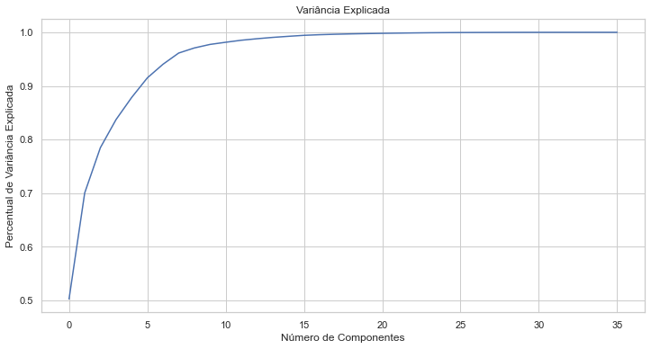
    


```python
# Pelo gráfico acima 10 componentes principais são suficientes. Usaremos esse valor 
pca = PCA(n_components = 10)
```


```python
# Fit e transform do modelo pca
arr_pca = pca.fit_transform(df_scaled)
```


```python
# Cria a lista colunas do PCA
cols_PCA = ['PCA' + str(i) for i in range(1,11)]
cols_PCA
```


    ['PCA1',
     'PCA2',
     'PCA3',
     'PCA4',
     'PCA5',
     'PCA6',
     'PCA7',
     'PCA8',
     'PCA9',
     'PCA10']


```python
# Armasena os componentes em um dataframe
df_scaled_pca = pd.DataFrame(arr_pca, columns = cols_PCA)

# Visualiza amostra
df_scaled_pca.head()
```


<div>
<style scoped>
    .dataframe tbody tr th:only-of-type {
        vertical-align: middle;
    }

    .dataframe tbody tr th {
        vertical-align: top;
    }
    
    .dataframe thead th {
        text-align: right;
    }
</style>
<table border="1" class="dataframe">
  <thead>
    <tr style="text-align: right;">
      <th></th>
      <th>PCA1</th>
      <th>PCA2</th>
      <th>PCA3</th>
      <th>PCA4</th>
      <th>PCA5</th>
      <th>PCA6</th>
      <th>PCA7</th>
      <th>PCA8</th>
      <th>PCA9</th>
      <th>PCA10</th>
    </tr>
  </thead>
  <tbody>
    <tr>
      <th>0</th>
      <td>-0.189786</td>
      <td>-0.225928</td>
      <td>-0.070251</td>
      <td>-0.061773</td>
      <td>0.068859</td>
      <td>-0.138118</td>
      <td>0.036129</td>
      <td>-0.006097</td>
      <td>0.054610</td>
      <td>-0.030596</td>
    </tr>
    <tr>
      <th>1</th>
      <td>9.243828</td>
      <td>28.165459</td>
      <td>9.693018</td>
      <td>2.014850</td>
      <td>-3.490405</td>
      <td>6.142835</td>
      <td>0.500528</td>
      <td>0.333165</td>
      <td>9.767015</td>
      <td>1.717751</td>
    </tr>
    <tr>
      <th>2</th>
      <td>0.037149</td>
      <td>0.276740</td>
      <td>0.007367</td>
      <td>0.076539</td>
      <td>0.023640</td>
      <td>-0.144762</td>
      <td>-0.026214</td>
      <td>0.050815</td>
      <td>0.322028</td>
      <td>-0.075613</td>
    </tr>
    <tr>
      <th>3</th>
      <td>0.224525</td>
      <td>-0.182780</td>
      <td>-0.168560</td>
      <td>-0.105874</td>
      <td>-0.069198</td>
      <td>-0.069884</td>
      <td>-0.085056</td>
      <td>-0.009260</td>
      <td>0.131555</td>
      <td>-0.037318</td>
    </tr>
    <tr>
      <th>4</th>
      <td>43.391792</td>
      <td>-9.788772</td>
      <td>-11.472998</td>
      <td>-9.508949</td>
      <td>-21.790186</td>
      <td>4.601164</td>
      <td>-14.752986</td>
      <td>-10.398443</td>
      <td>1.856955</td>
      <td>4.854454</td>
    </tr>
  </tbody>
</table>
</div>


### 3.1.2 Aplicação da Escala Z em Componentes PCA Padronizados


```python
# Fit e transform nos dados
arr_pca_scaled_z = scaler.fit_transform(df_scaled_pca)
```


```python
# Cria o dataFrame
df_pca_scaled_z = pd.DataFrame(arr_pca_scaled_z, columns = cols_PCA)

# Visualiza
df_pca_scaled_z.head()
```


<div>
<style scoped>
    .dataframe tbody tr th:only-of-type {
        vertical-align: middle;
    }

    .dataframe tbody tr th {
        vertical-align: top;
    }
    
    .dataframe thead th {
        text-align: right;
    }
</style>
<table border="1" class="dataframe">
  <thead>
    <tr style="text-align: right;">
      <th></th>
      <th>PCA1</th>
      <th>PCA2</th>
      <th>PCA3</th>
      <th>PCA4</th>
      <th>PCA5</th>
      <th>PCA6</th>
      <th>PCA7</th>
      <th>PCA8</th>
      <th>PCA9</th>
      <th>PCA10</th>
    </tr>
  </thead>
  <tbody>
    <tr>
      <th>0</th>
      <td>-0.044612</td>
      <td>-0.084651</td>
      <td>-0.040333</td>
      <td>-0.044975</td>
      <td>0.056453</td>
      <td>-0.120501</td>
      <td>0.037794</td>
      <td>-0.007035</td>
      <td>0.093356</td>
      <td>-0.062923</td>
    </tr>
    <tr>
      <th>1</th>
      <td>2.172910</td>
      <td>10.553095</td>
      <td>5.564976</td>
      <td>1.466945</td>
      <td>-2.861554</td>
      <td>5.359333</td>
      <td>0.523599</td>
      <td>0.384417</td>
      <td>16.696565</td>
      <td>3.532632</td>
    </tr>
    <tr>
      <th>2</th>
      <td>0.008733</td>
      <td>0.103690</td>
      <td>0.004230</td>
      <td>0.055726</td>
      <td>0.019381</td>
      <td>-0.126298</td>
      <td>-0.027422</td>
      <td>0.058632</td>
      <td>0.550502</td>
      <td>-0.155501</td>
    </tr>
    <tr>
      <th>3</th>
      <td>0.052778</td>
      <td>-0.068484</td>
      <td>-0.096774</td>
      <td>-0.077083</td>
      <td>-0.056731</td>
      <td>-0.060970</td>
      <td>-0.088976</td>
      <td>-0.010684</td>
      <td>0.224891</td>
      <td>-0.076746</td>
    </tr>
    <tr>
      <th>4</th>
      <td>10.199938</td>
      <td>-3.667678</td>
      <td>-6.586902</td>
      <td>-6.923150</td>
      <td>-17.864340</td>
      <td>4.014297</td>
      <td>-15.432997</td>
      <td>-11.998071</td>
      <td>3.174437</td>
      <td>9.983402</td>
    </tr>
  </tbody>
</table>
</div>


### 3.1.3 Calculando o Fraud Score


```python
# Loop para calcular o score por componente PCA
for i in range(1,11):
    col_name = 'score' + str(i)
    pca_col_name = 'PCA' + str(i)
    df_pca_scaled_z[col_name] = df_pca_scaled_z[pca_col_name] ** 2 
```


```python
# Visualiza
df_pca_scaled_z.head()
```


<div>
<style scoped>
    .dataframe tbody tr th:only-of-type {
        vertical-align: middle;
    }

    .dataframe tbody tr th {
        vertical-align: top;
    }
    
    .dataframe thead th {
        text-align: right;
    }
</style>
<table border="1" class="dataframe">
  <thead>
    <tr style="text-align: right;">
      <th></th>
      <th>PCA1</th>
      <th>PCA2</th>
      <th>PCA3</th>
      <th>PCA4</th>
      <th>PCA5</th>
      <th>PCA6</th>
      <th>PCA7</th>
      <th>PCA8</th>
      <th>PCA9</th>
      <th>PCA10</th>
      <th>score1</th>
      <th>score2</th>
      <th>score3</th>
      <th>score4</th>
      <th>score5</th>
      <th>score6</th>
      <th>score7</th>
      <th>score8</th>
      <th>score9</th>
      <th>score10</th>
    </tr>
  </thead>
  <tbody>
    <tr>
      <th>0</th>
      <td>-0.044612</td>
      <td>-0.084651</td>
      <td>-0.040333</td>
      <td>-0.044975</td>
      <td>0.056453</td>
      <td>-0.120501</td>
      <td>0.037794</td>
      <td>-0.007035</td>
      <td>0.093356</td>
      <td>-0.062923</td>
      <td>0.001990</td>
      <td>0.007166</td>
      <td>0.001627</td>
      <td>0.002023</td>
      <td>0.003187</td>
      <td>0.014521</td>
      <td>0.001428</td>
      <td>0.000049</td>
      <td>0.008715</td>
      <td>0.003959</td>
    </tr>
    <tr>
      <th>1</th>
      <td>2.172910</td>
      <td>10.553095</td>
      <td>5.564976</td>
      <td>1.466945</td>
      <td>-2.861554</td>
      <td>5.359333</td>
      <td>0.523599</td>
      <td>0.384417</td>
      <td>16.696565</td>
      <td>3.532632</td>
      <td>4.721539</td>
      <td>111.367812</td>
      <td>30.968961</td>
      <td>2.151928</td>
      <td>8.188489</td>
      <td>28.722445</td>
      <td>0.274156</td>
      <td>0.147776</td>
      <td>278.775287</td>
      <td>12.479486</td>
    </tr>
    <tr>
      <th>2</th>
      <td>0.008733</td>
      <td>0.103690</td>
      <td>0.004230</td>
      <td>0.055726</td>
      <td>0.019381</td>
      <td>-0.126298</td>
      <td>-0.027422</td>
      <td>0.058632</td>
      <td>0.550502</td>
      <td>-0.155501</td>
      <td>0.000076</td>
      <td>0.010752</td>
      <td>0.000018</td>
      <td>0.003105</td>
      <td>0.000376</td>
      <td>0.015951</td>
      <td>0.000752</td>
      <td>0.003438</td>
      <td>0.303052</td>
      <td>0.024181</td>
    </tr>
    <tr>
      <th>3</th>
      <td>0.052778</td>
      <td>-0.068484</td>
      <td>-0.096774</td>
      <td>-0.077083</td>
      <td>-0.056731</td>
      <td>-0.060970</td>
      <td>-0.088976</td>
      <td>-0.010684</td>
      <td>0.224891</td>
      <td>-0.076746</td>
      <td>0.002786</td>
      <td>0.004690</td>
      <td>0.009365</td>
      <td>0.005942</td>
      <td>0.003218</td>
      <td>0.003717</td>
      <td>0.007917</td>
      <td>0.000114</td>
      <td>0.050576</td>
      <td>0.005890</td>
    </tr>
    <tr>
      <th>4</th>
      <td>10.199938</td>
      <td>-3.667678</td>
      <td>-6.586902</td>
      <td>-6.923150</td>
      <td>-17.864340</td>
      <td>4.014297</td>
      <td>-15.432997</td>
      <td>-11.998071</td>
      <td>3.174437</td>
      <td>9.983402</td>
      <td>104.038733</td>
      <td>13.451864</td>
      <td>43.387278</td>
      <td>47.930008</td>
      <td>319.134642</td>
      <td>16.114584</td>
      <td>238.177403</td>
      <td>143.953715</td>
      <td>10.077047</td>
      <td>99.668315</td>
    </tr>
  </tbody>
</table>
</div>


```python
# Colunas
col_scores = ['score' + str(i) for i in range(1,11)]
```


```python
# Calcula o score de fraude
df_pca_scaled_z['Fraud Score 1'] = df_pca_scaled_z[col_scores].sum(axis = 1) ** (1 / 2)

# Visualiza
df_pca_scaled_z.head()
```


<div>
<style scoped>
    .dataframe tbody tr th:only-of-type {
        vertical-align: middle;
    }

    .dataframe tbody tr th {
        vertical-align: top;
    }
    
    .dataframe thead th {
        text-align: right;
    }
</style>
<table border="1" class="dataframe">
  <thead>
    <tr style="text-align: right;">
      <th></th>
      <th>PCA1</th>
      <th>PCA2</th>
      <th>PCA3</th>
      <th>PCA4</th>
      <th>PCA5</th>
      <th>PCA6</th>
      <th>PCA7</th>
      <th>PCA8</th>
      <th>PCA9</th>
      <th>PCA10</th>
      <th>score1</th>
      <th>score2</th>
      <th>score3</th>
      <th>score4</th>
      <th>score5</th>
      <th>score6</th>
      <th>score7</th>
      <th>score8</th>
      <th>score9</th>
      <th>score10</th>
      <th>Fraud Score 1</th>
    </tr>
  </thead>
  <tbody>
    <tr>
      <th>0</th>
      <td>-0.044612</td>
      <td>-0.084651</td>
      <td>-0.040333</td>
      <td>-0.044975</td>
      <td>0.056453</td>
      <td>-0.120501</td>
      <td>0.037794</td>
      <td>-0.007035</td>
      <td>0.093356</td>
      <td>-0.062923</td>
      <td>0.001990</td>
      <td>0.007166</td>
      <td>0.001627</td>
      <td>0.002023</td>
      <td>0.003187</td>
      <td>0.014521</td>
      <td>0.001428</td>
      <td>0.000049</td>
      <td>0.008715</td>
      <td>0.003959</td>
      <td>0.211342</td>
    </tr>
    <tr>
      <th>1</th>
      <td>2.172910</td>
      <td>10.553095</td>
      <td>5.564976</td>
      <td>1.466945</td>
      <td>-2.861554</td>
      <td>5.359333</td>
      <td>0.523599</td>
      <td>0.384417</td>
      <td>16.696565</td>
      <td>3.532632</td>
      <td>4.721539</td>
      <td>111.367812</td>
      <td>30.968961</td>
      <td>2.151928</td>
      <td>8.188489</td>
      <td>28.722445</td>
      <td>0.274156</td>
      <td>0.147776</td>
      <td>278.775287</td>
      <td>12.479486</td>
      <td>21.858588</td>
    </tr>
    <tr>
      <th>2</th>
      <td>0.008733</td>
      <td>0.103690</td>
      <td>0.004230</td>
      <td>0.055726</td>
      <td>0.019381</td>
      <td>-0.126298</td>
      <td>-0.027422</td>
      <td>0.058632</td>
      <td>0.550502</td>
      <td>-0.155501</td>
      <td>0.000076</td>
      <td>0.010752</td>
      <td>0.000018</td>
      <td>0.003105</td>
      <td>0.000376</td>
      <td>0.015951</td>
      <td>0.000752</td>
      <td>0.003438</td>
      <td>0.303052</td>
      <td>0.024181</td>
      <td>0.601415</td>
    </tr>
    <tr>
      <th>3</th>
      <td>0.052778</td>
      <td>-0.068484</td>
      <td>-0.096774</td>
      <td>-0.077083</td>
      <td>-0.056731</td>
      <td>-0.060970</td>
      <td>-0.088976</td>
      <td>-0.010684</td>
      <td>0.224891</td>
      <td>-0.076746</td>
      <td>0.002786</td>
      <td>0.004690</td>
      <td>0.009365</td>
      <td>0.005942</td>
      <td>0.003218</td>
      <td>0.003717</td>
      <td>0.007917</td>
      <td>0.000114</td>
      <td>0.050576</td>
      <td>0.005890</td>
      <td>0.306945</td>
    </tr>
    <tr>
      <th>4</th>
      <td>10.199938</td>
      <td>-3.667678</td>
      <td>-6.586902</td>
      <td>-6.923150</td>
      <td>-17.864340</td>
      <td>4.014297</td>
      <td>-15.432997</td>
      <td>-11.998071</td>
      <td>3.174437</td>
      <td>9.983402</td>
      <td>104.038733</td>
      <td>13.451864</td>
      <td>43.387278</td>
      <td>47.930008</td>
      <td>319.134642</td>
      <td>16.114584</td>
      <td>238.177403</td>
      <td>143.953715</td>
      <td>10.077047</td>
      <td>99.668315</td>
      <td>32.185922</td>
    </tr>
  </tbody>
</table>
</div>


```python
# Data Frame final com o score
df_score1 = pd.merge(df, df_pca_scaled_z.iloc[:,-1], left_index = True, right_index = True)
```


```python
# Shape
df_score1.shape
```


    (1070994, 70)


```python
# Visualiza
df_score1.head()
```


<div>
<style scoped>
    .dataframe tbody tr th:only-of-type {
        vertical-align: middle;
    }

    .dataframe tbody tr th {
        vertical-align: top;
    }
    
    .dataframe thead th {
        text-align: right;
    }
</style>
<table border="1" class="dataframe">
  <thead>
    <tr style="text-align: right;">
      <th></th>
      <th>Unnamed: 0</th>
      <th>RECORD</th>
      <th>BBLE</th>
      <th>B</th>
      <th>BLOCK</th>
      <th>LOT</th>
      <th>EASEMENT</th>
      <th>OWNER</th>
      <th>BLDGCL</th>
      <th>TAXCLASS</th>
      <th>LTFRONT</th>
      <th>LTDEPTH</th>
      <th>EXT</th>
      <th>STORIES</th>
      <th>FULLVAL</th>
      <th>AVLAND</th>
      <th>AVTOT</th>
      <th>EXLAND</th>
      <th>EXTOT</th>
      <th>EXCD1</th>
      <th>STADDR</th>
      <th>ZIP</th>
      <th>EXMPTCL</th>
      <th>BLDFRONT</th>
      <th>BLDDEPTH</th>
      <th>AVLAND2</th>
      <th>AVTOT2</th>
      <th>EXLAND2</th>
      <th>EXTOT2</th>
      <th>EXCD2</th>
      <th>PERIOD</th>
      <th>YEAR</th>
      <th>VALTYPE</th>
      <th>ind1_media_ind1_grupo_ZIP</th>
      <th>ind2_media_ind2_grupo_ZIP</th>
      <th>ind3_media_ind3_grupo_ZIP</th>
      <th>ind4_media_ind4_grupo_ZIP</th>
      <th>ind5_media_ind5_grupo_ZIP</th>
      <th>ind6_media_ind6_grupo_ZIP</th>
      <th>ind7_media_ind7_grupo_ZIP</th>
      <th>ind8_media_ind8_grupo_ZIP</th>
      <th>ind9_media_ind9_grupo_ZIP</th>
      <th>ind1_media_ind1_grupo_TAXCLASS</th>
      <th>ind2_media_ind2_grupo_TAXCLASS</th>
      <th>ind3_media_ind3_grupo_TAXCLASS</th>
      <th>ind4_media_ind4_grupo_TAXCLASS</th>
      <th>ind5_media_ind5_grupo_TAXCLASS</th>
      <th>ind6_media_ind6_grupo_TAXCLASS</th>
      <th>ind7_media_ind7_grupo_TAXCLASS</th>
      <th>ind8_media_ind8_grupo_TAXCLASS</th>
      <th>ind9_media_ind9_grupo_TAXCLASS</th>
      <th>ind1_media_ind1_grupo_B</th>
      <th>ind2_media_ind2_grupo_B</th>
      <th>ind3_media_ind3_grupo_B</th>
      <th>ind4_media_ind4_grupo_B</th>
      <th>ind5_media_ind5_grupo_B</th>
      <th>ind6_media_ind6_grupo_B</th>
      <th>ind7_media_ind7_grupo_B</th>
      <th>ind8_media_ind8_grupo_B</th>
      <th>ind9_media_ind9_grupo_B</th>
      <th>ind1_media_ind1_grupo_All</th>
      <th>ind2_media_ind2_grupo_All</th>
      <th>ind3_media_ind3_grupo_All</th>
      <th>ind4_media_ind4_grupo_All</th>
      <th>ind5_media_ind5_grupo_All</th>
      <th>ind6_media_ind6_grupo_All</th>
      <th>ind7_media_ind7_grupo_All</th>
      <th>ind8_media_ind8_grupo_All</th>
      <th>ind9_media_ind9_grupo_All</th>
      <th>Fraud Score 1</th>
    </tr>
  </thead>
  <tbody>
    <tr>
      <th>0</th>
      <td>0</td>
      <td>1</td>
      <td>1000010101</td>
      <td>1</td>
      <td>1</td>
      <td>101</td>
      <td>NaN</td>
      <td>U S GOVT LAND &amp; BLDGS</td>
      <td>P7</td>
      <td>4</td>
      <td>500.000000</td>
      <td>1046.000000</td>
      <td>NaN</td>
      <td>4.000000</td>
      <td>21400000.000000</td>
      <td>4225500.000000</td>
      <td>9630000.000000</td>
      <td>4225500.000000</td>
      <td>9630000.000000</td>
      <td>4600.000000</td>
      <td>1 LIBERTY ISLAND</td>
      <td>10004</td>
      <td>X3</td>
      <td>382.000000</td>
      <td>318.000000</td>
      <td>3775500.000000</td>
      <td>8613000.000000</td>
      <td>3775500.000000</td>
      <td>8613000.000000</td>
      <td>NaN</td>
      <td>FINAL</td>
      <td>2010/11</td>
      <td>AC-TR</td>
      <td>0.132606</td>
      <td>0.440920</td>
      <td>0.322414</td>
      <td>0.183988</td>
      <td>0.384673</td>
      <td>0.166388</td>
      <td>0.146115</td>
      <td>0.474799</td>
      <td>0.338662</td>
      <td>0.186694</td>
      <td>0.204512</td>
      <td>0.097932</td>
      <td>0.203730</td>
      <td>0.126685</td>
      <td>0.053077</td>
      <td>0.186558</td>
      <td>0.194281</td>
      <td>0.094752</td>
      <td>0.112427</td>
      <td>0.317461</td>
      <td>0.270552</td>
      <td>0.224860</td>
      <td>0.512207</td>
      <td>0.272549</td>
      <td>0.192715</td>
      <td>0.542278</td>
      <td>0.439817</td>
      <td>0.119039</td>
      <td>0.290093</td>
      <td>0.155256</td>
      <td>0.728226</td>
      <td>0.788544</td>
      <td>0.363666</td>
      <td>0.600587</td>
      <td>1.048116</td>
      <td>0.575614</td>
      <td>0.211342</td>
    </tr>
    <tr>
      <th>1</th>
      <td>1</td>
      <td>2</td>
      <td>1000010201</td>
      <td>1</td>
      <td>1</td>
      <td>201</td>
      <td>NaN</td>
      <td>U S GOVT LAND &amp; BLDGS</td>
      <td>Z9</td>
      <td>4</td>
      <td>27.000000</td>
      <td>355.000000</td>
      <td>NaN</td>
      <td>1.000000</td>
      <td>193800000.000000</td>
      <td>14310000.000000</td>
      <td>87210000.000000</td>
      <td>14310000.000000</td>
      <td>87210000.000000</td>
      <td>4600.000000</td>
      <td>1 ELLIS ISLAND</td>
      <td>10004</td>
      <td>X3</td>
      <td>382.000000</td>
      <td>318.000000</td>
      <td>11111400.000000</td>
      <td>80690400.000000</td>
      <td>11111400.000000</td>
      <td>80690400.000000</td>
      <td>NaN</td>
      <td>FINAL</td>
      <td>2010/11</td>
      <td>AC-TR</td>
      <td>65.525689</td>
      <td>3.993003</td>
      <td>11.679204</td>
      <td>33.998569</td>
      <td>1.302725</td>
      <td>2.253945</td>
      <td>72.201394</td>
      <td>4.299811</td>
      <td>12.267776</td>
      <td>92.252635</td>
      <td>1.852077</td>
      <td>3.547528</td>
      <td>37.646638</td>
      <td>0.429028</td>
      <td>0.719000</td>
      <td>92.185622</td>
      <td>1.759427</td>
      <td>3.432329</td>
      <td>55.554558</td>
      <td>2.874953</td>
      <td>9.800572</td>
      <td>41.551103</td>
      <td>1.734632</td>
      <td>3.692044</td>
      <td>95.228104</td>
      <td>4.910909</td>
      <td>15.932063</td>
      <td>58.821734</td>
      <td>2.627102</td>
      <td>5.624045</td>
      <td>134.566543</td>
      <td>2.670469</td>
      <td>4.926343</td>
      <td>296.773816</td>
      <td>9.491816</td>
      <td>20.851196</td>
      <td>21.858588</td>
    </tr>
    <tr>
      <th>2</th>
      <td>2</td>
      <td>3</td>
      <td>1000020001</td>
      <td>1</td>
      <td>2</td>
      <td>1</td>
      <td>NaN</td>
      <td>DEPT OF GENERAL SERVI</td>
      <td>Y7</td>
      <td>4</td>
      <td>709.000000</td>
      <td>564.000000</td>
      <td>E</td>
      <td>3.000000</td>
      <td>104686000.000000</td>
      <td>39008700.000000</td>
      <td>47108700.000000</td>
      <td>39008700.000000</td>
      <td>47108700.000000</td>
      <td>2191.000000</td>
      <td>MARGINAL STREET</td>
      <td>10004</td>
      <td>X1</td>
      <td>709.000000</td>
      <td>564.000000</td>
      <td>32321790.000000</td>
      <td>40179510.000000</td>
      <td>32321790.000000</td>
      <td>40179510.000000</td>
      <td>NaN</td>
      <td>FINAL</td>
      <td>2010/11</td>
      <td>AC-TR</td>
      <td>0.848425</td>
      <td>0.655239</td>
      <td>0.638840</td>
      <td>2.221515</td>
      <td>1.078797</td>
      <td>0.622170</td>
      <td>0.934861</td>
      <td>0.705585</td>
      <td>0.671034</td>
      <td>1.194484</td>
      <td>0.303920</td>
      <td>0.194046</td>
      <td>2.459885</td>
      <td>0.355281</td>
      <td>0.198470</td>
      <td>1.193616</td>
      <td>0.288716</td>
      <td>0.187745</td>
      <td>0.719319</td>
      <td>0.471770</td>
      <td>0.536081</td>
      <td>2.715008</td>
      <td>1.436462</td>
      <td>1.019137</td>
      <td>1.233010</td>
      <td>0.805864</td>
      <td>0.871467</td>
      <td>0.761622</td>
      <td>0.431099</td>
      <td>0.307629</td>
      <td>8.792770</td>
      <td>2.211437</td>
      <td>1.359848</td>
      <td>3.842618</td>
      <td>1.557576</td>
      <td>1.140538</td>
      <td>0.601415</td>
    </tr>
    <tr>
      <th>3</th>
      <td>3</td>
      <td>4</td>
      <td>1000020023</td>
      <td>1</td>
      <td>2</td>
      <td>23</td>
      <td>NaN</td>
      <td>DEPARTMENT OF BUSINES</td>
      <td>T2</td>
      <td>4</td>
      <td>793.000000</td>
      <td>551.000000</td>
      <td>NaN</td>
      <td>2.000000</td>
      <td>39200000.000000</td>
      <td>15255000.000000</td>
      <td>17640000.000000</td>
      <td>15255000.000000</td>
      <td>17640000.000000</td>
      <td>2191.000000</td>
      <td>PIER 6</td>
      <td>10004</td>
      <td>X1</td>
      <td>85.000000</td>
      <td>551.000000</td>
      <td>13644000.000000</td>
      <td>15750000.000000</td>
      <td>13644000.000000</td>
      <td>15750000.000000</td>
      <td>NaN</td>
      <td>FINAL</td>
      <td>2010/11</td>
      <td>AC-TR</td>
      <td>0.290744</td>
      <td>2.094845</td>
      <td>3.063624</td>
      <td>0.795061</td>
      <td>3.602014</td>
      <td>3.116060</td>
      <td>0.320365</td>
      <td>2.255805</td>
      <td>3.218015</td>
      <td>0.409335</td>
      <td>0.971653</td>
      <td>0.930568</td>
      <td>0.880372</td>
      <td>1.186254</td>
      <td>0.994011</td>
      <td>0.409037</td>
      <td>0.923046</td>
      <td>0.900350</td>
      <td>0.246501</td>
      <td>1.508284</td>
      <td>2.570832</td>
      <td>0.971678</td>
      <td>4.796228</td>
      <td>5.104220</td>
      <td>0.422537</td>
      <td>2.576405</td>
      <td>4.179211</td>
      <td>0.260998</td>
      <td>1.378254</td>
      <td>1.475269</td>
      <td>3.146857</td>
      <td>7.383803</td>
      <td>6.810629</td>
      <td>1.316816</td>
      <td>4.979681</td>
      <td>5.469571</td>
      <td>0.306945</td>
    </tr>
    <tr>
      <th>4</th>
      <td>4</td>
      <td>5</td>
      <td>1000030001</td>
      <td>1</td>
      <td>3</td>
      <td>1</td>
      <td>NaN</td>
      <td>PARKS AND RECREATION</td>
      <td>Q1</td>
      <td>4</td>
      <td>323.000000</td>
      <td>1260.000000</td>
      <td>NaN</td>
      <td>1.000000</td>
      <td>272300000.000000</td>
      <td>121050000.000000</td>
      <td>122535000.000000</td>
      <td>121050000.000000</td>
      <td>122535000.000000</td>
      <td>2231.000000</td>
      <td>BATTERY PARK</td>
      <td>10004</td>
      <td>X1</td>
      <td>89.000000</td>
      <td>57.000000</td>
      <td>106348680.000000</td>
      <td>107758350.000000</td>
      <td>106348680.000000</td>
      <td>107758350.000000</td>
      <td>NaN</td>
      <td>FINAL</td>
      <td>2010/11</td>
      <td>AC-TR</td>
      <td>2.168326</td>
      <td>134.344249</td>
      <td>392.945875</td>
      <td>6.773371</td>
      <td>263.878267</td>
      <td>456.555954</td>
      <td>2.389233</td>
      <td>144.666800</td>
      <td>412.748342</td>
      <td>3.052753</td>
      <td>62.312985</td>
      <td>119.356295</td>
      <td>7.500158</td>
      <td>86.903268</td>
      <td>145.639640</td>
      <td>3.050536</td>
      <td>59.195770</td>
      <td>115.480448</td>
      <td>1.838369</td>
      <td>96.727571</td>
      <td>329.739454</td>
      <td>8.278026</td>
      <td>351.364636</td>
      <td>747.855349</td>
      <td>3.151215</td>
      <td>165.227152</td>
      <td>536.032968</td>
      <td>1.946484</td>
      <td>88.388624</td>
      <td>189.220556</td>
      <td>26.809043</td>
      <td>540.926631</td>
      <td>997.873441</td>
      <td>9.820611</td>
      <td>319.351382</td>
      <td>701.536801</td>
      <td>32.185922</td>
    </tr>
  </tbody>
</table>
</div>


### 3.2. Calculando o Score de Fraude 2 com Deep Learning

Usaremos um modelo Autoencoder. Essa é uma abordagem de aprendizado não supervisionado.


```python
# Imports
import tensorflow as tf
import tensorflow.keras as keras
from sklearn.model_selection import train_test_split
from tensorflow.keras.models import Sequential, Model, load_model
from tensorflow.keras.layers import Input, Dense
from tensorflow.keras.callbacks import ModelCheckpoint, TensorBoard
from tensorflow.keras import regularizers
```

    INFO:tensorflow:Enabling eager execution
    INFO:tensorflow:Enabling v2 tensorshape
    INFO:tensorflow:Enabling resource variables
    INFO:tensorflow:Enabling tensor equality
    INFO:tensorflow:Enabling control flow v2


```python
# Carrega os dados com os 10 componentes principais
df_pca = df_pca_scaled_z.iloc[:,:10]
```


```python
# Divisão em treino e teste
X_treino, X_teste = train_test_split(df_pca, test_size = 0.2, random_state = 42)
```


```python
# Extrai os valores
X_treino = X_treino.values
X_teste = X_teste.values
```


```python
# Shape
X_treino.shape
```


    (856795, 10)


### 3.2.1. Construindo o Modelo


```python
# Hiperparâmetros do modelo
input_dim = X_treino.shape[1]
encoding_dim = 5
input_layer = Input(shape = (input_dim, ))
```


```python
# Modelo

# Encoder
encoder = Dense(encoding_dim, activation = "tanh", activity_regularizer = regularizers.l1(10e-5))(input_layer)
encoder = Dense(int(encoding_dim / 2), activation = "relu")(encoder)

# Decoder
decoder = Dense(int(encoding_dim / 2), activation = 'tanh')(encoder)
decoder = Dense(input_dim, activation='relu')(decoder)

# Modelo final
autoencoder = Model(inputs = input_layer, outputs = decoder)
autoencoder.summary()
```

    Model: "model"
    _________________________________________________________________
    Layer (type)                 Output Shape              Param #   
    =================================================================
    input_1 (InputLayer)         [(None, 10)]              0         
    _________________________________________________________________
    dense (Dense)                (None, 5)                 55        
    _________________________________________________________________
    dense_1 (Dense)              (None, 2)                 12        
    _________________________________________________________________
    dense_2 (Dense)              (None, 2)                 6         
    _________________________________________________________________
    dense_3 (Dense)              (None, 10)                30        
    =================================================================
    Total params: 103
    Trainable params: 103
    Non-trainable params: 0
    _________________________________________________________________


```python
# Hiperparâmetro de treinamento
num_epoch = 50
batch_size = 256
```


```python
# Compila o modelo
autoencoder.compile(optimizer = 'adam', loss = 'mean_squared_error', metrics = ['accuracy'])
```


```python
# Checkpoint
checkpointer = ModelCheckpoint(filepath = "modelo/modelo_autoencoder.h5", verbose = 0, save_best_only = True)
```


```python
tensorboard = TensorBoard(log_dir = '.\logs', 
                          histogram_freq = 0, 
                          write_graph = True, 
                          write_images = True,
                          profile_batch = 100000000)
```


```python
# Treinamento
history = autoencoder.fit(X_treino, 
                          X_treino,
                          epochs = num_epoch,
                          batch_size = batch_size,
                          shuffle = True,
                          validation_data = (X_teste, X_teste),
                          verbose = 1,
                          callbacks = [checkpointer, tensorboard]).history
```

    Epoch 1/50
    3347/3347 [==============================] - 6s 1ms/step - loss: 0.9513 - accuracy: 0.2345 - val_loss: 0.9183 - val_accuracy: 0.2295
    Epoch 2/50
    3347/3347 [==============================] - 5s 2ms/step - loss: 1.3922 - accuracy: 0.2363 - val_loss: 0.9151 - val_accuracy: 0.2359
    Epoch 3/50
    3347/3347 [==============================] - 5s 2ms/step - loss: 1.2422 - accuracy: 0.2326 - val_loss: 0.9118 - val_accuracy: 0.2177
    Epoch 4/50
    3347/3347 [==============================] - 4s 1ms/step - loss: 0.8009 - accuracy: 0.2251 - val_loss: 0.9083 - val_accuracy: 0.2342
    Epoch 5/50
    3347/3347 [==============================] - 4s 1ms/step - loss: 1.1121 - accuracy: 0.2305 - val_loss: 0.9065 - val_accuracy: 0.2296
    Epoch 6/50
    3347/3347 [==============================] - 4s 1ms/step - loss: 1.1798 - accuracy: 0.2227 - val_loss: 0.9046 - val_accuracy: 0.2192
    Epoch 7/50
    3347/3347 [==============================] - 4s 1ms/step - loss: 1.0556 - accuracy: 0.2185 - val_loss: 0.9019 - val_accuracy: 0.1784
    Epoch 8/50
    3347/3347 [==============================] - 4s 1ms/step - loss: 1.2575 - accuracy: 0.1966 - val_loss: 0.9003 - val_accuracy: 0.2284
    Epoch 9/50
    3347/3347 [==============================] - 4s 1ms/step - loss: 0.9320 - accuracy: 0.2145 - val_loss: 0.8997 - val_accuracy: 0.2068
    Epoch 10/50
    3347/3347 [==============================] - 4s 1ms/step - loss: 0.6303 - accuracy: 0.2158 - val_loss: 0.8983 - val_accuracy: 0.1843
    Epoch 11/50
    3347/3347 [==============================] - 4s 1ms/step - loss: 1.2854 - accuracy: 0.1975 - val_loss: 0.8970 - val_accuracy: 0.2106
    Epoch 12/50
    3347/3347 [==============================] - 4s 1ms/step - loss: 1.1885 - accuracy: 0.2167 - val_loss: 0.8965 - val_accuracy: 0.1905
    Epoch 13/50
    3347/3347 [==============================] - 4s 1ms/step - loss: 1.0682 - accuracy: 0.2121 - val_loss: 0.8955 - val_accuracy: 0.2286
    Epoch 14/50
    3347/3347 [==============================] - 5s 1ms/step - loss: 1.1599 - accuracy: 0.2181 - val_loss: 0.8948 - val_accuracy: 0.2307
    Epoch 15/50
    3347/3347 [==============================] - 5s 1ms/step - loss: 0.7539 - accuracy: 0.2339 - val_loss: 0.8935 - val_accuracy: 0.2350
    Epoch 16/50
    3347/3347 [==============================] - 4s 1ms/step - loss: 0.7115 - accuracy: 0.2341 - val_loss: 0.8912 - val_accuracy: 0.2340
    Epoch 17/50
    3347/3347 [==============================] - 4s 1ms/step - loss: 0.8121 - accuracy: 0.2359 - val_loss: 0.8937 - val_accuracy: 0.2339
    Epoch 18/50
    3347/3347 [==============================] - 4s 1ms/step - loss: 0.6863 - accuracy: 0.2291 - val_loss: 0.8930 - val_accuracy: 0.2222
    Epoch 19/50
    3347/3347 [==============================] - 4s 1ms/step - loss: 1.0649 - accuracy: 0.2305 - val_loss: 0.8912 - val_accuracy: 0.2391
    Epoch 20/50
    3347/3347 [==============================] - 4s 1ms/step - loss: 0.8886 - accuracy: 0.2326 - val_loss: 0.8908 - val_accuracy: 0.2381
    Epoch 21/50
    3347/3347 [==============================] - 4s 1ms/step - loss: 1.2107 - accuracy: 0.2351 - val_loss: 0.8899 - val_accuracy: 0.2305
    Epoch 22/50
    3347/3347 [==============================] - 4s 1ms/step - loss: 0.8626 - accuracy: 0.2354 - val_loss: 0.8914 - val_accuracy: 0.2363
    Epoch 23/50
    3347/3347 [==============================] - 4s 1ms/step - loss: 0.6779 - accuracy: 0.2344 - val_loss: 0.8876 - val_accuracy: 0.2397
    Epoch 24/50
    3347/3347 [==============================] - 4s 1ms/step - loss: 0.7049 - accuracy: 0.2354 - val_loss: 0.8868 - val_accuracy: 0.2406
    Epoch 25/50
    3347/3347 [==============================] - 4s 1ms/step - loss: 0.9427 - accuracy: 0.2404 - val_loss: 0.8892 - val_accuracy: 0.2407
    Epoch 26/50
    3347/3347 [==============================] - 4s 1ms/step - loss: 0.7631 - accuracy: 0.2404 - val_loss: 0.8861 - val_accuracy: 0.2396
    Epoch 27/50
    3347/3347 [==============================] - 5s 1ms/step - loss: 0.7383 - accuracy: 0.2403 - val_loss: 0.8849 - val_accuracy: 0.2404
    Epoch 28/50
    3347/3347 [==============================] - 4s 1ms/step - loss: 0.6985 - accuracy: 0.2428 - val_loss: 0.8882 - val_accuracy: 0.2399
    Epoch 29/50
    3347/3347 [==============================] - 4s 1ms/step - loss: 0.7450 - accuracy: 0.2404 - val_loss: 0.8882 - val_accuracy: 0.2364
    Epoch 30/50
    3347/3347 [==============================] - 4s 1ms/step - loss: 0.8167 - accuracy: 0.2378 - val_loss: 0.8883 - val_accuracy: 0.2409
    Epoch 31/50
    3347/3347 [==============================] - 4s 1ms/step - loss: 1.2371 - accuracy: 0.2406 - val_loss: 0.8879 - val_accuracy: 0.2403
    Epoch 32/50
    3347/3347 [==============================] - 4s 1ms/step - loss: 1.0245 - accuracy: 0.2386 - val_loss: 0.8866 - val_accuracy: 0.2400
    Epoch 33/50
    3347/3347 [==============================] - 4s 1ms/step - loss: 1.2148 - accuracy: 0.2391 - val_loss: 0.8863 - val_accuracy: 0.2408
    Epoch 34/50
    3347/3347 [==============================] - 4s 1ms/step - loss: 1.2055 - accuracy: 0.2402 - val_loss: 0.8876 - val_accuracy: 0.2409
    Epoch 35/50
    3347/3347 [==============================] - 5s 1ms/step - loss: 0.9024 - accuracy: 0.2416 - val_loss: 0.8866 - val_accuracy: 0.2409
    Epoch 36/50
    3347/3347 [==============================] - 4s 1ms/step - loss: 0.9737 - accuracy: 0.2416 - val_loss: 0.8861 - val_accuracy: 0.2409
    Epoch 37/50
    3347/3347 [==============================] - 4s 1ms/step - loss: 1.0153 - accuracy: 0.2423 - val_loss: 0.8867 - val_accuracy: 0.2405
    Epoch 38/50
    3347/3347 [==============================] - 4s 1ms/step - loss: 0.7343 - accuracy: 0.2376 - val_loss: 0.8866 - val_accuracy: 0.2409
    Epoch 39/50
    3347/3347 [==============================] - 4s 1ms/step - loss: 1.2355 - accuracy: 0.2417 - val_loss: 0.8858 - val_accuracy: 0.2409
    Epoch 40/50
    3347/3347 [==============================] - 4s 1ms/step - loss: 1.6391 - accuracy: 0.2411 - val_loss: 0.8873 - val_accuracy: 0.2410
    Epoch 41/50
    3347/3347 [==============================] - 4s 1ms/step - loss: 1.2672 - accuracy: 0.2374 - val_loss: 0.8856 - val_accuracy: 0.2409
    Epoch 42/50
    3347/3347 [==============================] - 6s 2ms/step - loss: 0.8409 - accuracy: 0.2399 - val_loss: 0.8858 - val_accuracy: 0.2409
    Epoch 43/50
    3347/3347 [==============================] - 5s 1ms/step - loss: 0.9458 - accuracy: 0.2413 - val_loss: 0.8855 - val_accuracy: 0.2409
    Epoch 44/50
    3347/3347 [==============================] - 4s 1ms/step - loss: 0.8377 - accuracy: 0.2394 - val_loss: 0.8853 - val_accuracy: 0.2409
    Epoch 45/50
    3347/3347 [==============================] - 4s 1ms/step - loss: 0.8578 - accuracy: 0.2412 - val_loss: 0.8860 - val_accuracy: 0.2409
    Epoch 46/50
    3347/3347 [==============================] - 4s 1ms/step - loss: 0.8442 - accuracy: 0.2417 - val_loss: 0.8855 - val_accuracy: 0.2409
    Epoch 47/50
    3347/3347 [==============================] - 3s 1ms/step - loss: 1.0256 - accuracy: 0.2414 - val_loss: 0.8859 - val_accuracy: 0.2409
    Epoch 48/50
    3347/3347 [==============================] - 3s 1ms/step - loss: 0.6944 - accuracy: 0.2417 - val_loss: 0.8859 - val_accuracy: 0.2409
    Epoch 49/50
    3347/3347 [==============================] - 3s 1ms/step - loss: 0.5828 - accuracy: 0.2423 - val_loss: 0.8862 - val_accuracy: 0.2409
    Epoch 50/50
    3347/3347 [==============================] - 4s 1ms/step - loss: 0.7137 - accuracy: 0.2417 - val_loss: 0.8850 - val_accuracy: 0.2409


### 3.2.2. Avaliando o Modelo


```python
# Carrega o modelo do disco
autoencoder = load_model('modelo/modelo_autoencoder.h5')
```


```python
# Plot
plt.plot(history['loss'])
plt.plot(history['val_loss'])
plt.title('Erro do Modelo')
plt.ylabel('Erro')
plt.xlabel('Número de Épocas')
plt.legend(['Treino', 'Teste'], loc = 'upper right');
```


​    
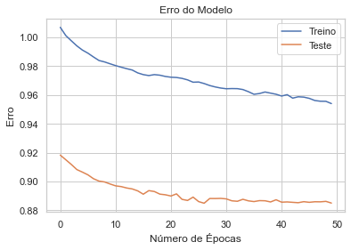
​    


```python
# Previsões
previsoes = autoencoder.predict(df_pca)
previsoes
```


    array([[0.       , 0.       , 0.       , ..., 0.       , 0.       ,
            0.       ],
           [3.2009957, 6.294691 , 4.3162017, ..., 1.3768675, 0.       ,
            0.       ],
           [0.       , 0.       , 0.       , ..., 0.       , 0.       ,
            0.       ],
           ...,
           [0.       , 0.       , 0.       , ..., 0.       , 0.       ,
            0.       ],
           [0.       , 0.       , 0.       , ..., 0.       , 0.       ,
            0.       ],
           [0.       , 0.       , 0.       , ..., 0.       , 0.       ,
            0.       ]], dtype=float32)


```python
# Previsões em dataframe
df_previsoes = pd.DataFrame(previsoes, columns = cols_PCA)
```


```python
# Visualiza
df_previsoes.head()
```


<div>
<style scoped>
    .dataframe tbody tr th:only-of-type {
        vertical-align: middle;
    }

    .dataframe tbody tr th {
        vertical-align: top;
    }
    
    .dataframe thead th {
        text-align: right;
    }
</style>
<table border="1" class="dataframe">
  <thead>
    <tr style="text-align: right;">
      <th></th>
      <th>PCA1</th>
      <th>PCA2</th>
      <th>PCA3</th>
      <th>PCA4</th>
      <th>PCA5</th>
      <th>PCA6</th>
      <th>PCA7</th>
      <th>PCA8</th>
      <th>PCA9</th>
      <th>PCA10</th>
    </tr>
  </thead>
  <tbody>
    <tr>
      <th>0</th>
      <td>0.000000</td>
      <td>0.000000</td>
      <td>0.000000</td>
      <td>0.000000</td>
      <td>0.000000</td>
      <td>0.000000</td>
      <td>0.000000</td>
      <td>0.000000</td>
      <td>0.000000</td>
      <td>0.000000</td>
    </tr>
    <tr>
      <th>1</th>
      <td>3.200996</td>
      <td>6.294691</td>
      <td>4.316202</td>
      <td>0.000000</td>
      <td>0.000000</td>
      <td>3.563962</td>
      <td>0.000000</td>
      <td>1.376868</td>
      <td>0.000000</td>
      <td>0.000000</td>
    </tr>
    <tr>
      <th>2</th>
      <td>0.000000</td>
      <td>0.000000</td>
      <td>0.000000</td>
      <td>0.000000</td>
      <td>0.000000</td>
      <td>0.000000</td>
      <td>0.000000</td>
      <td>0.000000</td>
      <td>0.000000</td>
      <td>0.000000</td>
    </tr>
    <tr>
      <th>3</th>
      <td>0.000000</td>
      <td>0.000000</td>
      <td>0.000000</td>
      <td>0.000000</td>
      <td>0.000000</td>
      <td>0.000000</td>
      <td>0.000000</td>
      <td>0.000000</td>
      <td>0.000000</td>
      <td>0.000000</td>
    </tr>
    <tr>
      <th>4</th>
      <td>0.542096</td>
      <td>0.000000</td>
      <td>0.000000</td>
      <td>0.000000</td>
      <td>0.000000</td>
      <td>1.818944</td>
      <td>0.000000</td>
      <td>0.000000</td>
      <td>0.000000</td>
      <td>0.000000</td>
    </tr>
  </tbody>
</table>
</div>


```python
# Shape
df_previsoes.shape
```


    (1070994, 10)


```python
# Colunas do PCA
cols_pca = ['PCA' + str(i) for i in range(1,11)]
```


```python
# Dataframe
df_autoencod = pd.DataFrame(0, index = np.arange(len(df_previsoes)), columns = cols_pca)
```


```python
# Loop
for i in range(0,10):
    df_autoencod.iloc[:,i] = (df_previsoes.iloc[:,i] - df_pca_scaled_z.iloc[:,i]) ** 2
```


```python
# Calcula o score 2
df_autoencod['Fraud Score 2'] = df_autoencod[cols_pca].sum(axis = 1) ** (1 / 2)
```


```python
# Visualiza
df_autoencod.head()
```


<div>
<style scoped>
    .dataframe tbody tr th:only-of-type {
        vertical-align: middle;
    }

    .dataframe tbody tr th {
        vertical-align: top;
    }
    
    .dataframe thead th {
        text-align: right;
    }
</style>
<table border="1" class="dataframe">
  <thead>
    <tr style="text-align: right;">
      <th></th>
      <th>PCA1</th>
      <th>PCA2</th>
      <th>PCA3</th>
      <th>PCA4</th>
      <th>PCA5</th>
      <th>PCA6</th>
      <th>PCA7</th>
      <th>PCA8</th>
      <th>PCA9</th>
      <th>PCA10</th>
      <th>Fraud Score 2</th>
    </tr>
  </thead>
  <tbody>
    <tr>
      <th>0</th>
      <td>0.001990</td>
      <td>0.007166</td>
      <td>0.001627</td>
      <td>0.002023</td>
      <td>0.003187</td>
      <td>0.014521</td>
      <td>0.001428</td>
      <td>0.000049</td>
      <td>0.008715</td>
      <td>0.003959</td>
      <td>0.211342</td>
    </tr>
    <tr>
      <th>1</th>
      <td>1.056960</td>
      <td>18.134003</td>
      <td>1.559438</td>
      <td>2.151928</td>
      <td>8.188489</td>
      <td>3.223354</td>
      <td>0.274156</td>
      <td>0.984959</td>
      <td>278.775287</td>
      <td>12.479486</td>
      <td>18.078387</td>
    </tr>
    <tr>
      <th>2</th>
      <td>0.000076</td>
      <td>0.010752</td>
      <td>0.000018</td>
      <td>0.003105</td>
      <td>0.000376</td>
      <td>0.015951</td>
      <td>0.000752</td>
      <td>0.003438</td>
      <td>0.303052</td>
      <td>0.024181</td>
      <td>0.601415</td>
    </tr>
    <tr>
      <th>3</th>
      <td>0.002786</td>
      <td>0.004690</td>
      <td>0.009365</td>
      <td>0.005942</td>
      <td>0.003218</td>
      <td>0.003717</td>
      <td>0.007917</td>
      <td>0.000114</td>
      <td>0.050576</td>
      <td>0.005890</td>
      <td>0.306945</td>
    </tr>
    <tr>
      <th>4</th>
      <td>93.273910</td>
      <td>13.451864</td>
      <td>43.387278</td>
      <td>47.930008</td>
      <td>319.134642</td>
      <td>4.819579</td>
      <td>238.177403</td>
      <td>143.953715</td>
      <td>10.077047</td>
      <td>99.668315</td>
      <td>31.841384</td>
    </tr>
  </tbody>
</table>
</div>


```python
# Dataframe
df_score2 = pd.merge(df_score1.iloc[:,1:], df_autoencod.iloc[:,-1], left_index = True, right_index = True)
```


```python
# Visualiza
df_score2.head()
```


<div>
<style scoped>
    .dataframe tbody tr th:only-of-type {
        vertical-align: middle;
    }

    .dataframe tbody tr th {
        vertical-align: top;
    }
    
    .dataframe thead th {
        text-align: right;
    }
</style>
<table border="1" class="dataframe">
  <thead>
    <tr style="text-align: right;">
      <th></th>
      <th>RECORD</th>
      <th>BBLE</th>
      <th>B</th>
      <th>BLOCK</th>
      <th>LOT</th>
      <th>EASEMENT</th>
      <th>OWNER</th>
      <th>BLDGCL</th>
      <th>TAXCLASS</th>
      <th>LTFRONT</th>
      <th>LTDEPTH</th>
      <th>EXT</th>
      <th>STORIES</th>
      <th>FULLVAL</th>
      <th>AVLAND</th>
      <th>AVTOT</th>
      <th>EXLAND</th>
      <th>EXTOT</th>
      <th>EXCD1</th>
      <th>STADDR</th>
      <th>ZIP</th>
      <th>EXMPTCL</th>
      <th>BLDFRONT</th>
      <th>BLDDEPTH</th>
      <th>AVLAND2</th>
      <th>AVTOT2</th>
      <th>EXLAND2</th>
      <th>EXTOT2</th>
      <th>EXCD2</th>
      <th>PERIOD</th>
      <th>YEAR</th>
      <th>VALTYPE</th>
      <th>ind1_media_ind1_grupo_ZIP</th>
      <th>ind2_media_ind2_grupo_ZIP</th>
      <th>ind3_media_ind3_grupo_ZIP</th>
      <th>ind4_media_ind4_grupo_ZIP</th>
      <th>ind5_media_ind5_grupo_ZIP</th>
      <th>ind6_media_ind6_grupo_ZIP</th>
      <th>ind7_media_ind7_grupo_ZIP</th>
      <th>ind8_media_ind8_grupo_ZIP</th>
      <th>ind9_media_ind9_grupo_ZIP</th>
      <th>ind1_media_ind1_grupo_TAXCLASS</th>
      <th>ind2_media_ind2_grupo_TAXCLASS</th>
      <th>ind3_media_ind3_grupo_TAXCLASS</th>
      <th>ind4_media_ind4_grupo_TAXCLASS</th>
      <th>ind5_media_ind5_grupo_TAXCLASS</th>
      <th>ind6_media_ind6_grupo_TAXCLASS</th>
      <th>ind7_media_ind7_grupo_TAXCLASS</th>
      <th>ind8_media_ind8_grupo_TAXCLASS</th>
      <th>ind9_media_ind9_grupo_TAXCLASS</th>
      <th>ind1_media_ind1_grupo_B</th>
      <th>ind2_media_ind2_grupo_B</th>
      <th>ind3_media_ind3_grupo_B</th>
      <th>ind4_media_ind4_grupo_B</th>
      <th>ind5_media_ind5_grupo_B</th>
      <th>ind6_media_ind6_grupo_B</th>
      <th>ind7_media_ind7_grupo_B</th>
      <th>ind8_media_ind8_grupo_B</th>
      <th>ind9_media_ind9_grupo_B</th>
      <th>ind1_media_ind1_grupo_All</th>
      <th>ind2_media_ind2_grupo_All</th>
      <th>ind3_media_ind3_grupo_All</th>
      <th>ind4_media_ind4_grupo_All</th>
      <th>ind5_media_ind5_grupo_All</th>
      <th>ind6_media_ind6_grupo_All</th>
      <th>ind7_media_ind7_grupo_All</th>
      <th>ind8_media_ind8_grupo_All</th>
      <th>ind9_media_ind9_grupo_All</th>
      <th>Fraud Score 1</th>
      <th>Fraud Score 2</th>
    </tr>
  </thead>
  <tbody>
    <tr>
      <th>0</th>
      <td>1</td>
      <td>1000010101</td>
      <td>1</td>
      <td>1</td>
      <td>101</td>
      <td>NaN</td>
      <td>U S GOVT LAND &amp; BLDGS</td>
      <td>P7</td>
      <td>4</td>
      <td>500.000000</td>
      <td>1046.000000</td>
      <td>NaN</td>
      <td>4.000000</td>
      <td>21400000.000000</td>
      <td>4225500.000000</td>
      <td>9630000.000000</td>
      <td>4225500.000000</td>
      <td>9630000.000000</td>
      <td>4600.000000</td>
      <td>1 LIBERTY ISLAND</td>
      <td>10004</td>
      <td>X3</td>
      <td>382.000000</td>
      <td>318.000000</td>
      <td>3775500.000000</td>
      <td>8613000.000000</td>
      <td>3775500.000000</td>
      <td>8613000.000000</td>
      <td>NaN</td>
      <td>FINAL</td>
      <td>2010/11</td>
      <td>AC-TR</td>
      <td>0.132606</td>
      <td>0.440920</td>
      <td>0.322414</td>
      <td>0.183988</td>
      <td>0.384673</td>
      <td>0.166388</td>
      <td>0.146115</td>
      <td>0.474799</td>
      <td>0.338662</td>
      <td>0.186694</td>
      <td>0.204512</td>
      <td>0.097932</td>
      <td>0.203730</td>
      <td>0.126685</td>
      <td>0.053077</td>
      <td>0.186558</td>
      <td>0.194281</td>
      <td>0.094752</td>
      <td>0.112427</td>
      <td>0.317461</td>
      <td>0.270552</td>
      <td>0.224860</td>
      <td>0.512207</td>
      <td>0.272549</td>
      <td>0.192715</td>
      <td>0.542278</td>
      <td>0.439817</td>
      <td>0.119039</td>
      <td>0.290093</td>
      <td>0.155256</td>
      <td>0.728226</td>
      <td>0.788544</td>
      <td>0.363666</td>
      <td>0.600587</td>
      <td>1.048116</td>
      <td>0.575614</td>
      <td>0.211342</td>
      <td>0.211342</td>
    </tr>
    <tr>
      <th>1</th>
      <td>2</td>
      <td>1000010201</td>
      <td>1</td>
      <td>1</td>
      <td>201</td>
      <td>NaN</td>
      <td>U S GOVT LAND &amp; BLDGS</td>
      <td>Z9</td>
      <td>4</td>
      <td>27.000000</td>
      <td>355.000000</td>
      <td>NaN</td>
      <td>1.000000</td>
      <td>193800000.000000</td>
      <td>14310000.000000</td>
      <td>87210000.000000</td>
      <td>14310000.000000</td>
      <td>87210000.000000</td>
      <td>4600.000000</td>
      <td>1 ELLIS ISLAND</td>
      <td>10004</td>
      <td>X3</td>
      <td>382.000000</td>
      <td>318.000000</td>
      <td>11111400.000000</td>
      <td>80690400.000000</td>
      <td>11111400.000000</td>
      <td>80690400.000000</td>
      <td>NaN</td>
      <td>FINAL</td>
      <td>2010/11</td>
      <td>AC-TR</td>
      <td>65.525689</td>
      <td>3.993003</td>
      <td>11.679204</td>
      <td>33.998569</td>
      <td>1.302725</td>
      <td>2.253945</td>
      <td>72.201394</td>
      <td>4.299811</td>
      <td>12.267776</td>
      <td>92.252635</td>
      <td>1.852077</td>
      <td>3.547528</td>
      <td>37.646638</td>
      <td>0.429028</td>
      <td>0.719000</td>
      <td>92.185622</td>
      <td>1.759427</td>
      <td>3.432329</td>
      <td>55.554558</td>
      <td>2.874953</td>
      <td>9.800572</td>
      <td>41.551103</td>
      <td>1.734632</td>
      <td>3.692044</td>
      <td>95.228104</td>
      <td>4.910909</td>
      <td>15.932063</td>
      <td>58.821734</td>
      <td>2.627102</td>
      <td>5.624045</td>
      <td>134.566543</td>
      <td>2.670469</td>
      <td>4.926343</td>
      <td>296.773816</td>
      <td>9.491816</td>
      <td>20.851196</td>
      <td>21.858588</td>
      <td>18.078387</td>
    </tr>
    <tr>
      <th>2</th>
      <td>3</td>
      <td>1000020001</td>
      <td>1</td>
      <td>2</td>
      <td>1</td>
      <td>NaN</td>
      <td>DEPT OF GENERAL SERVI</td>
      <td>Y7</td>
      <td>4</td>
      <td>709.000000</td>
      <td>564.000000</td>
      <td>E</td>
      <td>3.000000</td>
      <td>104686000.000000</td>
      <td>39008700.000000</td>
      <td>47108700.000000</td>
      <td>39008700.000000</td>
      <td>47108700.000000</td>
      <td>2191.000000</td>
      <td>MARGINAL STREET</td>
      <td>10004</td>
      <td>X1</td>
      <td>709.000000</td>
      <td>564.000000</td>
      <td>32321790.000000</td>
      <td>40179510.000000</td>
      <td>32321790.000000</td>
      <td>40179510.000000</td>
      <td>NaN</td>
      <td>FINAL</td>
      <td>2010/11</td>
      <td>AC-TR</td>
      <td>0.848425</td>
      <td>0.655239</td>
      <td>0.638840</td>
      <td>2.221515</td>
      <td>1.078797</td>
      <td>0.622170</td>
      <td>0.934861</td>
      <td>0.705585</td>
      <td>0.671034</td>
      <td>1.194484</td>
      <td>0.303920</td>
      <td>0.194046</td>
      <td>2.459885</td>
      <td>0.355281</td>
      <td>0.198470</td>
      <td>1.193616</td>
      <td>0.288716</td>
      <td>0.187745</td>
      <td>0.719319</td>
      <td>0.471770</td>
      <td>0.536081</td>
      <td>2.715008</td>
      <td>1.436462</td>
      <td>1.019137</td>
      <td>1.233010</td>
      <td>0.805864</td>
      <td>0.871467</td>
      <td>0.761622</td>
      <td>0.431099</td>
      <td>0.307629</td>
      <td>8.792770</td>
      <td>2.211437</td>
      <td>1.359848</td>
      <td>3.842618</td>
      <td>1.557576</td>
      <td>1.140538</td>
      <td>0.601415</td>
      <td>0.601415</td>
    </tr>
    <tr>
      <th>3</th>
      <td>4</td>
      <td>1000020023</td>
      <td>1</td>
      <td>2</td>
      <td>23</td>
      <td>NaN</td>
      <td>DEPARTMENT OF BUSINES</td>
      <td>T2</td>
      <td>4</td>
      <td>793.000000</td>
      <td>551.000000</td>
      <td>NaN</td>
      <td>2.000000</td>
      <td>39200000.000000</td>
      <td>15255000.000000</td>
      <td>17640000.000000</td>
      <td>15255000.000000</td>
      <td>17640000.000000</td>
      <td>2191.000000</td>
      <td>PIER 6</td>
      <td>10004</td>
      <td>X1</td>
      <td>85.000000</td>
      <td>551.000000</td>
      <td>13644000.000000</td>
      <td>15750000.000000</td>
      <td>13644000.000000</td>
      <td>15750000.000000</td>
      <td>NaN</td>
      <td>FINAL</td>
      <td>2010/11</td>
      <td>AC-TR</td>
      <td>0.290744</td>
      <td>2.094845</td>
      <td>3.063624</td>
      <td>0.795061</td>
      <td>3.602014</td>
      <td>3.116060</td>
      <td>0.320365</td>
      <td>2.255805</td>
      <td>3.218015</td>
      <td>0.409335</td>
      <td>0.971653</td>
      <td>0.930568</td>
      <td>0.880372</td>
      <td>1.186254</td>
      <td>0.994011</td>
      <td>0.409037</td>
      <td>0.923046</td>
      <td>0.900350</td>
      <td>0.246501</td>
      <td>1.508284</td>
      <td>2.570832</td>
      <td>0.971678</td>
      <td>4.796228</td>
      <td>5.104220</td>
      <td>0.422537</td>
      <td>2.576405</td>
      <td>4.179211</td>
      <td>0.260998</td>
      <td>1.378254</td>
      <td>1.475269</td>
      <td>3.146857</td>
      <td>7.383803</td>
      <td>6.810629</td>
      <td>1.316816</td>
      <td>4.979681</td>
      <td>5.469571</td>
      <td>0.306945</td>
      <td>0.306945</td>
    </tr>
    <tr>
      <th>4</th>
      <td>5</td>
      <td>1000030001</td>
      <td>1</td>
      <td>3</td>
      <td>1</td>
      <td>NaN</td>
      <td>PARKS AND RECREATION</td>
      <td>Q1</td>
      <td>4</td>
      <td>323.000000</td>
      <td>1260.000000</td>
      <td>NaN</td>
      <td>1.000000</td>
      <td>272300000.000000</td>
      <td>121050000.000000</td>
      <td>122535000.000000</td>
      <td>121050000.000000</td>
      <td>122535000.000000</td>
      <td>2231.000000</td>
      <td>BATTERY PARK</td>
      <td>10004</td>
      <td>X1</td>
      <td>89.000000</td>
      <td>57.000000</td>
      <td>106348680.000000</td>
      <td>107758350.000000</td>
      <td>106348680.000000</td>
      <td>107758350.000000</td>
      <td>NaN</td>
      <td>FINAL</td>
      <td>2010/11</td>
      <td>AC-TR</td>
      <td>2.168326</td>
      <td>134.344249</td>
      <td>392.945875</td>
      <td>6.773371</td>
      <td>263.878267</td>
      <td>456.555954</td>
      <td>2.389233</td>
      <td>144.666800</td>
      <td>412.748342</td>
      <td>3.052753</td>
      <td>62.312985</td>
      <td>119.356295</td>
      <td>7.500158</td>
      <td>86.903268</td>
      <td>145.639640</td>
      <td>3.050536</td>
      <td>59.195770</td>
      <td>115.480448</td>
      <td>1.838369</td>
      <td>96.727571</td>
      <td>329.739454</td>
      <td>8.278026</td>
      <td>351.364636</td>
      <td>747.855349</td>
      <td>3.151215</td>
      <td>165.227152</td>
      <td>536.032968</td>
      <td>1.946484</td>
      <td>88.388624</td>
      <td>189.220556</td>
      <td>26.809043</td>
      <td>540.926631</td>
      <td>997.873441</td>
      <td>9.820611</td>
      <td>319.351382</td>
      <td>701.536801</td>
      <td>32.185922</td>
      <td>31.841384</td>
    </tr>
  </tbody>
</table>
</div>

</details>


## 4. Calculando o Score Final do Score de Fraude e Apresentando os Resultados

<details>

O posto (português brasileiro) ou característica (português europeu) de uma matriz (em inglês, "matrix rank") é o número de linhas não-nulas da matriz, quando escrita na forma escalonada por linhas. Equivalentemente, corresponde ao número de linhas ou colunas linearmente independentes da matriz. A característica de uma matriz tem várias implicações em relação à independência linear e a dimensão de um espaço vetorial.


```python
# Cópia do dataframe
df_fraudes = df_score2.copy()
```


```python
# Calcula o Rank do Score 1
df_fraudes['Rank_Fraud Score 1'] = df_fraudes['Fraud Score 1'].rank(ascending = True, method = 'first')
df_fraudes.head()
```


<div>
<style scoped>
    .dataframe tbody tr th:only-of-type {
        vertical-align: middle;
    }

    .dataframe tbody tr th {
        vertical-align: top;
    }
    
    .dataframe thead th {
        text-align: right;
    }
</style>
<table border="1" class="dataframe">
  <thead>
    <tr style="text-align: right;">
      <th></th>
      <th>RECORD</th>
      <th>BBLE</th>
      <th>B</th>
      <th>BLOCK</th>
      <th>LOT</th>
      <th>EASEMENT</th>
      <th>OWNER</th>
      <th>BLDGCL</th>
      <th>TAXCLASS</th>
      <th>LTFRONT</th>
      <th>LTDEPTH</th>
      <th>EXT</th>
      <th>STORIES</th>
      <th>FULLVAL</th>
      <th>AVLAND</th>
      <th>AVTOT</th>
      <th>EXLAND</th>
      <th>EXTOT</th>
      <th>EXCD1</th>
      <th>STADDR</th>
      <th>ZIP</th>
      <th>EXMPTCL</th>
      <th>BLDFRONT</th>
      <th>BLDDEPTH</th>
      <th>AVLAND2</th>
      <th>AVTOT2</th>
      <th>EXLAND2</th>
      <th>EXTOT2</th>
      <th>EXCD2</th>
      <th>PERIOD</th>
      <th>YEAR</th>
      <th>VALTYPE</th>
      <th>ind1_media_ind1_grupo_ZIP</th>
      <th>ind2_media_ind2_grupo_ZIP</th>
      <th>ind3_media_ind3_grupo_ZIP</th>
      <th>ind4_media_ind4_grupo_ZIP</th>
      <th>ind5_media_ind5_grupo_ZIP</th>
      <th>ind6_media_ind6_grupo_ZIP</th>
      <th>ind7_media_ind7_grupo_ZIP</th>
      <th>ind8_media_ind8_grupo_ZIP</th>
      <th>ind9_media_ind9_grupo_ZIP</th>
      <th>ind1_media_ind1_grupo_TAXCLASS</th>
      <th>ind2_media_ind2_grupo_TAXCLASS</th>
      <th>ind3_media_ind3_grupo_TAXCLASS</th>
      <th>ind4_media_ind4_grupo_TAXCLASS</th>
      <th>ind5_media_ind5_grupo_TAXCLASS</th>
      <th>ind6_media_ind6_grupo_TAXCLASS</th>
      <th>ind7_media_ind7_grupo_TAXCLASS</th>
      <th>ind8_media_ind8_grupo_TAXCLASS</th>
      <th>ind9_media_ind9_grupo_TAXCLASS</th>
      <th>ind1_media_ind1_grupo_B</th>
      <th>ind2_media_ind2_grupo_B</th>
      <th>ind3_media_ind3_grupo_B</th>
      <th>ind4_media_ind4_grupo_B</th>
      <th>ind5_media_ind5_grupo_B</th>
      <th>ind6_media_ind6_grupo_B</th>
      <th>ind7_media_ind7_grupo_B</th>
      <th>ind8_media_ind8_grupo_B</th>
      <th>ind9_media_ind9_grupo_B</th>
      <th>ind1_media_ind1_grupo_All</th>
      <th>ind2_media_ind2_grupo_All</th>
      <th>ind3_media_ind3_grupo_All</th>
      <th>ind4_media_ind4_grupo_All</th>
      <th>ind5_media_ind5_grupo_All</th>
      <th>ind6_media_ind6_grupo_All</th>
      <th>ind7_media_ind7_grupo_All</th>
      <th>ind8_media_ind8_grupo_All</th>
      <th>ind9_media_ind9_grupo_All</th>
      <th>Fraud Score 1</th>
      <th>Fraud Score 2</th>
      <th>Rank_Fraud Score 1</th>
    </tr>
  </thead>
  <tbody>
    <tr>
      <th>0</th>
      <td>1</td>
      <td>1000010101</td>
      <td>1</td>
      <td>1</td>
      <td>101</td>
      <td>NaN</td>
      <td>U S GOVT LAND &amp; BLDGS</td>
      <td>P7</td>
      <td>4</td>
      <td>500.000000</td>
      <td>1046.000000</td>
      <td>NaN</td>
      <td>4.000000</td>
      <td>21400000.000000</td>
      <td>4225500.000000</td>
      <td>9630000.000000</td>
      <td>4225500.000000</td>
      <td>9630000.000000</td>
      <td>4600.000000</td>
      <td>1 LIBERTY ISLAND</td>
      <td>10004</td>
      <td>X3</td>
      <td>382.000000</td>
      <td>318.000000</td>
      <td>3775500.000000</td>
      <td>8613000.000000</td>
      <td>3775500.000000</td>
      <td>8613000.000000</td>
      <td>NaN</td>
      <td>FINAL</td>
      <td>2010/11</td>
      <td>AC-TR</td>
      <td>0.132606</td>
      <td>0.440920</td>
      <td>0.322414</td>
      <td>0.183988</td>
      <td>0.384673</td>
      <td>0.166388</td>
      <td>0.146115</td>
      <td>0.474799</td>
      <td>0.338662</td>
      <td>0.186694</td>
      <td>0.204512</td>
      <td>0.097932</td>
      <td>0.203730</td>
      <td>0.126685</td>
      <td>0.053077</td>
      <td>0.186558</td>
      <td>0.194281</td>
      <td>0.094752</td>
      <td>0.112427</td>
      <td>0.317461</td>
      <td>0.270552</td>
      <td>0.224860</td>
      <td>0.512207</td>
      <td>0.272549</td>
      <td>0.192715</td>
      <td>0.542278</td>
      <td>0.439817</td>
      <td>0.119039</td>
      <td>0.290093</td>
      <td>0.155256</td>
      <td>0.728226</td>
      <td>0.788544</td>
      <td>0.363666</td>
      <td>0.600587</td>
      <td>1.048116</td>
      <td>0.575614</td>
      <td>0.211342</td>
      <td>0.211342</td>
      <td>741726.000000</td>
    </tr>
    <tr>
      <th>1</th>
      <td>2</td>
      <td>1000010201</td>
      <td>1</td>
      <td>1</td>
      <td>201</td>
      <td>NaN</td>
      <td>U S GOVT LAND &amp; BLDGS</td>
      <td>Z9</td>
      <td>4</td>
      <td>27.000000</td>
      <td>355.000000</td>
      <td>NaN</td>
      <td>1.000000</td>
      <td>193800000.000000</td>
      <td>14310000.000000</td>
      <td>87210000.000000</td>
      <td>14310000.000000</td>
      <td>87210000.000000</td>
      <td>4600.000000</td>
      <td>1 ELLIS ISLAND</td>
      <td>10004</td>
      <td>X3</td>
      <td>382.000000</td>
      <td>318.000000</td>
      <td>11111400.000000</td>
      <td>80690400.000000</td>
      <td>11111400.000000</td>
      <td>80690400.000000</td>
      <td>NaN</td>
      <td>FINAL</td>
      <td>2010/11</td>
      <td>AC-TR</td>
      <td>65.525689</td>
      <td>3.993003</td>
      <td>11.679204</td>
      <td>33.998569</td>
      <td>1.302725</td>
      <td>2.253945</td>
      <td>72.201394</td>
      <td>4.299811</td>
      <td>12.267776</td>
      <td>92.252635</td>
      <td>1.852077</td>
      <td>3.547528</td>
      <td>37.646638</td>
      <td>0.429028</td>
      <td>0.719000</td>
      <td>92.185622</td>
      <td>1.759427</td>
      <td>3.432329</td>
      <td>55.554558</td>
      <td>2.874953</td>
      <td>9.800572</td>
      <td>41.551103</td>
      <td>1.734632</td>
      <td>3.692044</td>
      <td>95.228104</td>
      <td>4.910909</td>
      <td>15.932063</td>
      <td>58.821734</td>
      <td>2.627102</td>
      <td>5.624045</td>
      <td>134.566543</td>
      <td>2.670469</td>
      <td>4.926343</td>
      <td>296.773816</td>
      <td>9.491816</td>
      <td>20.851196</td>
      <td>21.858588</td>
      <td>18.078387</td>
      <td>1070274.000000</td>
    </tr>
    <tr>
      <th>2</th>
      <td>3</td>
      <td>1000020001</td>
      <td>1</td>
      <td>2</td>
      <td>1</td>
      <td>NaN</td>
      <td>DEPT OF GENERAL SERVI</td>
      <td>Y7</td>
      <td>4</td>
      <td>709.000000</td>
      <td>564.000000</td>
      <td>E</td>
      <td>3.000000</td>
      <td>104686000.000000</td>
      <td>39008700.000000</td>
      <td>47108700.000000</td>
      <td>39008700.000000</td>
      <td>47108700.000000</td>
      <td>2191.000000</td>
      <td>MARGINAL STREET</td>
      <td>10004</td>
      <td>X1</td>
      <td>709.000000</td>
      <td>564.000000</td>
      <td>32321790.000000</td>
      <td>40179510.000000</td>
      <td>32321790.000000</td>
      <td>40179510.000000</td>
      <td>NaN</td>
      <td>FINAL</td>
      <td>2010/11</td>
      <td>AC-TR</td>
      <td>0.848425</td>
      <td>0.655239</td>
      <td>0.638840</td>
      <td>2.221515</td>
      <td>1.078797</td>
      <td>0.622170</td>
      <td>0.934861</td>
      <td>0.705585</td>
      <td>0.671034</td>
      <td>1.194484</td>
      <td>0.303920</td>
      <td>0.194046</td>
      <td>2.459885</td>
      <td>0.355281</td>
      <td>0.198470</td>
      <td>1.193616</td>
      <td>0.288716</td>
      <td>0.187745</td>
      <td>0.719319</td>
      <td>0.471770</td>
      <td>0.536081</td>
      <td>2.715008</td>
      <td>1.436462</td>
      <td>1.019137</td>
      <td>1.233010</td>
      <td>0.805864</td>
      <td>0.871467</td>
      <td>0.761622</td>
      <td>0.431099</td>
      <td>0.307629</td>
      <td>8.792770</td>
      <td>2.211437</td>
      <td>1.359848</td>
      <td>3.842618</td>
      <td>1.557576</td>
      <td>1.140538</td>
      <td>0.601415</td>
      <td>0.601415</td>
      <td>1023940.000000</td>
    </tr>
    <tr>
      <th>3</th>
      <td>4</td>
      <td>1000020023</td>
      <td>1</td>
      <td>2</td>
      <td>23</td>
      <td>NaN</td>
      <td>DEPARTMENT OF BUSINES</td>
      <td>T2</td>
      <td>4</td>
      <td>793.000000</td>
      <td>551.000000</td>
      <td>NaN</td>
      <td>2.000000</td>
      <td>39200000.000000</td>
      <td>15255000.000000</td>
      <td>17640000.000000</td>
      <td>15255000.000000</td>
      <td>17640000.000000</td>
      <td>2191.000000</td>
      <td>PIER 6</td>
      <td>10004</td>
      <td>X1</td>
      <td>85.000000</td>
      <td>551.000000</td>
      <td>13644000.000000</td>
      <td>15750000.000000</td>
      <td>13644000.000000</td>
      <td>15750000.000000</td>
      <td>NaN</td>
      <td>FINAL</td>
      <td>2010/11</td>
      <td>AC-TR</td>
      <td>0.290744</td>
      <td>2.094845</td>
      <td>3.063624</td>
      <td>0.795061</td>
      <td>3.602014</td>
      <td>3.116060</td>
      <td>0.320365</td>
      <td>2.255805</td>
      <td>3.218015</td>
      <td>0.409335</td>
      <td>0.971653</td>
      <td>0.930568</td>
      <td>0.880372</td>
      <td>1.186254</td>
      <td>0.994011</td>
      <td>0.409037</td>
      <td>0.923046</td>
      <td>0.900350</td>
      <td>0.246501</td>
      <td>1.508284</td>
      <td>2.570832</td>
      <td>0.971678</td>
      <td>4.796228</td>
      <td>5.104220</td>
      <td>0.422537</td>
      <td>2.576405</td>
      <td>4.179211</td>
      <td>0.260998</td>
      <td>1.378254</td>
      <td>1.475269</td>
      <td>3.146857</td>
      <td>7.383803</td>
      <td>6.810629</td>
      <td>1.316816</td>
      <td>4.979681</td>
      <td>5.469571</td>
      <td>0.306945</td>
      <td>0.306945</td>
      <td>964204.000000</td>
    </tr>
    <tr>
      <th>4</th>
      <td>5</td>
      <td>1000030001</td>
      <td>1</td>
      <td>3</td>
      <td>1</td>
      <td>NaN</td>
      <td>PARKS AND RECREATION</td>
      <td>Q1</td>
      <td>4</td>
      <td>323.000000</td>
      <td>1260.000000</td>
      <td>NaN</td>
      <td>1.000000</td>
      <td>272300000.000000</td>
      <td>121050000.000000</td>
      <td>122535000.000000</td>
      <td>121050000.000000</td>
      <td>122535000.000000</td>
      <td>2231.000000</td>
      <td>BATTERY PARK</td>
      <td>10004</td>
      <td>X1</td>
      <td>89.000000</td>
      <td>57.000000</td>
      <td>106348680.000000</td>
      <td>107758350.000000</td>
      <td>106348680.000000</td>
      <td>107758350.000000</td>
      <td>NaN</td>
      <td>FINAL</td>
      <td>2010/11</td>
      <td>AC-TR</td>
      <td>2.168326</td>
      <td>134.344249</td>
      <td>392.945875</td>
      <td>6.773371</td>
      <td>263.878267</td>
      <td>456.555954</td>
      <td>2.389233</td>
      <td>144.666800</td>
      <td>412.748342</td>
      <td>3.052753</td>
      <td>62.312985</td>
      <td>119.356295</td>
      <td>7.500158</td>
      <td>86.903268</td>
      <td>145.639640</td>
      <td>3.050536</td>
      <td>59.195770</td>
      <td>115.480448</td>
      <td>1.838369</td>
      <td>96.727571</td>
      <td>329.739454</td>
      <td>8.278026</td>
      <td>351.364636</td>
      <td>747.855349</td>
      <td>3.151215</td>
      <td>165.227152</td>
      <td>536.032968</td>
      <td>1.946484</td>
      <td>88.388624</td>
      <td>189.220556</td>
      <td>26.809043</td>
      <td>540.926631</td>
      <td>997.873441</td>
      <td>9.820611</td>
      <td>319.351382</td>
      <td>701.536801</td>
      <td>32.185922</td>
      <td>31.841384</td>
      <td>1070373.000000</td>
    </tr>
  </tbody>
</table>
</div>


```python
# Calcula o Rank do Score 2
df_fraudes['Rank_Fraud Score 2'] = df_fraudes['Fraud Score 2'].rank(ascending = True, method = 'first')
df_fraudes.head()
```


<div>
<style scoped>
    .dataframe tbody tr th:only-of-type {
        vertical-align: middle;
    }

    .dataframe tbody tr th {
        vertical-align: top;
    }
    
    .dataframe thead th {
        text-align: right;
    }
</style>
<table border="1" class="dataframe">
  <thead>
    <tr style="text-align: right;">
      <th></th>
      <th>RECORD</th>
      <th>BBLE</th>
      <th>B</th>
      <th>BLOCK</th>
      <th>LOT</th>
      <th>EASEMENT</th>
      <th>OWNER</th>
      <th>BLDGCL</th>
      <th>TAXCLASS</th>
      <th>LTFRONT</th>
      <th>LTDEPTH</th>
      <th>EXT</th>
      <th>STORIES</th>
      <th>FULLVAL</th>
      <th>AVLAND</th>
      <th>AVTOT</th>
      <th>EXLAND</th>
      <th>EXTOT</th>
      <th>EXCD1</th>
      <th>STADDR</th>
      <th>ZIP</th>
      <th>EXMPTCL</th>
      <th>BLDFRONT</th>
      <th>BLDDEPTH</th>
      <th>AVLAND2</th>
      <th>AVTOT2</th>
      <th>EXLAND2</th>
      <th>EXTOT2</th>
      <th>EXCD2</th>
      <th>PERIOD</th>
      <th>YEAR</th>
      <th>VALTYPE</th>
      <th>ind1_media_ind1_grupo_ZIP</th>
      <th>ind2_media_ind2_grupo_ZIP</th>
      <th>ind3_media_ind3_grupo_ZIP</th>
      <th>ind4_media_ind4_grupo_ZIP</th>
      <th>ind5_media_ind5_grupo_ZIP</th>
      <th>ind6_media_ind6_grupo_ZIP</th>
      <th>ind7_media_ind7_grupo_ZIP</th>
      <th>ind8_media_ind8_grupo_ZIP</th>
      <th>ind9_media_ind9_grupo_ZIP</th>
      <th>ind1_media_ind1_grupo_TAXCLASS</th>
      <th>ind2_media_ind2_grupo_TAXCLASS</th>
      <th>ind3_media_ind3_grupo_TAXCLASS</th>
      <th>ind4_media_ind4_grupo_TAXCLASS</th>
      <th>ind5_media_ind5_grupo_TAXCLASS</th>
      <th>ind6_media_ind6_grupo_TAXCLASS</th>
      <th>ind7_media_ind7_grupo_TAXCLASS</th>
      <th>ind8_media_ind8_grupo_TAXCLASS</th>
      <th>ind9_media_ind9_grupo_TAXCLASS</th>
      <th>ind1_media_ind1_grupo_B</th>
      <th>ind2_media_ind2_grupo_B</th>
      <th>ind3_media_ind3_grupo_B</th>
      <th>ind4_media_ind4_grupo_B</th>
      <th>ind5_media_ind5_grupo_B</th>
      <th>ind6_media_ind6_grupo_B</th>
      <th>ind7_media_ind7_grupo_B</th>
      <th>ind8_media_ind8_grupo_B</th>
      <th>ind9_media_ind9_grupo_B</th>
      <th>ind1_media_ind1_grupo_All</th>
      <th>ind2_media_ind2_grupo_All</th>
      <th>ind3_media_ind3_grupo_All</th>
      <th>ind4_media_ind4_grupo_All</th>
      <th>ind5_media_ind5_grupo_All</th>
      <th>ind6_media_ind6_grupo_All</th>
      <th>ind7_media_ind7_grupo_All</th>
      <th>ind8_media_ind8_grupo_All</th>
      <th>ind9_media_ind9_grupo_All</th>
      <th>Fraud Score 1</th>
      <th>Fraud Score 2</th>
      <th>Rank_Fraud Score 1</th>
      <th>Rank_Fraud Score 2</th>
    </tr>
  </thead>
  <tbody>
    <tr>
      <th>0</th>
      <td>1</td>
      <td>1000010101</td>
      <td>1</td>
      <td>1</td>
      <td>101</td>
      <td>NaN</td>
      <td>U S GOVT LAND &amp; BLDGS</td>
      <td>P7</td>
      <td>4</td>
      <td>500.000000</td>
      <td>1046.000000</td>
      <td>NaN</td>
      <td>4.000000</td>
      <td>21400000.000000</td>
      <td>4225500.000000</td>
      <td>9630000.000000</td>
      <td>4225500.000000</td>
      <td>9630000.000000</td>
      <td>4600.000000</td>
      <td>1 LIBERTY ISLAND</td>
      <td>10004</td>
      <td>X3</td>
      <td>382.000000</td>
      <td>318.000000</td>
      <td>3775500.000000</td>
      <td>8613000.000000</td>
      <td>3775500.000000</td>
      <td>8613000.000000</td>
      <td>NaN</td>
      <td>FINAL</td>
      <td>2010/11</td>
      <td>AC-TR</td>
      <td>0.132606</td>
      <td>0.440920</td>
      <td>0.322414</td>
      <td>0.183988</td>
      <td>0.384673</td>
      <td>0.166388</td>
      <td>0.146115</td>
      <td>0.474799</td>
      <td>0.338662</td>
      <td>0.186694</td>
      <td>0.204512</td>
      <td>0.097932</td>
      <td>0.203730</td>
      <td>0.126685</td>
      <td>0.053077</td>
      <td>0.186558</td>
      <td>0.194281</td>
      <td>0.094752</td>
      <td>0.112427</td>
      <td>0.317461</td>
      <td>0.270552</td>
      <td>0.224860</td>
      <td>0.512207</td>
      <td>0.272549</td>
      <td>0.192715</td>
      <td>0.542278</td>
      <td>0.439817</td>
      <td>0.119039</td>
      <td>0.290093</td>
      <td>0.155256</td>
      <td>0.728226</td>
      <td>0.788544</td>
      <td>0.363666</td>
      <td>0.600587</td>
      <td>1.048116</td>
      <td>0.575614</td>
      <td>0.211342</td>
      <td>0.211342</td>
      <td>741726.000000</td>
      <td>759252.000000</td>
    </tr>
    <tr>
      <th>1</th>
      <td>2</td>
      <td>1000010201</td>
      <td>1</td>
      <td>1</td>
      <td>201</td>
      <td>NaN</td>
      <td>U S GOVT LAND &amp; BLDGS</td>
      <td>Z9</td>
      <td>4</td>
      <td>27.000000</td>
      <td>355.000000</td>
      <td>NaN</td>
      <td>1.000000</td>
      <td>193800000.000000</td>
      <td>14310000.000000</td>
      <td>87210000.000000</td>
      <td>14310000.000000</td>
      <td>87210000.000000</td>
      <td>4600.000000</td>
      <td>1 ELLIS ISLAND</td>
      <td>10004</td>
      <td>X3</td>
      <td>382.000000</td>
      <td>318.000000</td>
      <td>11111400.000000</td>
      <td>80690400.000000</td>
      <td>11111400.000000</td>
      <td>80690400.000000</td>
      <td>NaN</td>
      <td>FINAL</td>
      <td>2010/11</td>
      <td>AC-TR</td>
      <td>65.525689</td>
      <td>3.993003</td>
      <td>11.679204</td>
      <td>33.998569</td>
      <td>1.302725</td>
      <td>2.253945</td>
      <td>72.201394</td>
      <td>4.299811</td>
      <td>12.267776</td>
      <td>92.252635</td>
      <td>1.852077</td>
      <td>3.547528</td>
      <td>37.646638</td>
      <td>0.429028</td>
      <td>0.719000</td>
      <td>92.185622</td>
      <td>1.759427</td>
      <td>3.432329</td>
      <td>55.554558</td>
      <td>2.874953</td>
      <td>9.800572</td>
      <td>41.551103</td>
      <td>1.734632</td>
      <td>3.692044</td>
      <td>95.228104</td>
      <td>4.910909</td>
      <td>15.932063</td>
      <td>58.821734</td>
      <td>2.627102</td>
      <td>5.624045</td>
      <td>134.566543</td>
      <td>2.670469</td>
      <td>4.926343</td>
      <td>296.773816</td>
      <td>9.491816</td>
      <td>20.851196</td>
      <td>21.858588</td>
      <td>18.078387</td>
      <td>1070274.000000</td>
      <td>1070227.000000</td>
    </tr>
    <tr>
      <th>2</th>
      <td>3</td>
      <td>1000020001</td>
      <td>1</td>
      <td>2</td>
      <td>1</td>
      <td>NaN</td>
      <td>DEPT OF GENERAL SERVI</td>
      <td>Y7</td>
      <td>4</td>
      <td>709.000000</td>
      <td>564.000000</td>
      <td>E</td>
      <td>3.000000</td>
      <td>104686000.000000</td>
      <td>39008700.000000</td>
      <td>47108700.000000</td>
      <td>39008700.000000</td>
      <td>47108700.000000</td>
      <td>2191.000000</td>
      <td>MARGINAL STREET</td>
      <td>10004</td>
      <td>X1</td>
      <td>709.000000</td>
      <td>564.000000</td>
      <td>32321790.000000</td>
      <td>40179510.000000</td>
      <td>32321790.000000</td>
      <td>40179510.000000</td>
      <td>NaN</td>
      <td>FINAL</td>
      <td>2010/11</td>
      <td>AC-TR</td>
      <td>0.848425</td>
      <td>0.655239</td>
      <td>0.638840</td>
      <td>2.221515</td>
      <td>1.078797</td>
      <td>0.622170</td>
      <td>0.934861</td>
      <td>0.705585</td>
      <td>0.671034</td>
      <td>1.194484</td>
      <td>0.303920</td>
      <td>0.194046</td>
      <td>2.459885</td>
      <td>0.355281</td>
      <td>0.198470</td>
      <td>1.193616</td>
      <td>0.288716</td>
      <td>0.187745</td>
      <td>0.719319</td>
      <td>0.471770</td>
      <td>0.536081</td>
      <td>2.715008</td>
      <td>1.436462</td>
      <td>1.019137</td>
      <td>1.233010</td>
      <td>0.805864</td>
      <td>0.871467</td>
      <td>0.761622</td>
      <td>0.431099</td>
      <td>0.307629</td>
      <td>8.792770</td>
      <td>2.211437</td>
      <td>1.359848</td>
      <td>3.842618</td>
      <td>1.557576</td>
      <td>1.140538</td>
      <td>0.601415</td>
      <td>0.601415</td>
      <td>1023940.000000</td>
      <td>1027514.000000</td>
    </tr>
    <tr>
      <th>3</th>
      <td>4</td>
      <td>1000020023</td>
      <td>1</td>
      <td>2</td>
      <td>23</td>
      <td>NaN</td>
      <td>DEPARTMENT OF BUSINES</td>
      <td>T2</td>
      <td>4</td>
      <td>793.000000</td>
      <td>551.000000</td>
      <td>NaN</td>
      <td>2.000000</td>
      <td>39200000.000000</td>
      <td>15255000.000000</td>
      <td>17640000.000000</td>
      <td>15255000.000000</td>
      <td>17640000.000000</td>
      <td>2191.000000</td>
      <td>PIER 6</td>
      <td>10004</td>
      <td>X1</td>
      <td>85.000000</td>
      <td>551.000000</td>
      <td>13644000.000000</td>
      <td>15750000.000000</td>
      <td>13644000.000000</td>
      <td>15750000.000000</td>
      <td>NaN</td>
      <td>FINAL</td>
      <td>2010/11</td>
      <td>AC-TR</td>
      <td>0.290744</td>
      <td>2.094845</td>
      <td>3.063624</td>
      <td>0.795061</td>
      <td>3.602014</td>
      <td>3.116060</td>
      <td>0.320365</td>
      <td>2.255805</td>
      <td>3.218015</td>
      <td>0.409335</td>
      <td>0.971653</td>
      <td>0.930568</td>
      <td>0.880372</td>
      <td>1.186254</td>
      <td>0.994011</td>
      <td>0.409037</td>
      <td>0.923046</td>
      <td>0.900350</td>
      <td>0.246501</td>
      <td>1.508284</td>
      <td>2.570832</td>
      <td>0.971678</td>
      <td>4.796228</td>
      <td>5.104220</td>
      <td>0.422537</td>
      <td>2.576405</td>
      <td>4.179211</td>
      <td>0.260998</td>
      <td>1.378254</td>
      <td>1.475269</td>
      <td>3.146857</td>
      <td>7.383803</td>
      <td>6.810629</td>
      <td>1.316816</td>
      <td>4.979681</td>
      <td>5.469571</td>
      <td>0.306945</td>
      <td>0.306945</td>
      <td>964204.000000</td>
      <td>974980.000000</td>
    </tr>
    <tr>
      <th>4</th>
      <td>5</td>
      <td>1000030001</td>
      <td>1</td>
      <td>3</td>
      <td>1</td>
      <td>NaN</td>
      <td>PARKS AND RECREATION</td>
      <td>Q1</td>
      <td>4</td>
      <td>323.000000</td>
      <td>1260.000000</td>
      <td>NaN</td>
      <td>1.000000</td>
      <td>272300000.000000</td>
      <td>121050000.000000</td>
      <td>122535000.000000</td>
      <td>121050000.000000</td>
      <td>122535000.000000</td>
      <td>2231.000000</td>
      <td>BATTERY PARK</td>
      <td>10004</td>
      <td>X1</td>
      <td>89.000000</td>
      <td>57.000000</td>
      <td>106348680.000000</td>
      <td>107758350.000000</td>
      <td>106348680.000000</td>
      <td>107758350.000000</td>
      <td>NaN</td>
      <td>FINAL</td>
      <td>2010/11</td>
      <td>AC-TR</td>
      <td>2.168326</td>
      <td>134.344249</td>
      <td>392.945875</td>
      <td>6.773371</td>
      <td>263.878267</td>
      <td>456.555954</td>
      <td>2.389233</td>
      <td>144.666800</td>
      <td>412.748342</td>
      <td>3.052753</td>
      <td>62.312985</td>
      <td>119.356295</td>
      <td>7.500158</td>
      <td>86.903268</td>
      <td>145.639640</td>
      <td>3.050536</td>
      <td>59.195770</td>
      <td>115.480448</td>
      <td>1.838369</td>
      <td>96.727571</td>
      <td>329.739454</td>
      <td>8.278026</td>
      <td>351.364636</td>
      <td>747.855349</td>
      <td>3.151215</td>
      <td>165.227152</td>
      <td>536.032968</td>
      <td>1.946484</td>
      <td>88.388624</td>
      <td>189.220556</td>
      <td>26.809043</td>
      <td>540.926631</td>
      <td>997.873441</td>
      <td>9.820611</td>
      <td>319.351382</td>
      <td>701.536801</td>
      <td>32.185922</td>
      <td>31.841384</td>
      <td>1070373.000000</td>
      <td>1070487.000000</td>
    </tr>
  </tbody>
</table>
</div>


```python
# Organiza os dados
df_fraudes.sort_values('Rank_Fraud Score 1', ascending = False).head()
```


<div>
<style scoped>
    .dataframe tbody tr th:only-of-type {
        vertical-align: middle;
    }

    .dataframe tbody tr th {
        vertical-align: top;
    }
    
    .dataframe thead th {
        text-align: right;
    }
</style>
<table border="1" class="dataframe">
  <thead>
    <tr style="text-align: right;">
      <th></th>
      <th>RECORD</th>
      <th>BBLE</th>
      <th>B</th>
      <th>BLOCK</th>
      <th>LOT</th>
      <th>EASEMENT</th>
      <th>OWNER</th>
      <th>BLDGCL</th>
      <th>TAXCLASS</th>
      <th>LTFRONT</th>
      <th>LTDEPTH</th>
      <th>EXT</th>
      <th>STORIES</th>
      <th>FULLVAL</th>
      <th>AVLAND</th>
      <th>AVTOT</th>
      <th>EXLAND</th>
      <th>EXTOT</th>
      <th>EXCD1</th>
      <th>STADDR</th>
      <th>ZIP</th>
      <th>EXMPTCL</th>
      <th>BLDFRONT</th>
      <th>BLDDEPTH</th>
      <th>AVLAND2</th>
      <th>AVTOT2</th>
      <th>EXLAND2</th>
      <th>EXTOT2</th>
      <th>EXCD2</th>
      <th>PERIOD</th>
      <th>YEAR</th>
      <th>VALTYPE</th>
      <th>ind1_media_ind1_grupo_ZIP</th>
      <th>ind2_media_ind2_grupo_ZIP</th>
      <th>ind3_media_ind3_grupo_ZIP</th>
      <th>ind4_media_ind4_grupo_ZIP</th>
      <th>ind5_media_ind5_grupo_ZIP</th>
      <th>ind6_media_ind6_grupo_ZIP</th>
      <th>ind7_media_ind7_grupo_ZIP</th>
      <th>ind8_media_ind8_grupo_ZIP</th>
      <th>ind9_media_ind9_grupo_ZIP</th>
      <th>ind1_media_ind1_grupo_TAXCLASS</th>
      <th>ind2_media_ind2_grupo_TAXCLASS</th>
      <th>ind3_media_ind3_grupo_TAXCLASS</th>
      <th>ind4_media_ind4_grupo_TAXCLASS</th>
      <th>ind5_media_ind5_grupo_TAXCLASS</th>
      <th>ind6_media_ind6_grupo_TAXCLASS</th>
      <th>ind7_media_ind7_grupo_TAXCLASS</th>
      <th>ind8_media_ind8_grupo_TAXCLASS</th>
      <th>ind9_media_ind9_grupo_TAXCLASS</th>
      <th>ind1_media_ind1_grupo_B</th>
      <th>ind2_media_ind2_grupo_B</th>
      <th>ind3_media_ind3_grupo_B</th>
      <th>ind4_media_ind4_grupo_B</th>
      <th>ind5_media_ind5_grupo_B</th>
      <th>ind6_media_ind6_grupo_B</th>
      <th>ind7_media_ind7_grupo_B</th>
      <th>ind8_media_ind8_grupo_B</th>
      <th>ind9_media_ind9_grupo_B</th>
      <th>ind1_media_ind1_grupo_All</th>
      <th>ind2_media_ind2_grupo_All</th>
      <th>ind3_media_ind3_grupo_All</th>
      <th>ind4_media_ind4_grupo_All</th>
      <th>ind5_media_ind5_grupo_All</th>
      <th>ind6_media_ind6_grupo_All</th>
      <th>ind7_media_ind7_grupo_All</th>
      <th>ind8_media_ind8_grupo_All</th>
      <th>ind9_media_ind9_grupo_All</th>
      <th>Fraud Score 1</th>
      <th>Fraud Score 2</th>
      <th>Rank_Fraud Score 1</th>
      <th>Rank_Fraud Score 2</th>
    </tr>
  </thead>
  <tbody>
    <tr>
      <th>632815</th>
      <td>632816</td>
      <td>4018420001</td>
      <td>4</td>
      <td>1842</td>
      <td>1</td>
      <td>NaN</td>
      <td>864163 REALTY, LLC</td>
      <td>D9</td>
      <td>2</td>
      <td>157.000000</td>
      <td>95.000000</td>
      <td>NaN</td>
      <td>1.000000</td>
      <td>2930000.000000</td>
      <td>1318500.000000</td>
      <td>1318500.000000</td>
      <td>NaN</td>
      <td>NaN</td>
      <td>NaN</td>
      <td>86-55 BROADWAY</td>
      <td>11373</td>
      <td>NaN</td>
      <td>1.000000</td>
      <td>1.000000</td>
      <td>1201200.000000</td>
      <td>1201200.000000</td>
      <td>NaN</td>
      <td>NaN</td>
      <td>NaN</td>
      <td>FINAL</td>
      <td>2010/11</td>
      <td>AC-TR</td>
      <td>0.932679</td>
      <td>3552.965339</td>
      <td>5459.740071</td>
      <td>11.839361</td>
      <td>8664.281284</td>
      <td>9225.968208</td>
      <td>4.730309</td>
      <td>7525.630784</td>
      <td>8651.551054</td>
      <td>2.374901</td>
      <td>20917.627942</td>
      <td>85252.370375</td>
      <td>9.574238</td>
      <td>60709.723730</td>
      <td>142805.971089</td>
      <td>2.376405</td>
      <td>20929.365242</td>
      <td>85293.645699</td>
      <td>0.346562</td>
      <td>4297.315684</td>
      <td>8529.211578</td>
      <td>10.918825</td>
      <td>24947.889183</td>
      <td>45105.510052</td>
      <td>3.143866</td>
      <td>16116.564291</td>
      <td>31912.758060</td>
      <td>0.571506</td>
      <td>4824.821074</td>
      <td>10328.878197</td>
      <td>7.967947</td>
      <td>29889.494191</td>
      <td>55138.591300</td>
      <td>2.883423</td>
      <td>17432.257841</td>
      <td>38294.402650</td>
      <td>1024.704961</td>
      <td>1018.465105</td>
      <td>1070994.000000</td>
      <td>1070994.000000</td>
    </tr>
    <tr>
      <th>565391</th>
      <td>565392</td>
      <td>3085900700</td>
      <td>3</td>
      <td>8590</td>
      <td>700</td>
      <td>NaN</td>
      <td>U S GOVERNMENT OWNRD</td>
      <td>V9</td>
      <td>4</td>
      <td>117.000000</td>
      <td>108.000000</td>
      <td>NaN</td>
      <td>2.000000</td>
      <td>4326303700.000000</td>
      <td>1946836665.000000</td>
      <td>1946836665.000000</td>
      <td>1946836665.000000</td>
      <td>1946836665.000000</td>
      <td>2231.000000</td>
      <td>FLATBUSH AVENUE</td>
      <td>11234</td>
      <td>X1</td>
      <td>20.000000</td>
      <td>52.000000</td>
      <td>848484666.000000</td>
      <td>848484666.000000</td>
      <td>848484666.000000</td>
      <td>848484666.000000</td>
      <td>NaN</td>
      <td>FINAL</td>
      <td>2010/11</td>
      <td>AC-TR</td>
      <td>1617.350022</td>
      <td>3990.133637</td>
      <td>3575.629646</td>
      <td>9968.357994</td>
      <td>9827.199634</td>
      <td>8897.042516</td>
      <td>7667.182238</td>
      <td>8900.940261</td>
      <td>8062.175553</td>
      <td>1562.156387</td>
      <td>4829.247274</td>
      <td>4625.047715</td>
      <td>3885.067564</td>
      <td>6817.613159</td>
      <td>5712.758255</td>
      <td>1561.021628</td>
      <td>4587.663541</td>
      <td>4474.858915</td>
      <td>1402.666071</td>
      <td>6633.316452</td>
      <td>7094.088091</td>
      <td>20453.624446</td>
      <td>55324.430177</td>
      <td>48347.475246</td>
      <td>8402.770820</td>
      <td>33377.941861</td>
      <td>33151.872391</td>
      <td>996.055534</td>
      <td>6850.105430</td>
      <td>7332.282745</td>
      <td>13887.033346</td>
      <td>42436.016445</td>
      <td>39141.882967</td>
      <td>5025.407821</td>
      <td>24749.685481</td>
      <td>27184.499848</td>
      <td>914.747778</td>
      <td>910.117723</td>
      <td>1070993.000000</td>
      <td>1070993.000000</td>
    </tr>
    <tr>
      <th>917941</th>
      <td>917942</td>
      <td>4142600001</td>
      <td>4</td>
      <td>14260</td>
      <td>1</td>
      <td>NaN</td>
      <td>LOGAN PROPERTY, INC.</td>
      <td>T1</td>
      <td>4</td>
      <td>4910.000000</td>
      <td>100.000000</td>
      <td>NaN</td>
      <td>3.000000</td>
      <td>374019883.000000</td>
      <td>1792808947.000000</td>
      <td>4668308947.000000</td>
      <td>1792808947.000000</td>
      <td>4668308947.000000</td>
      <td>2198.000000</td>
      <td>154-68 BROOKVILLE BOULEVARD</td>
      <td>11422</td>
      <td>X4</td>
      <td>37.500000</td>
      <td>56.000000</td>
      <td>1644454002.000000</td>
      <td>4501180002.000000</td>
      <td>1644454002.000000</td>
      <td>4501180002.000000</td>
      <td>NaN</td>
      <td>FINAL</td>
      <td>2010/11</td>
      <td>AC-TR</td>
      <td>7.247847</td>
      <td>309.159692</td>
      <td>194.077820</td>
      <td>842.952680</td>
      <td>5868.161765</td>
      <td>5252.177825</td>
      <td>1217.103627</td>
      <td>6220.542000</td>
      <td>5790.150710</td>
      <td>3.475604</td>
      <td>206.762214</td>
      <td>132.012997</td>
      <td>92.072767</td>
      <td>3109.215999</td>
      <td>1736.893245</td>
      <td>96.331233</td>
      <td>5447.982161</td>
      <td>3542.682286</td>
      <td>1.343846</td>
      <td>261.219163</td>
      <td>172.820560</td>
      <td>450.994794</td>
      <td>16153.565176</td>
      <td>9735.156230</td>
      <td>338.131241</td>
      <td>27172.689482</td>
      <td>17935.077014</td>
      <td>2.216100</td>
      <td>293.284416</td>
      <td>209.285758</td>
      <td>329.110772</td>
      <td>19353.216175</td>
      <td>11900.603717</td>
      <td>310.119810</td>
      <td>29390.962040</td>
      <td>21521.582668</td>
      <td>870.173055</td>
      <td>870.019585</td>
      <td>1070992.000000</td>
      <td>1070992.000000</td>
    </tr>
    <tr>
      <th>132748</th>
      <td>132749</td>
      <td>1018750046E</td>
      <td>1</td>
      <td>1875</td>
      <td>46</td>
      <td>E</td>
      <td>CNY/NYCTA</td>
      <td>U7</td>
      <td>3</td>
      <td>2.000000</td>
      <td>1.000000</td>
      <td>NaN</td>
      <td>2.000000</td>
      <td>710000.000000</td>
      <td>319500.000000</td>
      <td>319500.000000</td>
      <td>NaN</td>
      <td>NaN</td>
      <td>NaN</td>
      <td>BROADWAY</td>
      <td>10025</td>
      <td>NaN</td>
      <td>100.000000</td>
      <td>100.000000</td>
      <td>NaN</td>
      <td>NaN</td>
      <td>NaN</td>
      <td>NaN</td>
      <td>NaN</td>
      <td>FINAL</td>
      <td>2010/11</td>
      <td>AC-TR</td>
      <td>1275.342300</td>
      <td>0.146458</td>
      <td>0.140875</td>
      <td>3366.871157</td>
      <td>0.301826</td>
      <td>0.184341</td>
      <td>1957.483765</td>
      <td>0.214069</td>
      <td>0.170689</td>
      <td>1329.817718</td>
      <td>0.196412</td>
      <td>0.174029</td>
      <td>1951.487956</td>
      <td>0.496404</td>
      <td>0.455290</td>
      <td>1528.874381</td>
      <td>0.228469</td>
      <td>0.202912</td>
      <td>975.408177</td>
      <td>0.127946</td>
      <td>0.218080</td>
      <td>4446.066056</td>
      <td>0.470467</td>
      <td>0.500678</td>
      <td>1671.982921</td>
      <td>0.218553</td>
      <td>0.354517</td>
      <td>1032.772155</td>
      <td>0.116915</td>
      <td>0.125145</td>
      <td>14398.937468</td>
      <td>0.724285</td>
      <td>0.668061</td>
      <td>5210.654512</td>
      <td>0.422420</td>
      <td>0.463977</td>
      <td>866.911571</td>
      <td>858.272323</td>
      <td>1070991.000000</td>
      <td>1070991.000000</td>
    </tr>
    <tr>
      <th>1067359</th>
      <td>1067360</td>
      <td>5078530085</td>
      <td>5</td>
      <td>7853</td>
      <td>85</td>
      <td>NaN</td>
      <td>NaN</td>
      <td>B2</td>
      <td>1</td>
      <td>1.000000</td>
      <td>1.000000</td>
      <td>NaN</td>
      <td>2.000000</td>
      <td>836000.000000</td>
      <td>28800.000000</td>
      <td>50160.000000</td>
      <td>NaN</td>
      <td>NaN</td>
      <td>NaN</td>
      <td>20 EMILY COURT</td>
      <td>10307</td>
      <td>NaN</td>
      <td>36.000000</td>
      <td>45.000000</td>
      <td>NaN</td>
      <td>NaN</td>
      <td>NaN</td>
      <td>NaN</td>
      <td>NaN</td>
      <td>FINAL</td>
      <td>2010/11</td>
      <td>AC-TR</td>
      <td>2581.804822</td>
      <td>0.307048</td>
      <td>0.339873</td>
      <td>2286.478043</td>
      <td>0.316391</td>
      <td>0.340133</td>
      <td>2289.618722</td>
      <td>0.337967</td>
      <td>0.366939</td>
      <td>3632.533954</td>
      <td>0.730567</td>
      <td>0.752414</td>
      <td>4978.130935</td>
      <td>0.972196</td>
      <td>0.982669</td>
      <td>5152.149989</td>
      <td>1.004425</td>
      <td>1.021688</td>
      <td>6191.398238</td>
      <td>0.912989</td>
      <td>0.886437</td>
      <td>5655.171444</td>
      <td>0.529463</td>
      <td>0.508231</td>
      <td>5395.857584</td>
      <td>0.628206</td>
      <td>0.606836</td>
      <td>2432.105694</td>
      <td>0.849777</td>
      <td>0.909592</td>
      <td>2595.864783</td>
      <td>0.403010</td>
      <td>0.371726</td>
      <td>1636.096590</td>
      <td>0.409370</td>
      <td>0.449643</td>
      <td>830.451089</td>
      <td>812.861113</td>
      <td>1070990.000000</td>
      <td>1070990.000000</td>
    </tr>
  </tbody>
</table>
</div>


```python
# Score final
df_fraudes['Final Score'] = (df_fraudes['Fraud Score 1'] * df_fraudes['Rank_Fraud Score 1']) + (df_fraudes['Fraud Score 2'] * df_fraudes['Rank_Fraud Score 2'])
```


```python
# Rank do Score Final
df_fraudes['Final Rank'] = df_fraudes['Final Score'].rank(ascending = False, method = 'first')
```


```python
# Resultado
df_fraudes.sort_values('Final Rank', ascending = True).head(20)
```


<div>
<style scoped>
    .dataframe tbody tr th:only-of-type {
        vertical-align: middle;
    }

    .dataframe tbody tr th {
        vertical-align: top;
    }
    
    .dataframe thead th {
        text-align: right;
    }
</style>
<table border="1" class="dataframe">
  <thead>
    <tr style="text-align: right;">
      <th></th>
      <th>RECORD</th>
      <th>BBLE</th>
      <th>B</th>
      <th>BLOCK</th>
      <th>LOT</th>
      <th>EASEMENT</th>
      <th>OWNER</th>
      <th>BLDGCL</th>
      <th>TAXCLASS</th>
      <th>LTFRONT</th>
      <th>LTDEPTH</th>
      <th>EXT</th>
      <th>STORIES</th>
      <th>FULLVAL</th>
      <th>AVLAND</th>
      <th>AVTOT</th>
      <th>EXLAND</th>
      <th>EXTOT</th>
      <th>EXCD1</th>
      <th>STADDR</th>
      <th>ZIP</th>
      <th>EXMPTCL</th>
      <th>BLDFRONT</th>
      <th>BLDDEPTH</th>
      <th>AVLAND2</th>
      <th>AVTOT2</th>
      <th>EXLAND2</th>
      <th>EXTOT2</th>
      <th>EXCD2</th>
      <th>PERIOD</th>
      <th>YEAR</th>
      <th>VALTYPE</th>
      <th>ind1_media_ind1_grupo_ZIP</th>
      <th>ind2_media_ind2_grupo_ZIP</th>
      <th>ind3_media_ind3_grupo_ZIP</th>
      <th>ind4_media_ind4_grupo_ZIP</th>
      <th>ind5_media_ind5_grupo_ZIP</th>
      <th>ind6_media_ind6_grupo_ZIP</th>
      <th>ind7_media_ind7_grupo_ZIP</th>
      <th>ind8_media_ind8_grupo_ZIP</th>
      <th>ind9_media_ind9_grupo_ZIP</th>
      <th>ind1_media_ind1_grupo_TAXCLASS</th>
      <th>ind2_media_ind2_grupo_TAXCLASS</th>
      <th>ind3_media_ind3_grupo_TAXCLASS</th>
      <th>ind4_media_ind4_grupo_TAXCLASS</th>
      <th>ind5_media_ind5_grupo_TAXCLASS</th>
      <th>ind6_media_ind6_grupo_TAXCLASS</th>
      <th>ind7_media_ind7_grupo_TAXCLASS</th>
      <th>ind8_media_ind8_grupo_TAXCLASS</th>
      <th>ind9_media_ind9_grupo_TAXCLASS</th>
      <th>ind1_media_ind1_grupo_B</th>
      <th>ind2_media_ind2_grupo_B</th>
      <th>ind3_media_ind3_grupo_B</th>
      <th>ind4_media_ind4_grupo_B</th>
      <th>ind5_media_ind5_grupo_B</th>
      <th>ind6_media_ind6_grupo_B</th>
      <th>ind7_media_ind7_grupo_B</th>
      <th>ind8_media_ind8_grupo_B</th>
      <th>ind9_media_ind9_grupo_B</th>
      <th>ind1_media_ind1_grupo_All</th>
      <th>ind2_media_ind2_grupo_All</th>
      <th>ind3_media_ind3_grupo_All</th>
      <th>ind4_media_ind4_grupo_All</th>
      <th>ind5_media_ind5_grupo_All</th>
      <th>ind6_media_ind6_grupo_All</th>
      <th>ind7_media_ind7_grupo_All</th>
      <th>ind8_media_ind8_grupo_All</th>
      <th>ind9_media_ind9_grupo_All</th>
      <th>Fraud Score 1</th>
      <th>Fraud Score 2</th>
      <th>Rank_Fraud Score 1</th>
      <th>Rank_Fraud Score 2</th>
      <th>Final Score</th>
      <th>Final Rank</th>
    </tr>
  </thead>
  <tbody>
    <tr>
      <th>632815</th>
      <td>632816</td>
      <td>4018420001</td>
      <td>4</td>
      <td>1842</td>
      <td>1</td>
      <td>NaN</td>
      <td>864163 REALTY, LLC</td>
      <td>D9</td>
      <td>2</td>
      <td>157.000000</td>
      <td>95.000000</td>
      <td>NaN</td>
      <td>1.000000</td>
      <td>2930000.000000</td>
      <td>1318500.000000</td>
      <td>1318500.000000</td>
      <td>NaN</td>
      <td>NaN</td>
      <td>NaN</td>
      <td>86-55 BROADWAY</td>
      <td>11373</td>
      <td>NaN</td>
      <td>1.000000</td>
      <td>1.000000</td>
      <td>1201200.000000</td>
      <td>1201200.000000</td>
      <td>NaN</td>
      <td>NaN</td>
      <td>NaN</td>
      <td>FINAL</td>
      <td>2010/11</td>
      <td>AC-TR</td>
      <td>0.932679</td>
      <td>3552.965339</td>
      <td>5459.740071</td>
      <td>11.839361</td>
      <td>8664.281284</td>
      <td>9225.968208</td>
      <td>4.730309</td>
      <td>7525.630784</td>
      <td>8651.551054</td>
      <td>2.374901</td>
      <td>20917.627942</td>
      <td>85252.370375</td>
      <td>9.574238</td>
      <td>60709.723730</td>
      <td>142805.971089</td>
      <td>2.376405</td>
      <td>20929.365242</td>
      <td>85293.645699</td>
      <td>0.346562</td>
      <td>4297.315684</td>
      <td>8529.211578</td>
      <td>10.918825</td>
      <td>24947.889183</td>
      <td>45105.510052</td>
      <td>3.143866</td>
      <td>16116.564291</td>
      <td>31912.758060</td>
      <td>0.571506</td>
      <td>4824.821074</td>
      <td>10328.878197</td>
      <td>7.967947</td>
      <td>29889.494191</td>
      <td>55138.591300</td>
      <td>2.883423</td>
      <td>17432.257841</td>
      <td>38294.402650</td>
      <td>1024.704961</td>
      <td>1018.465105</td>
      <td>1070994.000000</td>
      <td>1070994.000000</td>
      <td>2188222881.616439</td>
      <td>1.000000</td>
    </tr>
    <tr>
      <th>565391</th>
      <td>565392</td>
      <td>3085900700</td>
      <td>3</td>
      <td>8590</td>
      <td>700</td>
      <td>NaN</td>
      <td>U S GOVERNMENT OWNRD</td>
      <td>V9</td>
      <td>4</td>
      <td>117.000000</td>
      <td>108.000000</td>
      <td>NaN</td>
      <td>2.000000</td>
      <td>4326303700.000000</td>
      <td>1946836665.000000</td>
      <td>1946836665.000000</td>
      <td>1946836665.000000</td>
      <td>1946836665.000000</td>
      <td>2231.000000</td>
      <td>FLATBUSH AVENUE</td>
      <td>11234</td>
      <td>X1</td>
      <td>20.000000</td>
      <td>52.000000</td>
      <td>848484666.000000</td>
      <td>848484666.000000</td>
      <td>848484666.000000</td>
      <td>848484666.000000</td>
      <td>NaN</td>
      <td>FINAL</td>
      <td>2010/11</td>
      <td>AC-TR</td>
      <td>1617.350022</td>
      <td>3990.133637</td>
      <td>3575.629646</td>
      <td>9968.357994</td>
      <td>9827.199634</td>
      <td>8897.042516</td>
      <td>7667.182238</td>
      <td>8900.940261</td>
      <td>8062.175553</td>
      <td>1562.156387</td>
      <td>4829.247274</td>
      <td>4625.047715</td>
      <td>3885.067564</td>
      <td>6817.613159</td>
      <td>5712.758255</td>
      <td>1561.021628</td>
      <td>4587.663541</td>
      <td>4474.858915</td>
      <td>1402.666071</td>
      <td>6633.316452</td>
      <td>7094.088091</td>
      <td>20453.624446</td>
      <td>55324.430177</td>
      <td>48347.475246</td>
      <td>8402.770820</td>
      <td>33377.941861</td>
      <td>33151.872391</td>
      <td>996.055534</td>
      <td>6850.105430</td>
      <td>7332.282745</td>
      <td>13887.033346</td>
      <td>42436.016445</td>
      <td>39141.882967</td>
      <td>5025.407821</td>
      <td>24749.685481</td>
      <td>27184.499848</td>
      <td>914.747778</td>
      <td>910.117723</td>
      <td>1070993.000000</td>
      <td>1070993.000000</td>
      <td>1954418178.385396</td>
      <td>2.000000</td>
    </tr>
    <tr>
      <th>917941</th>
      <td>917942</td>
      <td>4142600001</td>
      <td>4</td>
      <td>14260</td>
      <td>1</td>
      <td>NaN</td>
      <td>LOGAN PROPERTY, INC.</td>
      <td>T1</td>
      <td>4</td>
      <td>4910.000000</td>
      <td>100.000000</td>
      <td>NaN</td>
      <td>3.000000</td>
      <td>374019883.000000</td>
      <td>1792808947.000000</td>
      <td>4668308947.000000</td>
      <td>1792808947.000000</td>
      <td>4668308947.000000</td>
      <td>2198.000000</td>
      <td>154-68 BROOKVILLE BOULEVARD</td>
      <td>11422</td>
      <td>X4</td>
      <td>37.500000</td>
      <td>56.000000</td>
      <td>1644454002.000000</td>
      <td>4501180002.000000</td>
      <td>1644454002.000000</td>
      <td>4501180002.000000</td>
      <td>NaN</td>
      <td>FINAL</td>
      <td>2010/11</td>
      <td>AC-TR</td>
      <td>7.247847</td>
      <td>309.159692</td>
      <td>194.077820</td>
      <td>842.952680</td>
      <td>5868.161765</td>
      <td>5252.177825</td>
      <td>1217.103627</td>
      <td>6220.542000</td>
      <td>5790.150710</td>
      <td>3.475604</td>
      <td>206.762214</td>
      <td>132.012997</td>
      <td>92.072767</td>
      <td>3109.215999</td>
      <td>1736.893245</td>
      <td>96.331233</td>
      <td>5447.982161</td>
      <td>3542.682286</td>
      <td>1.343846</td>
      <td>261.219163</td>
      <td>172.820560</td>
      <td>450.994794</td>
      <td>16153.565176</td>
      <td>9735.156230</td>
      <td>338.131241</td>
      <td>27172.689482</td>
      <td>17935.077014</td>
      <td>2.216100</td>
      <td>293.284416</td>
      <td>209.285758</td>
      <td>329.110772</td>
      <td>19353.216175</td>
      <td>11900.603717</td>
      <td>310.119810</td>
      <td>29390.962040</td>
      <td>21521.582668</td>
      <td>870.173055</td>
      <td>870.019585</td>
      <td>1070992.000000</td>
      <td>1070992.000000</td>
      <td>1863732396.361194</td>
      <td>3.000000</td>
    </tr>
    <tr>
      <th>132748</th>
      <td>132749</td>
      <td>1018750046E</td>
      <td>1</td>
      <td>1875</td>
      <td>46</td>
      <td>E</td>
      <td>CNY/NYCTA</td>
      <td>U7</td>
      <td>3</td>
      <td>2.000000</td>
      <td>1.000000</td>
      <td>NaN</td>
      <td>2.000000</td>
      <td>710000.000000</td>
      <td>319500.000000</td>
      <td>319500.000000</td>
      <td>NaN</td>
      <td>NaN</td>
      <td>NaN</td>
      <td>BROADWAY</td>
      <td>10025</td>
      <td>NaN</td>
      <td>100.000000</td>
      <td>100.000000</td>
      <td>NaN</td>
      <td>NaN</td>
      <td>NaN</td>
      <td>NaN</td>
      <td>NaN</td>
      <td>FINAL</td>
      <td>2010/11</td>
      <td>AC-TR</td>
      <td>1275.342300</td>
      <td>0.146458</td>
      <td>0.140875</td>
      <td>3366.871157</td>
      <td>0.301826</td>
      <td>0.184341</td>
      <td>1957.483765</td>
      <td>0.214069</td>
      <td>0.170689</td>
      <td>1329.817718</td>
      <td>0.196412</td>
      <td>0.174029</td>
      <td>1951.487956</td>
      <td>0.496404</td>
      <td>0.455290</td>
      <td>1528.874381</td>
      <td>0.228469</td>
      <td>0.202912</td>
      <td>975.408177</td>
      <td>0.127946</td>
      <td>0.218080</td>
      <td>4446.066056</td>
      <td>0.470467</td>
      <td>0.500678</td>
      <td>1671.982921</td>
      <td>0.218553</td>
      <td>0.354517</td>
      <td>1032.772155</td>
      <td>0.116915</td>
      <td>0.125145</td>
      <td>14398.937468</td>
      <td>0.724285</td>
      <td>0.668061</td>
      <td>5210.654512</td>
      <td>0.422420</td>
      <td>0.463977</td>
      <td>866.911571</td>
      <td>858.272323</td>
      <td>1070991.000000</td>
      <td>1070991.000000</td>
      <td>1847656424.031361</td>
      <td>4.000000</td>
    </tr>
    <tr>
      <th>1067359</th>
      <td>1067360</td>
      <td>5078530085</td>
      <td>5</td>
      <td>7853</td>
      <td>85</td>
      <td>NaN</td>
      <td>NaN</td>
      <td>B2</td>
      <td>1</td>
      <td>1.000000</td>
      <td>1.000000</td>
      <td>NaN</td>
      <td>2.000000</td>
      <td>836000.000000</td>
      <td>28800.000000</td>
      <td>50160.000000</td>
      <td>NaN</td>
      <td>NaN</td>
      <td>NaN</td>
      <td>20 EMILY COURT</td>
      <td>10307</td>
      <td>NaN</td>
      <td>36.000000</td>
      <td>45.000000</td>
      <td>NaN</td>
      <td>NaN</td>
      <td>NaN</td>
      <td>NaN</td>
      <td>NaN</td>
      <td>FINAL</td>
      <td>2010/11</td>
      <td>AC-TR</td>
      <td>2581.804822</td>
      <td>0.307048</td>
      <td>0.339873</td>
      <td>2286.478043</td>
      <td>0.316391</td>
      <td>0.340133</td>
      <td>2289.618722</td>
      <td>0.337967</td>
      <td>0.366939</td>
      <td>3632.533954</td>
      <td>0.730567</td>
      <td>0.752414</td>
      <td>4978.130935</td>
      <td>0.972196</td>
      <td>0.982669</td>
      <td>5152.149989</td>
      <td>1.004425</td>
      <td>1.021688</td>
      <td>6191.398238</td>
      <td>0.912989</td>
      <td>0.886437</td>
      <td>5655.171444</td>
      <td>0.529463</td>
      <td>0.508231</td>
      <td>5395.857584</td>
      <td>0.628206</td>
      <td>0.606836</td>
      <td>2432.105694</td>
      <td>0.849777</td>
      <td>0.909592</td>
      <td>2595.864783</td>
      <td>0.403010</td>
      <td>0.371726</td>
      <td>1636.096590</td>
      <td>0.409370</td>
      <td>0.449643</td>
      <td>830.451089</td>
      <td>812.861113</td>
      <td>1070990.000000</td>
      <td>1070990.000000</td>
      <td>1759970935.504677</td>
      <td>5.000000</td>
    </tr>
    <tr>
      <th>585117</th>
      <td>585118</td>
      <td>4004200001</td>
      <td>4</td>
      <td>420</td>
      <td>1</td>
      <td>NaN</td>
      <td>NEW YORK CITY ECONOMI</td>
      <td>O3</td>
      <td>4</td>
      <td>298.000000</td>
      <td>402.000000</td>
      <td>NaN</td>
      <td>20.000000</td>
      <td>3443400.000000</td>
      <td>1549530.000000</td>
      <td>1549530.000000</td>
      <td>NaN</td>
      <td>NaN</td>
      <td>NaN</td>
      <td>28-10 QUEENS PLAZA SOUTH</td>
      <td>11101</td>
      <td>X1</td>
      <td>1.000000</td>
      <td>1.000000</td>
      <td>1585494.000000</td>
      <td>1585494.000000</td>
      <td>NaN</td>
      <td>NaN</td>
      <td>NaN</td>
      <td>FINAL</td>
      <td>2010/11</td>
      <td>AC-TR</td>
      <td>0.248853</td>
      <td>1729.066051</td>
      <td>610.419496</td>
      <td>1.470885</td>
      <td>2836.741524</td>
      <td>1275.489750</td>
      <td>0.480418</td>
      <td>1849.497395</td>
      <td>771.765470</td>
      <td>0.131148</td>
      <td>3997.451974</td>
      <td>382.842399</td>
      <td>0.326164</td>
      <td>5643.339352</td>
      <td>472.878597</td>
      <td>0.131053</td>
      <td>3797.478911</td>
      <td>370.410389</td>
      <td>0.050709</td>
      <td>5050.299258</td>
      <td>501.185788</td>
      <td>1.597632</td>
      <td>29319.304305</td>
      <td>2650.449033</td>
      <td>0.460007</td>
      <td>18940.538389</td>
      <td>1875.228517</td>
      <td>0.083622</td>
      <td>5670.235115</td>
      <td>606.936164</td>
      <td>1.165862</td>
      <td>35126.786450</td>
      <td>3240.003844</td>
      <td>0.421900</td>
      <td>20486.770188</td>
      <td>2250.220923</td>
      <td>652.680240</td>
      <td>651.047621</td>
      <td>1070989.000000</td>
      <td>1070989.000000</td>
      <td>1396278198.004915</td>
      <td>6.000000</td>
    </tr>
    <tr>
      <th>585438</th>
      <td>585439</td>
      <td>4004590005</td>
      <td>4</td>
      <td>459</td>
      <td>5</td>
      <td>NaN</td>
      <td>11-01 43RD AVENUE REA</td>
      <td>H9</td>
      <td>4</td>
      <td>94.000000</td>
      <td>165.000000</td>
      <td>NaN</td>
      <td>10.000000</td>
      <td>3712000.000000</td>
      <td>252000.000000</td>
      <td>1670400.000000</td>
      <td>NaN</td>
      <td>1418400.000000</td>
      <td>1986.000000</td>
      <td>11-01 43 AVENUE</td>
      <td>11101</td>
      <td>NaN</td>
      <td>1.000000</td>
      <td>1.000000</td>
      <td>NaN</td>
      <td>NaN</td>
      <td>NaN</td>
      <td>NaN</td>
      <td>NaN</td>
      <td>FINAL</td>
      <td>2010/11</td>
      <td>AC-TR</td>
      <td>2.072019</td>
      <td>1863.940635</td>
      <td>1316.069681</td>
      <td>1.847608</td>
      <td>461.339157</td>
      <td>414.865691</td>
      <td>4.000092</td>
      <td>1993.766141</td>
      <td>1663.932987</td>
      <td>1.091977</td>
      <td>4309.270410</td>
      <td>825.411503</td>
      <td>0.409701</td>
      <td>917.776046</td>
      <td>153.808454</td>
      <td>1.091183</td>
      <td>4093.698588</td>
      <td>798.607982</td>
      <td>0.422214</td>
      <td>5444.244307</td>
      <td>1080.560866</td>
      <td>2.006817</td>
      <td>4768.197250</td>
      <td>862.084834</td>
      <td>3.830151</td>
      <td>20417.981791</td>
      <td>4043.008803</td>
      <td>0.696261</td>
      <td>6112.537825</td>
      <td>1308.559586</td>
      <td>1.464463</td>
      <td>5712.667832</td>
      <td>1053.843383</td>
      <td>3.512854</td>
      <td>22084.826316</td>
      <td>4851.495653</td>
      <td>647.501299</td>
      <td>647.501299</td>
      <td>1070988.000000</td>
      <td>1070988.000000</td>
      <td>1386932243.450250</td>
      <td>7.000000</td>
    </tr>
    <tr>
      <th>248664</th>
      <td>248665</td>
      <td>2056500001</td>
      <td>2</td>
      <td>5650</td>
      <td>1</td>
      <td>NaN</td>
      <td>PARKS AND RECREATION</td>
      <td>Q1</td>
      <td>4</td>
      <td>600.000000</td>
      <td>4000.000000</td>
      <td>E</td>
      <td>6.000000</td>
      <td>190000000.000000</td>
      <td>79200000.000000</td>
      <td>85500000.000000</td>
      <td>79200000.000000</td>
      <td>85500000.000000</td>
      <td>2231.000000</td>
      <td>PELHAM BAY PARK</td>
      <td>10462</td>
      <td>X1</td>
      <td>20.000000</td>
      <td>20.000000</td>
      <td>77130000.000000</td>
      <td>83430000.000000</td>
      <td>77130000.000000</td>
      <td>83430000.000000</td>
      <td>NaN</td>
      <td>FINAL</td>
      <td>2010/11</td>
      <td>AC-TR</td>
      <td>1.594303</td>
      <td>3099.625894</td>
      <td>1191.617541</td>
      <td>15.314923</td>
      <td>11348.012367</td>
      <td>6134.593205</td>
      <td>7.145940</td>
      <td>8862.230068</td>
      <td>4370.246956</td>
      <td>0.361210</td>
      <td>551.428730</td>
      <td>176.037385</td>
      <td>0.832133</td>
      <td>721.109751</td>
      <td>201.415832</td>
      <td>0.360947</td>
      <td>523.843435</td>
      <td>170.320937</td>
      <td>0.578823</td>
      <td>1121.792290</td>
      <td>375.965145</td>
      <td>5.889705</td>
      <td>7373.293313</td>
      <td>1925.610752</td>
      <td>2.383500</td>
      <td>4172.449009</td>
      <td>1321.436195</td>
      <td>0.230313</td>
      <td>782.180891</td>
      <td>279.079473</td>
      <td>2.974428</td>
      <td>4488.524725</td>
      <td>1380.033002</td>
      <td>1.162000</td>
      <td>2826.048626</td>
      <td>1034.689491</td>
      <td>609.818860</td>
      <td>608.664614</td>
      <td>1070987.000000</td>
      <td>1070987.000000</td>
      <td>1304979960.819432</td>
      <td>8.000000</td>
    </tr>
    <tr>
      <th>85885</th>
      <td>85886</td>
      <td>1012540010</td>
      <td>1</td>
      <td>1254</td>
      <td>10</td>
      <td>NaN</td>
      <td>PARKS AND RECREATION</td>
      <td>Q1</td>
      <td>4</td>
      <td>4000.000000</td>
      <td>150.000000</td>
      <td>NaN</td>
      <td>1.000000</td>
      <td>70214000.000000</td>
      <td>31455000.000000</td>
      <td>31596300.000000</td>
      <td>31455000.000000</td>
      <td>31596300.000000</td>
      <td>2231.000000</td>
      <td>JOE DIMAGGIO HIGHWAY</td>
      <td>10025</td>
      <td>X1</td>
      <td>8.000000</td>
      <td>8.000000</td>
      <td>28134000.000000</td>
      <td>28260180.000000</td>
      <td>28134000.000000</td>
      <td>28260180.000000</td>
      <td>NaN</td>
      <td>FINAL</td>
      <td>2010/11</td>
      <td>AC-TR</td>
      <td>0.420408</td>
      <td>2263.077957</td>
      <td>4353.597710</td>
      <td>1.104903</td>
      <td>4642.963432</td>
      <td>5671.410155</td>
      <td>0.645271</td>
      <td>3307.806228</td>
      <td>5274.989426</td>
      <td>0.533936</td>
      <td>1273.618975</td>
      <td>2439.530715</td>
      <td>1.321956</td>
      <td>1789.970581</td>
      <td>2999.779827</td>
      <td>0.533549</td>
      <td>1209.906017</td>
      <td>2360.312031</td>
      <td>0.321537</td>
      <td>1977.020820</td>
      <td>6739.565155</td>
      <td>1.459061</td>
      <td>7237.154312</td>
      <td>15403.782877</td>
      <td>0.551158</td>
      <td>3377.088001</td>
      <td>10956.011096</td>
      <td>0.340446</td>
      <td>1806.580562</td>
      <td>3867.490687</td>
      <td>4.725285</td>
      <td>11141.614996</td>
      <td>20553.474466</td>
      <td>1.717657</td>
      <td>6527.242705</td>
      <td>14338.754200</td>
      <td>479.297219</td>
      <td>478.850942</td>
      <td>1070986.000000</td>
      <td>1070986.000000</td>
      <td>1026163265.633780</td>
      <td>9.000000</td>
    </tr>
    <tr>
      <th>918203</th>
      <td>918204</td>
      <td>4151000700</td>
      <td>4</td>
      <td>15100</td>
      <td>700</td>
      <td>NaN</td>
      <td>U S GOVERNMENT OWNRD</td>
      <td>V9</td>
      <td>4</td>
      <td>8000.000000</td>
      <td>2600.000000</td>
      <td>NaN</td>
      <td>2.000000</td>
      <td>1662400000.000000</td>
      <td>748080000.000000</td>
      <td>748080000.000000</td>
      <td>748080000.000000</td>
      <td>748080000.000000</td>
      <td>4600.000000</td>
      <td>159 STREET</td>
      <td>1</td>
      <td>X1</td>
      <td>20.000000</td>
      <td>38.000000</td>
      <td>328392000.000000</td>
      <td>328392000.000000</td>
      <td>328392000.000000</td>
      <td>328392000.000000</td>
      <td>NaN</td>
      <td>FINAL</td>
      <td>2010/11</td>
      <td>AC-TR</td>
      <td>2.189459</td>
      <td>302.450055</td>
      <td>304.877733</td>
      <td>10.314484</td>
      <td>362.858645</td>
      <td>329.530557</td>
      <td>9.668993</td>
      <td>360.577867</td>
      <td>326.279758</td>
      <td>0.364661</td>
      <td>2539.321663</td>
      <td>2431.949160</td>
      <td>0.906908</td>
      <td>3584.847037</td>
      <td>3003.890662</td>
      <td>0.364396</td>
      <td>2412.291761</td>
      <td>2352.976672</td>
      <td>0.140997</td>
      <td>3208.127175</td>
      <td>3183.707861</td>
      <td>4.442257</td>
      <td>18624.650161</td>
      <td>16836.581622</td>
      <td>1.279063</td>
      <td>12031.694125</td>
      <td>11912.109080</td>
      <td>0.232514</td>
      <td>3601.932169</td>
      <td>3855.471330</td>
      <td>3.241711</td>
      <td>22313.766456</td>
      <td>20581.640510</td>
      <td>1.173103</td>
      <td>13013.914781</td>
      <td>14294.192331</td>
      <td>469.130091</td>
      <td>469.275825</td>
      <td>1070985.000000</td>
      <td>1070985.000000</td>
      <td>1005018660.446319</td>
      <td>10.000000</td>
    </tr>
    <tr>
      <th>565397</th>
      <td>565398</td>
      <td>3085910100</td>
      <td>3</td>
      <td>8591</td>
      <td>100</td>
      <td>NaN</td>
      <td>DEPT OF GENERAL SERVI</td>
      <td>V9</td>
      <td>4</td>
      <td>466.000000</td>
      <td>1009.000000</td>
      <td>NaN</td>
      <td>2.000000</td>
      <td>2310884200.000000</td>
      <td>1039897890.000000</td>
      <td>1039897890.000000</td>
      <td>1039897890.000000</td>
      <td>1039897890.000000</td>
      <td>2191.000000</td>
      <td>FLATBUSH AVENUE</td>
      <td>11234</td>
      <td>X1</td>
      <td>20.000000</td>
      <td>52.000000</td>
      <td>435264156.000000</td>
      <td>435264156.000000</td>
      <td>435264156.000000</td>
      <td>435264156.000000</td>
      <td>NaN</td>
      <td>FINAL</td>
      <td>2010/11</td>
      <td>AC-TR</td>
      <td>23.216553</td>
      <td>2131.319810</td>
      <td>1909.913549</td>
      <td>143.092655</td>
      <td>5249.173877</td>
      <td>4752.332800</td>
      <td>110.059998</td>
      <td>4754.414771</td>
      <td>4306.390719</td>
      <td>22.424265</td>
      <td>2579.530241</td>
      <td>2470.457561</td>
      <td>55.768927</td>
      <td>3641.610859</td>
      <td>3051.455401</td>
      <td>22.407976</td>
      <td>2450.488900</td>
      <td>2390.234593</td>
      <td>20.134832</td>
      <td>3543.169238</td>
      <td>3789.289245</td>
      <td>293.605368</td>
      <td>29551.404718</td>
      <td>25824.681854</td>
      <td>120.619142</td>
      <td>17828.743385</td>
      <td>17707.988949</td>
      <td>14.298065</td>
      <td>3658.966523</td>
      <td>3916.520318</td>
      <td>199.344011</td>
      <td>22667.091058</td>
      <td>20907.537977</td>
      <td>72.138154</td>
      <td>13219.982021</td>
      <td>14520.531969</td>
      <td>444.906083</td>
      <td>444.033878</td>
      <td>1070984.000000</td>
      <td>1070984.000000</td>
      <td>952040474.947499</td>
      <td>11.000000</td>
    </tr>
    <tr>
      <th>67128</th>
      <td>67129</td>
      <td>1011110001</td>
      <td>1</td>
      <td>1111</td>
      <td>1</td>
      <td>NaN</td>
      <td>CULTURAL AFFAIRS</td>
      <td>Q1</td>
      <td>4</td>
      <td>840.000000</td>
      <td>102.000000</td>
      <td>E</td>
      <td>1.000000</td>
      <td>6150000000.000000</td>
      <td>2668500000.000000</td>
      <td>2767500000.000000</td>
      <td>2668500000.000000</td>
      <td>2767500000.000000</td>
      <td>2231.000000</td>
      <td>1000 5 AVENUE</td>
      <td>10028</td>
      <td>X1</td>
      <td>66.000000</td>
      <td>93.000000</td>
      <td>2371005000.000000</td>
      <td>2465055000.000000</td>
      <td>2371005000.000000</td>
      <td>2465055000.000000</td>
      <td>NaN</td>
      <td>FINAL</td>
      <td>2010/11</td>
      <td>AC-TR</td>
      <td>124.298092</td>
      <td>933.871308</td>
      <td>2153.535227</td>
      <td>568.043261</td>
      <td>2331.306298</td>
      <td>3161.596013</td>
      <td>235.040909</td>
      <td>1546.271836</td>
      <td>2847.423892</td>
      <td>327.501114</td>
      <td>1163.172193</td>
      <td>2227.977400</td>
      <td>785.355746</td>
      <td>1583.348448</td>
      <td>2653.505473</td>
      <td>327.263215</td>
      <td>1104.984350</td>
      <td>2155.628470</td>
      <td>197.221245</td>
      <td>1805.575834</td>
      <td>6155.117769</td>
      <td>866.807765</td>
      <td>6401.746023</td>
      <td>13625.674059</td>
      <td>338.064168</td>
      <td>3084.230791</td>
      <td>10005.918339</td>
      <td>208.819872</td>
      <td>1649.915961</td>
      <td>3532.106316</td>
      <td>2807.225680</td>
      <td>9855.502095</td>
      <td>18180.919979</td>
      <td>1053.560752</td>
      <td>5961.207680</td>
      <td>13095.313828</td>
      <td>434.199121</td>
      <td>434.013775</td>
      <td>1070983.000000</td>
      <td>1070983.000000</td>
      <td>929841251.782499</td>
      <td>12.000000</td>
    </tr>
    <tr>
      <th>750815</th>
      <td>750816</td>
      <td>4066610005E</td>
      <td>4</td>
      <td>6661</td>
      <td>5</td>
      <td>E</td>
      <td>M FLAUM</td>
      <td>V0</td>
      <td>1B</td>
      <td>1.000000</td>
      <td>1.000000</td>
      <td>NaN</td>
      <td>5.000000</td>
      <td>204750.000000</td>
      <td>4919.000000</td>
      <td>4919.000000</td>
      <td>NaN</td>
      <td>NaN</td>
      <td>NaN</td>
      <td>VLEIGH PLACE</td>
      <td>11367</td>
      <td>NaN</td>
      <td>21.000000</td>
      <td>40.000000</td>
      <td>NaN</td>
      <td>NaN</td>
      <td>NaN</td>
      <td>NaN</td>
      <td>NaN</td>
      <td>FINAL</td>
      <td>2010/11</td>
      <td>AC-TR</td>
      <td>934.682655</td>
      <td>0.408045</td>
      <td>0.160879</td>
      <td>684.253736</td>
      <td>0.208023</td>
      <td>0.068082</td>
      <td>352.206518</td>
      <td>0.123114</td>
      <td>0.044624</td>
      <td>2084.295399</td>
      <td>0.463641</td>
      <td>0.448372</td>
      <td>2554.172052</td>
      <td>0.417642</td>
      <td>0.391109</td>
      <td>2552.351648</td>
      <td>0.417567</td>
      <td>0.391043</td>
      <td>361.210290</td>
      <td>0.357499</td>
      <td>0.141911</td>
      <td>607.569316</td>
      <td>0.110803</td>
      <td>0.040066</td>
      <td>174.937946</td>
      <td>0.071580</td>
      <td>0.028347</td>
      <td>595.662250</td>
      <td>0.401382</td>
      <td>0.171854</td>
      <td>443.370100</td>
      <td>0.132750</td>
      <td>0.048978</td>
      <td>160.445756</td>
      <td>0.077423</td>
      <td>0.034016</td>
      <td>432.061437</td>
      <td>420.381728</td>
      <td>1070982.000000</td>
      <td>1070982.000000</td>
      <td>912951285.078544</td>
      <td>13.000000</td>
    </tr>
    <tr>
      <th>920627</th>
      <td>920628</td>
      <td>4155770029</td>
      <td>4</td>
      <td>15577</td>
      <td>29</td>
      <td>NaN</td>
      <td>PLUCHENIK, YAAKOV</td>
      <td>A1</td>
      <td>1</td>
      <td>91.000000</td>
      <td>100.000000</td>
      <td>NaN</td>
      <td>2.000000</td>
      <td>1900000.000000</td>
      <td>9763.000000</td>
      <td>75763.000000</td>
      <td>NaN</td>
      <td>NaN</td>
      <td>NaN</td>
      <td>7-06 ELVIRA AVENUE</td>
      <td>11691</td>
      <td>NaN</td>
      <td>1.000000</td>
      <td>1.000000</td>
      <td>NaN</td>
      <td>NaN</td>
      <td>NaN</td>
      <td>NaN</td>
      <td>NaN</td>
      <td>FINAL</td>
      <td>2010/11</td>
      <td>AC-TR</td>
      <td>1.897467</td>
      <td>2507.701161</td>
      <td>2368.503207</td>
      <td>0.215133</td>
      <td>274.971704</td>
      <td>174.807958</td>
      <td>0.913948</td>
      <td>1182.817239</td>
      <td>855.320287</td>
      <td>0.907226</td>
      <td>2689.814405</td>
      <td>2770.252981</td>
      <td>0.185445</td>
      <td>533.899410</td>
      <td>539.651018</td>
      <td>0.855159</td>
      <td>2457.719370</td>
      <td>2499.960098</td>
      <td>0.368340</td>
      <td>2786.655222</td>
      <td>2765.444027</td>
      <td>0.132514</td>
      <td>184.729801</td>
      <td>166.994727</td>
      <td>0.296089</td>
      <td>926.082109</td>
      <td>916.877622</td>
      <td>0.607419</td>
      <td>3128.723564</td>
      <td>3348.953682</td>
      <td>0.096701</td>
      <td>221.320540</td>
      <td>204.140336</td>
      <td>0.271561</td>
      <td>1001.683846</td>
      <td>1100.227087</td>
      <td>411.214977</td>
      <td>409.150229</td>
      <td>1070981.000000</td>
      <td>1070981.000000</td>
      <td>878595548.830148</td>
      <td>14.000000</td>
    </tr>
    <tr>
      <th>585119</th>
      <td>585120</td>
      <td>4004200101</td>
      <td>4</td>
      <td>420</td>
      <td>101</td>
      <td>NaN</td>
      <td>NaN</td>
      <td>O3</td>
      <td>4</td>
      <td>139.000000</td>
      <td>342.000000</td>
      <td>NaN</td>
      <td>20.000000</td>
      <td>2151600.000000</td>
      <td>968220.000000</td>
      <td>968220.000000</td>
      <td>NaN</td>
      <td>NaN</td>
      <td>NaN</td>
      <td>28 STREET</td>
      <td>11101</td>
      <td>NaN</td>
      <td>1.000000</td>
      <td>1.000000</td>
      <td>975456.000000</td>
      <td>975456.000000</td>
      <td>NaN</td>
      <td>NaN</td>
      <td>NaN</td>
      <td>FINAL</td>
      <td>2010/11</td>
      <td>AC-TR</td>
      <td>0.391848</td>
      <td>1080.402659</td>
      <td>381.419117</td>
      <td>2.316083</td>
      <td>1772.530947</td>
      <td>796.986626</td>
      <td>0.756475</td>
      <td>1155.653887</td>
      <td>482.235751</td>
      <td>0.206508</td>
      <td>2497.798010</td>
      <td>239.218129</td>
      <td>0.513584</td>
      <td>3526.226680</td>
      <td>295.477026</td>
      <td>0.206358</td>
      <td>2372.845335</td>
      <td>231.450018</td>
      <td>0.079847</td>
      <td>3155.667039</td>
      <td>313.164704</td>
      <td>2.515661</td>
      <td>18320.095006</td>
      <td>1656.126543</td>
      <td>0.724336</td>
      <td>11834.948713</td>
      <td>1171.731915</td>
      <td>0.131673</td>
      <td>3543.032431</td>
      <td>379.242565</td>
      <td>1.835789</td>
      <td>21948.885905</td>
      <td>2024.508414</td>
      <td>0.664331</td>
      <td>12801.107840</td>
      <td>1406.044996</td>
      <td>407.804971</td>
      <td>406.177670</td>
      <td>1070980.000000</td>
      <td>1070980.000000</td>
      <td>871759129.422688</td>
      <td>15.000000</td>
    </tr>
    <tr>
      <th>935157</th>
      <td>935158</td>
      <td>5000130060</td>
      <td>5</td>
      <td>13</td>
      <td>60</td>
      <td>NaN</td>
      <td>RICH-NICH REALTY,LLC</td>
      <td>D3</td>
      <td>2</td>
      <td>136.000000</td>
      <td>132.000000</td>
      <td>NaN</td>
      <td>8.000000</td>
      <td>1040000.000000</td>
      <td>236250.000000</td>
      <td>468000.000000</td>
      <td>221378.000000</td>
      <td>453128.000000</td>
      <td>5113.000000</td>
      <td>224 RICHMOND TERRACE</td>
      <td>10301</td>
      <td>NaN</td>
      <td>1.000000</td>
      <td>1.000000</td>
      <td>209880.000000</td>
      <td>748350.000000</td>
      <td>195008.000000</td>
      <td>733478.000000</td>
      <td>NaN</td>
      <td>FINAL</td>
      <td>2010/11</td>
      <td>AC-TR</td>
      <td>0.478073</td>
      <td>1407.795874</td>
      <td>441.834464</td>
      <td>3.325900</td>
      <td>1965.356316</td>
      <td>767.277795</td>
      <td>3.103338</td>
      <td>2834.456843</td>
      <td>1148.793801</td>
      <td>0.700361</td>
      <td>7424.687051</td>
      <td>3782.528378</td>
      <td>1.425300</td>
      <td>10878.022170</td>
      <td>3198.512578</td>
      <td>0.700804</td>
      <td>7428.853192</td>
      <td>3784.359707</td>
      <td>0.429045</td>
      <td>1839.955937</td>
      <td>446.611437</td>
      <td>2.584118</td>
      <td>7036.071531</td>
      <td>1688.479321</td>
      <td>2.804374</td>
      <td>9495.222504</td>
      <td>2293.056939</td>
      <td>0.168538</td>
      <td>1712.564477</td>
      <td>458.277872</td>
      <td>1.186174</td>
      <td>5355.626092</td>
      <td>1234.972715</td>
      <td>0.850324</td>
      <td>6187.559097</td>
      <td>1699.069060</td>
      <td>354.678869</td>
      <td>353.611268</td>
      <td>1070978.000000</td>
      <td>1070979.000000</td>
      <td>758563507.986550</td>
      <td>16.000000</td>
    </tr>
    <tr>
      <th>556608</th>
      <td>556609</td>
      <td>3083120001</td>
      <td>3</td>
      <td>8312</td>
      <td>1</td>
      <td>NaN</td>
      <td>PARKS AND RECREATION</td>
      <td>Q1</td>
      <td>4</td>
      <td>35.000000</td>
      <td>50.000000</td>
      <td>NaN</td>
      <td>1.000000</td>
      <td>136000000.000000</td>
      <td>60750000.000000</td>
      <td>61200000.000000</td>
      <td>60750000.000000</td>
      <td>61200000.000000</td>
      <td>2231.000000</td>
      <td>9006 SEAVIEW AVENUE</td>
      <td>11236</td>
      <td>X1</td>
      <td>88.000000</td>
      <td>62.000000</td>
      <td>58590000.000000</td>
      <td>59040000.000000</td>
      <td>58590000.000000</td>
      <td>59040000.000000</td>
      <td>NaN</td>
      <td>FINAL</td>
      <td>2010/11</td>
      <td>AC-TR</td>
      <td>410.279689</td>
      <td>48.196922</td>
      <td>84.204023</td>
      <td>4146.768539</td>
      <td>443.647742</td>
      <td>662.022803</td>
      <td>2650.631430</td>
      <td>296.245976</td>
      <td>463.634910</td>
      <td>354.583059</td>
      <td>28.937455</td>
      <td>55.427730</td>
      <td>875.360428</td>
      <td>40.551610</td>
      <td>67.959721</td>
      <td>354.325488</td>
      <td>27.489855</td>
      <td>53.627830</td>
      <td>318.381457</td>
      <td>39.747663</td>
      <td>85.017329</td>
      <td>4608.489598</td>
      <td>329.073335</td>
      <td>575.147900</td>
      <td>1907.286753</td>
      <td>200.004808</td>
      <td>397.300344</td>
      <td>226.087747</td>
      <td>41.046690</td>
      <td>87.871913</td>
      <td>3128.944158</td>
      <td>252.412206</td>
      <td>465.636968</td>
      <td>1140.682517</td>
      <td>148.303215</td>
      <td>325.785856</td>
      <td>356.876037</td>
      <td>349.766422</td>
      <td>1070979.000000</td>
      <td>1070978.000000</td>
      <td>756798883.868638</td>
      <td>17.000000</td>
    </tr>
    <tr>
      <th>293329</th>
      <td>293330</td>
      <td>3011170001</td>
      <td>3</td>
      <td>1117</td>
      <td>1</td>
      <td>NaN</td>
      <td>CITY OF NY/PARKS AND</td>
      <td>Q1</td>
      <td>4</td>
      <td>526.000000</td>
      <td>250.000000</td>
      <td>NaN</td>
      <td>1.000000</td>
      <td>270500800.000000</td>
      <td>115650000.000000</td>
      <td>121725360.000000</td>
      <td>115650000.000000</td>
      <td>121725360.000000</td>
      <td>2231.000000</td>
      <td>95 PROSPECT PARK WEST</td>
      <td>11215</td>
      <td>X1</td>
      <td>28.000000</td>
      <td>20.000000</td>
      <td>105934500.000000</td>
      <td>111919572.000000</td>
      <td>105934500.000000</td>
      <td>111919572.000000</td>
      <td>NaN</td>
      <td>FINAL</td>
      <td>2010/11</td>
      <td>AC-TR</td>
      <td>4.223588</td>
      <td>455.865091</td>
      <td>1101.050202</td>
      <td>120.026872</td>
      <td>6082.047696</td>
      <td>8611.498979</td>
      <td>41.413441</td>
      <td>3548.647137</td>
      <td>6443.478522</td>
      <td>9.385554</td>
      <td>560.759070</td>
      <td>1074.095943</td>
      <td>22.176784</td>
      <td>752.131517</td>
      <td>1260.483819</td>
      <td>9.378737</td>
      <td>532.707023</td>
      <td>1039.216913</td>
      <td>8.427324</td>
      <td>770.242680</td>
      <td>1647.492461</td>
      <td>116.753595</td>
      <td>6103.492035</td>
      <td>10667.563286</td>
      <td>50.484485</td>
      <td>3875.755902</td>
      <td>7699.010658</td>
      <td>5.984377</td>
      <td>795.415627</td>
      <td>1702.809493</td>
      <td>79.270110</td>
      <td>4681.618727</td>
      <td>8636.407828</td>
      <td>30.193032</td>
      <td>2873.866219</td>
      <td>6313.180493</td>
      <td>325.381122</td>
      <td>325.165351</td>
      <td>1070977.000000</td>
      <td>1070977.000000</td>
      <td>696720310.277601</td>
      <td>18.000000</td>
    </tr>
    <tr>
      <th>1067000</th>
      <td>1067001</td>
      <td>5078120132</td>
      <td>5</td>
      <td>7812</td>
      <td>132</td>
      <td>NaN</td>
      <td>DRANOVSKY, VLADIMIR</td>
      <td>A3</td>
      <td>1</td>
      <td>96.000000</td>
      <td>279.000000</td>
      <td>NaN</td>
      <td>3.000000</td>
      <td>2120000.000000</td>
      <td>65401.000000</td>
      <td>124910.000000</td>
      <td>NaN</td>
      <td>NaN</td>
      <td>NaN</td>
      <td>238 BEDELL AVENUE</td>
      <td>10307</td>
      <td>NaN</td>
      <td>1.000000</td>
      <td>1.000000</td>
      <td>NaN</td>
      <td>NaN</td>
      <td>NaN</td>
      <td>NaN</td>
      <td>NaN</td>
      <td>FINAL</td>
      <td>2010/11</td>
      <td>AC-TR</td>
      <td>0.244443</td>
      <td>1261.393292</td>
      <td>930.830240</td>
      <td>0.193858</td>
      <td>1163.939429</td>
      <td>834.188438</td>
      <td>0.212876</td>
      <td>1363.417877</td>
      <td>986.863775</td>
      <td>0.343925</td>
      <td>3001.266600</td>
      <td>2060.679410</td>
      <td>0.422068</td>
      <td>3576.519034</td>
      <td>2410.032179</td>
      <td>0.479019</td>
      <td>4052.027065</td>
      <td>2747.779398</td>
      <td>0.586196</td>
      <td>3750.679409</td>
      <td>2427.733963</td>
      <td>0.479471</td>
      <td>1947.793076</td>
      <td>1246.456280</td>
      <td>0.501678</td>
      <td>2534.291117</td>
      <td>1632.055511</td>
      <td>0.230270</td>
      <td>3490.996818</td>
      <td>2491.151510</td>
      <td>0.220089</td>
      <td>1482.595988</td>
      <td>911.672105</td>
      <td>0.152115</td>
      <td>1651.470100</td>
      <td>1209.291830</td>
      <td>308.684040</td>
      <td>306.029693</td>
      <td>1070976.000000</td>
      <td>1070976.000000</td>
      <td>658343654.404240</td>
      <td>19.000000</td>
    </tr>
    <tr>
      <th>690832</th>
      <td>690833</td>
      <td>4038660070</td>
      <td>4</td>
      <td>3866</td>
      <td>70</td>
      <td>NaN</td>
      <td>PARKS AND RECREATION</td>
      <td>Q1</td>
      <td>4</td>
      <td>610.000000</td>
      <td>534.000000</td>
      <td>NaN</td>
      <td>3.000000</td>
      <td>242000000.000000</td>
      <td>103500000.000000</td>
      <td>108900000.000000</td>
      <td>103500000.000000</td>
      <td>108900000.000000</td>
      <td>2231.000000</td>
      <td>83-98 FOREST PARKWAY</td>
      <td>11385</td>
      <td>X1</td>
      <td>20.000000</td>
      <td>20.000000</td>
      <td>97020000.000000</td>
      <td>102420000.000000</td>
      <td>97020000.000000</td>
      <td>102420000.000000</td>
      <td>NaN</td>
      <td>FINAL</td>
      <td>2010/11</td>
      <td>AC-TR</td>
      <td>3.531873</td>
      <td>1114.855558</td>
      <td>784.370654</td>
      <td>45.009851</td>
      <td>6454.097247</td>
      <td>4535.642147</td>
      <td>21.388801</td>
      <td>4561.402210</td>
      <td>3236.133459</td>
      <td>3.389701</td>
      <td>702.346066</td>
      <td>448.432076</td>
      <td>8.012129</td>
      <td>942.359333</td>
      <td>526.427743</td>
      <td>3.387239</td>
      <td>667.211111</td>
      <td>433.870177</td>
      <td>1.310631</td>
      <td>887.329689</td>
      <td>587.050399</td>
      <td>39.245356</td>
      <td>4895.916819</td>
      <td>2950.587973</td>
      <td>11.889511</td>
      <td>3327.823002</td>
      <td>2196.498137</td>
      <td>2.161327</td>
      <td>996.251451</td>
      <td>710.918238</td>
      <td>28.639065</td>
      <td>5865.685720</td>
      <td>3606.904437</td>
      <td>10.904561</td>
      <td>3599.493513</td>
      <td>2635.735336</td>
      <td>294.675145</td>
      <td>293.514142</td>
      <td>1070975.000000</td>
      <td>1070975.000000</td>
      <td>629936021.662611</td>
      <td>20.000000</td>
    </tr>
  </tbody>
</table>
</div>

</details>

## Fonte de Conteúdo:

<p style="text-align: left;">Site: <a href="http://www.rodolfoterra.com">Rodolfo Terra | Ciência de dados</a></p>

<p style="text-align: left;">Blog: <a href="https://rodolffoterra.github.io/">Aprenda Gratuitamente Linguagem R & Python</a></p>


<p style="text-align: left;">Github: <a href="https://github.com/rodolffoterra">rodolffoterra</a></p>

<p></p><br><br><br><br><br>

