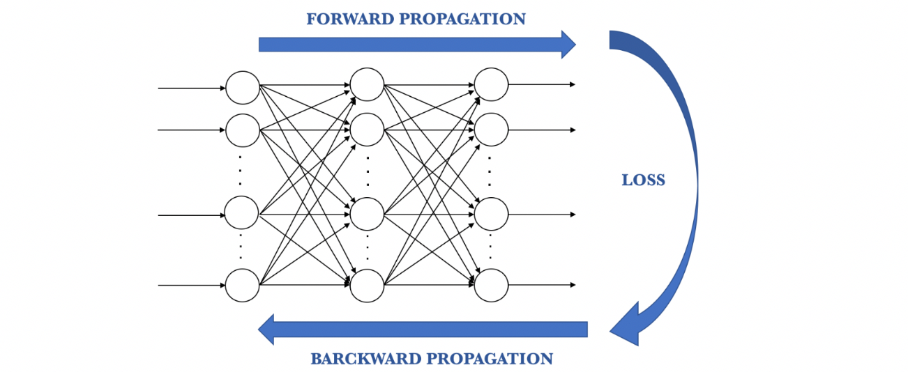
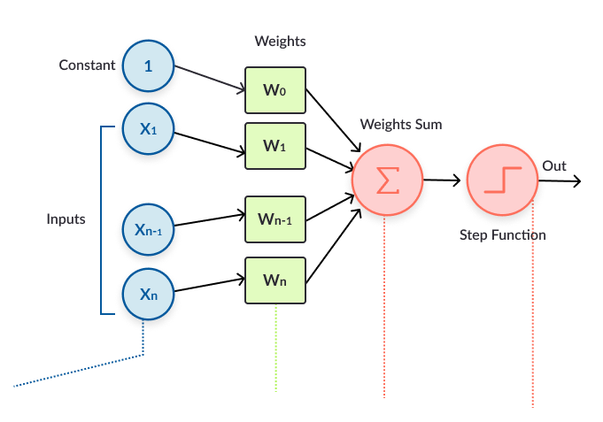
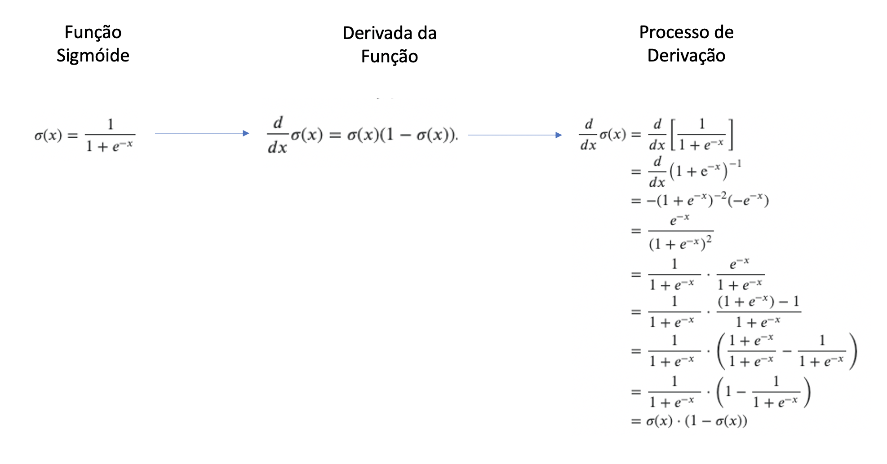
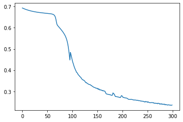

## Machine Learning 


```python
# Versão da Linhga Python
from platform import python_version
print("Ver~sao da Linguagem Python usada neste Jupyter Notebook: ", python_version())
```

    Ver~sao da Linguagem Python usada neste Jupyter Notebook:  3.8.8


## A Matemática das Redas Neurais Artificiais
Construindo a Rede Neural com Programação e Matemática


#### Etapas:

1 - Construir uma rede neural artificial somente com operações matemáticas;

2 - Treinar a rede para Prever a Ocorrência de Câncer;

### A Arquitetura de Redes Neurais Articiais

Uma rede neural típica é constituída por um conjunto de neurônios interligados, infuenciando uns aos outros formando um sistema maior, capaz de armazenar conhecimento adquirido por meio de exemplos apresentados e, assim, podendo realizar inferências sobre novos conjuntos de dados. Vejamos a arquitetura de redes neurais artificiais.

As redes neurais são comumente apresentadas como um grafo orientado, onde os vértices são os neurônios e as arestas as sinapses. A direção das arestas informa o tipo de alimentação, ou seja, como os neurônios são alimentados (recebem sinais de entrada). As redes neurais derivam seu poder devido a sua estrutura massiva e paralela e a habilidade de aprender por experiência. Essa experiência é transmitida por meio de exemplos obtidos do mundo real, definidos como um conjunto de características formados por dados de entrada e de saída. Se apresentamos esses dados de entrada e saída à rede, estamos diante de aprendizagem supervsionada e caso apresentemos apenas os dados de entrada, estamos diante de aprendizagem não supervisionada!

O conhecimento obtido pela rede através dos exemplos é armazenado na forma de pesos das conexões, os quais serão ajustados a fim de tomar decisões corretas a partir de novas entradas, ou seja, novas situações do mundo real não conhecidas pela rede. O processo de ajuste dos pesos sinapticos é realizado pelo algoritmo de aprendizagem, responsável em armazenar na rede o conhecimento do mundo real obtido atraves de exemplos. Existem vários algoritmos de aprendizagem, dentre eles o backpropagation que é o algoritmo mais utilizado.




```python
# Por enquanto precisaremos somente do NumPy
import numpy as np
```


```python
# Instala o pacote watermark. 
# Esse pacote é usado para gravar as versões de outros pacotes usados neste jupyter notebook.
!pip install -q -U watermark
```


```python
# Versões dos pacotes usados neste jupyter notebook
%reload_ext watermark
%watermark -a "Rodolfo Terra | Ciência de Dados" --iversions
```

    Author: Rodolfo Terra | Ciência de Dados
    
    numpy: 1.19.2


​    

## 1.0. Implementando Uma Rede Neural Artificial Somente com Fórmulas Matemáticas (Sem Frameworks)

### 1.1. Forward Propagation



#### 1.1.1 Desenvolvendo a Função Para Inicialização de Pesos


```python
# Função para inicialização randômica dos parâmetros do modelo
def inicializa_parametros(dims_camada_entrada):
    
    # Dicionário para os parâmetros
    parameters = {}
    
    # Comprimento das dimensões das camadas
    comp = len(dims_camada_entrada)
    
    # Loop pelo comprimento
    for i in range(1, comp):
        
        # Inicialização da matriz de pesos
        parameters["W" + str(i)] = np.random.randn(dims_camada_entrada[i], dims_camada_entrada[i - 1]) * 0.01
        
        # Inicialização do bias
        parameters["b" + str(i)] = np.zeros((dims_camada_entrada[i], 1))
    
    return parameters
```

#### 1.1.2. Desenvolvendo a Função Sigmoide

A principal razão pela qual usaremos a função sigmóide é porque ela permite converter números para valores entre 0 e 1.

Portanto é especialmente usada para modelos em que temos que prever probabilidade como uma saída. Com a probabilidade de qualquer coisa existrir apenas entre o intervalo de 0 e 1, sigmóide é a escolha certa. Algumas características da função sigmóide:

* A função é diferenciável. Isso significa que podemos encontrar a inclinação da curva sgmóide em dois pontos;

* A função sigmóide logística pode fazer com que uma rede neural fique presa no momento do treinamento;

* A função softmax é uma função de ativação logística mais generalizada, utilizada para a classificação em várias classes. 


Se a função parecer muito abstrata ou estranha para você, não se preocupe muito com detalhes como o número de Euler e ou como alguém criou essa função. Para aqueles que não são conhecedores de matemática, a única coisa importante sobre a função sigmóide é primeiro, sua curva e, segundo, sua derivada. Aqui estão mais alguns detalhes:

- **A função sigmóide produz resultados semelhantes aos da função de passo (Step Function) em que a saída está entre 0 e 1. A curva cruza 0,5 a z = 0, e podemos definir regras para a função de ativação, como: Se a saída do neurônio sigmóide for maior que ou igual a 0,5, gera 1; se a saída for menor que 0,5, gera 0.**


- A função sigmóide é suave e possui uma derivada simples de σ(z) * (1 - σ (z)), que é diferenciável em qualquer lugar da curva. 


- Se z for muito negativo, a saída será aproximadamente 0; se z for muito positivo, a saída é aproximadamente 1; mas em torno de z = 0, onde z não é muito grande nem muito pequeno, temos um desvio relativamente maior à medida que z muda.

#### 1.1.3. Afinal, O Que é Derivada?



No Cálculo, a derivada em um ponto de uma função y = f(x) representa a taxa de variação instantânea de y em relação a x neste ponto. 

Um exemplo típico é a função velocidade que representa a taxa de variação (derivada) da função espaço. Do mesmo modo, a função aceleração é a derivada da função velocidade. Geometricamente, a derivada no ponto x = a de y = f(x) representa a inclinação da reta tangente ao gráfico desta função no ponto (a, f(a)).

A função que a cada ponto x associa a derivada neste ponto de f(x) é chamada de função derivada de f(x).


Em cada ponto, a derivada de f(x) é a tangente do ângulo que a reta tangente à curva faz em relação ao eixo das abscissas. A reta é sempre tangente à curva azul; a tangente do ângulo que ela faz com o eixo das abscissas é a derivada. Note-se que a derivada é positiva quando verde, negativa quando vermelha, e zero quando preta.

A derivada de uma função y = f(x) num ponto x = x0, é igual ao valor da tangente trigonométrica do ângulo formado pela tangente geométrica à curva representativa de y=f(x), no ponto x = x0, ou seja, a derivada é o coeficiente angular da reta tangente ao gráfico da função no ponto x0.

A função derivada é representada por f'(x).


```python
# Função sigmóide
def sigmoid(Z):
    A = 1 / (1 + np.exp(-Z))
    return A, Z
```

#### 1.1.4. Desenvolvendo a Função ReLu

Para usar a descida de gradiente estocástico com retropropagação de erros para treinar redes neurais profundas, é necessária uma função de ativação que se assemelhe e atue como uma função linear, mas é, de fato, uma função não linear que permite que relacionamentos complexos nos dados sejam aprendidos.

A solução é usar a função de ativação linear retificada ou ReL para abreviar. Um nó ou unidade que implementa essa função de ativação é chamado de unidade de ativação linear retificada ou ReLU, para abreviar. Frequentemente, as redes que usam a função retificadora para as camadas ocultas são chamadas de redes retificadas.

A função ReLU é definida como 𝑓(𝑥) = max (0, 𝑥). Normalmente, ela é aplicada elemento a elemento à saída de alguma outra função, como um produto de vetor e matriz. 

A adoção da ReLU pode ser facilmente considerada um dos marcos na revolução do aprendizado profundo, por ex. as técnicas que agora permitem o desenvolvimento rotineiro de redes neurais muito profundas.

A derivada da função linear retificada também é fácil de calcular. **A derivada da função de ativação é necessária ao atualizar os pesos de um nó como parte da retropropagação de erro.**

A derivada da função é a inclinação. A inclinação para valores negativos é 0,0 e a inclinação para valores positivos é 1,0.

Tradicionalmente, o campo das redes neurais evitou qualquer função de ativação que não fosse completamente diferenciável, talvez adiando a adoção da função linear retificada e de outras funções lineares. Tecnicamente, não podemos calcular a derivada quando a entrada é 0,0; portanto, podemos assumir que é zero. Este não é um problema na prática.

Os gradientes das ativações tangentes e hiperbólicas são menores que a porção positiva da ReLU. Isso significa que a parte positiva é atualizada mais rapidamente à medida que o treinamento avança. No entanto, isso tem um custo. O gradiente 0 no lado esquerdo tem seu próprio problema, chamado "neurônios mortos", no qual uma atualização de gradiente define os valores recebidos para uma ReLU, de modo que a saída é sempre zero; unidades ReLU modificadas, como ELU (ou Leaky ReLU, ou PReLU, etc.) podem melhorar isso.


```python
# Função de ativação ReLu (Rectified Linear Unit)
def relu(Z):
    A = abs(Z * (Z > 0))
    return A, Z
```


#### 1.1.5. Desenvolvendo a Ativação Linear


```python
# Operação de ativação
# A é a matriz com os dados de entrada
# W é a matriz de pesos
# b é o bias
def linear_activation(A, W, b):
    Z = np.dot(W, A) + b
    cache = (A, W, b)
    return Z, cache
```

#### 1.1.6. Construindo o Proceso de Forward Propagation


```python
# Movimento para frente (forward)
def forward(A_prev, W, b, activation):
    
    # Se a função de ativação for Sigmoid, entramos neste bloco
    if activation == "sigmoid":
        Z, linear_cache = linear_activation(A_prev, W, b)
        A, activation_cache = sigmoid(Z)
        
    # Se não, se for ReLu, entramos neste bloco    
    elif activation == "relu":
        Z, linear_cache = linear_activation(A_prev, W, b)
        A, activation_cache = relu(Z)
        
    cache = (linear_cache, activation_cache)
    
    return A, cache
```

#### 1.1.7. Combinando Ativação e Propagação


```python
# Propagação para frente
def forward_propagation(X, parameters):
    
    # Lista de valores anteriores (cache)
    caches = []
    
    # Dados de entrada
    A = X
    
    # Comprimento dos parâmetros
    L = len(parameters) // 2
   
    # Loop
    for i in range(1, L):
      
        # Guarda o valor prévio de A
        A_prev = A
        
        # Executa o forward
        A, cache = forward(A_prev, parameters["W" + str(i)], parameters["b" + str(i)], activation = "relu")
        
        # Grava o cache
        caches.append(cache)
    
    # Saída na última camada
    A_last, cache = forward(A, parameters["W" + str(L)], parameters["b" + str(L)], activation = "sigmoid")
    
    # Grava o cache
    caches.append(cache)
    
    return(A_last, caches)
```

#### 1.1.8. Desenvolvendo a Função de Custo


```python
# Função de custo (ou função de erro)
def calcula_custo(A_last, Y):
    
    # Ajusta o shape de Y para obter seu comprimento (total de elementos)
    m = Y.shape[1]
    
    # Calcula o custo comparando valor real e previso
    custo = (-1 / m) * np.sum((Y * np.log(A_last)) + ((1 - Y) * np.log(1 - A_last)))
    
    # Ajusta o shape do custo
    custo = np.squeeze(custo)
    
    return(custo)
```

## 1.2 Backward Propagation


#### 1.2.1. Por Que Precisamos deBackpropagation (Retropropagação)?

Ao projetar uma rede neural, primeiro, precisamos treinar um modelo e atribuir pesos específicos a cada uma das entradas. Esse peso decide o quão vital é esse recurso para nossa previsão. Quanto maior o peso, maior a importância. No entanto, inicialmente, não sabemos o peso específico exigido pelas entradas. Então, o que fazemos é atribuir um peso aleatório às nossas entradas e nosso modelo calcula o erro na previsão. Depois disso, atualizamos nossos valores de peso e executamos novamente o código (retropropagação). Após várias iterações, podemos obter valores de erro mais baixos e maior precisão.

Para que a retropropagação funcione usamos um algoritmo que verifica quanto o valor de  cada  peso  afeta  o  erro  do  modelo,  calculando  as  derivadas  parciais. Esse  algoritmo  é chamado de Gradiente Descendente e é aplicado através da Chain Rule (Regra da Cadeia).

Em outras palavras, a retropropagação visa minimizar a função de custo ajustando os pesos e vieses (bias)da rede. O nível de ajuste é determinado pelos gradientes da função de custo em relação a esses parâmetros.Uma pergunta pode surgir:por que calcular gradientes?O gradiente de uma função C(x_1, x_2,..., x_m) no ponto x é um vetor das derivadas parciais de C em x.A derivada de uma função C mede a sensibilidade à alteração do valor da função (valor de saída) em relação a uma alteração no argumento x(valor de entrada). Em outras palavras, a derivada nos diz a direção que C está seguindo.O  gradiente  mostra  quanto  o  parâmetro  x  precisa  mudar  (na  direção  positiva  ou negativa) para minimizar C. O cálculo desses gradientes acontece usando uma técnica chamada Regra da Cadeia.


#### 1.2.2. Desenvolvendo o Backward Propagation - Função Sigmóide Backward


```python
# Função sigmoid para o backpropagation 
# Fazemos o cálculo da derivada pois não queremos o valor completo da função, mas sim sua variação
def sigmoid_backward(da, Z):
    
    # Calculamos a derivada de Z
    dg = (1 / (1 + np.exp(-Z))) * (1 - (1 / (1 + np.exp(-Z))))
    
    # Encontramos a mudança na derivada de z
    dz = da * dg
    return dz

# Compare com a função sigmoid do forward propagation
# A = 1 / (1 + np.exp(-Z))
```

#### 1.2.3 Desenvolvendo o Backward Propagation - Função ReLu Backward


```python
# Função relu para o backpropagation 
# Fazemos o cálculo da derivada pois não queremos o valor completo da função, mas sim sua variação
def relu_backward(da, Z):
    
    dg = 1 * ( Z >= 0)
    dz = da * dg
    return dz

# Compare com a função relu do forward propagation:
# A = abs(Z * (Z > 0))
```

#### 1.2.4. Ativação Linear backward

##### 1.2.4.1 Desenvolvendo o Backward Propagation


```python
# Ativação linear para o backpropagation
def linear_backward_function(dz, cache):
    
    # Recebe os valores do cache (memória)
    A_prev, W, b = cache
    
    # Shape de m
    m = A_prev.shape[1]
    
    # Calcula a derivada de W (resultado da operação com dz)
    dW = (1 / m) * np.dot(dz, A_prev.T)
    
    # Calcula a derivada de b (resultado da operação com dz)
    db = (1 / m) * np.sum(dz, axis = 1, keepdims = True)
    
    # Calcula a derivada da operação
    dA_prev = np.dot(W.T, dz)
    
    return dA_prev, dW, db
```

##### 1.2.4.2. Desenvolvendo o Backward Propagation


```python
# Função que define o tipo de ativação (relu ou sigmoid)
def linear_activation_backward(dA, cache, activation):
    
    # Extrai o cache
    linear_cache, activation_cache = cache
    
    # Verifica se a ativação é relu
    if activation == "relu":
        dZ = relu_backward(dA, activation_cache)
        dA_prev, dW, db = linear_backward_function(dZ, linear_cache)
        
    # Verifica se a ativação é sigmoid
    if activation == "sigmoid":
        dZ = sigmoid_backward(dA, activation_cache)
        dA_prev, dW, db = linear_backward_function(dZ, linear_cache)
        
    return dA_prev, dW, db
```

#### 1.2.5. Combinando Ativação e Retropropagação - Algoritmo backpropagation


```python
# Algoritmo Backpropagation (calcula os gradientes para atualização dos pesos)
# AL = Valor previsto no Forward
# Y = Valor real
def backward_propagation(AL, Y, caches):
    
    # Dicionário para os gradientes
    grads = {}
    
    # Comprimento dos dados (que estão no cache)
    L = len(caches)
    
    # Extrai o comprimento para o valor de m
    m = AL.shape[1]
    
    # Ajusta o shape de Y
    Y = Y.reshape(AL.shape)
    
    # Calcula a derivada da previsão final da rede (feita ao final do Forward Propagation)
    dAL = -((Y / AL) - ((1 - Y) / (1 - AL)))
    
    # Captura o valor corrente do cache
    current_cache = caches[L - 1]
    
    # Gera a lista de gradiente para os dados, os pesos e o bias
    # Fazemos isso uma vez, pois estamos na parte final da rede, iniciando o caminho de volta
    grads["dA" + str(L - 1)], grads["dW" + str(L)], grads["db" + str(L)] = linear_activation_backward(dAL, current_cache, activation = "sigmoid")
    
    # Loop para calcular a derivada durante as ativações lineares com a relu
    for l in reversed(range(L - 1)):
        
        # Cache atual
        current_cache = caches[l]
        
        # Calcula as derivadas
        dA_prev, dW, db = linear_activation_backward(grads["dA" + str(l + 1)], current_cache, activation = "relu")
        
        # Alimenta os gradientes na lista, usando o índice respectivo
        grads["dA" + str(l)] = dA_prev
        grads["dW" + str(l + 1)] = dW
        grads["db" + str(l + 1)] = db
        
    return grads
```

#### 1.2.6. Gradientes e Atualização dos Pesos


```python
# Função de atualização de pesos
def atualiza_pesos(parameters, grads, learning_rate):
    
    # Comprimento da estrutura de dados com os parâmetros (pesos e bias)
    L = len(parameters)//2
    
    # Loop para atualização dos pesos
    for l in range(L):
        
        # Atualização dos pesos
        parameters["W" + str(l + 1)] = parameters["W" + str(l + 1)] - (learning_rate * grads["dW" + str(l + 1)])
        
        # Atualização do bias
        parameters["b" + str(l + 1)] = parameters["b" + str(l + 1)] - (learning_rate * grads["db" + str(l + 1)])
    
    return parameters
```

### 1.3 Implementando a Rede Completa


```python
# Modelo completo da rede neural
def modeloNN(X, Y, dims_camada_entrada, learning_rate = 0.0075, num_iterations = 100):
    
    # Lista para receber o custo a cada época de treinamento
    custos = []
    
    # Inicializa os parâmetros
    parametros = inicializa_parametros(dims_camada_entrada)
    
    # Loop pelo número de iterações (épocas)
    for i in range(num_iterations):
        
        # Forward Propagation
        AL, caches = forward_propagation(X, parametros)
        
        # Calcula o custo
        custo = calcula_custo(AL, Y)
        
        # Backward Propagation
        # Nota: ao invés de AL e Y, poderíamos passar somente o valor do custo
        # Estamos passando o valor de AL e Y para fique claro didaticamente o que está sendo feito
        gradientes = backward_propagation(AL, Y, caches)
        
        # Atualiza os pesos
        parametros = atualiza_pesos(parametros, gradientes, learning_rate)
        
        # Print do valor intermediário do custo
        # A redução do custo indica o aprendizado do modelo
        if i % 10 == 0:
            print("Custo Após " + str(i) + " iterações é " + str(custo))
            custos.append(custo)
            
    return parametros, custos 
```


```python
# Função para fazer as previsões
# Não precisamos do Backpropagation pois ao fazer previsões como o modelo treinado, 
# teremos os melhores valores de pesos (parametros)
def predict(X, parametros):
    AL, caches = forward_propagation(X, parametros)
    return AL
```

## 2.0. Usando Rede Naurais para Prever a Ocorrência de Câncer


```python
# Import
import sklearn
import numpy as np
import pandas as pd
import matplotlib
import matplotlib.pyplot as plt
from sklearn.datasets import load_breast_cancer
from sklearn.model_selection import train_test_split
from sklearn.metrics import classification_report
```


```python
# Versões dos pacotes usados neste jupyter notebook
%reload_ext watermark
%watermark -a "Rodolfo Terra | ciência de Dados" --iversions
```

    Author: Rodolfo Terra | ciência de Dados
    
    matplotlib: 3.3.4
    numpy     : 1.19.2
    pandas    : 1.2.3
    sklearn   : 0.0


​    

### 2.1 Carregando os dados


```python
# Carregando o objetov completo
temp = load_breast_cancer()
```


```python
# Tipo do Objetivo
type(temp)
```


    sklearn.utils.Bunch


```python
# Visualiza o objeto
temp
```


    {'data': array([[1.799e+01, 1.038e+01, 1.228e+02, ..., 2.654e-01, 4.601e-01,
             1.189e-01],
            [2.057e+01, 1.777e+01, 1.329e+02, ..., 1.860e-01, 2.750e-01,
             8.902e-02],
            [1.969e+01, 2.125e+01, 1.300e+02, ..., 2.430e-01, 3.613e-01,
             8.758e-02],
            ...,
            [1.660e+01, 2.808e+01, 1.083e+02, ..., 1.418e-01, 2.218e-01,
             7.820e-02],
            [2.060e+01, 2.933e+01, 1.401e+02, ..., 2.650e-01, 4.087e-01,
             1.240e-01],
            [7.760e+00, 2.454e+01, 4.792e+01, ..., 0.000e+00, 2.871e-01,
             7.039e-02]]),
     'target': array([0, 0, 0, 0, 0, 0, 0, 0, 0, 0, 0, 0, 0, 0, 0, 0, 0, 0, 0, 1, 1, 1,
            0, 0, 0, 0, 0, 0, 0, 0, 0, 0, 0, 0, 0, 0, 0, 1, 0, 0, 0, 0, 0, 0,
            0, 0, 1, 0, 1, 1, 1, 1, 1, 0, 0, 1, 0, 0, 1, 1, 1, 1, 0, 1, 0, 0,
            1, 1, 1, 1, 0, 1, 0, 0, 1, 0, 1, 0, 0, 1, 1, 1, 0, 0, 1, 0, 0, 0,
            1, 1, 1, 0, 1, 1, 0, 0, 1, 1, 1, 0, 0, 1, 1, 1, 1, 0, 1, 1, 0, 1,
            1, 1, 1, 1, 1, 1, 1, 0, 0, 0, 1, 0, 0, 1, 1, 1, 0, 0, 1, 0, 1, 0,
            0, 1, 0, 0, 1, 1, 0, 1, 1, 0, 1, 1, 1, 1, 0, 1, 1, 1, 1, 1, 1, 1,
            1, 1, 0, 1, 1, 1, 1, 0, 0, 1, 0, 1, 1, 0, 0, 1, 1, 0, 0, 1, 1, 1,
            1, 0, 1, 1, 0, 0, 0, 1, 0, 1, 0, 1, 1, 1, 0, 1, 1, 0, 0, 1, 0, 0,
            0, 0, 1, 0, 0, 0, 1, 0, 1, 0, 1, 1, 0, 1, 0, 0, 0, 0, 1, 1, 0, 0,
            1, 1, 1, 0, 1, 1, 1, 1, 1, 0, 0, 1, 1, 0, 1, 1, 0, 0, 1, 0, 1, 1,
            1, 1, 0, 1, 1, 1, 1, 1, 0, 1, 0, 0, 0, 0, 0, 0, 0, 0, 0, 0, 0, 0,
            0, 0, 1, 1, 1, 1, 1, 1, 0, 1, 0, 1, 1, 0, 1, 1, 0, 1, 0, 0, 1, 1,
            1, 1, 1, 1, 1, 1, 1, 1, 1, 1, 1, 0, 1, 1, 0, 1, 0, 1, 1, 1, 1, 1,
            1, 1, 1, 1, 1, 1, 1, 1, 1, 0, 1, 1, 1, 0, 1, 0, 1, 1, 1, 1, 0, 0,
            0, 1, 1, 1, 1, 0, 1, 0, 1, 0, 1, 1, 1, 0, 1, 1, 1, 1, 1, 1, 1, 0,
            0, 0, 1, 1, 1, 1, 1, 1, 1, 1, 1, 1, 1, 0, 0, 1, 0, 0, 0, 1, 0, 0,
            1, 1, 1, 1, 1, 0, 1, 1, 1, 1, 1, 0, 1, 1, 1, 0, 1, 1, 0, 0, 1, 1,
            1, 1, 1, 1, 0, 1, 1, 1, 1, 1, 1, 1, 0, 1, 1, 1, 1, 1, 0, 1, 1, 0,
            1, 1, 1, 1, 1, 1, 1, 1, 1, 1, 1, 1, 0, 1, 0, 0, 1, 0, 1, 1, 1, 1,
            1, 0, 1, 1, 0, 1, 0, 1, 1, 0, 1, 0, 1, 1, 1, 1, 1, 1, 1, 1, 0, 0,
            1, 1, 1, 1, 1, 1, 0, 1, 1, 1, 1, 1, 1, 1, 1, 1, 1, 0, 1, 1, 1, 1,
            1, 1, 1, 0, 1, 0, 1, 1, 0, 1, 1, 1, 1, 1, 0, 0, 1, 0, 1, 0, 1, 1,
            1, 1, 1, 0, 1, 1, 0, 1, 0, 1, 0, 0, 1, 1, 1, 0, 1, 1, 1, 1, 1, 1,
            1, 1, 1, 1, 1, 0, 1, 0, 0, 1, 1, 1, 1, 1, 1, 1, 1, 1, 1, 1, 1, 1,
            1, 1, 1, 1, 1, 1, 1, 1, 1, 1, 1, 1, 0, 0, 0, 0, 0, 0, 1]),
     'frame': None,
     'target_names': array(['malignant', 'benign'], dtype='<U9'),
     'DESCR': '.. _breast_cancer_dataset:\n\nBreast cancer wisconsin (diagnostic) dataset\n--------------------------------------------\n\n**Data Set Characteristics:**\n\n    :Number of Instances: 569\n\n    :Number of Attributes: 30 numeric, predictive attributes and the class\n\n    :Attribute Information:\n        - radius (mean of distances from center to points on the perimeter)\n        - texture (standard deviation of gray-scale values)\n        - perimeter\n        - area\n        - smoothness (local variation in radius lengths)\n        - compactness (perimeter^2 / area - 1.0)\n        - concavity (severity of concave portions of the contour)\n        - concave points (number of concave portions of the contour)\n        - symmetry\n        - fractal dimension ("coastline approximation" - 1)\n\n        The mean, standard error, and "worst" or largest (mean of the three\n        worst/largest values) of these features were computed for each image,\n        resulting in 30 features.  For instance, field 0 is Mean Radius, field\n        10 is Radius SE, field 20 is Worst Radius.\n\n        - class:\n                - WDBC-Malignant\n                - WDBC-Benign\n\n    :Summary Statistics:\n\n    ===================================== ====== ======\n                                           Min    Max\n    ===================================== ====== ======\n    radius (mean):                        6.981  28.11\n    texture (mean):                       9.71   39.28\n    perimeter (mean):                     43.79  188.5\n    area (mean):                          143.5  2501.0\n    smoothness (mean):                    0.053  0.163\n    compactness (mean):                   0.019  0.345\n    concavity (mean):                     0.0    0.427\n    concave points (mean):                0.0    0.201\n    symmetry (mean):                      0.106  0.304\n    fractal dimension (mean):             0.05   0.097\n    radius (standard error):              0.112  2.873\n    texture (standard error):             0.36   4.885\n    perimeter (standard error):           0.757  21.98\n    area (standard error):                6.802  542.2\n    smoothness (standard error):          0.002  0.031\n    compactness (standard error):         0.002  0.135\n    concavity (standard error):           0.0    0.396\n    concave points (standard error):      0.0    0.053\n    symmetry (standard error):            0.008  0.079\n    fractal dimension (standard error):   0.001  0.03\n    radius (worst):                       7.93   36.04\n    texture (worst):                      12.02  49.54\n    perimeter (worst):                    50.41  251.2\n    area (worst):                         185.2  4254.0\n    smoothness (worst):                   0.071  0.223\n    compactness (worst):                  0.027  1.058\n    concavity (worst):                    0.0    1.252\n    concave points (worst):               0.0    0.291\n    symmetry (worst):                     0.156  0.664\n    fractal dimension (worst):            0.055  0.208\n    ===================================== ====== ======\n\n    :Missing Attribute Values: None\n\n    :Class Distribution: 212 - Malignant, 357 - Benign\n\n    :Creator:  Dr. William H. Wolberg, W. Nick Street, Olvi L. Mangasarian\n\n    :Donor: Nick Street\n\n    :Date: November, 1995\n\nThis is a copy of UCI ML Breast Cancer Wisconsin (Diagnostic) datasets.\nhttps://goo.gl/U2Uwz2\n\nFeatures are computed from a digitized image of a fine needle\naspirate (FNA) of a breast mass.  They describe\ncharacteristics of the cell nuclei present in the image.\n\nSeparating plane described above was obtained using\nMultisurface Method-Tree (MSM-T) [K. P. Bennett, "Decision Tree\nConstruction Via Linear Programming." Proceedings of the 4th\nMidwest Artificial Intelligence and Cognitive Science Society,\npp. 97-101, 1992], a classification method which uses linear\nprogramming to construct a decision tree.  Relevant features\nwere selected using an exhaustive search in the space of 1-4\nfeatures and 1-3 separating planes.\n\nThe actual linear program used to obtain the separating plane\nin the 3-dimensional space is that described in:\n[K. P. Bennett and O. L. Mangasarian: "Robust Linear\nProgramming Discrimination of Two Linearly Inseparable Sets",\nOptimization Methods and Software 1, 1992, 23-34].\n\nThis database is also available through the UW CS ftp server:\n\nftp ftp.cs.wisc.edu\ncd math-prog/cpo-dataset/machine-learn/WDBC/\n\n.. topic:: References\n\n   - W.N. Street, W.H. Wolberg and O.L. Mangasarian. Nuclear feature extraction \n     for breast tumor diagnosis. IS&T/SPIE 1993 International Symposium on \n     Electronic Imaging: Science and Technology, volume 1905, pages 861-870,\n     San Jose, CA, 1993.\n   - O.L. Mangasarian, W.N. Street and W.H. Wolberg. Breast cancer diagnosis and \n     prognosis via linear programming. Operations Research, 43(4), pages 570-577, \n     July-August 1995.\n   - W.H. Wolberg, W.N. Street, and O.L. Mangasarian. Machine learning techniques\n     to diagnose breast cancer from fine-needle aspirates. Cancer Letters 77 (1994) \n     163-171.',
     'feature_names': array(['mean radius', 'mean texture', 'mean perimeter', 'mean area',
            'mean smoothness', 'mean compactness', 'mean concavity',
            'mean concave points', 'mean symmetry', 'mean fractal dimension',
            'radius error', 'texture error', 'perimeter error', 'area error',
            'smoothness error', 'compactness error', 'concavity error',
            'concave points error', 'symmetry error',
            'fractal dimension error', 'worst radius', 'worst texture',
            'worst perimeter', 'worst area', 'worst smoothness',
            'worst compactness', 'worst concavity', 'worst concave points',
            'worst symmetry', 'worst fractal dimension'], dtype='<U23'),
     'filename': 'E:\\anaconda\\lib\\site-packages\\sklearn\\datasets\\data\\breast_cancer.csv'}


```python
# Carregamos o dataset
dados = pd.DataFrame(columns = load_breast_cancer()['feature_names'], data = load_breast_cancer()['data'])
```


```python
# Shape
dados.shape
```


    (569, 30)


```python
# Visualiza os dados
dados.head()
```


<div>
<style scoped>
    .dataframe tbody tr th:only-of-type {
        vertical-align: middle;
    }

    .dataframe tbody tr th {
        vertical-align: top;
    }
    
    .dataframe thead th {
        text-align: right;
    }
</style>
<table border="1" class="dataframe">
  <thead>
    <tr style="text-align: right;">
      <th></th>
      <th>mean radius</th>
      <th>mean texture</th>
      <th>mean perimeter</th>
      <th>mean area</th>
      <th>mean smoothness</th>
      <th>mean compactness</th>
      <th>mean concavity</th>
      <th>mean concave points</th>
      <th>mean symmetry</th>
      <th>mean fractal dimension</th>
      <th>...</th>
      <th>worst radius</th>
      <th>worst texture</th>
      <th>worst perimeter</th>
      <th>worst area</th>
      <th>worst smoothness</th>
      <th>worst compactness</th>
      <th>worst concavity</th>
      <th>worst concave points</th>
      <th>worst symmetry</th>
      <th>worst fractal dimension</th>
    </tr>
  </thead>
  <tbody>
    <tr>
      <th>0</th>
      <td>17.99</td>
      <td>10.38</td>
      <td>122.80</td>
      <td>1001.0</td>
      <td>0.11840</td>
      <td>0.27760</td>
      <td>0.3001</td>
      <td>0.14710</td>
      <td>0.2419</td>
      <td>0.07871</td>
      <td>...</td>
      <td>25.38</td>
      <td>17.33</td>
      <td>184.60</td>
      <td>2019.0</td>
      <td>0.1622</td>
      <td>0.6656</td>
      <td>0.7119</td>
      <td>0.2654</td>
      <td>0.4601</td>
      <td>0.11890</td>
    </tr>
    <tr>
      <th>1</th>
      <td>20.57</td>
      <td>17.77</td>
      <td>132.90</td>
      <td>1326.0</td>
      <td>0.08474</td>
      <td>0.07864</td>
      <td>0.0869</td>
      <td>0.07017</td>
      <td>0.1812</td>
      <td>0.05667</td>
      <td>...</td>
      <td>24.99</td>
      <td>23.41</td>
      <td>158.80</td>
      <td>1956.0</td>
      <td>0.1238</td>
      <td>0.1866</td>
      <td>0.2416</td>
      <td>0.1860</td>
      <td>0.2750</td>
      <td>0.08902</td>
    </tr>
    <tr>
      <th>2</th>
      <td>19.69</td>
      <td>21.25</td>
      <td>130.00</td>
      <td>1203.0</td>
      <td>0.10960</td>
      <td>0.15990</td>
      <td>0.1974</td>
      <td>0.12790</td>
      <td>0.2069</td>
      <td>0.05999</td>
      <td>...</td>
      <td>23.57</td>
      <td>25.53</td>
      <td>152.50</td>
      <td>1709.0</td>
      <td>0.1444</td>
      <td>0.4245</td>
      <td>0.4504</td>
      <td>0.2430</td>
      <td>0.3613</td>
      <td>0.08758</td>
    </tr>
    <tr>
      <th>3</th>
      <td>11.42</td>
      <td>20.38</td>
      <td>77.58</td>
      <td>386.1</td>
      <td>0.14250</td>
      <td>0.28390</td>
      <td>0.2414</td>
      <td>0.10520</td>
      <td>0.2597</td>
      <td>0.09744</td>
      <td>...</td>
      <td>14.91</td>
      <td>26.50</td>
      <td>98.87</td>
      <td>567.7</td>
      <td>0.2098</td>
      <td>0.8663</td>
      <td>0.6869</td>
      <td>0.2575</td>
      <td>0.6638</td>
      <td>0.17300</td>
    </tr>
    <tr>
      <th>4</th>
      <td>20.29</td>
      <td>14.34</td>
      <td>135.10</td>
      <td>1297.0</td>
      <td>0.10030</td>
      <td>0.13280</td>
      <td>0.1980</td>
      <td>0.10430</td>
      <td>0.1809</td>
      <td>0.05883</td>
      <td>...</td>
      <td>22.54</td>
      <td>16.67</td>
      <td>152.20</td>
      <td>1575.0</td>
      <td>0.1374</td>
      <td>0.2050</td>
      <td>0.4000</td>
      <td>0.1625</td>
      <td>0.2364</td>
      <td>0.07678</td>
    </tr>
  </tbody>
</table>
<p>5 rows × 30 columns</p>
</div>


```python
#Verifica se temos valores ausentes
dados.isnull().any()
```


    mean radius                False
    mean texture               False
    mean perimeter             False
    mean area                  False
    mean smoothness            False
    mean compactness           False
    mean concavity             False
    mean concave points        False
    mean symmetry              False
    mean fractal dimension     False
    radius error               False
    texture error              False
    perimeter error            False
    area error                 False
    smoothness error           False
    compactness error          False
    concavity error            False
    concave points error       False
    symmetry error             False
    fractal dimension error    False
    worst radius               False
    worst texture              False
    worst perimeter            False
    worst area                 False
    worst smoothness           False
    worst compactness          False
    worst concavity            False
    worst concave points       False
    worst symmetry             False
    worst fractal dimension    False
    dtype: bool


```python
# Separa a variável target
target = load_breast_cancer()['target']
```


```python
type(target)
```


    numpy.ndarray


```python
# Visualiza a variável
target
```


    array([0, 0, 0, 0, 0, 0, 0, 0, 0, 0, 0, 0, 0, 0, 0, 0, 0, 0, 0, 1, 1, 1,
           0, 0, 0, 0, 0, 0, 0, 0, 0, 0, 0, 0, 0, 0, 0, 1, 0, 0, 0, 0, 0, 0,
           0, 0, 1, 0, 1, 1, 1, 1, 1, 0, 0, 1, 0, 0, 1, 1, 1, 1, 0, 1, 0, 0,
           1, 1, 1, 1, 0, 1, 0, 0, 1, 0, 1, 0, 0, 1, 1, 1, 0, 0, 1, 0, 0, 0,
           1, 1, 1, 0, 1, 1, 0, 0, 1, 1, 1, 0, 0, 1, 1, 1, 1, 0, 1, 1, 0, 1,
           1, 1, 1, 1, 1, 1, 1, 0, 0, 0, 1, 0, 0, 1, 1, 1, 0, 0, 1, 0, 1, 0,
           0, 1, 0, 0, 1, 1, 0, 1, 1, 0, 1, 1, 1, 1, 0, 1, 1, 1, 1, 1, 1, 1,
           1, 1, 0, 1, 1, 1, 1, 0, 0, 1, 0, 1, 1, 0, 0, 1, 1, 0, 0, 1, 1, 1,
           1, 0, 1, 1, 0, 0, 0, 1, 0, 1, 0, 1, 1, 1, 0, 1, 1, 0, 0, 1, 0, 0,
           0, 0, 1, 0, 0, 0, 1, 0, 1, 0, 1, 1, 0, 1, 0, 0, 0, 0, 1, 1, 0, 0,
           1, 1, 1, 0, 1, 1, 1, 1, 1, 0, 0, 1, 1, 0, 1, 1, 0, 0, 1, 0, 1, 1,
           1, 1, 0, 1, 1, 1, 1, 1, 0, 1, 0, 0, 0, 0, 0, 0, 0, 0, 0, 0, 0, 0,
           0, 0, 1, 1, 1, 1, 1, 1, 0, 1, 0, 1, 1, 0, 1, 1, 0, 1, 0, 0, 1, 1,
           1, 1, 1, 1, 1, 1, 1, 1, 1, 1, 1, 0, 1, 1, 0, 1, 0, 1, 1, 1, 1, 1,
           1, 1, 1, 1, 1, 1, 1, 1, 1, 0, 1, 1, 1, 0, 1, 0, 1, 1, 1, 1, 0, 0,
           0, 1, 1, 1, 1, 0, 1, 0, 1, 0, 1, 1, 1, 0, 1, 1, 1, 1, 1, 1, 1, 0,
           0, 0, 1, 1, 1, 1, 1, 1, 1, 1, 1, 1, 1, 0, 0, 1, 0, 0, 0, 1, 0, 0,
           1, 1, 1, 1, 1, 0, 1, 1, 1, 1, 1, 0, 1, 1, 1, 0, 1, 1, 0, 0, 1, 1,
           1, 1, 1, 1, 0, 1, 1, 1, 1, 1, 1, 1, 0, 1, 1, 1, 1, 1, 0, 1, 1, 0,
           1, 1, 1, 1, 1, 1, 1, 1, 1, 1, 1, 1, 0, 1, 0, 0, 1, 0, 1, 1, 1, 1,
           1, 0, 1, 1, 0, 1, 0, 1, 1, 0, 1, 0, 1, 1, 1, 1, 1, 1, 1, 1, 0, 0,
           1, 1, 1, 1, 1, 1, 0, 1, 1, 1, 1, 1, 1, 1, 1, 1, 1, 0, 1, 1, 1, 1,
           1, 1, 1, 0, 1, 0, 1, 1, 0, 1, 1, 1, 1, 1, 0, 0, 1, 0, 1, 0, 1, 1,
           1, 1, 1, 0, 1, 1, 0, 1, 0, 1, 0, 0, 1, 1, 1, 0, 1, 1, 1, 1, 1, 1,
           1, 1, 1, 1, 1, 0, 1, 0, 0, 1, 1, 1, 1, 1, 1, 1, 1, 1, 1, 1, 1, 1,
           1, 1, 1, 1, 1, 1, 1, 1, 1, 1, 1, 1, 0, 0, 0, 0, 0, 0, 1])


```python
# Total de registro por classe - Câncer Benigno
np.count_nonzero(target == 1)

```


    357


```python
# Total de registrtos por class - Cancer Malígno
np.count_nonzero(target == 0)
```


    212


```python
# Vamos extrair os labels

# Dicionário para labels
labels = {}

# Nomes das classes das variável taregt
target_names = load_breast_cancer()['target_names']

#Mapeamento
for i in range(len(target_names)):
    labels.update({i:target_names[i]})
```


```python
# Visualiza os lables
labels
```


    {0: 'malignant', 1: 'benign'}


```python
# Agora preparamos as variáveis preditora em x
X = np.array(dados)
```


```python
# Visualiza os dados de entrada
X
```


    array([[1.799e+01, 1.038e+01, 1.228e+02, ..., 2.654e-01, 4.601e-01,
            1.189e-01],
           [2.057e+01, 1.777e+01, 1.329e+02, ..., 1.860e-01, 2.750e-01,
            8.902e-02],
           [1.969e+01, 2.125e+01, 1.300e+02, ..., 2.430e-01, 3.613e-01,
            8.758e-02],
           ...,
           [1.660e+01, 2.808e+01, 1.083e+02, ..., 1.418e-01, 2.218e-01,
            7.820e-02],
           [2.060e+01, 2.933e+01, 1.401e+02, ..., 2.650e-01, 4.087e-01,
            1.240e-01],
           [7.760e+00, 2.454e+01, 4.792e+01, ..., 0.000e+00, 2.871e-01,
            7.039e-02]])


```python
# Dividimos os dados de entrada e saída em treino e teste
X_treino, X_teste, Y_treino, Y_teste = train_test_split(X, target, test_size = 0.15, shuffle = True)
```


```python
# Shape dos dados de treino
print(X_treino.shape)
print(Y_treino.shape)
```

    (483, 30)
    (483,)


```python
# Shape dos dados de teste
print(X_teste.shape)
print(Y_teste.shape)
```

    (86, 30)
    (86,)


```python
# Ajuste o shape dos dados de entrada
X_treino = X_treino.T
X_teste = X_teste.T
```


```python
print(X_treino.shape)
print(X_teste.shape)
```

    (30, 483)
    (30, 86)


```python
# Precisamos ajustar também os dados de saída
Y_treino = Y_treino.reshape(1, len(Y_treino))
Y_teste = Y_teste.reshape(1, len(Y_teste))
```


```python
print(Y_treino.shape)
print(Y_teste.shape)
```

    (1, 483)
    (1, 86)


```python
# Variável com as dimensões de entrada para o número de neurônios
dims_camada_entrada = [X_treino.shape[0], 50, 20, 5, 1]
```


```python
dims_camada_entrada
```


    [30, 50, 20, 5, 1]


```python
# Treinamento do modelo

print("\nIniciando o Treinamento.\n")

parametros, custo = modeloNN(X = X_treino, 
                             Y = Y_treino, 
                             dims_camada_entrada = dims_camada_entrada, 
                             num_iterations = 3000, 
                             learning_rate = 0.0075)

print("\nTreinamento Concluído.\n")
```


    Iniciando o Treinamento.
    
    Custo Após 0 iterações é 0.6931354827911539
    Custo Após 10 iterações é 0.6920510189719492
    Custo Após 20 iterações é 0.691006675432112
    Custo Após 30 iterações é 0.6900005871078156
    Custo Após 40 iterações é 0.6890316826286887
    Custo Após 50 iterações é 0.6880989818052369
    Custo Após 60 iterações é 0.6872009409838412
    Custo Após 70 iterações é 0.6863359754322764
    Custo Após 80 iterações é 0.6855027387456888
    Custo Após 90 iterações é 0.684700035843715
    Custo Após 100 iterações é 0.6839267197912282
    Custo Após 110 iterações é 0.6831816861022018
    Custo Após 120 iterações é 0.6824638758175816
    Custo Após 130 iterações é 0.6817722647923482
    Custo Após 140 iterações é 0.6811058689690097
    Custo Após 150 iterações é 0.6804637406537173
    Custo Após 160 iterações é 0.6798449708351277
    Custo Após 170 iterações é 0.6792486749248884
    Custo Após 180 iterações é 0.6786739963428489
    Custo Após 190 iterações é 0.6781201110931454
    Custo Após 200 iterações é 0.6775862268500347
    Custo Após 210 iterações é 0.6770715788429543
    Custo Após 220 iterações é 0.676575440396268
    Custo Após 230 iterações é 0.6760970950314643
    Custo Após 240 iterações é 0.6756358438304763
    Custo Após 250 iterações é 0.6751910215714026
    Custo Após 260 iterações é 0.6747619826481853
    Custo Após 270 iterações é 0.6743480908496903
    Custo Após 280 iterações é 0.6739487105885198
    Custo Após 290 iterações é 0.673563265261196
    Custo Após 300 iterações é 0.6731911843168401
    Custo Após 310 iterações é 0.672831898809141
    Custo Após 320 iterações é 0.6724848559335725
    Custo Após 330 iterações é 0.6721495073356644
    Custo Após 340 iterações é 0.6718253187820605
    Custo Após 350 iterações é 0.6715117498064969
    Custo Após 360 iterações é 0.6712082678613013
    Custo Após 370 iterações é 0.6709143391647661
    Custo Após 380 iterações é 0.670629419795754
    Custo Após 390 iterações é 0.6703529546977492
    Custo Após 400 iterações é 0.6700843655475854
    Custo Após 410 iterações é 0.669823057381083
    Custo Após 420 iterações é 0.6695683911494233
    Custo Após 430 iterações é 0.669319710048415
    Custo Após 440 iterações é 0.6690762877130361
    Custo Após 450 iterações é 0.6688373302856894
    Custo Após 460 iterações é 0.6686019733826961
    Custo Após 470 iterações é 0.668369195243311
    Custo Após 480 iterações é 0.6681377930402528
    Custo Após 490 iterações é 0.6679063665796368
    Custo Após 500 iterações é 0.6676731728034567
    Custo Após 510 iterações é 0.667436089996904
    Custo Após 520 iterações é 0.6671923936419432
    Custo Após 530 iterações é 0.6669386008683635
    Custo Após 540 iterações é 0.6666701566248439
    Custo Após 550 iterações é 0.6663809784986686
    Custo Após 560 iterações é 0.6660626852506472
    Custo Após 570 iterações é 0.6657035761786466
    Custo Após 580 iterações é 0.6652868556230841
    Custo Após 590 iterações é 0.6647876755405753
    Custo Após 600 iterações é 0.664168228608324
    Custo Após 610 iterações é 0.6633684658296017
    Custo Após 620 iterações é 0.6622852483896856
    Custo Após 630 iterações é 0.6607488318586557
    Custo Após 640 iterações é 0.6584878437033544
    Custo Após 650 iterações é 0.6549627460396508
    Custo Após 660 iterações é 0.6492433357260329
    Custo Após 670 iterações é 0.6400864593104626
    Custo Após 680 iterações é 0.6276850189677998
    Custo Após 690 iterações é 0.6170853356772148
    Custo Após 700 iterações é 0.6118568875437549
    Custo Após 710 iterações é 0.6088694948898659
    Custo Após 720 iterações é 0.6061898414701167
    Custo Após 730 iterações é 0.6035119898381162
    Custo Após 740 iterações é 0.6008010968470019
    Custo Após 750 iterações é 0.5979959560105433
    Custo Após 760 iterações é 0.5951961135369327
    Custo Após 770 iterações é 0.5923416564229492
    Custo Após 780 iterações é 0.5894171037449164
    Custo Após 790 iterações é 0.5864063304116273
    Custo Após 800 iterações é 0.5832891935956854
    Custo Após 810 iterações é 0.580039205344321
    Custo Após 820 iterações é 0.5766214997611934
    Custo Após 830 iterações é 0.5729896756084699
    Custo Após 840 iterações é 0.5690806449678082
    Custo Após 850 iterações é 0.5648072065371783
    Custo Após 860 iterações é 0.5600468813647359
    Custo Após 870 iterações é 0.5545812288178429
    Custo Após 880 iterações é 0.548251562653865
    Custo Após 890 iterações é 0.5407154555695491
    Custo Após 900 iterações é 0.5315257906198648
    Custo Após 910 iterações é 0.5200605451807121
    Custo Após 920 iterações é 0.5056317781100451
    Custo Após 930 iterações é 0.48787907365711797
    Custo Após 940 iterações é 0.4675435469161462
    Custo Após 950 iterações é 0.4478636063648477
    Custo Após 960 iterações é 0.48383219580818104
    Custo Após 970 iterações é 0.4749807833227217
    Custo Após 980 iterações é 0.4645590829757372
    Custo Após 990 iterações é 0.4546484330130221
    Custo Após 1000 iterações é 0.44372852225665377
    Custo Após 1010 iterações é 0.4353041441552156
    Custo Após 1020 iterações é 0.42851625299551827
    Custo Após 1030 iterações é 0.4200871754974273
    Custo Após 1040 iterações é 0.41333041135920895
    Custo Após 1050 iterações é 0.40756497209103465
    Custo Após 1060 iterações é 0.4015559472227128
    Custo Após 1070 iterações é 0.39719653365511176
    Custo Após 1080 iterações é 0.3906812049538403
    Custo Após 1090 iterações é 0.3886395727310075
    Custo Após 1100 iterações é 0.3863821559609492
    Custo Após 1110 iterações é 0.38104103160610187
    Custo Após 1120 iterações é 0.37749903303222904
    Custo Após 1130 iterações é 0.37540935525288366
    Custo Após 1140 iterações é 0.37275157298313816
    Custo Após 1150 iterações é 0.3692658124782557
    Custo Após 1160 iterações é 0.36764868279637597
    Custo Após 1170 iterações é 0.3653497369782557
    Custo Após 1180 iterações é 0.36065393626258513
    Custo Após 1190 iterações é 0.3582679322684965
    Custo Após 1200 iterações é 0.35580147795448386
    Custo Após 1210 iterações é 0.35388803878718567
    Custo Após 1220 iterações é 0.3536850706975638
    Custo Após 1230 iterações é 0.35177659681184387
    Custo Após 1240 iterações é 0.34985947378719806
    Custo Após 1250 iterações é 0.34758128922191056
    Custo Após 1260 iterações é 0.3431840812317904
    Custo Após 1270 iterações é 0.3408483686984917
    Custo Após 1280 iterações é 0.34161383932116424
    Custo Após 1290 iterações é 0.33860307269098966
    Custo Após 1300 iterações é 0.33743326994065304
    Custo Após 1310 iterações é 0.3356035251367847
    Custo Após 1320 iterações é 0.33401415544994506
    Custo Após 1330 iterações é 0.3332543519999735
    Custo Após 1340 iterações é 0.33211239535647236
    Custo Após 1350 iterações é 0.33207690094967973
    Custo Após 1360 iterações é 0.33079456507306615
    Custo Após 1370 iterações é 0.32823102847703256
    Custo Após 1380 iterações é 0.3281361970070891
    Custo Após 1390 iterações é 0.3254599797770451
    Custo Após 1400 iterações é 0.3233665379412725
    Custo Após 1410 iterações é 0.3223414004156845
    Custo Após 1420 iterações é 0.3205577732074268
    Custo Após 1430 iterações é 0.31916497989875287
    Custo Após 1440 iterações é 0.31872642957069436
    Custo Após 1450 iterações é 0.31795280056972597
    Custo Após 1460 iterações é 0.31635575991988857
    Custo Após 1470 iterações é 0.3149592396139368
    Custo Após 1480 iterações é 0.31472530303348595
    Custo Após 1490 iterações é 0.31509298189183677
    Custo Após 1500 iterações é 0.3115717537400463
    Custo Após 1510 iterações é 0.31359955149500934
    Custo Após 1520 iterações é 0.3092826871600542
    Custo Após 1530 iterações é 0.3118336406434141
    Custo Após 1540 iterações é 0.30709530530438434
    Custo Após 1550 iterações é 0.3082550676207331
    Custo Após 1560 iterações é 0.306414716892454
    Custo Após 1570 iterações é 0.30738038079320906
    Custo Após 1580 iterações é 0.30521224078764425
    Custo Após 1590 iterações é 0.3049474583355111
    Custo Após 1600 iterações é 0.3026583401878312
    Custo Após 1610 iterações é 0.30463669511159774
    Custo Após 1620 iterações é 0.30226143020745244
    Custo Após 1630 iterações é 0.3017362091043683
    Custo Após 1640 iterações é 0.3017574542546733
    Custo Após 1650 iterações é 0.3002416197318212
    Custo Após 1660 iterações é 0.2953460194508413
    Custo Após 1670 iterações é 0.2900817843618759
    Custo Após 1680 iterações é 0.28789682403594613
    Custo Após 1690 iterações é 0.28711220060463816
    Custo Após 1700 iterações é 0.2869651992642646
    Custo Após 1710 iterações é 0.2859384443188689
    Custo Após 1720 iterações é 0.285506966339705
    Custo Após 1730 iterações é 0.2853122823455955
    Custo Após 1740 iterações é 0.2842682696635921
    Custo Após 1750 iterações é 0.28499655120382006
    Custo Após 1760 iterações é 0.28309923409824306
    Custo Após 1770 iterações é 0.2824325553155139
    Custo Após 1780 iterações é 0.2821065266012859
    Custo Após 1790 iterações é 0.2808897073445936
    Custo Após 1800 iterações é 0.2835889515687025
    Custo Após 1810 iterações é 0.29292810405028163
    Custo Após 1820 iterações é 0.2896877820985566
    Custo Após 1830 iterações é 0.28833697304458356
    Custo Após 1840 iterações é 0.2848410816894288
    Custo Após 1850 iterações é 0.278579914662654
    Custo Após 1860 iterações é 0.2754053340697972
    Custo Após 1870 iterações é 0.27611139219638065
    Custo Após 1880 iterações é 0.27519156409300866
    Custo Após 1890 iterações é 0.27479831014282774
    Custo Após 1900 iterações é 0.27398744604966013
    Custo Após 1910 iterações é 0.27395340442774146
    Custo Após 1920 iterações é 0.2728521519066461
    Custo Após 1930 iterações é 0.2726147349862487
    Custo Após 1940 iterações é 0.2720434453731387
    Custo Após 1950 iterações é 0.27078419152251626
    Custo Após 1960 iterações é 0.27143930259363624
    Custo Após 1970 iterações é 0.2759605835064127
    Custo Após 1980 iterações é 0.28037108663104576
    Custo Após 1990 iterações é 0.2784812900269843
    Custo Após 2000 iterações é 0.27652988874789275
    Custo Após 2010 iterações é 0.2715704221621722
    Custo Após 2020 iterações é 0.2709978272162304
    Custo Após 2030 iterações é 0.271094279234915
    Custo Após 2040 iterações é 0.2698874001836786
    Custo Após 2050 iterações é 0.2697405095232057
    Custo Após 2060 iterações é 0.2689097701354004
    Custo Após 2070 iterações é 0.2687631783206506
    Custo Após 2080 iterações é 0.2685338507619344
    Custo Após 2090 iterações é 0.2676585287927146
    Custo Após 2100 iterações é 0.2658432909149376
    Custo Após 2110 iterações é 0.2645160807472383
    Custo Após 2120 iterações é 0.26244825366112523
    Custo Após 2130 iterações é 0.2623245505140088
    Custo Após 2140 iterações é 0.26222760350181523
    Custo Após 2150 iterações é 0.2623082041553852
    Custo Após 2160 iterações é 0.2619062242395529
    Custo Após 2170 iterações é 0.2627164630493991
    Custo Após 2180 iterações é 0.26235066361287307
    Custo Após 2190 iterações é 0.26175632940609483
    Custo Após 2200 iterações é 0.26100691636685264
    Custo Após 2210 iterações é 0.26061579152493436
    Custo Após 2220 iterações é 0.2596239066560759
    Custo Após 2230 iterações é 0.2589493012440935
    Custo Após 2240 iterações é 0.25973676659783274
    Custo Após 2250 iterações é 0.25908732945410917
    Custo Após 2260 iterações é 0.2592245762338003
    Custo Após 2270 iterações é 0.25877442613524376
    Custo Após 2280 iterações é 0.2579188511550558
    Custo Após 2290 iterações é 0.2584274483319684
    Custo Após 2300 iterações é 0.2574587659288542
    Custo Após 2310 iterações é 0.25804824175631175
    Custo Após 2320 iterações é 0.2563444889848643
    Custo Após 2330 iterações é 0.2561864422715731
    Custo Após 2340 iterações é 0.25635901756391033
    Custo Após 2350 iterações é 0.25592462634382623
    Custo Após 2360 iterações é 0.25506150284038
    Custo Após 2370 iterações é 0.25366444065353605
    Custo Após 2380 iterações é 0.2546946933163173
    Custo Após 2390 iterações é 0.25385895861458463
    Custo Após 2400 iterações é 0.25351553415415595
    Custo Após 2410 iterações é 0.25351787943629167
    Custo Após 2420 iterações é 0.25287819940823675
    Custo Após 2430 iterações é 0.2509861432752116
    Custo Após 2440 iterações é 0.25156909210873707
    Custo Após 2450 iterações é 0.24941821681042067
    Custo Após 2460 iterações é 0.25247157890428007
    Custo Após 2470 iterações é 0.2518079811759134
    Custo Após 2480 iterações é 0.25070073445456764
    Custo Após 2490 iterações é 0.25104965198794854
    Custo Após 2500 iterações é 0.2482824666586698
    Custo Após 2510 iterações é 0.25112229069648073
    Custo Após 2520 iterações é 0.24907980922646247
    Custo Após 2530 iterações é 0.2477061141143648
    Custo Após 2540 iterações é 0.24739257346759017
    Custo Após 2550 iterações é 0.24639473148195173
    Custo Após 2560 iterações é 0.2469249195285623
    Custo Após 2570 iterações é 0.24744701598841085
    Custo Após 2580 iterações é 0.2468786359281917
    Custo Após 2590 iterações é 0.24762889935607021
    Custo Após 2600 iterações é 0.24695642602301876
    Custo Após 2610 iterações é 0.24608397119720832
    Custo Após 2620 iterações é 0.2468648996935379
    Custo Após 2630 iterações é 0.24389008057852257
    Custo Após 2640 iterações é 0.24484846229185056
    Custo Após 2650 iterações é 0.2438607350649672
    Custo Após 2660 iterações é 0.24483624173100807
    Custo Após 2670 iterações é 0.24327072267459207
    Custo Após 2680 iterações é 0.2431097737217176
    Custo Após 2690 iterações é 0.24391130983874929
    Custo Após 2700 iterações é 0.24162714753901887
    Custo Após 2710 iterações é 0.24412081135810546
    Custo Após 2720 iterações é 0.24368174821692948
    Custo Após 2730 iterações é 0.24291720696529326
    Custo Após 2740 iterações é 0.23995695161715225
    Custo Após 2750 iterações é 0.24210291045963786
    Custo Após 2760 iterações é 0.23980092619010304
    Custo Após 2770 iterações é 0.24025681764598336
    Custo Após 2780 iterações é 0.241905782438928
    Custo Após 2790 iterações é 0.23892841378201982
    Custo Após 2800 iterações é 0.24039095675665495
    Custo Após 2810 iterações é 0.23953326262927752
    Custo Após 2820 iterações é 0.23854003681720137
    Custo Após 2830 iterações é 0.24035765180039503
    Custo Após 2840 iterações é 0.23938815925499868
    Custo Após 2850 iterações é 0.2362577610490712
    Custo Após 2860 iterações é 0.23853005578934694
    Custo Após 2870 iterações é 0.23736034523610233
    Custo Após 2880 iterações é 0.23727333512226575
    Custo Após 2890 iterações é 0.23632454433366096
    Custo Após 2900 iterações é 0.23526470846598052
    Custo Após 2910 iterações é 0.23657173332213094
    Custo Após 2920 iterações é 0.23647788977633055
    Custo Após 2930 iterações é 0.23576064490677767
    Custo Após 2940 iterações é 0.23528132319678388
    Custo Após 2950 iterações é 0.23595867270233317
    Custo Após 2960 iterações é 0.2347209073979776
    Custo Após 2970 iterações é 0.23486409522917304
    Custo Após 2980 iterações é 0.2348239400874354
    Custo Após 2990 iterações é 0.23568367578082658
    
    Treinamento Concluído.


​    


```python
# Plot do erro durante o treinamento
plt.plot(custo)
```


    [<matplotlib.lines.Line2D at 0x21342f14220>]



    


```python
# Previsões com os dados de treino
y_pred_treino = predict(X_treino, parametros)
```


```python
# Visualiza as previsões
y_pred_treino
```


    array([[8.77196133e-01, 7.41472924e-01, 8.20416721e-01, 8.68722475e-01,
            8.78556036e-01, 4.04073209e-09, 7.29018985e-02, 8.52131379e-01,
            8.70576445e-01, 8.78455793e-01, 8.78761511e-01, 8.57622405e-10,
            9.21189348e-08, 8.76671957e-01, 7.69496087e-01, 8.78216187e-01,
            4.56993610e-07, 8.77354039e-01, 8.76457673e-01, 8.49480334e-01,
            7.75628374e-03, 5.51302163e-01, 3.46637675e-12, 1.45319248e-08,
            8.78024204e-01, 8.76942248e-01, 7.41478822e-01, 8.77159477e-01,
            8.73723356e-01, 3.01569223e-08, 8.92129808e-07, 1.60117359e-06,
            8.56617206e-01, 8.78474526e-01, 5.24161907e-01, 1.57711501e-05,
            6.20519426e-04, 8.76216725e-01, 1.76591702e-01, 8.39496710e-01,
            8.68658927e-01, 8.78353368e-01, 8.77477964e-01, 8.62520765e-01,
            3.20608785e-09, 8.77056705e-01, 8.39286735e-01, 8.74755090e-01,
            8.00109669e-01, 7.97238762e-01, 7.58013693e-01, 8.77910692e-01,
            7.50175639e-01, 3.69612772e-08, 8.78787607e-01, 8.78236756e-01,
            8.11537184e-01, 8.30197617e-01, 4.18120691e-01, 1.93712559e-01,
            1.61447706e-01, 1.09351859e-05, 1.19531241e-05, 8.78511393e-01,
            8.77532394e-01, 8.47188392e-01, 8.73288194e-01, 4.85265757e-01,
            3.57907843e-02, 6.23963048e-03, 7.20686971e-01, 4.05488331e-02,
            3.61140228e-01, 4.05773172e-02, 3.33043988e-03, 7.97209407e-01,
            4.27131521e-01, 8.78449042e-01, 6.86809269e-01, 1.16149586e-02,
            8.78574405e-01, 8.56679990e-01, 8.52727065e-01, 4.51067801e-04,
            8.75077347e-01, 8.28353328e-01, 7.74118982e-01, 7.43589678e-01,
            1.16344879e-01, 3.83157591e-04, 8.40290426e-01, 8.78470052e-01,
            8.77736021e-01, 8.78006565e-01, 4.27211595e-01, 7.63897371e-06,
            8.46263818e-01, 8.08256421e-01, 5.74532910e-01, 8.78635278e-01,
            8.72632971e-05, 8.77610206e-01, 2.20767329e-04, 8.68363679e-01,
            8.78472506e-01, 8.78505146e-01, 8.78612928e-01, 8.74866409e-01,
            8.13378840e-01, 8.77107783e-01, 2.69209600e-06, 2.60771549e-05,
            8.71871057e-01, 8.78426518e-01, 7.67209789e-01, 2.34500618e-17,
            4.17462060e-01, 7.10162368e-02, 1.93122918e-17, 1.12911102e-07,
            2.50758082e-01, 7.52198536e-01, 1.26822383e-02, 6.82646094e-01,
            3.77119476e-05, 8.77716576e-01, 3.08025298e-10, 7.15111920e-01,
            8.78037289e-01, 8.33603789e-01, 1.88776023e-03, 8.77942703e-01,
            8.65099932e-01, 2.59277118e-01, 2.12538067e-01, 8.78435277e-01,
            4.34640308e-02, 4.68600865e-02, 8.78192030e-01, 7.19544765e-01,
            6.93530691e-01, 8.64277645e-01, 8.78364211e-01, 5.73807022e-01,
            8.77980949e-01, 1.77085781e-03, 8.66796805e-01, 3.66465111e-13,
            8.77666924e-01, 7.88028668e-01, 4.69087095e-02, 8.64139582e-01,
            8.50983318e-01, 1.92639560e-05, 2.14971703e-03, 8.18318003e-01,
            6.00523818e-01, 1.51028794e-01, 8.78734723e-01, 2.02483043e-11,
            1.40939766e-01, 8.77946166e-01, 8.77613520e-01, 8.78250423e-01,
            8.77770509e-01, 1.13514890e-03, 4.94427346e-01, 8.78415974e-01,
            7.37259726e-02, 8.75076953e-01, 8.64552282e-01, 8.25776364e-01,
            8.78515781e-01, 7.52146089e-01, 6.22318696e-08, 8.40146808e-01,
            8.84726018e-10, 3.51410553e-02, 7.87621301e-01, 7.87083860e-01,
            6.20683519e-01, 8.36625517e-01, 8.77575806e-01, 6.22782509e-10,
            7.14457659e-01, 8.77618824e-01, 8.77950430e-01, 8.47332609e-01,
            8.61280676e-01, 8.73792407e-01, 8.64050019e-01, 4.80952153e-01,
            8.04975482e-01, 8.78510297e-01, 8.71264491e-01, 8.18273532e-01,
            7.34244495e-01, 8.52098499e-01, 7.94469740e-01, 3.19547286e-06,
            7.58157448e-01, 8.56524897e-01, 8.74401651e-01, 1.98090340e-04,
            1.00960426e-04, 6.14180757e-01, 8.71569392e-01, 8.78213449e-01,
            1.76948315e-05, 7.81120060e-01, 2.52890794e-13, 8.78525632e-01,
            4.26431336e-02, 5.65273961e-01, 7.14343758e-01, 8.29378094e-01,
            8.56935169e-01, 4.18933359e-04, 6.31810700e-01, 7.33367120e-05,
            8.78542779e-01, 2.24586194e-01, 7.62041731e-01, 1.98397308e-01,
            8.66559343e-04, 8.16201611e-01, 8.75465086e-01, 8.66209307e-01,
            7.68402243e-01, 6.10394303e-03, 8.41193613e-01, 8.77762577e-01,
            8.77042876e-01, 1.97262377e-03, 8.77529941e-01, 1.93557259e-04,
            1.56594592e-02, 4.36044398e-06, 8.75334683e-01, 8.78039585e-01,
            8.78117307e-01, 1.45260850e-03, 8.73896535e-01, 1.25173344e-06,
            8.76682138e-01, 6.97039535e-01, 8.73846104e-01, 8.48351112e-01,
            8.78067554e-01, 8.78080537e-01, 8.78517149e-01, 8.07066523e-01,
            1.89941244e-06, 8.77529602e-01, 8.74987386e-01, 8.54380858e-01,
            1.04288600e-08, 8.77395646e-01, 6.72586132e-01, 8.78037859e-01,
            8.78333100e-01, 2.94964205e-06, 2.28607394e-05, 6.69443304e-02,
            3.68077109e-11, 1.15909218e-03, 3.35914079e-09, 4.93304967e-01,
            6.52645418e-01, 4.86995606e-07, 5.96477423e-06, 8.78713612e-01,
            3.97936372e-14, 8.77838755e-01, 6.63420721e-01, 1.17326291e-04,
            3.41550115e-01, 8.78554903e-01, 8.78534244e-01, 8.34398381e-01,
            8.23275446e-01, 8.08548657e-01, 9.78751174e-05, 3.00391968e-03,
            8.74561798e-01, 8.78625093e-01, 7.56913583e-01, 8.77837092e-01,
            6.22043926e-01, 2.09726360e-02, 3.47545039e-29, 8.38910717e-01,
            8.78035538e-01, 8.77327587e-01, 8.72296226e-01, 3.68135999e-01,
            7.24476403e-01, 1.37277754e-02, 1.08209935e-06, 3.18495327e-06,
            4.48232623e-05, 8.70640985e-01, 7.98503430e-01, 6.78402370e-01,
            8.65127690e-01, 8.78165747e-01, 7.72778952e-01, 8.78383277e-01,
            2.56663957e-15, 1.61311432e-01, 8.72864927e-01, 8.45856633e-01,
            8.49176195e-01, 5.83169797e-01, 8.77230100e-01, 1.74830529e-13,
            8.12202346e-01, 7.95595836e-01, 8.78597652e-01, 8.77855826e-01,
            7.72122834e-01, 6.78441413e-01, 8.77679578e-01, 8.78436172e-01,
            1.39185655e-04, 7.50345148e-01, 8.78418146e-01, 8.24969171e-01,
            8.53461694e-01, 8.78669943e-01, 8.78071757e-01, 6.11486049e-01,
            8.37306775e-01, 1.33914178e-03, 6.31358636e-02, 6.26134847e-01,
            5.29583951e-04, 8.29979563e-01, 8.00940152e-01, 8.70357376e-01,
            6.28785117e-01, 8.66529205e-01, 8.77509627e-01, 7.37882174e-01,
            6.44500180e-07, 1.35367923e-04, 8.28133617e-01, 8.76903411e-01,
            3.48008246e-05, 8.78858342e-01, 7.22611140e-01, 6.95609815e-01,
            2.37915272e-04, 7.26725042e-29, 2.00461315e-01, 1.61258563e-06,
            8.77960058e-01, 8.78447786e-01, 1.08487978e-03, 8.78247642e-01,
            8.49168618e-01, 3.95031998e-06, 5.97434109e-01, 1.28078037e-05,
            5.67592760e-01, 8.78206890e-01, 6.12286047e-01, 8.78779871e-01,
            8.77912398e-01, 1.83272157e-01, 8.72715441e-01, 8.78128291e-01,
            8.73939538e-01, 8.72556324e-01, 8.78911739e-01, 3.70369421e-03,
            2.44061741e-05, 8.77989870e-01, 8.34227230e-01, 7.74899792e-01,
            2.71975400e-02, 2.95818089e-01, 7.10097477e-02, 8.77974284e-01,
            3.52356854e-11, 8.45279787e-01, 8.70206365e-01, 8.17340660e-01,
            8.77616061e-01, 8.51336877e-01, 8.75768949e-01, 8.78233583e-01,
            8.74471206e-01, 5.86551670e-09, 5.83151275e-02, 1.69516576e-16,
            9.23145260e-10, 9.00806263e-03, 8.27869979e-01, 8.77344636e-01,
            2.00343171e-01, 8.78362775e-01, 8.77801947e-01, 8.60878918e-01,
            9.98846943e-03, 8.15347811e-01, 8.59636944e-01, 8.60093693e-01,
            8.77477616e-01, 1.01365891e-01, 3.67907715e-02, 8.78722364e-01,
            7.08345389e-01, 8.78467582e-01, 8.68460426e-01, 8.52745845e-01,
            4.37077951e-08, 7.69535071e-01, 8.77801587e-01, 1.09330350e-07,
            1.02316476e-12, 8.18531415e-01, 4.14396253e-03, 3.35283228e-02,
            8.60294568e-01, 1.19580120e-05, 8.24505904e-01, 8.17283660e-01,
            8.65410568e-01, 8.12520485e-01, 4.82188397e-18, 1.20493628e-05,
            4.77252385e-01, 7.95473908e-01, 8.13737089e-03, 8.50729080e-01,
            5.69537360e-01, 8.78314812e-01, 2.75589203e-10, 6.74327870e-01,
            1.26535694e-05, 8.74881990e-01, 8.31908536e-01, 3.79366406e-01,
            1.16304104e-03, 8.13343718e-01, 8.78406678e-01, 7.24114573e-01,
            8.71208193e-01, 6.33265654e-01, 2.29929444e-09, 2.56983792e-06,
            8.78222529e-01, 1.97272298e-03, 2.01489311e-01, 8.67843830e-01,
            8.42161052e-01, 8.69779112e-01, 2.06274228e-01, 8.78818498e-01,
            5.74141162e-07, 2.46340692e-09, 7.51439476e-01, 8.62134902e-01,
            8.77008390e-01, 1.41267877e-01, 8.58449226e-01, 5.65881130e-05,
            1.84449119e-01, 4.72362024e-06, 8.67755757e-01, 2.85519636e-01,
            2.25701477e-02, 2.91250605e-01, 8.35577145e-05, 7.83079493e-01,
            4.30441985e-01, 4.26989724e-06, 2.79831236e-05, 8.64225399e-01,
            4.15737011e-05, 8.33870987e-06, 7.16199679e-02]])


```python
# Ajustamos o shape em treino
y_pred_treino = y_pred_treino.reshape(-1)
y_treino = Y_treino.reshape(-1)
```


```python
# Convertemos as previsões para o valor binário de classe
# (0 ou 1, usando como threshold o valor de 0.5 da probablidade)
y_pred_treino = 1 * (y_pred_treino > 0.5)
```


```python
# Calculamos a acurácia comparando valor real com valor previsto
acc_treino = sum(1 * (y_pred_treino == y_treino)) / len(y_pred_treino) * 100
```


```python
print("Acurácia nos dados de treino: " + str(acc_treino) + " %")
```

    Acurácia nos dados de treino: 91.92546583850931 %


```python
print(classification_report(y_treino, y_pred_treino, target_names = ['Maligno','Banigno']))
```

                  precision    recall  f1-score   support
    
         Maligno       0.90      0.88      0.89       183
         Banigno       0.93      0.94      0.94       300
    
        accuracy                           0.92       483
       macro avg       0.92      0.91      0.91       483
    weighted avg       0.92      0.92      0.92       483


​    


```python
# Previsões com modelo usando dados de teste
y_pred_teste = predict(X_teste, parametros)
```


```python
# Visualiza os dados
y_pred_teste
```


    array([[8.70914083e-01, 8.60626952e-01, 8.73825229e-01, 1.18417887e-16,
            6.26854895e-03, 8.69472924e-01, 8.78308280e-01, 5.91224976e-01,
            8.13471757e-01, 8.67084928e-01, 8.77326855e-01, 1.96437938e-02,
            8.78205690e-01, 8.77980212e-01, 8.77937786e-01, 8.78700654e-01,
            9.05840601e-03, 8.77794699e-01, 7.56464066e-01, 8.63726966e-01,
            8.27578323e-01, 5.50158174e-01, 8.77947389e-01, 8.67900473e-01,
            5.95656403e-01, 5.27605690e-03, 4.68067870e-17, 8.78310301e-01,
            8.78583834e-01, 8.78398628e-01, 8.77739880e-01, 8.78473505e-01,
            2.75596997e-01, 7.51230818e-03, 8.68558960e-01, 8.34405421e-01,
            4.03931504e-05, 6.09434878e-01, 7.85844664e-01, 1.50489900e-03,
            1.45927902e-08, 8.78363623e-01, 8.59034870e-01, 1.70833078e-01,
            8.78455611e-01, 2.25544460e-02, 8.56791593e-01, 8.57051044e-01,
            8.77671342e-01, 6.41919591e-01, 1.27329412e-15, 1.29279919e-05,
            6.82249589e-01, 1.82319893e-02, 8.68206339e-01, 2.34669269e-02,
            7.27980711e-01, 4.10847565e-03, 8.78183775e-01, 4.12339354e-01,
            8.78903128e-01, 6.87899053e-01, 4.21148489e-01, 8.77199885e-01,
            7.95790549e-01, 1.13042635e-03, 4.46645541e-06, 8.77567961e-01,
            8.63181149e-01, 8.38640885e-01, 1.98442748e-02, 9.16646182e-03,
            8.77573298e-01, 8.08561826e-01, 8.66753421e-01, 6.03333368e-05,
            3.44789722e-04, 2.06796313e-23, 2.09417392e-04, 8.77843448e-01,
            8.77794471e-01, 1.57194508e-04, 7.71690384e-01, 8.77373847e-01,
            8.77002104e-01, 8.77806728e-01]])


```python
# Ajustamos os shapes
y_pred_teste = y_pred_teste.reshape(-1)
y_teste = Y_teste.reshape(-1)
```


```python
# Convertemos as previsões para o valor binário de classe
y_pred_teste = 1 * (y_pred_teste > 0.5)
```


```python
# Visualizamos as previsões
y_pred_teste
```


    array([1, 1, 1, 0, 0, 1, 1, 1, 1, 1, 1, 0, 1, 1, 1, 1, 0, 1, 1, 1, 1, 1,
           1, 1, 1, 0, 0, 1, 1, 1, 1, 1, 0, 0, 1, 1, 0, 1, 1, 0, 0, 1, 1, 0,
           1, 0, 1, 1, 1, 1, 0, 0, 1, 0, 1, 0, 1, 0, 1, 0, 1, 1, 0, 1, 1, 0,
           0, 1, 1, 1, 0, 0, 1, 1, 1, 0, 0, 0, 0, 1, 1, 0, 1, 1, 1, 1])


```python
# Calculamos a acurácia
acuracia = sum(1 * (y_pred_teste == y_teste)) / len(y_pred_teste) *100
```


```python
print("Acurácia nos dados de teste: " + str(acuracia) + " %")
```

    Acurácia nos dados de teste: 95.34883720930233 %


```python
print(classification_report(y_teste, y_pred_teste, target_names = ['Maligno','Benigno']))
```

                  precision    recall  f1-score   support
    
         Maligno       0.93      0.93      0.93        29
         Benigno       0.96      0.96      0.96        57
    
        accuracy                           0.95        86
       macro avg       0.95      0.95      0.95        86
    weighted avg       0.95      0.95      0.95        86


​    
