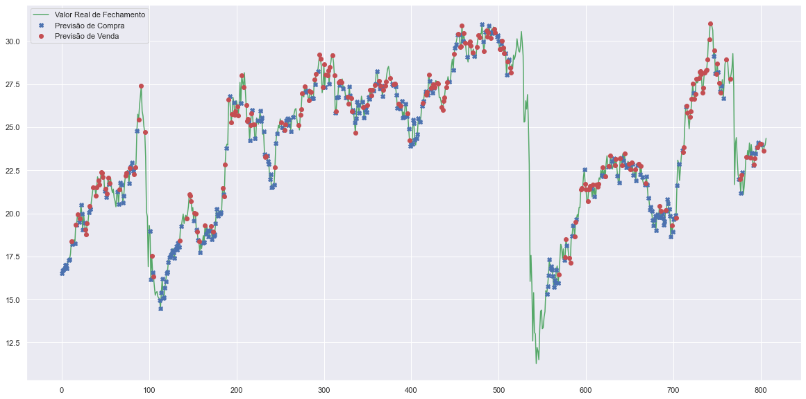

## AI Bot Trader - Robô Investidor Para Recomendação de Compras de Venda de Ações

Nesse projeto iremos construir uma AI Bot Trader para recomendação de compra e Vendas de ações. Iremos extrair dados da Bovesta, tais como:

* Cotações diárias históricas;
* Dados intraday;
* Informações financeiras;

Nosso modelo irá analisar dados financeiros históricos e recomendar a quantidade ação que devemos comprar e vender ppara uma melhor rentabilidade. Iremos trabalhar tanto com a linguagem Python como a Linguagem R.


**Etapas do Projeto:**

* Parte 1 - Extração dos Dados;
* Parte 2 - Análise Financeira das ações;
* Parte 3 - Construção do Modelo e Otimização Bayesiana;
* Parte 4 - Execução do AI Bot Trader
* Parte 5 - Conclusão 

## 1. Extração de Dados

Primeiramente iremos carregar algumas bibliotecas em python para importar os dados históricos diários das ações da Petrobrás (PETR4.SA), Iatú (ITSA4) e a Ambev (ABEV3), de 01 de janeiro de 2018 até a data de hoje. 

<details><summary>Script Python</summary>

```python
# Import Package
import numpy as np
import pandas as pd
from pandas_datareader import data as web
import csv
import time
import random
import types
import pkg_resources
import matplotlib.pyplot as plt
import seaborn as sns
from bayes_opt import BayesianOptimization
from pprint import pprint
from datetime import datetime
sns.set()

# enables the %%R magic, not necessary if you've already done this
%load_ext rpy2.ipython
```

    The rpy2.ipython extension is already loaded. To reload it, use:
      %reload_ext rpy2.ipython


```python
# 
TickerA='PETR4.SA'
TickerB='ITUB3.SA'
TickerC='ABEV3.SA'

prices=pd.DataFrame()
tickers = [TickerA, TickerB, TickerC]
for t in tickers:
    prices[t]=wb.DataReader(t, data_source='yahoo', start='2018-1-1')['Adj Close']
```

Utilizando o Matplotlib, plotei no gráfico da figura abaixo os preços de cada um dos três ativos. O eixo horizontal representa o tempo, enquanto o eixo vertical representa o preço do ativo normalizado


```python
(prices/prices.iloc[0]*100).plot(figsize=(15,5))
plt.ylabel('Preço Normalizados')
plt.xlabel('Data')
plt.title("Preço Normalizado da Petrobrás (PETRA4.SA), Itaú (ITUB3.SA) e Ambev (ABEV3.SA) de 01/01/2018 até 14/04/2021")
plt.show()
```

</details>
    

    


## 2. Análise Financeira das Ações

### 2.1. Retorno Diário


Para calcular quanto um ativo retornou em um dia, basta tomar a variação do preço no dia anterior para o preço no dia atual (P1 - P0), e dividir pelo valor do ativo no dia anterior (P0):


<details><summary>Script Python</summary>

Outra maneira, que iremos utilizar é utilizando o logarítmo, do pacode numpy.


```python
log_returns=np.log(prices/prices.shift(1))

log_returns.plot(figsize = (15,5))
plt.ylabel('Log Preço Retorno')
plt.xlabel('Data')
plt.title(" Log do Retorno Diária das ações")
plt.show()
```


​    

​    


### 2.2.  Retorno diário médio x Retornos anuais médios

Agora iremos saber quanto cada ativo variou em média por dia desde 2018 até a data de hoje. Iremos calcular o valor médio (diário) dos dados. 


```python
log_returns.mean()
```


    PETR4.SA    0.000572
    ITUB3.SA    0.000158
    ABEV3.SA   -0.000282
    dtype: float64


Ao observar o resultado podemos falar que as ações da Petrobrás, comparado com o IOtaú e a Ambev teve o maior rendimento diário médio, de aproximadamente 0.05% entre 2018 a 2021. 
Para sabermos o retorno médio por ano, basta multiplicarmos em por 250, média de dias ao ano que o mercado se encontra e,m operação.
Ao observar abaixo temos o rendimento anual médio das ações da Petrobrás, Itaú e Ambev de 14,30 % a.a, 3,95 % a.a e -7,05% a.a respectivamente. 


```python
log_returns.mean()*250
```


    PETR4.SA    0.143049
    ITUB3.SA    0.039486
    ABEV3.SA   -0.070501
    dtype: float64


Abaixo iremos analisar o retorno diário da Petrobrás, através de um histograma.


```python
fig, ax1 = plt.subplots(1, 1, figsize=(15, 4))
sns.distplot(log_returns['PETR4.SA'], bins=100, ax=ax1)
plt.ylabel('Densidade')
plt.xlabel('Log do Retorno Diária das ações')
plt.xlabel('Retorno Diário')
plt.title(" Histograma Log do Retorno Diária da Petrobrás")
```

    c:\users\rodolfo\appdata\local\programs\python\python39\lib\site-packages\seaborn\distributions.py:2557: FutureWarning: `distplot` is a deprecated function and will be removed in a future version. Please adapt your code to use either `displot` (a figure-level function with similar flexibility) or `histplot` (an axes-level function for histograms).
      warnings.warn(msg, FutureWarning)


    Text(0.5, 1.0, ' Histograma Log do Retorno Diária da Petrobrás')


​    

​    


### 2.3 Computando o risco (desvio Padrão)


Ao realizar uma aplicação financeira, o investidor geralmente procura bons retornos, mas o risco de perder dinheiro muitas vezes pode levá-lo a tomar uma atitude mais conservadora, e consequentemente obter um retorno menor. Geralmente maiores retornos têm uma maior probabilidade de virem acompanhados de riscos maiores. Se o risco é importante, então como poderíamos estimar o risco de um determinado ativo

Conceitos de estatística como variância e desvio padrão podem nos ajudar quando desejamos quantificar o risco de um ativo. É esperado que uma ação volátil possa desviar muito do seu valor médio, para mais ou para menos. Essa medida do quanto a variável desvia do seu valor médio é a variância, dada pela fórmula:


Na equação acima, **n** representa o número de dados, e o termo negativo no numerador é o valor médio de **x**. A raiz quadrada da variância (ou seja, **s**) é chamada de **desvio padrão**. Em finanças, o desvio padrão representa o risco (ou a volatilidade) do ativo.

Abaixo temos a volatilidade dos retornos diários para as ações da Petrobrás, Itaú e Ambev


```python
log_returns.std()
```


    PETR4.SA    0.034704
    ITUB3.SA    0.019939
    ABEV3.SA    0.021151
    dtype: float64


### 2.4. Correlação entre retorno diários

Podemos utilizar o conceito de correlação para analisar o quanto a variação de um ativo pode ou não interferir na variação do outro. A correlação entre duas variáveis x e y (corr(x,y)) se apresenta como um número real entre -1 e 1, onde: 0 < corr(x,y) < 1 (correlação positiva) significa que o aumento de x influencia no aumento de y; -1 < corr(x,y) < 0 (correlação negativa) significa que o aumento de x influencia na redução de y; e corr(x,y) = 0 significa que as variáveis x e y são independentes. Dessa forma, duas variáveis fortemente correlacionadas terão o valor absoluto da correlação muito próximo de 1 (podendo ser positivamente ou negativamente correlacionadas).

Podemos interpretar a tabela abaixo como uma matriz em que cada elemento é a correlação da linha e da coluna associadas. Dessa forma, naturalmente que a variação do preço da Petrobrás, por exemplo, é fortemente correlacionada com o Itaú, com um valor de 0.5953, e também uma correção positiva com a Ambev, ou seja, quando uma ação tende a subir ou cair, consequentemente as demais outras tende a seguir a mesma tendência.


```python
log_returns.corr()
```


<div>
<style scoped>
    .dataframe tbody tr th:only-of-type {
        vertical-align: middle;
    }

    .dataframe tbody tr th {
        vertical-align: top;
    }
    
    .dataframe thead th {
        text-align: right;
    }
</style>
<table border="1" class="dataframe">
  <thead>
    <tr style="text-align: right;">
      <th></th>
      <th>PETR4.SA</th>
      <th>ITUB3.SA</th>
      <th>ABEV3.SA</th>
    </tr>
  </thead>
  <tbody>
    <tr>
      <th>PETR4.SA</th>
      <td>1.000000</td>
      <td>0.595300</td>
      <td>0.445718</td>
    </tr>
    <tr>
      <th>ITUB3.SA</th>
      <td>0.595300</td>
      <td>1.000000</td>
      <td>0.557336</td>
    </tr>
    <tr>
      <th>ABEV3.SA</th>
      <td>0.445718</td>
      <td>0.557336</td>
      <td>1.000000</td>
    </tr>
  </tbody>
</table>
</div>


```python
def plot_corr(corr):
    #Cortaremos a metade de cima do gráfico
    mask = np.zeros_like(corr, dtype=np.bool)
    mask[np.triu_indices_from(mask, 1)] = True
    
    sns.heatmap(corr, mask = mask, cmap = 'RdBu', square = True, linewidths = 0.50)
    
# Calcula a correlação
corr = log_returns.corr()
plot_corr(corr)
```


​    

​    


```r
%%R -i df -w 10 -h 5 --units in -r 100

library("quantmod")

Ações <- c('PETR4.SA')
Data_Inicio = as.Date("2018-01-01")
df <- getSymbols(Ações, src = "yahoo", from = Data_Inicio)

chartSeries(PETR4.SA, theme='white')
addBBands()


```


​    

​    

</details>


    


## 3. Construção do Modelo e Otimização Bayesiana

Analisando as 03 ações, iremos agora construir o modelo apenas para a ação de maior rentabilidade, ou seja a Petrobrás. Iremos coletar novos dados, somente da Petrobrás, para construirmos o modelo.


```python
# escolher a ação desejada
acao = 'PETR4.SA'

# importar dados para o DataFrame
df = web.DataReader(acao, data_source='yahoo', start='01-01-2018')

# ver as 5 primeiras entradas
df.head()
```


<div>
<style scoped>
    .dataframe tbody tr th:only-of-type {
        vertical-align: middle;
    }

    .dataframe tbody tr th {
        vertical-align: top;
    }
    
    .dataframe thead th {
        text-align: right;
    }
</style>
<table border="1" class="dataframe">
  <thead>
    <tr style="text-align: right;">
      <th></th>
      <th>High</th>
      <th>Low</th>
      <th>Open</th>
      <th>Close</th>
      <th>Volume</th>
      <th>Adj Close</th>
    </tr>
    <tr>
      <th>Date</th>
      <th></th>
      <th></th>
      <th></th>
      <th></th>
      <th></th>
      <th></th>
    </tr>
  </thead>
  <tbody>
    <tr>
      <th>2018-01-02</th>
      <td>16.549999</td>
      <td>16.190001</td>
      <td>16.190001</td>
      <td>16.549999</td>
      <td>33461800.0</td>
      <td>15.353476</td>
    </tr>
    <tr>
      <th>2018-01-03</th>
      <td>16.719999</td>
      <td>16.370001</td>
      <td>16.490000</td>
      <td>16.700001</td>
      <td>55940900.0</td>
      <td>15.492632</td>
    </tr>
    <tr>
      <th>2018-01-04</th>
      <td>16.959999</td>
      <td>16.620001</td>
      <td>16.780001</td>
      <td>16.730000</td>
      <td>37064900.0</td>
      <td>15.520462</td>
    </tr>
    <tr>
      <th>2018-01-05</th>
      <td>16.860001</td>
      <td>16.570000</td>
      <td>16.700001</td>
      <td>16.830000</td>
      <td>26958200.0</td>
      <td>15.613233</td>
    </tr>
    <tr>
      <th>2018-01-08</th>
      <td>17.030001</td>
      <td>16.709999</td>
      <td>16.740000</td>
      <td>17.030001</td>
      <td>28400000.0</td>
      <td>15.798772</td>
    </tr>
  </tbody>
</table>
</div>

<details><summary>Script Python</summary>

```python
# Shape
df.shape
```


    (807, 6)


```python
# Dados de Fechamento
close = df.Close.values.tolist()
```


```python
# Outros parâmetros para a versão base do modelo
window_size = 30
skip = 5
l = len(close) - 1
```


```python
# Classe para a estratégia de treinamento
# Usamos Deep Evolution Strategy do OpenAI
class PoliticaTrader:

    # Inputs
    inputs = None

    # Construtor
    def __init__(self, weights, reward_function, population_size, sigma, learning_rate):
        
        # Inicializa os atributos da classe
        self.weights = weights
        self.reward_function = reward_function
        self.population_size = population_size
        self.sigma = sigma
        self.learning_rate = learning_rate

    # Obtém o peso a partir da população
    def get_weights_population(self, weights, population):
        
        # Lista para os pesos
        weights_population = []
        
        # Loop pela população
        for index, i in enumerate(population):
            jittered = self.sigma * i
            weights_population.append(weights[index] + jittered)
        
        return weights_population

    # Obtém os pesos
    def get_weights(self):
        return self.weights

    # Treinamento
    def treinamento(self, epoch = 100, print_every = 1):
        
        # Time
        lasttime = time.time()
        
        # Loop pelas épocas
        for i in range(epoch):
            
            # Lista para a população
            population = []
            
            # Recompensas
            rewards = np.zeros(self.population_size)
            
            # Loop pelo population_size
            for k in range(self.population_size):
                
                x = []
                
                # Loop
                for w in self.weights:
                    x.append(np.random.randn(*w.shape))
                    
                population.append(x)
            
            # Loop
            for k in range(self.population_size):
                
                weights_population = self.get_weights_population(self.weights, population[k])
                rewards[k] = self.reward_function(weights_population)
            
            # Recompensas
            rewards = (rewards - np.mean(rewards)) / np.std(rewards)
            
            # Loop
            for index, w in enumerate(self.weights):
                A = np.array([p[index] for p in population])
                
                # Pesos da rede neural 
                self.weights[index] = (w + self.learning_rate / (self.population_size * self.sigma) * np.dot(A.T, rewards).T)
            
            if (i + 1) % print_every == 0:
                print('Iteração %d. Recompensa: %f' % (i + 1, self.reward_function(self.weights)))
        
        print('Tempo Total de Treinamento:', time.time() - lasttime, 'segundos')
```

### 3.1. Arquitetura do Modelo de Rede Neural


```python
# Classe do Modelo
class Modelo:
    
    # Método construtor
    def __init__(self, input_size, layer_size, output_size):
        
        self.weights = [np.random.randn(input_size, layer_size),
                        np.random.randn(layer_size, output_size),
                        np.random.randn(layer_size, 1),
                        np.random.randn(1, layer_size),]

    # Função para previsão
    def predict(self, inputs):
        
        # Feed forward
        feed = np.dot(inputs, self.weights[0]) + self.weights[-1]
        
        # Decisão de compra (previsão)
        decision = np.dot(feed, self.weights[1])
        
        # Compra (decisão)
        buy = np.dot(feed, self.weights[2])
        
        return decision, buy

    def get_weights(self):
        return self.weights

    def set_weights(self, weights):
        self.weights = weights
```

### 3.2. Configuração do AI Bot Trader


```python
# Função para obter o estado dos dados
def get_state(data, t, n):
    d = t - n + 1
    block = data[d : t + 1] if d >= 0 else -d * [data[0]] + data[0 : t + 1]
    res = []
    for i in range(n - 1):
        res.append(block[i + 1] - block[i])
    return np.array([res])
```


```python
# Classe para o agente inteligente (Trader)
class Trader:
    
    # Método construtor
    def __init__(self, population_size, sigma, learning_rate, model, money, max_buy, max_sell, skip, window_size,):
        
        # Inicializa os atributos
        self.window_size = window_size
        self.skip = skip
        self.POPULATION_SIZE = population_size
        self.SIGMA = sigma
        self.LEARNING_RATE = learning_rate
        self.model = model
        self.initial_money = money
        self.max_buy = max_buy
        self.max_sell = max_sell
        self.es = PoliticaTrader(self.model.get_weights(),
                                 self.get_reward,
                                 self.POPULATION_SIZE,
                                 self.SIGMA,
                                 self.LEARNING_RATE,)

    # Método de ação
    def agir(self, sequence):
        decision, buy = self.model.predict(np.array(sequence))
        return np.argmax(decision[0]), int(buy[0])

    # Método para obter recompensa
    def get_reward(self, weights):
        
        # Valor inicial investido
        initial_money = self.initial_money
        starting_money = initial_money
        
        # Pesos
        self.model.weights = weights
        
        # Estado
        state = get_state(close, 0, self.window_size + 1)
        
        # Objetos de controle
        inventory = []
        quantity = 0
        
        # Loop
        for t in range(0, l, self.skip):
            
            # Ação e compra/venda
            action, buy = self.agir(state)
            
            # Próximo estado
            next_state = get_state(close, t + 1, self.window_size + 1)
            
            # Verifica ação e valor inicial investido
            if action == 1 and initial_money >= close[t]:
                if buy < 0:
                    buy = 1
                if buy > self.max_buy:
                    buy_units = self.max_buy
                else:
                    buy_units = buy
                    
                total_buy = buy_units * close[t]
                initial_money -= total_buy
                inventory.append(total_buy)
                quantity += buy_units
            
            elif action == 2 and len(inventory) > 0:
                if quantity > self.max_sell:
                    sell_units = self.max_sell
                else:
                    sell_units = quantity
                    
                quantity -= sell_units
                total_sell = sell_units * close[t]
                initial_money += total_sell

            # Próximo estado
            state = next_state
        
        return ((initial_money - starting_money) / starting_money) * 100

    # Treinamento do Trader
    def fit(self, iterations, checkpoint):
        self.es.treinamento(iterations, print_every = checkpoint)

    # Método para recomendação
    def investir(self):
        
        # Valor inicial
        initial_money = self.initial_money
        starting_money = initial_money
        
        # Estado
        state = get_state(close, 0, self.window_size + 1)
        
        # Listas de controle        
        states_sell = []
        states_buy = []
        inventory = []
        quantity = 0
        
        # Loop
        for t in range(0, l, self.skip):
            
            # Ação e compra
            action, buy = self.agir(state)
            
            # Próximo estado
            next_state = get_state(close, t + 1, self.window_size + 1)
            
            # Verifica ação e valor inicial investido
            if action == 1 and initial_money >= close[t]:
                if buy < 0:
                    buy = 1
                if buy > self.max_buy:
                    buy_units = self.max_buy
                else:
                    buy_units = buy
                
                total_buy = buy_units * close[t]
                initial_money -= total_buy
                inventory.append(total_buy)
                quantity += buy_units
                states_buy.append(t)
                
                print('Dia %d: comprar %d unidades ao preço de %f, saldo total %f' % (t, buy_units, total_buy, initial_money))
            
            elif action == 2 and len(inventory) > 0:
                bought_price = inventory.pop(0)
                if quantity > self.max_sell:
                    sell_units = self.max_sell
                else:
                    sell_units = quantity
                if sell_units < 1:
                    continue
                    
                quantity -= sell_units
                total_sell = sell_units * close[t]
                initial_money += total_sell
                states_sell.append(t)
                
                try:
                    invest = ((total_sell - bought_price) / bought_price) * 100
                except:
                    invest = 0
                
                print('Dia %d, vender %d unidades ao preço de %f, investimento %f %%, saldo total %f,' % (t, sell_units, total_sell, invest, initial_money))
            
            # Próximo estado
            state = next_state

        # Investimento
        invest = ((initial_money - starting_money) / starting_money) * 100
        
        print('\nGanho Total %f, Valor Total Investido %f' % (initial_money - starting_money, invest))
        
        plt.figure(figsize = (20, 10))
        plt.plot(close, label = 'Valor Real de Fechamento', c = 'g')
        plt.plot(close, 'X', label = 'Previsão de Compra', markevery = states_buy, c = 'b')
        plt.plot(close, 'o', label = 'Previsão de Venda', markevery = states_sell, c = 'r')
        plt.legend()
        plt.show()
```

### 3.3. Funções Para Buscar o Melhor Trader


```python
# Função para encontrar o melhor trader
def melhor_trader(window_size, skip, population_size, sigma, learning_rate, size_network):
    
    # Cria o modelo
    model = Modelo(window_size, size_network, 3)
    
    # Cria o trader
    trader = Trader(population_size, sigma, learning_rate, model, 10000, 5, 5, skip, window_size,)
    
    # Treinamento
    try:
        trader.fit(100, 1000)
        return trader.es.reward_function(trader.es.weights)
    except:
        return 0
```


```python
# Função para encontrar o melhor trader de acordo com os hiperparâmetros
def busca_melhor_trader(window_size, skip, population_size, sigma, learning_rate, size_network):
    
    # Variável global
    global accbest
    
    # Hiperparâmetros
    param = {'window_size': int(np.around(window_size)),
             'skip': int(np.around(skip)),
             'population_size': int(np.around(population_size)),
             'sigma': max(min(sigma, 1), 0.0001),
             'learning_rate': max(min(learning_rate, 0.5), 0.000001),
             'size_network': int(np.around(size_network)),}
    
    print('\nBuscando Parâmetros %s' % (param))
    
    # Investimento feito pelo melhor trader
    investment = melhor_trader(**param)
    
    print('Após 100 iterações o investimento foi de %f' % (investment))
        
    return investment
```

### 3.4. Otimização Bayesiana Para os Hiperparâmetros do Modelo


```python
# Modelo para otimização bayesiana de hiperparâmetros
otimizacao_bayesiana = BayesianOptimization(busca_melhor_trader, {'window_size': (2, 50),
                                                                  'skip': (1, 15),
                                                                  'population_size': (1, 50),
                                                                  'sigma': (0.01, 0.99),
                                                                  'learning_rate': (0.000001, 0.49),
                                                                  'size_network': (10, 1000),},)
```


```python
%%time
otimizacao_bayesiana.maximize(init_points = 30, n_iter = 50, acq = 'ei', xi = 0.0)
```

    |   iter    |  target   | learni... | popula... |   sigma   | size_n... |   skip    | window... |
    -------------------------------------------------------------------------------------------------
    
    Buscando Parâmetros {'window_size': 37, 'skip': 4, 'population_size': 6, 'sigma': 0.3714710811812899, 'learning_rate': 0.4884908974282609, 'size_network': 507}
    Tempo Total de Treinamento: 9.442381858825684 segundos
    Após 100 iterações o investimento foi de 6.701600
    |  1        |  6.702    |  0.4885   |  6.352    |  0.3715   |  507.5    |  4.297    |  36.82    |
    
    Buscando Parâmetros {'window_size': 33, 'skip': 15, 'population_size': 11, 'sigma': 0.7310678968278661, 'learning_rate': 0.47611684297877793, 'size_network': 42}
    Tempo Total de Treinamento: 1.9048259258270264 segundos
    Após 100 iterações o investimento foi de 6.168100
    |  2        |  6.168    |  0.4761   |  11.31    |  0.7311   |  41.9     |  14.51    |  32.71    |
    
    Buscando Parâmetros {'window_size': 5, 'skip': 6, 'population_size': 19, 'sigma': 0.19194116271831085, 'learning_rate': 0.2975303348902732, 'size_network': 193}
    Tempo Total de Treinamento: 7.623299837112427 segundos
    Após 100 iterações o investimento foi de 5.577000
    |  3        |  5.577    |  0.2975   |  18.76    |  0.1919   |  192.6    |  5.662    |  4.712    |
    
    Buscando Parâmetros {'window_size': 41, 'skip': 2, 'population_size': 13, 'sigma': 0.08109011361630551, 'learning_rate': 0.32351660721618913, 'size_network': 157}
    Tempo Total de Treinamento: 18.8673677444458 segundos
    Após 100 iterações o investimento foi de 3.453101
    |  4        |  3.453    |  0.3235   |  12.75    |  0.08109  |  156.6    |  1.935    |  40.85    |
    
    Buscando Parâmetros {'window_size': 10, 'skip': 12, 'population_size': 37, 'sigma': 0.8066874470504081, 'learning_rate': 0.23912765505414102, 'size_network': 962}
    Tempo Total de Treinamento: 19.27206301689148 segundos
    Após 100 iterações o investimento foi de 1.551100
    |  5        |  1.551    |  0.2391   |  36.52    |  0.8067   |  962.0    |  11.64    |  9.701    |
    
    Buscando Parâmetros {'window_size': 41, 'skip': 7, 'population_size': 24, 'sigma': 0.9733001577107043, 'learning_rate': 0.17617966173797298, 'size_network': 405}
    Tempo Total de Treinamento: 22.231436014175415 segundos
    Após 100 iterações o investimento foi de 5.068500
    |  6        |  5.069    |  0.1762   |  23.54    |  0.9733   |  405.4    |  6.917    |  40.54    |
    
    Buscando Parâmetros {'window_size': 11, 'skip': 3, 'population_size': 18, 'sigma': 0.443688135746148, 'learning_rate': 0.16346331925485064, 'size_network': 459}
    Tempo Total de Treinamento: 15.526564836502075 segundos
    Após 100 iterações o investimento foi de 6.431800
    |  7        |  6.432    |  0.1635   |  18.01    |  0.4437   |  458.9    |  3.093    |  10.59    |
    
    Buscando Parâmetros {'window_size': 34, 'skip': 14, 'population_size': 36, 'sigma': 0.748779378980862, 'learning_rate': 0.18529156337493885, 'size_network': 737}
    Tempo Total de Treinamento: 20.70582628250122 segundos
    Após 100 iterações o investimento foi de 4.404100
    |  8        |  4.404    |  0.1853   |  36.26    |  0.7488   |  737.4    |  14.37    |  34.33    |
    
    Buscando Parâmetros {'window_size': 20, 'skip': 14, 'population_size': 19, 'sigma': 0.6069657524085991, 'learning_rate': 0.31829481198365855, 'size_network': 503}
    Tempo Total de Treinamento: 8.768885374069214 segundos
    Após 100 iterações o investimento foi de 5.510100
    |  9        |  5.51     |  0.3183   |  19.01    |  0.607    |  502.8    |  14.14    |  20.39    |
    
    Buscando Parâmetros {'window_size': 9, 'skip': 14, 'population_size': 36, 'sigma': 0.9110933250357709, 'learning_rate': 0.4733465993407593, 'size_network': 673}
    Tempo Total de Treinamento: 8.201050043106079 segundos
    Após 100 iterações o investimento foi de 3.414300
    |  10       |  3.414    |  0.4733   |  36.14    |  0.9111   |  672.8    |  14.18    |  9.273    |
    
    Buscando Parâmetros {'window_size': 20, 'skip': 10, 'population_size': 39, 'sigma': 0.633729879392366, 'learning_rate': 0.34929555537809837, 'size_network': 204}
    Tempo Total de Treinamento: 10.641438961029053 segundos
    Após 100 iterações o investimento foi de 4.062700
    |  11       |  4.063    |  0.3493   |  38.6     |  0.6337   |  204.5    |  10.43    |  20.25    |
    
    Buscando Parâmetros {'window_size': 38, 'skip': 10, 'population_size': 47, 'sigma': 0.10073107592809434, 'learning_rate': 0.2331534100666837, 'size_network': 257}
    Tempo Total de Treinamento: 29.320645809173584 segundos
    Após 100 iterações o investimento foi de 4.660100
    |  12       |  4.66     |  0.2332   |  46.59    |  0.1007   |  257.0    |  9.672    |  38.02    |
    
    Buscando Parâmetros {'window_size': 39, 'skip': 4, 'population_size': 36, 'sigma': 0.25352922075467466, 'learning_rate': 0.2618670403938699, 'size_network': 894}
    Tempo Total de Treinamento: 62.035640239715576 segundos
    Após 100 iterações o investimento foi de 14.863200
    |  13       |  14.86    |  0.2619   |  36.1     |  0.2535   |  893.6    |  3.526    |  39.12    |
    
    Buscando Parâmetros {'window_size': 49, 'skip': 14, 'population_size': 45, 'sigma': 0.8297145661973063, 'learning_rate': 0.3689039878215728, 'size_network': 92}
    Tempo Total de Treinamento: 9.926882266998291 segundos
    Após 100 iterações o investimento foi de 5.198300
    |  14       |  5.198    |  0.3689   |  45.03    |  0.8297   |  91.8     |  14.15    |  49.06    |
    
    Buscando Parâmetros {'window_size': 43, 'skip': 9, 'population_size': 24, 'sigma': 0.7408673287595107, 'learning_rate': 0.09175827808943801, 'size_network': 385}
    Tempo Total de Treinamento: 17.889352321624756 segundos
    Após 100 iterações o investimento foi de 2.008900
    |  15       |  2.009    |  0.09176  |  24.16    |  0.7409   |  384.8    |  9.009    |  42.69    |
    
    Buscando Parâmetros {'window_size': 10, 'skip': 13, 'population_size': 10, 'sigma': 0.3677914343530931, 'learning_rate': 0.14624037342254007, 'size_network': 852}
    Tempo Total de Treinamento: 2.8682312965393066 segundos
    Após 100 iterações o investimento foi de 5.164000
    |  16       |  5.164    |  0.1462   |  10.2     |  0.3678   |  851.8    |  12.87    |  9.847    |
    
    Buscando Parâmetros {'window_size': 9, 'skip': 2, 'population_size': 4, 'sigma': 0.8731616721134408, 'learning_rate': 0.3301988436718014, 'size_network': 253}
    Tempo Total de Treinamento: 4.918956518173218 segundos
    Após 100 iterações o investimento foi de 2.717600
    |  17       |  2.718    |  0.3302   |  3.59     |  0.8732   |  252.9    |  1.525    |  9.281    |
    
    Buscando Parâmetros {'window_size': 40, 'skip': 11, 'population_size': 34, 'sigma': 0.36414728741338265, 'learning_rate': 0.3994044183735809, 'size_network': 224}
    Tempo Total de Treinamento: 10.765360832214355 segundos
    Após 100 iterações o investimento foi de 8.189200
    |  18       |  8.189    |  0.3994   |  34.43    |  0.3641   |  224.4    |  11.17    |  39.72    |
    
    Buscando Parâmetros {'window_size': 5, 'skip': 4, 'population_size': 13, 'sigma': 0.6178738453604706, 'learning_rate': 0.3786922634942377, 'size_network': 89}
    Tempo Total de Treinamento: 6.52597713470459 segundos
    Após 100 iterações o investimento foi de 2.478500
    |  19       |  2.479    |  0.3787   |  12.87    |  0.6179   |  88.51    |  4.449    |  5.057    |
    
    Buscando Parâmetros {'window_size': 43, 'skip': 11, 'population_size': 18, 'sigma': 0.7595852568445012, 'learning_rate': 0.42635924837194716, 'size_network': 457}
    Tempo Total de Treinamento: 11.8781156539917 segundos
    Após 100 iterações o investimento foi de 7.485800
    |  20       |  7.486    |  0.4264   |  18.47    |  0.7596   |  456.7    |  11.1     |  42.77    |
    
    Buscando Parâmetros {'window_size': 30, 'skip': 10, 'population_size': 16, 'sigma': 0.9068510341187307, 'learning_rate': 0.014653583588138265, 'size_network': 702}
    Tempo Total de Treinamento: 11.506169319152832 segundos
    Após 100 iterações o investimento foi de -0.197700
    |  21       | -0.1977   |  0.01465  |  16.04    |  0.9069   |  702.0    |  10.23    |  30.19    |
    
    Buscando Parâmetros {'window_size': 32, 'skip': 14, 'population_size': 32, 'sigma': 0.958182793861402, 'learning_rate': 0.34225753108357165, 'size_network': 263}
    Tempo Total de Treinamento: 7.859153985977173 segundos
    Após 100 iterações o investimento foi de 3.502500
    |  22       |  3.503    |  0.3423   |  32.33    |  0.9582   |  262.8    |  13.5     |  31.86    |
    
    Buscando Parâmetros {'window_size': 44, 'skip': 10, 'population_size': 27, 'sigma': 0.9516554140724764, 'learning_rate': 0.41106827746610347, 'size_network': 558}
    Tempo Total de Treinamento: 19.99038290977478 segundos
    Após 100 iterações o investimento foi de 4.895500
    |  23       |  4.895    |  0.4111   |  26.94    |  0.9517   |  558.0    |  9.539    |  44.45    |
    
    Buscando Parâmetros {'window_size': 35, 'skip': 14, 'population_size': 14, 'sigma': 0.35748741473589796, 'learning_rate': 0.46331394063146053, 'size_network': 512}
    Tempo Total de Treinamento: 7.194947242736816 segundos
    Após 100 iterações o investimento foi de 5.024000
    |  24       |  5.024    |  0.4633   |  13.56    |  0.3575   |  512.0    |  13.93    |  34.63    |
    
    Buscando Parâmetros {'window_size': 23, 'skip': 11, 'population_size': 10, 'sigma': 0.41107466559993094, 'learning_rate': 0.26892544518675615, 'size_network': 449}
    Tempo Total de Treinamento: 5.787738084793091 segundos
    Após 100 iterações o investimento foi de 6.660200
    |  25       |  6.66     |  0.2689   |  9.961    |  0.4111   |  449.5    |  11.16    |  22.78    |
    
    Buscando Parâmetros {'window_size': 4, 'skip': 2, 'population_size': 32, 'sigma': 0.23361095682116345, 'learning_rate': 0.320315258958531, 'size_network': 127}
    Tempo Total de Treinamento: 32.03536415100098 segundos
    Após 100 iterações o investimento foi de 4.419700
    |  26       |  4.42     |  0.3203   |  32.14    |  0.2336   |  126.8    |  2.256    |  4.044    |
    
    Buscando Parâmetros {'window_size': 3, 'skip': 15, 'population_size': 10, 'sigma': 0.629038128008649, 'learning_rate': 0.2666348990070033, 'size_network': 677}
    Tempo Total de Treinamento: 1.8568551540374756 segundos
    Após 100 iterações o investimento foi de 1.024000
    |  27       |  1.024    |  0.2666   |  10.34    |  0.629    |  677.0    |  14.9     |  3.035    |
    
    Buscando Parâmetros {'window_size': 30, 'skip': 11, 'population_size': 16, 'sigma': 0.6664097642518093, 'learning_rate': 0.12104587306463734, 'size_network': 262}
    Tempo Total de Treinamento: 4.876995325088501 segundos
    Após 100 iterações o investimento foi de 4.652300
    |  28       |  4.652    |  0.121    |  15.53    |  0.6664   |  261.8    |  10.68    |  30.25    |
    
    Buscando Parâmetros {'window_size': 44, 'skip': 3, 'population_size': 35, 'sigma': 0.06436113067719122, 'learning_rate': 0.3287640746212722, 'size_network': 703}
    Tempo Total de Treinamento: 75.75144982337952 segundos
    Após 100 iterações o investimento foi de -2.936600
    |  29       | -2.937    |  0.3288   |  35.45    |  0.06436  |  703.0    |  2.949    |  44.4     |
    
    Buscando Parâmetros {'window_size': 17, 'skip': 3, 'population_size': 21, 'sigma': 0.7132174383649433, 'learning_rate': 0.17435296630335198, 'size_network': 31}
    Tempo Total de Treinamento: 15.145662069320679 segundos
    Após 100 iterações o investimento foi de 2.822400
    |  30       |  2.822    |  0.1744   |  21.33    |  0.7132   |  30.79    |  3.304    |  17.4     |
    
    Buscando Parâmetros {'window_size': 11, 'skip': 5, 'population_size': 18, 'sigma': 0.4697677535693172, 'learning_rate': 0.06444378620957386, 'size_network': 460}
    Tempo Total de Treinamento: 9.526125431060791 segundos
    Após 100 iterações o investimento foi de 3.645000
    |  31       |  3.645    |  0.06444  |  18.1     |  0.4698   |  459.6    |  5.337    |  11.45    |
    
    Buscando Parâmetros {'window_size': 21, 'skip': 2, 'population_size': 25, 'sigma': 0.3902980829941716, 'learning_rate': 0.06640274967489014, 'size_network': 893}
    Tempo Total de Treinamento: 74.44517350196838 segundos
    Após 100 iterações o investimento foi de 9.252400
    |  32       |  9.252    |  0.0664   |  25.1     |  0.3903   |  892.8    |  2.161    |  21.31    |
    
    Buscando Parâmetros {'window_size': 20, 'skip': 2, 'population_size': 30, 'sigma': 0.4674005274978509, 'learning_rate': 0.4424647463738166, 'size_network': 959}
    Tempo Total de Treinamento: 88.63414406776428 segundos
    Após 100 iterações o investimento foi de 15.876900
    |  33       |  15.88    |  0.4425   |  29.62    |  0.4674   |  959.4    |  2.029    |  19.76    |
    
    Buscando Parâmetros {'window_size': 21, 'skip': 7, 'population_size': 15, 'sigma': 0.7736841162369068, 'learning_rate': 0.4231865259480723, 'size_network': 325}
    Tempo Total de Treinamento: 6.257140636444092 segundos
    Após 100 iterações o investimento foi de 5.097600
    |  34       |  5.098    |  0.4232   |  14.96    |  0.7737   |  325.2    |  6.997    |  20.67    |
    
    Buscando Parâmetros {'window_size': 44, 'skip': 6, 'population_size': 13, 'sigma': 0.7632250558186701, 'learning_rate': 0.23802187803933425, 'size_network': 839}
    Tempo Total de Treinamento: 15.78127384185791 segundos
    Após 100 iterações o investimento foi de 9.103800
    |  35       |  9.104    |  0.238    |  13.0     |  0.7632   |  838.8    |  6.2      |  44.1     |
    
    Buscando Parâmetros {'window_size': 47, 'skip': 6, 'population_size': 17, 'sigma': 0.25046078928719695, 'learning_rate': 0.0731848212518044, 'size_network': 873}
    Tempo Total de Treinamento: 21.634924173355103 segundos
    Após 100 iterações o investimento foi de 9.442301
    |  36       |  9.442    |  0.07318  |  17.25    |  0.2505   |  872.9    |  6.087    |  46.59    |
    
    Buscando Parâmetros {'window_size': 18, 'skip': 10, 'population_size': 8, 'sigma': 0.7164511951397857, 'learning_rate': 0.3944748323179408, 'size_network': 84}
    Tempo Total de Treinamento: 1.8858375549316406 segundos
    Após 100 iterações o investimento foi de 3.760200
    |  37       |  3.76     |  0.3945   |  8.032    |  0.7165   |  83.8     |  10.3     |  17.58    |
    
    Buscando Parâmetros {'window_size': 4, 'skip': 14, 'population_size': 47, 'sigma': 0.11270220402200781, 'learning_rate': 0.18979827260328294, 'size_network': 108}
    Tempo Total de Treinamento: 7.007679462432861 segundos
    Após 100 iterações o investimento foi de 1.835600
    |  38       |  1.836    |  0.1898   |  46.83    |  0.1127   |  108.0    |  14.37    |  4.349    |
    
    Buscando Parâmetros {'window_size': 36, 'skip': 6, 'population_size': 17, 'sigma': 0.7319406065967556, 'learning_rate': 0.05836100109318181, 'size_network': 611}
    Tempo Total de Treinamento: 18.71552038192749 segundos
    Após 100 iterações o investimento foi de 1.580300
    |  39       |  1.58     |  0.05836  |  16.57    |  0.7319   |  611.0    |  5.581    |  36.08    |
    
    Buscando Parâmetros {'window_size': 19, 'skip': 9, 'population_size': 25, 'sigma': 0.7546619578573674, 'learning_rate': 0.4459356203027896, 'size_network': 526}
    Tempo Total de Treinamento: 16.936607360839844 segundos
    Após 100 iterações o investimento foi de 4.319600
    |  40       |  4.32     |  0.4459   |  24.52    |  0.7547   |  525.9    |  8.559    |  19.15    |
    
    Buscando Parâmetros {'window_size': 5, 'skip': 6, 'population_size': 28, 'sigma': 0.6003949009843166, 'learning_rate': 0.28889314242453573, 'size_network': 301}
    Tempo Total de Treinamento: 11.035311460494995 segundos
    Após 100 iterações o investimento foi de 3.825000
    |  41       |  3.825    |  0.2889   |  28.5     |  0.6004   |  301.0    |  6.081    |  5.202    |
    
    Buscando Parâmetros {'window_size': 7, 'skip': 9, 'population_size': 10, 'sigma': 0.3975218822395772, 'learning_rate': 0.29355747111981934, 'size_network': 397}
    Tempo Total de Treinamento: 2.9002113342285156 segundos
    Após 100 iterações o investimento foi de 2.298900
    |  42       |  2.299    |  0.2936   |  10.2     |  0.3975   |  397.3    |  9.004    |  6.563    |
    
    Buscando Parâmetros {'window_size': 29, 'skip': 6, 'population_size': 16, 'sigma': 0.313094789485743, 'learning_rate': 0.18056920836316, 'size_network': 512}
    Tempo Total de Treinamento: 16.4734525680542 segundos
    Após 100 iterações o investimento foi de 8.753101
    |  43       |  8.753    |  0.1806   |  16.49    |  0.3131   |  512.3    |  5.709    |  29.15    |
    
    Buscando Parâmetros {'window_size': 29, 'skip': 6, 'population_size': 9, 'sigma': 0.9026670413444527, 'learning_rate': 0.13989500435337537, 'size_network': 690}
    Tempo Total de Treinamento: 9.521034717559814 segundos
    Após 100 iterações o investimento foi de 1.739500
    |  44       |  1.74     |  0.1399   |  9.213    |  0.9027   |  690.4    |  6.159    |  29.45    |
    
    Buscando Parâmetros {'window_size': 13, 'skip': 4, 'population_size': 49, 'sigma': 0.8661134627241167, 'learning_rate': 0.045196112641287325, 'size_network': 649}
    Tempo Total de Treinamento: 35.86389112472534 segundos
    Após 100 iterações o investimento foi de 0.248000
    |  45       |  0.248    |  0.0452   |  49.17    |  0.8661   |  648.7    |  4.481    |  12.99    |
    
    Buscando Parâmetros {'window_size': 33, 'skip': 6, 'population_size': 26, 'sigma': 0.5313923229496396, 'learning_rate': 0.35534102009508767, 'size_network': 423}
    Tempo Total de Treinamento: 26.98723840713501 segundos
    Após 100 iterações o investimento foi de 10.372100
    |  46       |  10.37    |  0.3553   |  25.83    |  0.5314   |  423.5    |  6.184    |  32.55    |
    
    Buscando Parâmetros {'window_size': 25, 'skip': 7, 'population_size': 23, 'sigma': 0.8611546905158693, 'learning_rate': 0.24564294405667267, 'size_network': 908}
    Tempo Total de Treinamento: 22.241109371185303 segundos
    Após 100 iterações o investimento foi de 6.876700
    |  47       |  6.877    |  0.2456   |  23.49    |  0.8612   |  908.0    |  7.221    |  25.14    |
    
    Buscando Parâmetros {'window_size': 40, 'skip': 4, 'population_size': 31, 'sigma': 0.021551558508644753, 'learning_rate': 0.19164389651424052, 'size_network': 815}


    <ipython-input-120-8534583be908>:68: RuntimeWarning: invalid value encountered in true_divide
      rewards = (rewards - np.mean(rewards)) / np.std(rewards)


    Após 100 iterações o investimento foi de 0.000000
    |  48       |  0.0      |  0.1916   |  31.01    |  0.02155  |  814.6    |  3.838    |  40.09    |
    
    Buscando Parâmetros {'window_size': 20, 'skip': 8, 'population_size': 28, 'sigma': 0.7831519088256497, 'learning_rate': 0.4771451831620576, 'size_network': 643}
    Tempo Total de Treinamento: 21.955946445465088 segundos
    Após 100 iterações o investimento foi de 6.683000
    |  49       |  6.683    |  0.4771   |  28.09    |  0.7832   |  643.1    |  8.359    |  20.09    |
    
    Buscando Parâmetros {'window_size': 48, 'skip': 12, 'population_size': 36, 'sigma': 0.5413751545207391, 'learning_rate': 0.16283682410252603, 'size_network': 291}
    Tempo Total de Treinamento: 20.419804096221924 segundos
    Após 100 iterações o investimento foi de 5.280200
    |  50       |  5.28     |  0.1628   |  35.93    |  0.5414   |  291.5    |  11.89    |  48.32    |
    
    Buscando Parâmetros {'window_size': 42, 'skip': 14, 'population_size': 25, 'sigma': 0.27523891073136797, 'learning_rate': 0.2080683588470813, 'size_network': 423}
    Tempo Total de Treinamento: 12.998985767364502 segundos
    Após 100 iterações o investimento foi de 4.934400
    |  51       |  4.934    |  0.2081   |  25.13    |  0.2752   |  422.6    |  13.98    |  41.57    |
    
    Buscando Parâmetros {'window_size': 28, 'skip': 12, 'population_size': 1, 'sigma': 0.27431059702144245, 'learning_rate': 0.2534727240288356, 'size_network': 819}
    Após 100 iterações o investimento foi de 0.000000
    |  52       |  0.0      |  0.2535   |  1.201    |  0.2743   |  818.9    |  12.15    |  27.68    |


    <ipython-input-120-8534583be908>:68: RuntimeWarning: invalid value encountered in true_divide
      rewards = (rewards - np.mean(rewards)) / np.std(rewards)


​    
    Buscando Parâmetros {'window_size': 8, 'skip': 6, 'population_size': 10, 'sigma': 0.4590860508766327, 'learning_rate': 0.23208823047531804, 'size_network': 773}
    Tempo Total de Treinamento: 4.843014240264893 segundos
    Após 100 iterações o investimento foi de 4.347801
    |  53       |  4.348    |  0.2321   |  9.793    |  0.4591   |  773.0    |  6.482    |  8.251    |
    
    Buscando Parâmetros {'window_size': 47, 'skip': 3, 'population_size': 29, 'sigma': 0.42427870774369936, 'learning_rate': 0.37795978711827627, 'size_network': 340}
    Tempo Total de Treinamento: 59.14331817626953 segundos
    Após 100 iterações o investimento foi de 23.595301
    |  54       |  23.6     |  0.378    |  28.83    |  0.4243   |  340.3    |  2.736    |  46.67    |
    
    Buscando Parâmetros {'window_size': 45, 'skip': 5, 'population_size': 31, 'sigma': 0.5966664888546497, 'learning_rate': 0.3497722540363399, 'size_network': 339}
    Tempo Total de Treinamento: 38.80337977409363 segundos
    Após 100 iterações o investimento foi de 10.241900
    |  55       |  10.24    |  0.3498   |  31.24    |  0.5967   |  339.5    |  5.428    |  45.14    |
    
    Buscando Parâmetros {'window_size': 43, 'skip': 2, 'population_size': 26, 'sigma': 0.5000407357577589, 'learning_rate': 0.32144682748224823, 'size_network': 345}
    Tempo Total de Treinamento: 77.35072612762451 segundos
    Após 100 iterações o investimento foi de 15.626000
    |  56       |  15.63    |  0.3214   |  26.34    |  0.5      |  345.0    |  2.157    |  43.47    |
    
    Buscando Parâmetros {'window_size': 47, 'skip': 2, 'population_size': 29, 'sigma': 0.6866538078249137, 'learning_rate': 0.014402474554791824, 'size_network': 345}
    Tempo Total de Treinamento: 88.26267457008362 segundos
    Após 100 iterações o investimento foi de 1.010000
    |  57       |  1.01     |  0.0144   |  28.66    |  0.6867   |  344.6    |  1.661    |  46.64    |
    
    Buscando Parâmetros {'window_size': 13, 'skip': 5, 'population_size': 45, 'sigma': 0.09838024977910924, 'learning_rate': 0.0100408229261383, 'size_network': 922}
    Tempo Total de Treinamento: 56.50383257865906 segundos
    Após 100 iterações o investimento foi de 2.407100
    |  58       |  2.407    |  0.01004  |  44.98    |  0.09838  |  921.8    |  4.961    |  12.8     |
    
    Buscando Parâmetros {'window_size': 39, 'skip': 14, 'population_size': 11, 'sigma': 0.6278001578255121, 'learning_rate': 0.28608366218694126, 'size_network': 97}
    Tempo Total de Treinamento: 2.7882819175720215 segundos
    Após 100 iterações o investimento foi de 5.315500
    |  59       |  5.316    |  0.2861   |  10.52    |  0.6278   |  97.47    |  13.85    |  38.88    |
    
    Buscando Parâmetros {'window_size': 20, 'skip': 2, 'population_size': 30, 'sigma': 0.7492774194381046, 'learning_rate': 0.3195037174035489, 'size_network': 18}
    Tempo Total de Treinamento: 34.08898329734802 segundos
    Após 100 iterações o investimento foi de 8.904100
    |  60       |  8.904    |  0.3195   |  29.65    |  0.7493   |  17.99    |  1.814    |  20.48    |
    
    Buscando Parâmetros {'window_size': 5, 'skip': 1, 'population_size': 7, 'sigma': 0.4419160235855665, 'learning_rate': 0.38929205791742477, 'size_network': 403}
    Tempo Total de Treinamento: 16.803640127182007 segundos
    Após 100 iterações o investimento foi de 1.748100
    |  61       |  1.748    |  0.3893   |  7.4      |  0.4419   |  402.6    |  1.296    |  4.578    |
    
    Buscando Parâmetros {'window_size': 23, 'skip': 13, 'population_size': 26, 'sigma': 0.9188771571449473, 'learning_rate': 0.39543160327625065, 'size_network': 161}
    Tempo Total de Treinamento: 6.5129852294921875 segundos
    Após 100 iterações o investimento foi de 4.596900
    |  62       |  4.597    |  0.3954   |  26.17    |  0.9189   |  161.5    |  12.68    |  22.97    |
    
    Buscando Parâmetros {'window_size': 20, 'skip': 8, 'population_size': 31, 'sigma': 0.7601174466900914, 'learning_rate': 0.23884539822447548, 'size_network': 262}
    Tempo Total de Treinamento: 11.071172714233398 segundos
    Após 100 iterações o investimento foi de 4.939900
    |  63       |  4.94     |  0.2388   |  30.57    |  0.7601   |  262.1    |  8.18     |  19.53    |
    
    Buscando Parâmetros {'window_size': 49, 'skip': 14, 'population_size': 20, 'sigma': 0.35006031668777204, 'learning_rate': 0.061460826050176866, 'size_network': 951}
    Tempo Total de Treinamento: 15.601480484008789 segundos
    Após 100 iterações o investimento foi de 5.570900
    |  64       |  5.571    |  0.06146  |  20.1     |  0.3501   |  951.4    |  13.5     |  49.13    |
    
    Buscando Parâmetros {'window_size': 25, 'skip': 13, 'population_size': 49, 'sigma': 0.04989022529115661, 'learning_rate': 0.18589605397294448, 'size_network': 913}


    <ipython-input-120-8534583be908>:68: RuntimeWarning: invalid value encountered in true_divide
      rewards = (rewards - np.mean(rewards)) / np.std(rewards)


    Após 100 iterações o investimento foi de 0.000000
    |  65       |  0.0      |  0.1859   |  49.19    |  0.04989  |  913.0    |  13.45    |  25.24    |
    
    Buscando Parâmetros {'window_size': 15, 'skip': 10, 'population_size': 19, 'sigma': 0.09835613696967611, 'learning_rate': 0.06733452094083146, 'size_network': 743}
    Tempo Total de Treinamento: 12.610332250595093 segundos
    Após 100 iterações o investimento foi de 3.902500
    |  66       |  3.903    |  0.06733  |  19.05    |  0.09836  |  742.7    |  10.06    |  14.61    |
    
    Buscando Parâmetros {'window_size': 25, 'skip': 12, 'population_size': 36, 'sigma': 0.20461097432913755, 'learning_rate': 0.04442143396619284, 'size_network': 361}
    Tempo Total de Treinamento: 10.920267105102539 segundos
    Após 100 iterações o investimento foi de 3.094300
    |  67       |  3.094    |  0.04442  |  36.38    |  0.2046   |  360.9    |  11.93    |  25.42    |
    
    Buscando Parâmetros {'window_size': 32, 'skip': 4, 'population_size': 26, 'sigma': 0.28948556472553066, 'learning_rate': 0.15470573461450834, 'size_network': 425}
    Tempo Total de Treinamento: 40.2887077331543 segundos
    Após 100 iterações o investimento foi de 11.348200
    |  68       |  11.35    |  0.1547   |  25.72    |  0.2895   |  425.1    |  4.45     |  32.23    |
    
    Buscando Parâmetros {'window_size': 45, 'skip': 2, 'population_size': 24, 'sigma': 0.25956140563207764, 'learning_rate': 0.3186486462415948, 'size_network': 341}
    Tempo Total de Treinamento: 73.2327172756195 segundos
    Após 100 iterações o investimento foi de 17.075301
    |  69       |  17.08    |  0.3186   |  24.28    |  0.2596   |  341.1    |  2.475    |  45.04    |
    
    Buscando Parâmetros {'window_size': 38, 'skip': 6, 'population_size': 35, 'sigma': 0.3228405209963187, 'learning_rate': 0.16755444618508378, 'size_network': 895}
    Tempo Total de Treinamento: 43.86868977546692 segundos
    Após 100 iterações o investimento foi de 12.135001
    |  70       |  12.14    |  0.1676   |  35.25    |  0.3228   |  894.7    |  6.305    |  37.76    |
    
    Buscando Parâmetros {'window_size': 50, 'skip': 4, 'population_size': 31, 'sigma': 0.9625071599325451, 'learning_rate': 0.4058709327710803, 'size_network': 342}
    Tempo Total de Treinamento: 53.45405721664429 segundos
    Após 100 iterações o investimento foi de 10.698800
    |  71       |  10.7     |  0.4059   |  30.62    |  0.9625   |  342.3    |  4.454    |  49.69    |
    
    Buscando Parâmetros {'window_size': 42, 'skip': 3, 'population_size': 26, 'sigma': 0.8907426246251257, 'learning_rate': 0.46775469028117156, 'size_network': 343}
    Tempo Total de Treinamento: 55.373090744018555 segundos
    Após 100 iterações o investimento foi de 11.390400
    |  72       |  11.39    |  0.4678   |  25.86    |  0.8907   |  343.3    |  3.451    |  42.3     |
    
    Buscando Parâmetros {'window_size': 46, 'skip': 3, 'population_size': 25, 'sigma': 0.7734002322394727, 'learning_rate': 0.2887044041260375, 'size_network': 339}
    Tempo Total de Treinamento: 53.021912574768066 segundos
    Após 100 iterações o investimento foi de 16.743301
    |  73       |  16.74    |  0.2887   |  25.42    |  0.7734   |  339.2    |  3.012    |  45.76    |
    
    Buscando Parâmetros {'window_size': 23, 'skip': 1, 'population_size': 31, 'sigma': 0.3694687552587373, 'learning_rate': 0.39936755828900894, 'size_network': 957}
    Tempo Total de Treinamento: 189.37090706825256 segundos
    Após 100 iterações o investimento foi de 24.975601
    |  74       |  24.98    |  0.3994   |  31.22    |  0.3695   |  957.2    |  1.019    |  22.53    |
    
    Buscando Parâmetros {'window_size': 23, 'skip': 3, 'population_size': 33, 'sigma': 0.19356743216470332, 'learning_rate': 0.44121097694717487, 'size_network': 956}
    Tempo Total de Treinamento: 69.67992687225342 segundos
    Após 100 iterações o investimento foi de 12.926601
    |  75       |  12.93    |  0.4412   |  32.58    |  0.1936   |  956.3    |  2.536    |  23.04    |
    
    Buscando Parâmetros {'window_size': 24, 'skip': 4, 'population_size': 27, 'sigma': 0.5868963128438969, 'learning_rate': 0.05285279960204355, 'size_network': 955}
    Tempo Total de Treinamento: 44.930349826812744 segundos
    Após 100 iterações o investimento foi de 1.986900
    |  76       |  1.987    |  0.05285  |  27.21    |  0.5869   |  955.1    |  4.15     |  23.55    |
    
    Buscando Parâmetros {'window_size': 48, 'skip': 2, 'population_size': 26, 'sigma': 0.809523165417609, 'learning_rate': 0.33585667830920685, 'size_network': 338}
    Tempo Total de Treinamento: 79.4019525051117 segundos
    Após 100 iterações o investimento foi de 15.242700
    |  77       |  15.24    |  0.3359   |  26.01    |  0.8095   |  338.4    |  1.659    |  47.79    |
    
    Buscando Parâmetros {'window_size': 22, 'skip': 2, 'population_size': 30, 'sigma': 0.1752452596817331, 'learning_rate': 0.04521815588418272, 'size_network': 962}
    Tempo Total de Treinamento: 88.451242685318 segundos
    Após 100 iterações o investimento foi de 10.196401
    |  78       |  10.2     |  0.04522  |  30.46    |  0.1752   |  961.8    |  1.773    |  22.32    |
    
    Buscando Parâmetros {'window_size': 18, 'skip': 2, 'population_size': 29, 'sigma': 0.8457264985132346, 'learning_rate': 0.37694553626387783, 'size_network': 957}
    Tempo Total de Treinamento: 86.44908165931702 segundos
    Após 100 iterações o investimento foi de 4.765200
    |  79       |  4.765    |  0.3769   |  28.63    |  0.8457   |  956.7    |  2.232    |  18.04    |
    
    Buscando Parâmetros {'window_size': 44, 'skip': 3, 'population_size': 29, 'sigma': 0.6613514157600335, 'learning_rate': 0.4749619983092169, 'size_network': 338}
    Tempo Total de Treinamento: 59.57512664794922 segundos
    Após 100 iterações o investimento foi de 16.342501
    |  80       |  16.34    |  0.475    |  28.69    |  0.6614   |  338.0    |  3.091    |  44.28    |
    =================================================================================================
    Wall time: 38min 47s


```python
type(otimizacao_bayesiana)
```


    bayes_opt.bayesian_optimization.BayesianOptimization


```python
#Visualiza o resultado
otimizacao_bayesiana.res
```


    [{'target': 6.701600046157837,
      'params': {'learning_rate': 0.4884908974282609,
       'population_size': 6.3517363034636904,
       'sigma': 0.3714710811812899,
       'size_network': 507.47763083935246,
       'skip': 4.297433017489604,
       'window_size': 36.81546778847756}},
     {'target': 6.168100280761719,
      'params': {'learning_rate': 0.47611684297877793,
       'population_size': 11.3066710689841,
       'sigma': 0.7310678968278661,
       'size_network': 41.90262831719818,
       'skip': 14.514243268427702,
       'window_size': 32.70805376649636}},
     {'target': 5.576999950408935,
      'params': {'learning_rate': 0.2975303348902732,
       'population_size': 18.762951752632013,
       'sigma': 0.19194116271831085,
       'size_network': 192.59588987898093,
       'skip': 5.661631516464673,
       'window_size': 4.7121682357407675}},
     {'target': 3.4531006050109863,
      'params': {'learning_rate': 0.32351660721618913,
       'population_size': 12.752967536833156,
       'sigma': 0.08109011361630551,
       'size_network': 156.56374878131632,
       'skip': 1.9354120780841717,
       'window_size': 40.8493117488929}},
     {'target': 1.551100082397461,
      'params': {'learning_rate': 0.23912765505414102,
       'population_size': 36.522927255387735,
       'sigma': 0.8066874470504081,
       'size_network': 961.9857598064701,
       'skip': 11.644537743040939,
       'window_size': 9.700982068239172}},
     {'target': 5.068500061035156,
      'params': {'learning_rate': 0.17617966173797298,
       'population_size': 23.544474642338216,
       'sigma': 0.9733001577107043,
       'size_network': 405.40303495104456,
       'skip': 6.9168573732395195,
       'window_size': 40.54153081623919}},
     {'target': 6.431799879074096,
      'params': {'learning_rate': 0.16346331925485064,
       'population_size': 18.006445463250113,
       'sigma': 0.443688135746148,
       'size_network': 458.94462716216367,
       'skip': 3.093264871533052,
       'window_size': 10.59016845341162}},
     {'target': 4.404100294113159,
      'params': {'learning_rate': 0.18529156337493885,
       'population_size': 36.25749204834559,
       'sigma': 0.748779378980862,
       'size_network': 737.3862422023532,
       'skip': 14.369884290087011,
       'window_size': 34.33404637674833}},
     {'target': 5.5101001262664795,
      'params': {'learning_rate': 0.31829481198365855,
       'population_size': 19.006598391252275,
       'sigma': 0.6069657524085991,
       'size_network': 502.8013214364662,
       'skip': 14.143257472114117,
       'window_size': 20.386451958600368}},
     {'target': 3.4143003940582277,
      'params': {'learning_rate': 0.4733465993407593,
       'population_size': 36.135010305739215,
       'sigma': 0.9110933250357709,
       'size_network': 672.8373011372867,
       'skip': 14.184391958085985,
       'window_size': 9.273442424311005}},
     {'target': 4.06270001411438,
      'params': {'learning_rate': 0.34929555537809837,
       'population_size': 38.6004406184456,
       'sigma': 0.633729879392366,
       'size_network': 204.45540788674526,
       'skip': 10.433330915767629,
       'window_size': 20.248462934076237}},
     {'target': 4.660100240707397,
      'params': {'learning_rate': 0.2331534100666837,
       'population_size': 46.59294476248102,
       'sigma': 0.10073107592809434,
       'size_network': 257.0151738207311,
       'skip': 9.672082582523762,
       'window_size': 38.01704348368727}},
     {'target': 14.863200359344484,
      'params': {'learning_rate': 0.2618670403938699,
       'population_size': 36.103918938387274,
       'sigma': 0.25352922075467466,
       'size_network': 893.6194229713072,
       'skip': 3.5258608154021553,
       'window_size': 39.12289827427551}},
     {'target': 5.1983000278472895,
      'params': {'learning_rate': 0.3689039878215728,
       'population_size': 45.03035585537859,
       'sigma': 0.8297145661973063,
       'size_network': 91.80291101060568,
       'skip': 14.153514609423897,
       'window_size': 49.06309205451747}},
     {'target': 2.0089002227783204,
      'params': {'learning_rate': 0.09175827808943801,
       'population_size': 24.155067815953597,
       'sigma': 0.7408673287595107,
       'size_network': 384.8482943282145,
       'skip': 9.008713398417378,
       'window_size': 42.694994356527765}},
     {'target': 5.164000368118287,
      'params': {'learning_rate': 0.14624037342254007,
       'population_size': 10.202068075126771,
       'sigma': 0.3677914343530931,
       'size_network': 851.7924658258127,
       'skip': 12.871104786564906,
       'window_size': 9.84689195029564}},
     {'target': 2.717599964141846,
      'params': {'learning_rate': 0.3301988436718014,
       'population_size': 3.590009771122082,
       'sigma': 0.8731616721134408,
       'size_network': 252.93714694907604,
       'skip': 1.5249138137362468,
       'window_size': 9.281180640910911}},
     {'target': 8.189200286865235,
      'params': {'learning_rate': 0.3994044183735809,
       'population_size': 34.43063444971076,
       'sigma': 0.36414728741338265,
       'size_network': 224.4255970140841,
       'skip': 11.168632380885992,
       'window_size': 39.71841165919878}},
     {'target': 2.4785001277923584,
      'params': {'learning_rate': 0.3786922634942377,
       'population_size': 12.86641077586131,
       'sigma': 0.6178738453604706,
       'size_network': 88.5138146187819,
       'skip': 4.44940386063069,
       'window_size': 5.0574255443642375}},
     {'target': 7.485800104141235,
      'params': {'learning_rate': 0.42635924837194716,
       'population_size': 18.46508931806002,
       'sigma': 0.7595852568445012,
       'size_network': 456.6796740105,
       'skip': 11.096692282468245,
       'window_size': 42.77388789259417}},
     {'target': -0.19770020484924317,
      'params': {'learning_rate': 0.014653583588138265,
       'population_size': 16.03782551008625,
       'sigma': 0.9068510341187307,
       'size_network': 701.9731081898886,
       'skip': 10.232064752655557,
       'window_size': 30.189088871533905}},
     {'target': 3.502500162124634,
      'params': {'learning_rate': 0.34225753108357165,
       'population_size': 32.32728646516202,
       'sigma': 0.958182793861402,
       'size_network': 262.83454007640506,
       'skip': 13.5024522222304,
       'window_size': 31.861355780815337}},
     {'target': 4.895499906539917,
      'params': {'learning_rate': 0.41106827746610347,
       'population_size': 26.937845800081664,
       'sigma': 0.9516554140724764,
       'size_network': 558.0002426491609,
       'skip': 9.539213192412948,
       'window_size': 44.45304442339251}},
     {'target': 5.02399998664856,
      'params': {'learning_rate': 0.46331394063146053,
       'population_size': 13.558756488960697,
       'sigma': 0.35748741473589796,
       'size_network': 511.9806173062599,
       'skip': 13.932686647138828,
       'window_size': 34.63320733786274}},
     {'target': 6.66020043373108,
      'params': {'learning_rate': 0.26892544518675615,
       'population_size': 9.961173192639968,
       'sigma': 0.41107466559993094,
       'size_network': 449.4612753647964,
       'skip': 11.163879308429157,
       'window_size': 22.78260618797911}},
     {'target': 4.419699869155884,
      'params': {'learning_rate': 0.320315258958531,
       'population_size': 32.13934173103317,
       'sigma': 0.23361095682116345,
       'size_network': 126.84654474489176,
       'skip': 2.255555152934847,
       'window_size': 4.0436017373576085}},
     {'target': 1.024000072479248,
      'params': {'learning_rate': 0.2666348990070033,
       'population_size': 10.342827331437736,
       'sigma': 0.629038128008649,
       'size_network': 676.9817372845479,
       'skip': 14.903849728684971,
       'window_size': 3.034690393705448}},
     {'target': 4.652299890518188,
      'params': {'learning_rate': 0.12104587306463734,
       'population_size': 15.533827571027881,
       'sigma': 0.6664097642518093,
       'size_network': 261.77664640452895,
       'skip': 10.679922597790213,
       'window_size': 30.2546137929748}},
     {'target': -2.9365996265411374,
      'params': {'learning_rate': 0.3287640746212722,
       'population_size': 35.45001009276764,
       'sigma': 0.06436113067719122,
       'size_network': 702.9890893000885,
       'skip': 2.949231770807013,
       'window_size': 44.402498036793915}},
     {'target': 2.822400321960449,
      'params': {'learning_rate': 0.17435296630335198,
       'population_size': 21.331950467402905,
       'sigma': 0.7132174383649433,
       'size_network': 30.785056511312806,
       'skip': 3.30439377619356,
       'window_size': 17.40258032996028}},
     {'target': 3.6449999141693112,
      'params': {'learning_rate': 0.06444378620957386,
       'population_size': 18.097961450873832,
       'sigma': 0.4697677535693172,
       'size_network': 459.55244573969225,
       'skip': 5.336584443242204,
       'window_size': 11.454042630684663}},
     {'target': 9.252400226593018,
      'params': {'learning_rate': 0.06640274967489014,
       'population_size': 25.10077461078439,
       'sigma': 0.3902980829941716,
       'size_network': 892.7777450397391,
       'skip': 2.1606068733648267,
       'window_size': 21.314971964473152}},
     {'target': 15.876900157928468,
      'params': {'learning_rate': 0.4424647463738166,
       'population_size': 29.622571562434135,
       'sigma': 0.4674005274978509,
       'size_network': 959.3887394763436,
       'skip': 2.0286299188318697,
       'window_size': 19.758527664873345}},
     {'target': 5.097599802017212,
      'params': {'learning_rate': 0.4231865259480723,
       'population_size': 14.962373821241385,
       'sigma': 0.7736841162369068,
       'size_network': 325.23709697146114,
       'skip': 6.997474005088003,
       'window_size': 20.667824449399966}},
     {'target': 9.103800354003907,
      'params': {'learning_rate': 0.23802187803933425,
       'population_size': 13.004281344068419,
       'sigma': 0.7632250558186701,
       'size_network': 838.8217124373604,
       'skip': 6.1999183561303015,
       'window_size': 44.095268011392875}},
     {'target': 9.442300624847412,
      'params': {'learning_rate': 0.0731848212518044,
       'population_size': 17.253292146278774,
       'sigma': 0.25046078928719695,
       'size_network': 872.9296496567641,
       'skip': 6.087297869620574,
       'window_size': 46.59078843295862}},
     {'target': 3.7602002239227295,
      'params': {'learning_rate': 0.3944748323179408,
       'population_size': 8.032273567351922,
       'sigma': 0.7164511951397857,
       'size_network': 83.80257069624106,
       'skip': 10.297823092178511,
       'window_size': 17.583146102273943}},
     {'target': 1.8355997753143312,
      'params': {'learning_rate': 0.18979827260328294,
       'population_size': 46.83013932925044,
       'sigma': 0.11270220402200781,
       'size_network': 108.01419699538637,
       'skip': 14.366624987970212,
       'window_size': 4.349139821111391}},
     {'target': 1.5803000831604006,
      'params': {'learning_rate': 0.05836100109318181,
       'population_size': 16.565333086176175,
       'sigma': 0.7319406065967556,
       'size_network': 610.959543618442,
       'skip': 5.581485363944937,
       'window_size': 36.08120027734053}},
     {'target': 4.319600219726563,
      'params': {'learning_rate': 0.4459356203027896,
       'population_size': 24.516598107074746,
       'sigma': 0.7546619578573674,
       'size_network': 525.9301932514594,
       'skip': 8.559149649404784,
       'window_size': 19.145115215396366}},
     {'target': 3.8249999999999997,
      'params': {'learning_rate': 0.28889314242453573,
       'population_size': 28.497766991563612,
       'sigma': 0.6003949009843166,
       'size_network': 300.99597649380576,
       'skip': 6.080558828379752,
       'window_size': 5.201790650188228}},
     {'target': 2.2988999938964843,
      'params': {'learning_rate': 0.29355747111981934,
       'population_size': 10.196832805625894,
       'sigma': 0.3975218822395772,
       'size_network': 397.33052433949445,
       'skip': 9.00429764241317,
       'window_size': 6.5634427667002075}},
     {'target': 8.753100528717042,
      'params': {'learning_rate': 0.18056920836316,
       'population_size': 16.489759680041146,
       'sigma': 0.313094789485743,
       'size_network': 512.2750772070292,
       'skip': 5.7091589893064585,
       'window_size': 29.146897189962182}},
     {'target': 1.7395000839233399,
      'params': {'learning_rate': 0.13989500435337537,
       'population_size': 9.213023200927568,
       'sigma': 0.9026670413444527,
       'size_network': 690.417146983696,
       'skip': 6.158647048513921,
       'window_size': 29.451720801634867}},
     {'target': 0.2480000591278076,
      'params': {'learning_rate': 0.045196112641287325,
       'population_size': 49.16638295954675,
       'sigma': 0.8661134627241167,
       'size_network': 648.7242288165681,
       'skip': 4.481021241865437,
       'window_size': 12.992151151950768}},
     {'target': 10.372100391387939,
      'params': {'learning_rate': 0.35534102009508767,
       'population_size': 25.82850570398256,
       'sigma': 0.5313923229496396,
       'size_network': 423.48768441662077,
       'skip': 6.184008687043052,
       'window_size': 32.547088980870654}},
     {'target': 6.876699981689454,
      'params': {'learning_rate': 0.24564294405667267,
       'population_size': 23.490920158995564,
       'sigma': 0.8611546905158693,
       'size_network': 907.9714378510376,
       'skip': 7.221389669130717,
       'window_size': 25.135304763422702}},
     {'target': 0.0,
      'params': {'learning_rate': 0.19164389651424052,
       'population_size': 31.007189388502443,
       'sigma': 0.021551558508644753,
       'size_network': 814.5960800418035,
       'skip': 3.8375074183571396,
       'window_size': 40.09212721376258}},
     {'target': 6.683000183105468,
      'params': {'learning_rate': 0.4771451831620576,
       'population_size': 28.092093448704347,
       'sigma': 0.7831519088256497,
       'size_network': 643.1421193011242,
       'skip': 8.358789466607696,
       'window_size': 20.085213301902776}},
     {'target': 5.280200233459473,
      'params': {'learning_rate': 0.16283682410252603,
       'population_size': 35.92779067454177,
       'sigma': 0.5413751545207391,
       'size_network': 291.47315857674477,
       'skip': 11.886477879251105,
       'window_size': 48.32376338331298}},
     {'target': 4.9343999576568605,
      'params': {'learning_rate': 0.2080683588470813,
       'population_size': 25.133772554861174,
       'sigma': 0.27523891073136797,
       'size_network': 422.56415645989534,
       'skip': 13.983727915945849,
       'window_size': 41.570141564604995}},
     {'target': 0.0,
      'params': {'learning_rate': 0.2534727240288356,
       'population_size': 1.2009835507200541,
       'sigma': 0.27431059702144245,
       'size_network': 818.9396275240912,
       'skip': 12.149575931167664,
       'window_size': 27.67976670396493}},
     {'target': 4.347800502777099,
      'params': {'learning_rate': 0.23208823047531804,
       'population_size': 9.79331391357997,
       'sigma': 0.4590860508766327,
       'size_network': 773.0396656688038,
       'skip': 6.482143873005274,
       'window_size': 8.251327131353332}},
     {'target': 23.595300674438477,
      'params': {'learning_rate': 0.37795978711827627,
       'population_size': 28.831037914051066,
       'sigma': 0.42427870774369936,
       'size_network': 340.3229305580406,
       'skip': 2.735600776120556,
       'window_size': 46.67109750627629}},
     {'target': 10.241900005340575,
      'params': {'learning_rate': 0.3497722540363399,
       'population_size': 31.244118446211377,
       'sigma': 0.5966664888546497,
       'size_network': 339.45302074068707,
       'skip': 5.428409923735878,
       'window_size': 45.138068351310096}},
     {'target': 15.62600025177002,
      'params': {'learning_rate': 0.32144682748224823,
       'population_size': 26.337951449394478,
       'sigma': 0.5000407357577589,
       'size_network': 344.9886756894866,
       'skip': 2.157152705548798,
       'window_size': 43.469550201672604}},
     {'target': 1.0100000190734864,
      'params': {'learning_rate': 0.014402474554791824,
       'population_size': 28.659903747212695,
       'sigma': 0.6866538078249137,
       'size_network': 344.61751609206954,
       'skip': 1.661475621546699,
       'window_size': 46.64487893337992}},
     {'target': 2.407100191116333,
      'params': {'learning_rate': 0.0100408229261383,
       'population_size': 44.9831445566214,
       'sigma': 0.09838024977910924,
       'size_network': 921.8253198973257,
       'skip': 4.961410930850457,
       'window_size': 12.803075820265775}},
     {'target': 5.31550015449524,
      'params': {'learning_rate': 0.28608366218694126,
       'population_size': 10.518500439692863,
       'sigma': 0.6278001578255121,
       'size_network': 97.46672174071178,
       'skip': 13.851802614764443,
       'window_size': 38.88061887451684}},
     {'target': 8.904099922180176,
      'params': {'learning_rate': 0.3195037174035489,
       'population_size': 29.649452410418235,
       'sigma': 0.7492774194381046,
       'size_network': 17.99195821147594,
       'skip': 1.8141046050983147,
       'window_size': 20.477336489270115}},
     {'target': 1.7480997276306154,
      'params': {'learning_rate': 0.38929205791742477,
       'population_size': 7.399797464681875,
       'sigma': 0.4419160235855665,
       'size_network': 402.63203887443234,
       'skip': 1.2957337153046995,
       'window_size': 4.577528520674969}},
     {'target': 4.596900091171265,
      'params': {'learning_rate': 0.39543160327625065,
       'population_size': 26.171789898549076,
       'sigma': 0.9188771571449473,
       'size_network': 161.47574077231732,
       'skip': 12.6787810093657,
       'window_size': 22.97226674030432}},
     {'target': 4.939899997711182,
      'params': {'learning_rate': 0.23884539822447548,
       'population_size': 30.572481184512757,
       'sigma': 0.7601174466900914,
       'size_network': 262.12212354815483,
       'skip': 8.180302414808931,
       'window_size': 19.531222290535826}},
     {'target': 5.570900106430054,
      'params': {'learning_rate': 0.061460826050176866,
       'population_size': 20.102678090097516,
       'sigma': 0.35006031668777204,
       'size_network': 951.4307452457291,
       'skip': 13.501003569293017,
       'window_size': 49.128502708035946}},
     {'target': 0.0,
      'params': {'learning_rate': 0.18589605397294448,
       'population_size': 49.188440425681904,
       'sigma': 0.04989022529115661,
       'size_network': 912.9548406719007,
       'skip': 13.449915555788376,
       'window_size': 25.23871750673876}},
     {'target': 3.9025000858306886,
      'params': {'learning_rate': 0.06733452094083146,
       'population_size': 19.048412397978225,
       'sigma': 0.09835613696967611,
       'size_network': 742.7100447559841,
       'skip': 10.061860488672908,
       'window_size': 14.605548844029268}},
     {'target': 3.0942999076843263,
      'params': {'learning_rate': 0.04442143396619284,
       'population_size': 36.379634324706345,
       'sigma': 0.20461097432913755,
       'size_network': 360.9384033022339,
       'skip': 11.929169611870043,
       'window_size': 25.424618469137055}},
     {'target': 11.34820019721985,
      'params': {'learning_rate': 0.15470573461450834,
       'population_size': 25.718770150202083,
       'sigma': 0.28948556472553066,
       'size_network': 425.14824139300043,
       'skip': 4.450391349989099,
       'window_size': 32.229728403228954}},
     {'target': 17.07530075073242,
      'params': {'learning_rate': 0.3186486462415948,
       'population_size': 24.2787315933867,
       'sigma': 0.25956140563207764,
       'size_network': 341.1024029633911,
       'skip': 2.475150451521185,
       'window_size': 45.043533928816814}},
     {'target': 12.135000591278077,
      'params': {'learning_rate': 0.16755444618508378,
       'population_size': 35.24845090490318,
       'sigma': 0.3228405209963187,
       'size_network': 894.7288670758875,
       'skip': 6.305392546144781,
       'window_size': 37.75887327246714}},
     {'target': 10.698800344467163,
      'params': {'learning_rate': 0.4058709327710803,
       'population_size': 30.62043193918593,
       'sigma': 0.9625071599325451,
       'size_network': 342.26296046648326,
       'skip': 4.454056305219471,
       'window_size': 49.68624951220654}},
     {'target': 11.390399818420411,
      'params': {'learning_rate': 0.46775469028117156,
       'population_size': 25.857734620022505,
       'sigma': 0.8907426246251257,
       'size_network': 343.2680487285459,
       'skip': 3.4505741467745747,
       'window_size': 42.30460799989238}},
     {'target': 16.74330075263977,
      'params': {'learning_rate': 0.2887044041260375,
       'population_size': 25.42234879892267,
       'sigma': 0.7734002322394727,
       'size_network': 339.24184001284107,
       'skip': 3.011661486016577,
       'window_size': 45.757495394341525}},
     {'target': 24.975601081848144,
      'params': {'learning_rate': 0.39936755828900894,
       'population_size': 31.21786754703709,
       'sigma': 0.3694687552587373,
       'size_network': 957.152314208091,
       'skip': 1.019372603691704,
       'window_size': 22.5345780057972}},
     {'target': 12.926600732803346,
      'params': {'learning_rate': 0.44121097694717487,
       'population_size': 32.58164522794058,
       'sigma': 0.19356743216470332,
       'size_network': 956.3491949767905,
       'skip': 2.5361428136808093,
       'window_size': 23.040986554620545}},
     {'target': 1.9868999576568604,
      'params': {'learning_rate': 0.05285279960204355,
       'population_size': 27.206395541452263,
       'sigma': 0.5868963128438969,
       'size_network': 955.1043168492334,
       'skip': 4.150342455803665,
       'window_size': 23.54637677110457}},
     {'target': 15.242700452804566,
      'params': {'learning_rate': 0.33585667830920685,
       'population_size': 26.005308393696023,
       'sigma': 0.809523165417609,
       'size_network': 338.38669968512454,
       'skip': 1.6594709451500764,
       'window_size': 47.79351763531207}},
     {'target': 10.196400852203368,
      'params': {'learning_rate': 0.04521815588418272,
       'population_size': 30.463123411826068,
       'sigma': 0.1752452596817331,
       'size_network': 961.8398852513193,
       'skip': 1.772898669558455,
       'window_size': 22.319671749871446}},
     {'target': 4.7651995754241945,
      'params': {'learning_rate': 0.37694553626387783,
       'population_size': 28.631196231074554,
       'sigma': 0.8457264985132346,
       'size_network': 956.7357233650883,
       'skip': 2.2316289238887093,
       'window_size': 18.039051429358103}},
     {'target': 16.342500581741334,
      'params': {'learning_rate': 0.4749619983092169,
       'population_size': 28.690782935408624,
       'sigma': 0.6613514157600335,
       'size_network': 338.03854360671914,
       'skip': 3.09057779411617,
       'window_size': 44.2755579635143}}]


Vamos obter o maior valor para cada hiperparâmetro.


```python
max([dic['target'] for dic in otimizacao_bayesiana.res])
```


    24.975601081848144


```python
[dic['params'] for dic in otimizacao_bayesiana.res]
```


    [{'learning_rate': 0.4884908974282609,
      'population_size': 6.3517363034636904,
      'sigma': 0.3714710811812899,
      'size_network': 507.47763083935246,
      'skip': 4.297433017489604,
      'window_size': 36.81546778847756},
     {'learning_rate': 0.47611684297877793,
      'population_size': 11.3066710689841,
      'sigma': 0.7310678968278661,
      'size_network': 41.90262831719818,
      'skip': 14.514243268427702,
      'window_size': 32.70805376649636},
     {'learning_rate': 0.2975303348902732,
      'population_size': 18.762951752632013,
      'sigma': 0.19194116271831085,
      'size_network': 192.59588987898093,
      'skip': 5.661631516464673,
      'window_size': 4.7121682357407675},
     {'learning_rate': 0.32351660721618913,
      'population_size': 12.752967536833156,
      'sigma': 0.08109011361630551,
      'size_network': 156.56374878131632,
      'skip': 1.9354120780841717,
      'window_size': 40.8493117488929},
     {'learning_rate': 0.23912765505414102,
      'population_size': 36.522927255387735,
      'sigma': 0.8066874470504081,
      'size_network': 961.9857598064701,
      'skip': 11.644537743040939,
      'window_size': 9.700982068239172},
     {'learning_rate': 0.17617966173797298,
      'population_size': 23.544474642338216,
      'sigma': 0.9733001577107043,
      'size_network': 405.40303495104456,
      'skip': 6.9168573732395195,
      'window_size': 40.54153081623919},
     {'learning_rate': 0.16346331925485064,
      'population_size': 18.006445463250113,
      'sigma': 0.443688135746148,
      'size_network': 458.94462716216367,
      'skip': 3.093264871533052,
      'window_size': 10.59016845341162},
     {'learning_rate': 0.18529156337493885,
      'population_size': 36.25749204834559,
      'sigma': 0.748779378980862,
      'size_network': 737.3862422023532,
      'skip': 14.369884290087011,
      'window_size': 34.33404637674833},
     {'learning_rate': 0.31829481198365855,
      'population_size': 19.006598391252275,
      'sigma': 0.6069657524085991,
      'size_network': 502.8013214364662,
      'skip': 14.143257472114117,
      'window_size': 20.386451958600368},
     {'learning_rate': 0.4733465993407593,
      'population_size': 36.135010305739215,
      'sigma': 0.9110933250357709,
      'size_network': 672.8373011372867,
      'skip': 14.184391958085985,
      'window_size': 9.273442424311005},
     {'learning_rate': 0.34929555537809837,
      'population_size': 38.6004406184456,
      'sigma': 0.633729879392366,
      'size_network': 204.45540788674526,
      'skip': 10.433330915767629,
      'window_size': 20.248462934076237},
     {'learning_rate': 0.2331534100666837,
      'population_size': 46.59294476248102,
      'sigma': 0.10073107592809434,
      'size_network': 257.0151738207311,
      'skip': 9.672082582523762,
      'window_size': 38.01704348368727},
     {'learning_rate': 0.2618670403938699,
      'population_size': 36.103918938387274,
      'sigma': 0.25352922075467466,
      'size_network': 893.6194229713072,
      'skip': 3.5258608154021553,
      'window_size': 39.12289827427551},
     {'learning_rate': 0.3689039878215728,
      'population_size': 45.03035585537859,
      'sigma': 0.8297145661973063,
      'size_network': 91.80291101060568,
      'skip': 14.153514609423897,
      'window_size': 49.06309205451747},
     {'learning_rate': 0.09175827808943801,
      'population_size': 24.155067815953597,
      'sigma': 0.7408673287595107,
      'size_network': 384.8482943282145,
      'skip': 9.008713398417378,
      'window_size': 42.694994356527765},
     {'learning_rate': 0.14624037342254007,
      'population_size': 10.202068075126771,
      'sigma': 0.3677914343530931,
      'size_network': 851.7924658258127,
      'skip': 12.871104786564906,
      'window_size': 9.84689195029564},
     {'learning_rate': 0.3301988436718014,
      'population_size': 3.590009771122082,
      'sigma': 0.8731616721134408,
      'size_network': 252.93714694907604,
      'skip': 1.5249138137362468,
      'window_size': 9.281180640910911},
     {'learning_rate': 0.3994044183735809,
      'population_size': 34.43063444971076,
      'sigma': 0.36414728741338265,
      'size_network': 224.4255970140841,
      'skip': 11.168632380885992,
      'window_size': 39.71841165919878},
     {'learning_rate': 0.3786922634942377,
      'population_size': 12.86641077586131,
      'sigma': 0.6178738453604706,
      'size_network': 88.5138146187819,
      'skip': 4.44940386063069,
      'window_size': 5.0574255443642375},
     {'learning_rate': 0.42635924837194716,
      'population_size': 18.46508931806002,
      'sigma': 0.7595852568445012,
      'size_network': 456.6796740105,
      'skip': 11.096692282468245,
      'window_size': 42.77388789259417},
     {'learning_rate': 0.014653583588138265,
      'population_size': 16.03782551008625,
      'sigma': 0.9068510341187307,
      'size_network': 701.9731081898886,
      'skip': 10.232064752655557,
      'window_size': 30.189088871533905},
     {'learning_rate': 0.34225753108357165,
      'population_size': 32.32728646516202,
      'sigma': 0.958182793861402,
      'size_network': 262.83454007640506,
      'skip': 13.5024522222304,
      'window_size': 31.861355780815337},
     {'learning_rate': 0.41106827746610347,
      'population_size': 26.937845800081664,
      'sigma': 0.9516554140724764,
      'size_network': 558.0002426491609,
      'skip': 9.539213192412948,
      'window_size': 44.45304442339251},
     {'learning_rate': 0.46331394063146053,
      'population_size': 13.558756488960697,
      'sigma': 0.35748741473589796,
      'size_network': 511.9806173062599,
      'skip': 13.932686647138828,
      'window_size': 34.63320733786274},
     {'learning_rate': 0.26892544518675615,
      'population_size': 9.961173192639968,
      'sigma': 0.41107466559993094,
      'size_network': 449.4612753647964,
      'skip': 11.163879308429157,
      'window_size': 22.78260618797911},
     {'learning_rate': 0.320315258958531,
      'population_size': 32.13934173103317,
      'sigma': 0.23361095682116345,
      'size_network': 126.84654474489176,
      'skip': 2.255555152934847,
      'window_size': 4.0436017373576085},
     {'learning_rate': 0.2666348990070033,
      'population_size': 10.342827331437736,
      'sigma': 0.629038128008649,
      'size_network': 676.9817372845479,
      'skip': 14.903849728684971,
      'window_size': 3.034690393705448},
     {'learning_rate': 0.12104587306463734,
      'population_size': 15.533827571027881,
      'sigma': 0.6664097642518093,
      'size_network': 261.77664640452895,
      'skip': 10.679922597790213,
      'window_size': 30.2546137929748},
     {'learning_rate': 0.3287640746212722,
      'population_size': 35.45001009276764,
      'sigma': 0.06436113067719122,
      'size_network': 702.9890893000885,
      'skip': 2.949231770807013,
      'window_size': 44.402498036793915},
     {'learning_rate': 0.17435296630335198,
      'population_size': 21.331950467402905,
      'sigma': 0.7132174383649433,
      'size_network': 30.785056511312806,
      'skip': 3.30439377619356,
      'window_size': 17.40258032996028},
     {'learning_rate': 0.06444378620957386,
      'population_size': 18.097961450873832,
      'sigma': 0.4697677535693172,
      'size_network': 459.55244573969225,
      'skip': 5.336584443242204,
      'window_size': 11.454042630684663},
     {'learning_rate': 0.06640274967489014,
      'population_size': 25.10077461078439,
      'sigma': 0.3902980829941716,
      'size_network': 892.7777450397391,
      'skip': 2.1606068733648267,
      'window_size': 21.314971964473152},
     {'learning_rate': 0.4424647463738166,
      'population_size': 29.622571562434135,
      'sigma': 0.4674005274978509,
      'size_network': 959.3887394763436,
      'skip': 2.0286299188318697,
      'window_size': 19.758527664873345},
     {'learning_rate': 0.4231865259480723,
      'population_size': 14.962373821241385,
      'sigma': 0.7736841162369068,
      'size_network': 325.23709697146114,
      'skip': 6.997474005088003,
      'window_size': 20.667824449399966},
     {'learning_rate': 0.23802187803933425,
      'population_size': 13.004281344068419,
      'sigma': 0.7632250558186701,
      'size_network': 838.8217124373604,
      'skip': 6.1999183561303015,
      'window_size': 44.095268011392875},
     {'learning_rate': 0.0731848212518044,
      'population_size': 17.253292146278774,
      'sigma': 0.25046078928719695,
      'size_network': 872.9296496567641,
      'skip': 6.087297869620574,
      'window_size': 46.59078843295862},
     {'learning_rate': 0.3944748323179408,
      'population_size': 8.032273567351922,
      'sigma': 0.7164511951397857,
      'size_network': 83.80257069624106,
      'skip': 10.297823092178511,
      'window_size': 17.583146102273943},
     {'learning_rate': 0.18979827260328294,
      'population_size': 46.83013932925044,
      'sigma': 0.11270220402200781,
      'size_network': 108.01419699538637,
      'skip': 14.366624987970212,
      'window_size': 4.349139821111391},
     {'learning_rate': 0.05836100109318181,
      'population_size': 16.565333086176175,
      'sigma': 0.7319406065967556,
      'size_network': 610.959543618442,
      'skip': 5.581485363944937,
      'window_size': 36.08120027734053},
     {'learning_rate': 0.4459356203027896,
      'population_size': 24.516598107074746,
      'sigma': 0.7546619578573674,
      'size_network': 525.9301932514594,
      'skip': 8.559149649404784,
      'window_size': 19.145115215396366},
     {'learning_rate': 0.28889314242453573,
      'population_size': 28.497766991563612,
      'sigma': 0.6003949009843166,
      'size_network': 300.99597649380576,
      'skip': 6.080558828379752,
      'window_size': 5.201790650188228},
     {'learning_rate': 0.29355747111981934,
      'population_size': 10.196832805625894,
      'sigma': 0.3975218822395772,
      'size_network': 397.33052433949445,
      'skip': 9.00429764241317,
      'window_size': 6.5634427667002075},
     {'learning_rate': 0.18056920836316,
      'population_size': 16.489759680041146,
      'sigma': 0.313094789485743,
      'size_network': 512.2750772070292,
      'skip': 5.7091589893064585,
      'window_size': 29.146897189962182},
     {'learning_rate': 0.13989500435337537,
      'population_size': 9.213023200927568,
      'sigma': 0.9026670413444527,
      'size_network': 690.417146983696,
      'skip': 6.158647048513921,
      'window_size': 29.451720801634867},
     {'learning_rate': 0.045196112641287325,
      'population_size': 49.16638295954675,
      'sigma': 0.8661134627241167,
      'size_network': 648.7242288165681,
      'skip': 4.481021241865437,
      'window_size': 12.992151151950768},
     {'learning_rate': 0.35534102009508767,
      'population_size': 25.82850570398256,
      'sigma': 0.5313923229496396,
      'size_network': 423.48768441662077,
      'skip': 6.184008687043052,
      'window_size': 32.547088980870654},
     {'learning_rate': 0.24564294405667267,
      'population_size': 23.490920158995564,
      'sigma': 0.8611546905158693,
      'size_network': 907.9714378510376,
      'skip': 7.221389669130717,
      'window_size': 25.135304763422702},
     {'learning_rate': 0.19164389651424052,
      'population_size': 31.007189388502443,
      'sigma': 0.021551558508644753,
      'size_network': 814.5960800418035,
      'skip': 3.8375074183571396,
      'window_size': 40.09212721376258},
     {'learning_rate': 0.4771451831620576,
      'population_size': 28.092093448704347,
      'sigma': 0.7831519088256497,
      'size_network': 643.1421193011242,
      'skip': 8.358789466607696,
      'window_size': 20.085213301902776},
     {'learning_rate': 0.16283682410252603,
      'population_size': 35.92779067454177,
      'sigma': 0.5413751545207391,
      'size_network': 291.47315857674477,
      'skip': 11.886477879251105,
      'window_size': 48.32376338331298},
     {'learning_rate': 0.2080683588470813,
      'population_size': 25.133772554861174,
      'sigma': 0.27523891073136797,
      'size_network': 422.56415645989534,
      'skip': 13.983727915945849,
      'window_size': 41.570141564604995},
     {'learning_rate': 0.2534727240288356,
      'population_size': 1.2009835507200541,
      'sigma': 0.27431059702144245,
      'size_network': 818.9396275240912,
      'skip': 12.149575931167664,
      'window_size': 27.67976670396493},
     {'learning_rate': 0.23208823047531804,
      'population_size': 9.79331391357997,
      'sigma': 0.4590860508766327,
      'size_network': 773.0396656688038,
      'skip': 6.482143873005274,
      'window_size': 8.251327131353332},
     {'learning_rate': 0.37795978711827627,
      'population_size': 28.831037914051066,
      'sigma': 0.42427870774369936,
      'size_network': 340.3229305580406,
      'skip': 2.735600776120556,
      'window_size': 46.67109750627629},
     {'learning_rate': 0.3497722540363399,
      'population_size': 31.244118446211377,
      'sigma': 0.5966664888546497,
      'size_network': 339.45302074068707,
      'skip': 5.428409923735878,
      'window_size': 45.138068351310096},
     {'learning_rate': 0.32144682748224823,
      'population_size': 26.337951449394478,
      'sigma': 0.5000407357577589,
      'size_network': 344.9886756894866,
      'skip': 2.157152705548798,
      'window_size': 43.469550201672604},
     {'learning_rate': 0.014402474554791824,
      'population_size': 28.659903747212695,
      'sigma': 0.6866538078249137,
      'size_network': 344.61751609206954,
      'skip': 1.661475621546699,
      'window_size': 46.64487893337992},
     {'learning_rate': 0.0100408229261383,
      'population_size': 44.9831445566214,
      'sigma': 0.09838024977910924,
      'size_network': 921.8253198973257,
      'skip': 4.961410930850457,
      'window_size': 12.803075820265775},
     {'learning_rate': 0.28608366218694126,
      'population_size': 10.518500439692863,
      'sigma': 0.6278001578255121,
      'size_network': 97.46672174071178,
      'skip': 13.851802614764443,
      'window_size': 38.88061887451684},
     {'learning_rate': 0.3195037174035489,
      'population_size': 29.649452410418235,
      'sigma': 0.7492774194381046,
      'size_network': 17.99195821147594,
      'skip': 1.8141046050983147,
      'window_size': 20.477336489270115},
     {'learning_rate': 0.38929205791742477,
      'population_size': 7.399797464681875,
      'sigma': 0.4419160235855665,
      'size_network': 402.63203887443234,
      'skip': 1.2957337153046995,
      'window_size': 4.577528520674969},
     {'learning_rate': 0.39543160327625065,
      'population_size': 26.171789898549076,
      'sigma': 0.9188771571449473,
      'size_network': 161.47574077231732,
      'skip': 12.6787810093657,
      'window_size': 22.97226674030432},
     {'learning_rate': 0.23884539822447548,
      'population_size': 30.572481184512757,
      'sigma': 0.7601174466900914,
      'size_network': 262.12212354815483,
      'skip': 8.180302414808931,
      'window_size': 19.531222290535826},
     {'learning_rate': 0.061460826050176866,
      'population_size': 20.102678090097516,
      'sigma': 0.35006031668777204,
      'size_network': 951.4307452457291,
      'skip': 13.501003569293017,
      'window_size': 49.128502708035946},
     {'learning_rate': 0.18589605397294448,
      'population_size': 49.188440425681904,
      'sigma': 0.04989022529115661,
      'size_network': 912.9548406719007,
      'skip': 13.449915555788376,
      'window_size': 25.23871750673876},
     {'learning_rate': 0.06733452094083146,
      'population_size': 19.048412397978225,
      'sigma': 0.09835613696967611,
      'size_network': 742.7100447559841,
      'skip': 10.061860488672908,
      'window_size': 14.605548844029268},
     {'learning_rate': 0.04442143396619284,
      'population_size': 36.379634324706345,
      'sigma': 0.20461097432913755,
      'size_network': 360.9384033022339,
      'skip': 11.929169611870043,
      'window_size': 25.424618469137055},
     {'learning_rate': 0.15470573461450834,
      'population_size': 25.718770150202083,
      'sigma': 0.28948556472553066,
      'size_network': 425.14824139300043,
      'skip': 4.450391349989099,
      'window_size': 32.229728403228954},
     {'learning_rate': 0.3186486462415948,
      'population_size': 24.2787315933867,
      'sigma': 0.25956140563207764,
      'size_network': 341.1024029633911,
      'skip': 2.475150451521185,
      'window_size': 45.043533928816814},
     {'learning_rate': 0.16755444618508378,
      'population_size': 35.24845090490318,
      'sigma': 0.3228405209963187,
      'size_network': 894.7288670758875,
      'skip': 6.305392546144781,
      'window_size': 37.75887327246714},
     {'learning_rate': 0.4058709327710803,
      'population_size': 30.62043193918593,
      'sigma': 0.9625071599325451,
      'size_network': 342.26296046648326,
      'skip': 4.454056305219471,
      'window_size': 49.68624951220654},
     {'learning_rate': 0.46775469028117156,
      'population_size': 25.857734620022505,
      'sigma': 0.8907426246251257,
      'size_network': 343.2680487285459,
      'skip': 3.4505741467745747,
      'window_size': 42.30460799989238},
     {'learning_rate': 0.2887044041260375,
      'population_size': 25.42234879892267,
      'sigma': 0.7734002322394727,
      'size_network': 339.24184001284107,
      'skip': 3.011661486016577,
      'window_size': 45.757495394341525},
     {'learning_rate': 0.39936755828900894,
      'population_size': 31.21786754703709,
      'sigma': 0.3694687552587373,
      'size_network': 957.152314208091,
      'skip': 1.019372603691704,
      'window_size': 22.5345780057972},
     {'learning_rate': 0.44121097694717487,
      'population_size': 32.58164522794058,
      'sigma': 0.19356743216470332,
      'size_network': 956.3491949767905,
      'skip': 2.5361428136808093,
      'window_size': 23.040986554620545},
     {'learning_rate': 0.05285279960204355,
      'population_size': 27.206395541452263,
      'sigma': 0.5868963128438969,
      'size_network': 955.1043168492334,
      'skip': 4.150342455803665,
      'window_size': 23.54637677110457},
     {'learning_rate': 0.33585667830920685,
      'population_size': 26.005308393696023,
      'sigma': 0.809523165417609,
      'size_network': 338.38669968512454,
      'skip': 1.6594709451500764,
      'window_size': 47.79351763531207},
     {'learning_rate': 0.04521815588418272,
      'population_size': 30.463123411826068,
      'sigma': 0.1752452596817331,
      'size_network': 961.8398852513193,
      'skip': 1.772898669558455,
      'window_size': 22.319671749871446},
     {'learning_rate': 0.37694553626387783,
      'population_size': 28.631196231074554,
      'sigma': 0.8457264985132346,
      'size_network': 956.7357233650883,
      'skip': 2.2316289238887093,
      'window_size': 18.039051429358103},
     {'learning_rate': 0.4749619983092169,
      'population_size': 28.690782935408624,
      'sigma': 0.6613514157600335,
      'size_network': 338.03854360671914,
      'skip': 3.09057779411617,
      'window_size': 44.2755579635143}]


```python
max([d['learning_rate'] for d in [dic['params'] for dic in otimizacao_bayesiana.res]])
```


    0.4884908974282609


```python
max([d['population_size'] for d in [dic['params'] for dic in otimizacao_bayesiana.res]])
```


    49.188440425681904


```python
max([d['sigma'] for d in [dic['params'] for dic in otimizacao_bayesiana.res]])
```


    0.9733001577107043


```python
max([d['size_network'] for d in [dic['params'] for dic in otimizacao_bayesiana.res]])
```


    961.9857598064701


```python
max([d['skip'] for d in [dic['params'] for dic in otimizacao_bayesiana.res]])
```


    14.903849728684971


```python
max([d['window_size'] for d in [dic['params'] for dic in otimizacao_bayesiana.res]])
```


    49.68624951220654

</details>

## 4. Execução do AI Bot Trader

<details><summary>Script Python</summary>

```python
%%time
melhor_trader(window_size = 30, 
              skip = 1, 
              population_size = 15, 
              sigma = 0.1, 
              learning_rate = 0.03, 
              size_network = 500)
```

    Tempo Total de Treinamento: 87.97528648376465 segundos
    Wall time: 1min 28s


    8.320999507904054


```python
# Cria o modelo
modelo_base = Modelo(input_size = 30, layer_size = 500, output_size = 3)
```


```python
# Cria o trader base
trader_base = Trader(population_size = 15, 
                     sigma = 0.1, 
                     learning_rate = 0.03, 
                     model = modelo_base, 
                     money = 10000, 
                     max_buy = 5, 
                     max_sell = 5, 
                     skip = 1, 
                     window_size = 30)
```


```python
# Aqui treinamos o trader!
trader_base.fit(500, 100)
```

    Iteração 100. Recompensa: 18.115400
    Iteração 200. Recompensa: 23.460000
    Iteração 300. Recompensa: 29.490400
    Iteração 400. Recompensa: 28.821200
    Iteração 500. Recompensa: 36.332800
    Tempo Total de Treinamento: 441.6181561946869 segundos


```python
# Recomendações
trader_base.investir()
```

    Dia 0: comprar 5 unidades ao preço de 82.749996, saldo total 9917.250004
    Dia 1: comprar 5 unidades ao preço de 83.500004, saldo total 9833.750000
    Dia 2: comprar 5 unidades ao preço de 83.649998, saldo total 9750.100002
    Dia 3: comprar 5 unidades ao preço de 84.150000, saldo total 9665.950003
    Dia 4: comprar 5 unidades ao preço de 85.150003, saldo total 9580.799999
    Dia 5: comprar 5 unidades ao preço de 85.150003, saldo total 9495.649996
    Dia 6: comprar 5 unidades ao preço de 83.999996, saldo total 9411.650000
    Dia 8: comprar 5 unidades ao preço de 86.499996, saldo total 9325.150003
    Dia 9: comprar 5 unidades ao preço de 86.750002, saldo total 9238.400002
    Dia 11, vender 5 unidades ao preço de 91.800003, investimento 10.936565 %, saldo total 9330.200005,
    Dia 12: comprar 5 unidades ao preço de 91.099997, saldo total 9239.100008
    Dia 13: comprar 5 unidades ao preço de 91.300001, saldo total 9147.800007
    Dia 15: comprar 5 unidades ao preço de 91.199999, saldo total 9056.600008
    Dia 16, vender 5 unidades ao preço de 96.700001, investimento 15.808379 %, saldo total 9153.300009,
    Dia 17: comprar 1 unidades ao preço de 19.340000, saldo total 9133.960009
    Dia 18, vender 5 unidades ao preço de 99.650002, investimento 19.127321 %, saldo total 9233.610010,
    Dia 20: comprar 5 unidades ao preço de 97.449999, saldo total 9136.160011
    Dia 21, vender 5 unidades ao preço de 98.500004, investimento 17.052887 %, saldo total 9234.660015,
    Dia 22: comprar 5 unidades ao preço de 102.600002, saldo total 9132.060013
    Dia 23: comprar 5 unidades ao preço de 99.849997, saldo total 9032.210016
    Dia 24: comprar 5 unidades ao preço de 95.200005, saldo total 8937.010012
    Dia 26: comprar 1 unidades ao preço de 19.440001, saldo total 8917.570011
    Dia 27, vender 5 unidades ao preço de 95.249996, investimento 11.861412 %, saldo total 9012.820007,
    Dia 28, vender 5 unidades ao preço de 93.850002, investimento 10.217262 %, saldo total 9106.670010,
    Dia 29, vender 5 unidades ao preço de 96.999998, investimento 15.476193 %, saldo total 9203.670008,
    Dia 31: comprar 5 unidades ao preço de 100.249996, saldo total 9103.420012
    Dia 32, vender 5 unidades ao preço de 102.200003, investimento 18.150297 %, saldo total 9205.620014,
    Dia 33: comprar 5 unidades ao preço de 101.250000, saldo total 9104.370014
    Dia 36, vender 5 unidades ao preço de 107.600002, investimento 24.034582 %, saldo total 9211.970016,
    Dia 39, vender 5 unidades ao preço de 105.150003, investimento 15.422621 %, saldo total 9317.120020,
    Dia 40, vender 5 unidades ao preço de 107.550001, investimento 17.798466 %, saldo total 9424.670021,
    Dia 42, vender 5 unidades ao preço de 109.499998, investimento 20.065789 %, saldo total 9534.170019,
    Dia 43, vender 5 unidades ao preço de 108.350000, investimento 460.237847 %, saldo total 9642.520020,
    Dia 45, vender 5 unidades ao preço de 111.949997, investimento 14.879424 %, saldo total 9754.470016,
    Dia 46, vender 5 unidades ao preço de 111.650000, investimento 8.820660 %, saldo total 9866.120016,
    Dia 47, vender 5 unidades ao preço de 110.550003, investimento 10.716081 %, saldo total 9976.670019,
    Dia 49: comprar 1 unidades ao preço de 21.309999, saldo total 9955.360020
    Dia 50, vender 5 unidades ao preço de 107.150002, investimento 12.552517 %, saldo total 10062.510021,
    Dia 51: comprar 1 unidades ao preço de 20.930000, saldo total 10041.580021
    Dia 52, vender 5 unidades ao preço de 105.799999, investimento 444.238664 %, saldo total 10147.380020,
    Dia 53, vender 4 unidades ao preço de 88.199997, investimento -12.019950 %, saldo total 10235.580017,
    Dia 54: comprar 1 unidades ao preço de 21.719999, saldo total 10213.860018
    Dia 55, vender 1 unidades ao preço de 21.750000, investimento -78.518519 %, saldo total 10235.610018,
    Dia 64: comprar 1 unidades ao preço de 21.280001, saldo total 10214.330017
    Dia 65: comprar 5 unidades ao preço de 102.650003, saldo total 10111.680014
    Dia 66, vender 5 unidades ao preço de 106.999998, investimento 402.819524 %, saldo total 10218.680012,
    Dia 67: comprar 1 unidades ao preço de 21.799999, saldo total 10196.880013
    Dia 68: comprar 5 unidades ao preço de 108.400002, saldo total 10088.480011
    Dia 70: comprar 1 unidades ao preço de 20.620001, saldo total 10067.860010
    Dia 71: comprar 5 unidades ao preço de 105.150003, saldo total 9962.710007
    Dia 73, vender 5 unidades ao preço de 111.000004, investimento 8.134438 %, saldo total 10073.710011,
    Dia 74, vender 5 unidades ao preço de 111.800003, investimento 412.844069 %, saldo total 10185.510014,
    Dia 76: comprar 5 unidades ao preço de 111.999998, saldo total 10073.510015
    Dia 77: comprar 1 unidades ao preço de 21.730000, saldo total 10051.780016
    Dia 78, vender 5 unidades ao preço de 113.149996, investimento 4.381913 %, saldo total 10164.930012,
    Dia 79: comprar 5 unidades ao preço de 113.549995, saldo total 10051.380016
    Dia 80: comprar 5 unidades ao preço de 114.849997, saldo total 9936.530020
    Dia 81: comprar 5 unidades ao preço de 113.000002, saldo total 9823.530018
    Dia 82: comprar 1 unidades ao preço de 22.450001, saldo total 9801.080017
    Dia 83, vender 5 unidades ao preço de 111.350002, investimento 440.009688 %, saldo total 9912.430019,
    Dia 84, vender 5 unidades ao preço de 113.249998, investimento 7.703276 %, saldo total 10025.680017,
    Dia 86: comprar 5 unidades ao preço de 123.900003, saldo total 9901.780014
    Dia 88, vender 5 unidades ao preço de 127.200003, investimento 13.571433 %, saldo total 10028.980017,
    Dia 91, vender 5 unidades ao preço de 136.949997, investimento 530.234698 %, saldo total 10165.930014,
    Dia 95, vender 5 unidades ao preço de 123.549995, investimento 8.806693 %, saldo total 10289.480009,
    Dia 101: comprar 1 unidades ao preço de 18.980000, saldo total 10270.500010
    Dia 102: comprar 1 unidades ao preço de 16.160000, saldo total 10254.340010
    Dia 103, vender 2 unidades ao preço de 35.060001, investimento 84.720770 %, saldo total 10289.400011,
    Dia 104: comprar 1 unidades ao preço de 16.590000, saldo total 10272.810011
    Dia 105, vender 1 unidades ao preço de 16.330000, investimento 1.051981 %, saldo total 10289.140011,
    Dia 112: comprar 5 unidades ao preço de 74.850001, saldo total 10214.290009
    Dia 113: comprar 5 unidades ao preço de 72.500000, saldo total 10141.790009
    Dia 114: comprar 5 unidades ao preço de 77.100000, saldo total 10064.690009
    Dia 115: comprar 5 unidades ao preço de 81.049995, saldo total 9983.640014
    Dia 116: comprar 5 unidades ao preço de 75.500002, saldo total 9908.140012
    Dia 117: comprar 1 unidades ao preço de 15.110000, saldo total 9893.030012
    Dia 118: comprar 5 unidades ao preço de 78.499999, saldo total 9814.530013
    Dia 119: comprar 5 unidades ao preço de 80.200005, saldo total 9734.330009
    Dia 120: comprar 5 unidades ao preço de 82.749996, saldo total 9651.580012
    Dia 121: comprar 5 unidades ao preço de 83.000002, saldo total 9568.580010
    Dia 122: comprar 5 unidades ao preço de 85.950003, saldo total 9482.630008
    Dia 123: comprar 5 unidades ao preço de 87.349997, saldo total 9395.280011
    Dia 124: comprar 5 unidades ao preço de 87.500000, saldo total 9307.780011
    Dia 125: comprar 5 unidades ao preço de 88.050003, saldo total 9219.730008
    Dia 126: comprar 5 unidades ao preço de 89.300003, saldo total 9130.430005
    Dia 128: comprar 5 unidades ao preço de 88.750000, saldo total 9041.680005
    Dia 129: comprar 5 unidades ao preço de 87.049999, saldo total 8954.630006
    Dia 130: comprar 5 unidades ao preço de 89.750004, saldo total 8864.880002
    Dia 131: comprar 5 unidades ao preço de 90.550003, saldo total 8774.329999
    Dia 132: comprar 5 unidades ao preço de 89.399996, saldo total 8684.930003
    Dia 133: comprar 5 unidades ao preço de 91.450005, saldo total 8593.479999
    Dia 134: comprar 5 unidades ao preço de 90.249996, saldo total 8503.230002
    Dia 135, vender 5 unidades ao preço de 91.999998, investimento 22.912487 %, saldo total 8595.230000,
    Dia 137: comprar 1 unidades ao preço de 19.260000, saldo total 8575.970000
    Dia 143, vender 5 unidades ao preço de 98.599997, investimento 35.999995 %, saldo total 8674.569997,
    Dia 146, vender 5 unidades ao preço de 105.550003, investimento 36.900133 %, saldo total 8780.120000,
    Dia 147, vender 5 unidades ao preço de 105.200005, investimento 29.796435 %, saldo total 8885.320004,
    Dia 148, vender 5 unidades ao preço de 103.549995, investimento 37.152308 %, saldo total 8988.870000,
    Dia 151: comprar 1 unidades ao preço de 19.590000, saldo total 8969.280000
    Dia 152, vender 5 unidades ao preço de 100.200005, investimento 563.137041 %, saldo total 9069.480004,
    Dia 153, vender 5 unidades ao preço de 99.899998, investimento 27.261145 %, saldo total 9169.380002,
    Dia 154: comprar 1 unidades ao preço de 19.049999, saldo total 9150.330003
    Dia 155, vender 5 unidades ao preço de 94.750004, investimento 18.142143 %, saldo total 9245.080007,
    Dia 156: comprar 1 unidades ao preço de 18.459999, saldo total 9226.620008
    Dia 157, vender 5 unidades ao preço de 91.800003, investimento 10.936565 %, saldo total 9318.420011,
    Dia 158: comprar 5 unidades ao preço de 88.599997, saldo total 9229.820014
    Dia 161: comprar 5 unidades ao preço de 91.499996, saldo total 9138.320018
    Dia 163: comprar 1 unidades ao preço de 18.350000, saldo total 9119.970017
    Dia 164, vender 5 unidades ao preço de 96.499996, investimento 16.265053 %, saldo total 9216.470014,
    Dia 165: comprar 5 unidades ao preço de 93.999996, saldo total 9122.470017
    Dia 167: comprar 5 unidades ao preço de 95.000000, saldo total 9027.470017
    Dia 168: comprar 5 unidades ao preço de 93.249998, saldo total 8934.220019
    Dia 170: comprar 5 unidades ao preço de 94.949999, saldo total 8839.270020
    Dia 171, vender 5 unidades ao preço de 96.300001, investimento 12.041883 %, saldo total 8935.570022,
    Dia 172: comprar 5 unidades ao preço de 92.500000, saldo total 8843.070022
    Dia 173, vender 5 unidades ao preço de 94.750004, investimento 8.471674 %, saldo total 8937.820025,
    Dia 174: comprar 5 unidades ao preço de 93.549995, saldo total 8844.270030
    Dia 175: comprar 5 unidades ao preço de 93.950005, saldo total 8750.320025
    Dia 176: comprar 5 unidades ao preço de 96.999998, saldo total 8653.320027
    Dia 177: comprar 5 unidades ao preço de 101.250000, saldo total 8552.070027
    Dia 178: comprar 5 unidades ao preço de 99.899998, saldo total 8452.170030
    Dia 179: comprar 5 unidades ao preço de 99.350004, saldo total 8352.820025
    Dia 181: comprar 5 unidades ao preço de 100.000000, saldo total 8252.820025
    Dia 182: comprar 5 unidades ao preço de 100.400000, saldo total 8152.420026
    Dia 184, vender 5 unidades ao preço de 107.299995, investimento 22.628566 %, saldo total 8259.720021,
    Dia 185: comprar 1 unidades ao preço de 21.090000, saldo total 8238.630021
    Dia 186, vender 5 unidades ao preço de 105.000000, investimento 19.250422 %, saldo total 8343.630021,
    Dia 187, vender 5 unidades ao preço de 114.099998, investimento 27.771550 %, saldo total 8457.730020,
    Dia 188: comprar 1 unidades ao preço de 23.790001, saldo total 8433.940019
    Dia 191, vender 5 unidades ao preço de 133.000002, investimento 49.859157 %, saldo total 8566.940021,
    Dia 192: comprar 1 unidades ao preço de 26.820000, saldo total 8540.120021
    Dia 194, vender 5 unidades ao preço de 126.450005, investimento 45.261351 %, saldo total 8666.570025,
    Dia 195, vender 5 unidades ao preço de 128.850002, investimento 43.565456 %, saldo total 8795.420028,
    Dia 197: comprar 1 unidades ao preço de 26.450001, saldo total 8768.970027
    Dia 198, vender 5 unidades ao preço de 128.500004, investimento 41.910546 %, saldo total 8897.470031,
    Dia 199, vender 5 unidades ao preço de 129.600000, investimento 44.966450 %, saldo total 9027.070031,
    Dia 201, vender 5 unidades ao preço de 131.000004, investimento 43.247673 %, saldo total 9158.070035,
    Dia 202, vender 5 unidades ao preço de 128.400002, investimento 42.271476 %, saldo total 9286.470037,
    Dia 205: comprar 1 unidades ao preço de 26.420000, saldo total 9260.050036
    Dia 206, vender 5 unidades ao preço de 140.000000, investimento 626.895111 %, saldo total 9400.050036,
    Dia 208, vender 5 unidades ao preço de 136.599998, investimento 597.294525 %, saldo total 9536.650035,
    Dia 211, vender 5 unidades ao preço de 131.499996, investimento 590.288722 %, saldo total 9668.150031,
    Dia 212, vender 5 unidades ao preço de 126.750002, investimento 586.619763 %, saldo total 9794.900033,
    Dia 213, vender 5 unidades ao preço de 127.299995, investimento 43.679459 %, saldo total 9922.200028,
    Dia 214: comprar 1 unidades ao preço de 25.330000, saldo total 9896.870028
    Dia 215: comprar 1 unidades ao preço de 24.240000, saldo total 9872.630029
    Dia 216, vender 5 unidades ao preço de 125.500002, investimento 37.158478 %, saldo total 9998.130031,
    Dia 217, vender 5 unidades ao preço de 128.999996, investimento 602.997240 %, saldo total 10127.130027,
    Dia 218: comprar 1 unidades ao preço de 26.000000, saldo total 10101.130027
    Dia 219, vender 5 unidades ao preço de 125.850000, investimento 33.882985 %, saldo total 10226.980027,
    Dia 220, vender 5 unidades ao preço de 125.749998, investimento 32.368419 %, saldo total 10352.730025,
    Dia 221: comprar 5 unidades ao preço de 121.850004, saldo total 10230.880021
    Dia 224: comprar 5 unidades ao preço de 126.899996, saldo total 10103.980025
    Dia 227: comprar 5 unidades ao preço de 129.700003, saldo total 9974.280023
    Dia 228: comprar 5 unidades ao preço de 126.700001, saldo total 9847.580022
    Dia 229: comprar 5 unidades ao preço de 127.799997, saldo total 9719.780025
    Dia 231: comprar 5 unidades ao preço de 123.850002, saldo total 9595.930022
    Dia 232: comprar 1 unidades ao preço de 23.440001, saldo total 9572.490022
    Dia 233, vender 5 unidades ao preço de 116.450005, investimento 24.879364 %, saldo total 9688.940026,
    Dia 234, vender 5 unidades ao preço de 116.499996, investimento 22.696153 %, saldo total 9805.440022,
    Dia 235: comprar 5 unidades ao preço de 116.800003, saldo total 9688.640019
    Dia 236: comprar 5 unidades ao preço de 115.249996, saldo total 9573.390023
    Dia 237: comprar 5 unidades ao preço de 114.350004, saldo total 9459.040019
    Dia 238: comprar 5 unidades ao preço de 110.000000, saldo total 9349.040019
    Dia 239: comprar 5 unidades ao preço de 111.250000, saldo total 9237.790019
    Dia 240: comprar 1 unidades ao preço de 21.490000, saldo total 9216.300019
    Dia 241: comprar 5 unidades ao preço de 107.749996, saldo total 9108.550023
    Dia 243: comprar 5 unidades ao preço de 108.350000, saldo total 9000.200023
    Dia 244, vender 5 unidades ao preço de 113.400002, investimento 22.594596 %, saldo total 9113.600024,
    Dia 245: comprar 0 unidades ao preço de 0.000000, saldo total 9113.600024
    Dia 246: comprar 5 unidades ao preço de 123.249998, saldo total 8990.350026
    Dia 251, vender 5 unidades ao preço de 126.300001, investimento 35.008025 %, saldo total 9116.650027,
    Dia 252: comprar 5 unidades ao preço de 124.949999, saldo total 8991.700028
    Dia 254: comprar 5 unidades ao preço de 124.150000, saldo total 8867.550029
    Dia 255, vender 5 unidades ao preço de 124.099998, investimento 32.091530 %, saldo total 8991.650027,
    Dia 256, vender 5 unidades ao preço de 125.799999, investimento 29.690723 %, saldo total 9117.450027,
    Dia 257: comprar 5 unidades ao preço de 126.999998, saldo total 8990.450028
    Dia 258: comprar 5 unidades ao preço de 127.650003, saldo total 8862.800025
    Dia 259: comprar 5 unidades ao preço de 125.649996, saldo total 8737.150029
    Dia 260: comprar 5 unidades ao preço de 127.150002, saldo total 8610.000028
    Dia 262: comprar 1 unidades ao preço de 24.770000, saldo total 8585.230027
    Dia 265: comprar 5 unidades ao preço de 127.900000, saldo total 8457.330028
    Dia 271, vender 5 unidades ao preço de 125.649996, investimento 24.098761 %, saldo total 8582.980023,
    Dia 273, vender 5 unidades ao preço de 128.599997, investimento 28.728728 %, saldo total 8711.580020,
    Dia 274, vender 5 unidades ao preço de 130.249996, investimento 31.102155 %, saldo total 8841.830016,
    Dia 275, vender 5 unidades ao preço de 134.750004, investimento 34.750004 %, saldo total 8976.580020,
    Dia 278, vender 5 unidades ao preço de 136.899996, investimento 36.354578 %, saldo total 9113.480016,
    Dia 279: comprar 1 unidades ao preço de 27.040001, saldo total 9086.440015
    Dia 281: comprar 5 unidades ao preço de 135.649996, saldo total 8950.790019
    Dia 283, vender 5 unidades ao preço de 132.900000, investimento 530.156466 %, saldo total 9083.690019,
    Dia 284, vender 5 unidades ao preço de 135.400000, investimento 469.146677 %, saldo total 9219.090018,
    Dia 285, vender 5 unidades ao preço de 135.299997, investimento 404.474269 %, saldo total 9354.390016,
    Dia 286: comprar 5 unidades ao preço de 133.500004, saldo total 9220.890012
    Dia 288: comprar 5 unidades ao preço de 133.350000, saldo total 9087.540011
    Dia 289, vender 5 unidades ao preço de 138.750000, investimento 424.574654 %, saldo total 9226.290011,
    Dia 290: comprar 1 unidades ao preço de 27.500000, saldo total 9198.790011
    Dia 291, vender 5 unidades ao preço de 140.500002, investimento 431.794101 %, saldo total 9339.290013,
    Dia 293: comprar 5 unidades ao preço de 141.250000, saldo total 9198.040013
    Dia 295, vender 5 unidades ao preço de 146.000004, investimento 476.391647 %, saldo total 9344.040017,
    Dia 296, vender 5 unidades ao preço de 144.849997, investimento 497.565998 %, saldo total 9488.890014,
    Dia 299, vender 5 unidades ao preço de 136.700001, investimento 425.769234 %, saldo total 9625.590014,
    Dia 300, vender 5 unidades ao preço de 143.149996, investimento 17.480501 %, saldo total 9768.740010,
    Dia 301: comprar 1 unidades ao preço de 27.340000, saldo total 9741.400010
    Dia 302, vender 5 unidades ao preço de 140.299997, investimento 10.559497 %, saldo total 9881.700007,
    Dia 304, vender 5 unidades ao preço de 140.000000, investimento 7.941401 %, saldo total 10021.700007,
    Dia 305, vender 5 unidades ao preço de 141.450005, investimento 11.641676 %, saldo total 10163.150012,
    Dia 306: comprar 1 unidades ao preço de 27.540001, saldo total 10135.610011
    Dia 307, vender 5 unidades ao preço de 142.349997, investimento 11.384976 %, saldo total 10277.960008,
    Dia 310, vender 5 unidades ao preço de 145.799999, investimento 17.723049 %, saldo total 10423.760007,
    Dia 312, vender 5 unidades ao preço de 140.000000, investimento 497.269611 %, saldo total 10563.760007,
    Dia 313: comprar 1 unidades ao preço de 25.830000, saldo total 10537.930007
    Dia 314, vender 5 unidades ao preço de 129.650002, investimento 11.001711 %, saldo total 10667.580009,
    Dia 315: comprar 5 unidades ao preço de 133.599997, saldo total 10533.980012
    Dia 316: comprar 1 unidades ao preço de 26.750000, saldo total 10507.230012
    Dia 317, vender 5 unidades ao preço de 138.000002, investimento 19.739702 %, saldo total 10645.230014,
    Dia 318: comprar 1 unidades ao preço de 27.440001, saldo total 10617.790013
    Dia 319, vender 5 unidades ao preço de 138.400002, investimento 21.031916 %, saldo total 10756.190015,
    Dia 320, vender 5 unidades ao preço de 138.000002, investimento 25.454547 %, saldo total 10894.190017,
    Dia 322: comprar 5 unidades ao preço de 136.250000, saldo total 10757.940017
    Dia 325: comprar 5 unidades ao preço de 133.649998, saldo total 10624.290019
    Dia 327, vender 5 unidades ao preço de 133.850002, investimento 20.314609 %, saldo total 10758.140021,
    Dia 328, vender 5 unidades ao preço de 131.750002, investimento 513.075865 %, saldo total 10889.890023,
    Dia 329: comprar 5 unidades ao preço de 136.850004, saldo total 10753.040019
    Dia 330: comprar 5 unidades ao preço de 134.150000, saldo total 10618.890019
    Dia 331, vender 5 unidades ao preço de 133.400002, investimento 23.805110 %, saldo total 10752.290021,
    Dia 332, vender 5 unidades ao preço de 129.499998, investimento 19.520072 %, saldo total 10881.790019,
    Dia 333: comprar 1 unidades ao preço de 26.000000, saldo total 10855.790019
    Dia 334: comprar 1 unidades ao preço de 25.879999, saldo total 10829.910020
    Dia 335: comprar 5 unidades ao preço de 126.350002, saldo total 10703.560018
    Dia 336, vender 5 unidades ao preço de 123.400002, investimento 0.000000 %, saldo total 10826.960019,
    Dia 337: comprar 5 unidades ao preço de 127.600002, saldo total 10699.360017
    Dia 338: comprar 5 unidades ao preço de 132.449999, saldo total 10566.910018
    Dia 339: comprar 5 unidades ao preço de 131.450005, saldo total 10435.460013
    Dia 340: comprar 5 unidades ao preço de 129.200001, saldo total 10306.260013
    Dia 344: comprar 5 unidades ao preço de 132.500000, saldo total 10173.760013
    Dia 345, vender 5 unidades ao preço de 130.749998, investimento 6.085193 %, saldo total 10304.510011,
    Dia 346: comprar 5 unidades ao preço de 127.749996, saldo total 10176.760015
    Dia 347: comprar 5 unidades ao preço de 129.949999, saldo total 10046.810016
    Dia 348: comprar 5 unidades ao preço de 131.000004, saldo total 9915.810012
    Dia 349: comprar 5 unidades ao preço de 129.300003, saldo total 9786.510009
    Dia 350, vender 5 unidades ao preço de 131.400003, investimento 5.162069 %, saldo total 9917.910012,
    Dia 351: comprar 5 unidades ao preço de 133.800001, saldo total 9784.110011
    Dia 352: comprar 5 unidades ao preço de 133.249998, saldo total 9650.860013
    Dia 353, vender 5 unidades ao preço de 135.799999, investimento 9.383810 %, saldo total 9786.660012,
    Dia 354, vender 5 unidades ao preço de 134.250002, investimento 5.708665 %, saldo total 9920.910014,
    Dia 355, vender 5 unidades ao preço de 135.900002, investimento 6.462983 %, saldo total 10056.810016,
    Dia 357: comprar 1 unidades ao preço de 27.110001, saldo total 10029.700015
    Dia 358, vender 5 unidades ao preço de 137.250004, investimento 9.232000 %, saldo total 10166.950019,
    Dia 359: comprar 5 unidades ao preço de 137.600002, saldo total 10029.350017
    Dia 361: comprar 5 unidades ao preço de 141.250000, saldo total 9888.100017
    Dia 362: comprar 5 unidades ao preço de 137.550001, saldo total 9750.550015
    Dia 363, vender 5 unidades ao preço de 138.350000, investimento 8.808493 %, saldo total 9888.900016,
    Dia 364: comprar 1 unidades ao preço de 27.230000, saldo total 9861.670016
    Dia 365, vender 5 unidades ao preço de 137.049999, investimento 453.290257 %, saldo total 9998.720016,
    Dia 366: comprar 1 unidades ao preço de 27.260000, saldo total 9971.460015
    Dia 367: comprar 1 unidades ao preço de 26.820000, saldo total 9944.640016
    Dia 368, vender 5 unidades ao preço de 135.900002, investimento 6.254888 %, saldo total 10080.540017,
    Dia 369: comprar 1 unidades ao preço de 27.389999, saldo total 10053.150018
    Dia 370, vender 5 unidades ao preço de 136.999998, investimento 406.656781 %, saldo total 10190.150016,
    Dia 371, vender 5 unidades ao preço de 138.249998, investimento 1.916699 %, saldo total 10328.400014,
    Dia 376, vender 5 unidades ao preço de 139.150000, investimento 4.232206 %, saldo total 10467.550014,
    Dia 378: comprar 5 unidades ao preço de 137.550001, saldo total 10330.000012
    Dia 379: comprar 1 unidades ao preço de 27.440001, saldo total 10302.560012
    Dia 380, vender 5 unidades ao preço de 137.449999, investimento 3.074615 %, saldo total 10440.010011,
    Dia 381, vender 5 unidades ao preço de 137.600002, investimento 400.363645 %, saldo total 10577.610013,
    Dia 382: comprar 5 unidades ao preço de 136.750002, saldo total 10440.860011
    Dia 383: comprar 5 unidades ao preço de 134.449997, saldo total 10306.410014
    Dia 384: comprar 5 unidades ao preço de 130.699997, saldo total 10175.710017
    Dia 385, vender 5 unidades ao preço de 131.899996, investimento -6.619472 %, saldo total 10307.610013,
    Dia 386: comprar 1 unidades ao preço de 26.240000, saldo total 10281.370013
    Dia 387: comprar 1 unidades ao preço de 26.080000, saldo total 10255.290013
    Dia 388, vender 5 unidades ao preço de 131.250000, investimento 380.065835 %, saldo total 10386.540013,
    Dia 389: comprar 5 unidades ao preço de 132.600002, saldo total 10253.940011
    Dia 390: comprar 5 unidades ao preço de 127.749996, saldo total 10126.190015
    Dia 392: comprar 5 unidades ao preço de 128.000002, saldo total 9998.190013
    Dia 393: comprar 5 unidades ao preço de 131.750002, saldo total 9866.440011
    Dia 395: comprar 5 unidades ao preço de 128.249998, saldo total 9738.190013
    Dia 396, vender 5 unidades ao preço de 128.950005, investimento 368.228033 %, saldo total 9867.140018,
    Dia 397: comprar 1 unidades ao preço de 24.920000, saldo total 9842.220017
    Dia 398, vender 5 unidades ao preço de 121.149998, investimento 369.028254 %, saldo total 9963.370015,
    Dia 399: comprar 5 unidades ao preço de 119.549999, saldo total 9843.820016
    Dia 400: comprar 5 unidades ao preço de 120.150003, saldo total 9723.670012
    Dia 401: comprar 5 unidades ao preço de 120.100002, saldo total 9603.570010
    Dia 402: comprar 5 unidades ao preço de 127.250004, saldo total 9476.320006
    Dia 403: comprar 5 unidades ao preço de 126.099997, saldo total 9350.220010
    Dia 404: comprar 5 unidades ao preço de 121.400003, saldo total 9228.820006
    Dia 406: comprar 5 unidades ao preço de 121.700001, saldo total 9107.120006
    Dia 407: comprar 1 unidades ao preço de 24.590000, saldo total 9082.530005
    Dia 408: comprar 5 unidades ao preço de 127.500000, saldo total 8955.030005
    Dia 410: comprar 5 unidades ao preço de 126.499996, saldo total 8828.530009
    Dia 412: comprar 5 unidades ao preço de 131.300001, saldo total 8697.230008
    Dia 413, vender 5 unidades ao preço de 131.949997, investimento -1.235030 %, saldo total 8829.180005,
    Dia 414: comprar 5 unidades ao preço de 132.600002, saldo total 8696.580003
    Dia 416: comprar 5 unidades ao preço de 135.500002, saldo total 8561.080001
    Dia 417, vender 5 unidades ao preço de 134.350004, investimento 402.243006 %, saldo total 8695.430005,
    Dia 418, vender 5 unidades ao preço de 135.299997, investimento 393.075782 %, saldo total 8830.730002,
    Dia 419: comprar 5 unidades ao preço de 134.399996, saldo total 8696.330007
    Dia 420, vender 5 unidades ao preço de 140.299997, investimento 2.972475 %, saldo total 8836.630004,
    Dia 421: comprar 5 unidades ao preço de 138.450003, saldo total 8698.180001
    Dia 422: comprar 5 unidades ao preço de 136.099997, saldo total 8562.080005
    Dia 423, vender 5 unidades ao preço de 136.450005, investimento 2.095029 %, saldo total 8698.530009,
    Dia 424: comprar 1 unidades ao preço de 27.000000, saldo total 8671.530009
    Dia 425, vender 5 unidades ao preço de 137.399998, investimento 0.401895 %, saldo total 8808.930007,
    Dia 426: comprar 1 unidades ao preço de 27.270000, saldo total 8781.660007
    Dia 427, vender 5 unidades ao preço de 136.700001, investimento 1.900858 %, saldo total 8918.360007,
    Dia 430, vender 5 unidades ao preço de 137.749996, investimento 429.807678 %, saldo total 9056.110003,
    Dia 431, vender 5 unidades ao preço de 137.550001, investimento 431.491521 %, saldo total 9193.660005,
    Dia 435, vender 5 unidades ao preço de 130.850000, investimento 3.561534 %, saldo total 9324.510005,
    Dia 436, vender 5 unidades ao preço de 130.100002, investimento 1.959248 %, saldo total 9454.610007,
    Dia 437, vender 5 unidades ao preço de 132.600002, investimento 0.113253 %, saldo total 9587.210010,
    Dia 438, vender 5 unidades ao preço de 133.699999, investimento 1.711673 %, saldo total 9720.910008,
    Dia 440, vender 5 unidades ao preço de 136.549997, investimento 5.688852 %, saldo total 9857.460006,
    Dia 441, vender 5 unidades ao preço de 138.000002, investimento 4.150945 %, saldo total 9995.460008,
    Dia 443: comprar 5 unidades ao preço de 138.299999, saldo total 9857.160008
    Dia 448: comprar 5 unidades ao preço de 141.599998, saldo total 9715.560010
    Dia 449, vender 5 unidades ao preço de 146.250000, investimento 14.481412 %, saldo total 9861.810010,
    Dia 450: comprar 5 unidades ao preço de 148.000002, saldo total 9713.810008
    Dia 451: comprar 5 unidades ao preço de 149.099998, saldo total 9564.710010
    Dia 453: comprar 5 unidades ao preço de 151.949997, saldo total 9412.760013
    Dia 454, vender 5 unidades ao preço de 152.150002, investimento 17.083496 %, saldo total 9564.910014,
    Dia 455: comprar 1 unidades ao preço de 30.360001, saldo total 9534.550014
    Dia 456, vender 5 unidades ao preço de 148.249998, investimento 13.167934 %, saldo total 9682.800012,
    Dia 457, vender 5 unidades ao preço de 148.549995, investimento 14.887851 %, saldo total 9831.350007,
    Dia 458, vender 5 unidades ao preço de 154.499998, investimento 15.470850 %, saldo total 9985.850005,
    Dia 459: comprar 1 unidades ao preço de 30.020000, saldo total 9955.830005
    Dia 460, vender 5 unidades ao preço de 152.250004, investimento 14.258916 %, saldo total 10108.080009,
    Dia 462, vender 5 unidades ao preço de 149.499998, investimento 451.457007 %, saldo total 10257.580007,
    Dia 464: comprar 1 unidades ao preço de 29.080000, saldo total 10228.500007
    Dia 466, vender 5 unidades ao preço de 149.250002, investimento 8.466569 %, saldo total 10377.750009,
    Dia 467, vender 5 unidades ao preço de 149.899998, investimento 6.123892 %, saldo total 10527.650006,
    Dia 468, vender 5 unidades ao preço de 148.649998, investimento 8.069790 %, saldo total 10676.300004,
    Dia 470, vender 5 unidades ao preço de 146.650000, investimento 438.560419 %, saldo total 10822.950004,
    Dia 472: comprar 1 unidades ao preço de 29.150000, saldo total 10793.800004
    Dia 475, vender 5 unidades ao preço de 148.299999, investimento 444.020536 %, saldo total 10942.100003,
    Dia 477, vender 5 unidades ao preço de 151.750002, investimento 465.809111 %, saldo total 11093.850005,
    Dia 478, vender 5 unidades ao preço de 151.049995, investimento 451.478637 %, saldo total 11244.900001,
    Dia 481: comprar 5 unidades ao preço de 154.849997, saldo total 11090.050004
    Dia 482: comprar 1 unidades ao preço de 29.980000, saldo total 11060.070004
    Dia 483, vender 5 unidades ao preço de 147.049999, investimento 6.906578 %, saldo total 11207.120004,
    Dia 485: comprar 1 unidades ao preço de 30.540001, saldo total 11176.580003
    Dia 486, vender 5 unidades ao preço de 153.050003, investimento 457.762391 %, saldo total 11329.630006,
    Dia 487, vender 5 unidades ao preço de 151.300001, investimento 10.639853 %, saldo total 11480.930007,
    Dia 488, vender 5 unidades ao preço de 152.500000, investimento 13.425068 %, saldo total 11633.430007,
    Dia 489: comprar 5 unidades ao preço de 154.549999, saldo total 11478.880008
    Dia 490: comprar 1 unidades ao preço de 30.520000, saldo total 11448.360007
    Dia 491, vender 5 unidades ao preço de 150.900002, investimento 15.455245 %, saldo total 11599.260009,
    Dia 493: comprar 1 unidades ao preço de 30.450001, saldo total 11568.810008
    Dia 495, vender 5 unidades ao preço de 153.450003, investimento 484.794223 %, saldo total 11722.260011,
    Dia 496, vender 5 unidades ao preço de 152.500000, investimento 484.739266 %, saldo total 11874.760011,
    Dia 498: comprar 5 unidades ao preço de 151.350002, saldo total 11723.410008
    Dia 499: comprar 5 unidades ao preço de 151.650000, saldo total 11571.760009
    Dia 500: comprar 5 unidades ao preço de 150.000000, saldo total 11421.760009
    Dia 501, vender 5 unidades ao preço de 147.749996, investimento 11.425335 %, saldo total 11569.510005,
    Dia 502, vender 5 unidades ao preço de 147.600002, investimento 15.538166 %, saldo total 11717.110007,
    Dia 503: comprar 1 unidades ao preço de 29.850000, saldo total 11687.260007
    Dia 504, vender 5 unidades ao preço de 150.000000, investimento 17.187498 %, saldo total 11837.260007,
    Dia 505, vender 5 unidades ao preço de 148.100004, investimento 12.409869 %, saldo total 11985.360011,
    Dia 506, vender 2 unidades ao preço de 58.580002, investimento -54.323585 %, saldo total 12043.940013,
    Dia 508: comprar 1 unidades ao preço de 29.299999, saldo total 12014.640014
    Dia 509: comprar 5 unidades ao preço de 140.150003, saldo total 11874.490010
    Dia 510, vender 5 unidades ao preço de 143.999996, investimento 477.849100 %, saldo total 12018.490006,
    Dia 511: comprar 1 unidades ao preço de 28.850000, saldo total 11989.640006
    Dia 512: comprar 5 unidades ao preço de 144.700003, saldo total 11844.940003
    Dia 513, vender 5 unidades ao preço de 142.250004, investimento 18.987875 %, saldo total 11987.190007,
    Dia 514, vender 2 unidades ao preço de 56.360001, investimento -53.091969 %, saldo total 12043.550008,
    Dia 555: comprar 5 unidades ao preço de 76.700001, saldo total 11966.850007
    Dia 556: comprar 5 unidades ao preço de 78.850002, saldo total 11888.000005
    Dia 557: comprar 5 unidades ao preço de 81.999998, saldo total 11806.000007
    Dia 558: comprar 5 unidades ao preço de 86.599998, saldo total 11719.400008
    Dia 559: comprar 5 unidades ao preço de 84.099998, saldo total 11635.300010
    Dia 560: comprar 5 unidades ao preço de 84.650002, saldo total 11550.650008
    Dia 561: comprar 5 unidades ao preço de 83.649998, saldo total 11467.000010
    Dia 562: comprar 5 unidades ao preço de 81.899996, saldo total 11385.100015
    Dia 563: comprar 5 unidades ao preço de 78.600001, saldo total 11306.500013
    Dia 564: comprar 5 unidades ao preço de 80.649996, saldo total 11225.850018
    Dia 565: comprar 5 unidades ao preço de 79.749999, saldo total 11146.100019
    Dia 566: comprar 5 unidades ao preço de 83.750000, saldo total 11062.350019
    Dia 568: comprar 5 unidades ao preço de 79.749999, saldo total 10982.600019
    Dia 569, vender 5 unidades ao preço de 82.250004, investimento 7.235988 %, saldo total 11064.850023,
    Dia 575: comprar 1 unidades ao preço de 17.280001, saldo total 11047.570023
    Dia 576, vender 5 unidades ao preço de 87.200003, investimento 10.589728 %, saldo total 11134.770025,
    Dia 577, vender 5 unidades ao preço de 92.399998, investimento 12.682927 %, saldo total 11227.170023,
    Dia 578: comprar 5 unidades ao preço de 90.749998, saldo total 11136.420025
    Dia 581, vender 5 unidades ao preço de 86.999998, investimento 0.461893 %, saldo total 11223.420023,
    Dia 582, vender 5 unidades ao preço de 85.749998, investimento 1.961950 %, saldo total 11309.170021,
    Dia 584: comprar 5 unidades ao preço de 93.400002, saldo total 11215.770020
    Dia 585: comprar 5 unidades ao preço de 96.499996, saldo total 11119.270023
    Dia 587, vender 5 unidades ao preço de 93.350000, investimento 10.277612 %, saldo total 11212.620024,
    Dia 588, vender 5 unidades ao preço de 97.399998, investimento 16.437538 %, saldo total 11310.020021,
    Dia 589: comprar 5 unidades ao preço de 98.350000, saldo total 11211.670021
    Dia 594, vender 5 unidades ao preço de 106.999998, investimento 30.647135 %, saldo total 11318.670019,
    Dia 595, vender 5 unidades ao preço de 107.349997, investimento 36.577601 %, saldo total 11426.020016,
    Dia 598: comprar 1 unidades ao preço de 22.530001, saldo total 11403.490015
    Dia 599, vender 5 unidades ao preço de 108.599997, investimento 34.655923 %, saldo total 11512.090012,
    Dia 600, vender 5 unidades ao preço de 106.999998, investimento 34.169278 %, saldo total 11619.090010,
    Dia 602, vender 5 unidades ao preço de 103.500004, investimento 23.582094 %, saldo total 11722.590014,
    Dia 603, vender 5 unidades ao preço de 106.850004, investimento 33.981198 %, saldo total 11829.440018,
    Dia 604, vender 5 unidades ao preço de 107.200003, investimento 520.370361 %, saldo total 11936.640020,
    Dia 605, vender 5 unidades ao preço de 108.000002, investimento 19.008269 %, saldo total 12044.640022,
    Dia 606: comprar 5 unidades ao preço de 107.349997, saldo total 11937.290026
    Dia 608, vender 5 unidades ao preço de 108.249998, investimento 15.899354 %, saldo total 12045.540024,
    Dia 609: comprar 1 unidades ao preço de 21.000000, saldo total 12024.540024
    Dia 612, vender 5 unidades ao preço de 108.299999, investimento 12.227983 %, saldo total 12132.840023,
    Dia 613, vender 5 unidades ao preço de 107.749996, investimento 9.557698 %, saldo total 12240.590019,
    Dia 614, vender 3 unidades ao preço de 65.129997, investimento 189.081204 %, saldo total 12305.720016,
    Dia 618: comprar 5 unidades ao preço de 111.149998, saldo total 12194.570019
    Dia 619, vender 5 unidades ao preço de 113.249998, investimento 1.889339 %, saldo total 12307.820017,
    Dia 620: comprar 1 unidades ao preço de 22.139999, saldo total 12285.680017
    Dia 622, vender 1 unidades ao preço de 22.160000, investimento 0.090336 %, saldo total 12307.840017,
    Dia 625: comprar 5 unidades ao preço de 113.599997, saldo total 12194.240021
    Dia 626, vender 5 unidades ao preço de 113.699999, investimento 0.088030 %, saldo total 12307.940020,
    Dia 627: comprar 5 unidades ao preço de 113.699999, saldo total 12194.240021
    Dia 628, vender 5 unidades ao preço de 116.850004, investimento 2.770453 %, saldo total 12311.090025,
    Dia 629: comprar 1 unidades ao preço de 23.049999, saldo total 12288.040026
    Dia 632: comprar 5 unidades ao preço de 116.000004, saldo total 12172.040022
    Dia 633, vender 5 unidades ao preço de 113.999996, investimento 394.577006 %, saldo total 12286.040018,
    Dia 634, vender 1 unidades ao preço de 23.170000, investimento -80.025863 %, saldo total 12309.210018,
    Dia 636: comprar 5 unidades ao preço de 111.000004, saldo total 12198.210014
    Dia 638: comprar 1 unidades ao preço de 21.780001, saldo total 12176.430014
    Dia 639, vender 5 unidades ao preço de 115.900002, investimento 4.414412 %, saldo total 12292.330015,
    Dia 640: comprar 1 unidades ao preço de 23.219999, saldo total 12269.110016
    Dia 641, vender 2 unidades ao preço de 45.580002, investimento 109.274566 %, saldo total 12314.690018,
    Dia 643: comprar 1 unidades ao preço de 23.080000, saldo total 12291.610018
    Dia 644, vender 1 unidades ao preço de 23.480000, investimento 1.119725 %, saldo total 12315.090017,
    Dia 645: comprar 1 unidades ao preço de 22.840000, saldo total 12292.250017
    Dia 646: comprar 5 unidades ao preço de 113.350000, saldo total 12178.900017
    Dia 649, vender 5 unidades ao preço de 114.449997, investimento 395.883871 %, saldo total 12293.350014,
    Dia 650: comprar 5 unidades ao preço de 113.649998, saldo total 12179.700016
    Dia 651, vender 5 unidades ao preço de 112.799997, investimento 393.870388 %, saldo total 12292.500013,
    Dia 652, vender 1 unidades ao preço de 22.969999, investimento -79.735334 %, saldo total 12315.470013,
    Dia 653: comprar 3 unidades ao preço de 68.610003, saldo total 12246.860010
    Dia 654: comprar 5 unidades ao preço de 111.099997, saldo total 12135.760014
    Dia 656, vender 5 unidades ao preço de 112.700005, investimento -0.835894 %, saldo total 12248.460018,
    Dia 657: comprar 5 unidades ao preço de 109.449997, saldo total 12139.010021
    Dia 659: comprar 5 unidades ao preço de 113.999996, saldo total 12025.010025
    Dia 660, vender 5 unidades ao preço de 114.399996, investimento 66.739530 %, saldo total 12139.410021,
    Dia 662: comprar 1 unidades ao preço de 22.260000, saldo total 12117.150021
    Dia 663, vender 5 unidades ao preço de 113.649998, investimento 2.295231 %, saldo total 12230.800018,
    Dia 664: comprar 5 unidades ao preço de 110.600004, saldo total 12120.200014
    Dia 667: comprar 5 unidades ao preço de 108.350000, saldo total 12011.850014
    Dia 668, vender 5 unidades ao preço de 108.649998, investimento -0.730927 %, saldo total 12120.500011,
    Dia 669: comprar 5 unidades ao preço de 110.749998, saldo total 12009.750013
    Dia 670: comprar 5 unidades ao preço de 108.249998, saldo total 11901.500015
    Dia 671: comprar 5 unidades ao preço de 104.499998, saldo total 11797.000017
    Dia 673: comprar 5 unidades ao preço de 101.149998, saldo total 11695.850019
    Dia 674: comprar 1 unidades ao preço de 20.400000, saldo total 11675.450020
    Dia 675: comprar 1 unidades ao preço de 20.129999, saldo total 11655.320021
    Dia 676: comprar 5 unidades ao preço de 98.149996, saldo total 11557.170025
    Dia 677: comprar 5 unidades ao preço de 96.549997, saldo total 11460.620028
    Dia 678: comprar 5 unidades ao preço de 98.050003, saldo total 11362.570024
    Dia 679: comprar 5 unidades ao preço de 99.250002, saldo total 11263.320023
    Dia 680: comprar 5 unidades ao preço de 95.100002, saldo total 11168.220020
    Dia 682: comprar 5 unidades ao preço de 99.650002, saldo total 11068.570019
    Dia 683: comprar 5 unidades ao preço de 98.950005, saldo total 10969.620014
    Dia 684, vender 5 unidades ao preço de 102.200003, investimento -10.350872 %, saldo total 11071.820017,
    Dia 685: comprar 1 unidades ao preço de 19.799999, saldo total 11052.020018
    Dia 686, vender 5 unidades ao preço de 100.649996, investimento 352.156311 %, saldo total 11152.670013,
    Dia 687: comprar 5 unidades ao preço de 99.849997, saldo total 11052.820017
    Dia 688: comprar 5 unidades ao preço de 98.750000, saldo total 10954.070017
    Dia 689: comprar 5 unidades ao preço de 96.650000, saldo total 10857.420017
    Dia 690: comprar 5 unidades ao preço de 97.600002, saldo total 10759.820015
    Dia 691, vender 5 unidades ao preço de 100.900002, investimento -8.770346 %, saldo total 10860.720016,
    Dia 692: comprar 5 unidades ao preço de 100.799999, saldo total 10759.920017
    Dia 693: comprar 5 unidades ao preço de 104.200001, saldo total 10655.720016
    Dia 694: comprar 5 unidades ao preço de 102.849998, saldo total 10552.870018
    Dia 695: comprar 5 unidades ao preço de 101.250000, saldo total 10451.620018
    Dia 696: comprar 5 unidades ao preço de 99.399996, saldo total 10352.220022
    Dia 697: comprar 1 unidades ao preço de 18.670000, saldo total 10333.550022
    Dia 698, vender 5 unidades ao preço de 96.450005, investimento -10.982922 %, saldo total 10430.000027,
    Dia 699: comprar 5 unidades ao preço de 94.700003, saldo total 10335.300024
    Dia 700: comprar 5 unidades ao preço de 98.249998, saldo total 10237.050026
    Dia 701: comprar 5 unidades ao preço de 98.599997, saldo total 10138.450029
    Dia 702: comprar 5 unidades ao preço de 99.449997, saldo total 10039.000032
    Dia 703, vender 5 unidades ao preço de 98.750000, investimento -10.835213 %, saldo total 10137.750032,
    Dia 704: comprar 5 unidades ao preço de 108.050003, saldo total 10029.700029
    Dia 706: comprar 5 unidades ao preço de 114.399996, saldo total 9915.300034
    Dia 710: comprar 1 unidades ao preço de 23.690001, saldo total 9891.610033
    Dia 711, vender 5 unidades ao preço de 117.749996, investimento 8.775980 %, saldo total 10009.360029,
    Dia 712, vender 5 unidades ao preço de 119.099998, investimento 13.971292 %, saldo total 10128.460028,
    Dia 714: comprar 5 unidades ao preço de 131.099997, saldo total 9997.360031
    Dia 715, vender 5 unidades ao preço de 131.250000, investimento 29.757788 %, saldo total 10128.610031,
    Dia 716, vender 5 unidades ao preço de 129.099998, investimento 532.843142 %, saldo total 10257.710030,
    Dia 719, vender 5 unidades ao preço de 128.000002, investimento 535.866901 %, saldo total 10385.710032,
    Dia 720, vender 5 unidades ao preço de 129.549999, investimento 31.991854 %, saldo total 10515.260031,
    Dia 721, vender 5 unidades ao preço de 133.199997, investimento 37.959607 %, saldo total 10648.460028,
    Dia 722, vender 5 unidades ao preço de 137.650003, investimento 40.387557 %, saldo total 10786.110031,
    Dia 723: comprar 1 unidades ao preço de 27.000000, saldo total 10759.110031
    Dia 724, vender 5 unidades ao preço de 133.299999, investimento 34.307301 %, saldo total 10892.410030,
    Dia 725, vender 5 unidades ao preço de 134.700003, investimento 41.640378 %, saldo total 11027.110033,
    Dia 726, vender 5 unidades ao preço de 139.099998, investimento 39.588556 %, saldo total 11166.210032,
    Dia 729, vender 5 unidades ao preço de 139.250002, investimento 40.727636 %, saldo total 11305.460033,
    Dia 730, vender 5 unidades ao preço de 140.950003, investimento 611.868728 %, saldo total 11446.410036,
    Dia 731, vender 5 unidades ao preço de 141.199999, investimento 41.412122 %, saldo total 11587.610035,
    Dia 732, vender 5 unidades ao preço de 140.500002, investimento 42.278483 %, saldo total 11728.110037,
    Dia 733, vender 5 unidades ao preço de 135.100002, investimento 39.782724 %, saldo total 11863.210039,
    Dia 734, vender 5 unidades ao preço de 136.400003, investimento 39.754099 %, saldo total 11999.610043,
    Dia 736, vender 5 unidades ao preço de 140.900002, investimento 39.781749 %, saldo total 12140.510044,
    Dia 737, vender 5 unidades ao preço de 141.350002, investimento 35.652592 %, saldo total 12281.860046,
    Dia 738, vender 5 unidades ao preço de 141.700001, investimento 37.773459 %, saldo total 12423.560047,
    Dia 739, vender 5 unidades ao preço de 144.549999, investimento 42.765431 %, saldo total 12568.110046,
    Dia 741, vender 5 unidades ao preço de 150.500002, investimento 51.408459 %, saldo total 12718.610048,
    Dia 742, vender 5 unidades ao preço de 155.000000, investimento 730.208888 %, saldo total 12873.610048,
    Dia 746: comprar 1 unidades ao preço de 29.150000, saldo total 12844.460049
    Dia 747, vender 5 unidades ao preço de 147.250004, investimento 55.491024 %, saldo total 12991.710052,
    Dia 748: comprar 1 unidades ao preço de 28.120001, saldo total 12963.590052
    Dia 749, vender 5 unidades ao preço de 140.349998, investimento 42.849874 %, saldo total 13103.940050,
    Dia 750, vender 2 unidades ao preço de 57.380001, investimento -41.805271 %, saldo total 13161.320051,
    Dia 751: comprar 1 unidades ao preço de 28.209999, saldo total 13133.110052
    Dia 752, vender 1 unidades ao preço de 27.549999, investimento -72.297637 %, saldo total 13160.660051,
    Dia 753: comprar 1 unidades ao preço de 27.090000, saldo total 13133.570051
    Dia 754, vender 1 unidades ao preço de 27.000000, investimento -75.011569 %, saldo total 13160.570051,
    Dia 755: comprar 5 unidades ao preço de 136.999998, saldo total 13023.570053
    Dia 757: comprar 1 unidades ao preço de 26.690001, saldo total 12996.880053
    Dia 760, vender 5 unidades ao preço de 144.700003, investimento 26.486021 %, saldo total 13141.580055,
    Dia 765, vender 1 unidades ao preço de 27.799999, investimento 17.349087 %, saldo total 13169.380054,
    Dia 775: comprar 5 unidades ao preço de 110.000000, saldo total 13059.380054
    Dia 776, vender 5 unidades ao preço de 109.949999, investimento -0.045456 %, saldo total 13169.330053,
    Dia 777: comprar 1 unidades ao preço de 21.190001, saldo total 13148.140053
    Dia 778, vender 1 unidades ao preço de 22.219999, investimento 4.860778 %, saldo total 13170.360052,
    Dia 779: comprar 5 unidades ao preço de 111.949997, saldo total 13058.410055
    Dia 783, vender 5 unidades ao preço de 116.450005, investimento 4.019659 %, saldo total 13174.860060,
    Dia 786: comprar 5 unidades ao preço de 116.400003, saldo total 13058.460056
    Dia 788, vender 5 unidades ao preço de 116.199999, investimento -0.171825 %, saldo total 13174.660055,
    Dia 790: comprar 1 unidades ao preço de 23.520000, saldo total 13151.140055
    Dia 791: comprar 5 unidades ao preço de 113.999996, saldo total 13037.140059
    Dia 792, vender 5 unidades ao preço de 114.099998, investimento 385.119032 %, saldo total 13151.240057,
    Dia 793, vender 1 unidades ao preço de 23.200001, investimento -79.649121 %, saldo total 13174.440058,
    Dia 794: comprar 5 unidades ao preço de 117.299995, saldo total 13057.140062
    Dia 795: comprar 5 unidades ao preço de 119.150000, saldo total 12937.990063
    Dia 796, vender 5 unidades ao preço de 119.150000, investimento 1.577156 %, saldo total 13057.140062,
    Dia 797: comprar 5 unidades ao preço de 120.500002, saldo total 12936.640060
    Dia 799, vender 5 unidades ao preço de 120.200005, investimento 0.881246 %, saldo total 13056.840065,
    Dia 800, vender 5 unidades ao preço de 120.100002, investimento -0.331950 %, saldo total 13176.940067,
    Dia 801: comprar 1 unidades ao preço de 24.000000, saldo total 13152.940067
    Dia 803, vender 1 unidades ao preço de 23.650000, investimento -1.458335 %, saldo total 13176.590067,
    
    Ganho Total 3176.590067, Valor Total Investido 31.765901



    


### 4.1. Execução do AI Bot Trader - Modelo Otimizado


```python
melhor_trader(window_size = int(np.around(max([d['window_size'] for d in [dic['params'] for dic in otimizacao_bayesiana.res]]))), 
              skip = int(np.around(max([d['skip'] for d in [dic['params'] for dic in otimizacao_bayesiana.res]]))), 
              population_size = int(max([d['population_size'] for d in [dic['params'] for dic in otimizacao_bayesiana.res]])), 
              sigma = max([d['sigma'] for d in [dic['params'] for dic in otimizacao_bayesiana.res]]), 
              learning_rate = max([d['learning_rate'] for d in [dic['params'] for dic in otimizacao_bayesiana.res]]), 
              size_network = int(np.around(max([d['size_network'] for d in [dic['params'] for dic in otimizacao_bayesiana.res]]))))
```

    Tempo Total de Treinamento: 34.225799560546875 segundos


    6.383200454711914


```python
modelo_otim = Modelo(input_size = int(np.around(max([d['window_size'] for d in [dic['params'] for dic in otimizacao_bayesiana.res]]))), 
                     layer_size = int(np.around(max([d['size_network'] for d in [dic['params'] for dic in otimizacao_bayesiana.res]]))), 
                     output_size = 3)
```


```python
# Cria o trader com otimização
trader_otim = Trader(population_size = int(np.around(max([d['population_size'] for d in [dic['params'] for dic in otimizacao_bayesiana.res]]))), 
                     sigma = max([d['sigma'] for d in [dic['params'] for dic in otimizacao_bayesiana.res]]), 
                     learning_rate = max([d['learning_rate'] for d in [dic['params'] for dic in otimizacao_bayesiana.res]]), 
                     model = modelo_otim, 
                     money = 10000, 
                     max_buy = 5, 
                     max_sell = 5, 
                     skip = int(np.around(max([d['skip'] for d in [dic['params'] for dic in otimizacao_bayesiana.res]]))), 
                     window_size = int(np.around(max([d['window_size'] for d in [dic['params'] for dic in otimizacao_bayesiana.res]]))))

```


```python
trader_otim.fit(500, 100)
```

    Iteração 100. Recompensa: 5.563200
    Iteração 200. Recompensa: 7.079200
    Iteração 300. Recompensa: 7.223600
    Iteração 400. Recompensa: 7.452300
    Iteração 500. Recompensa: 7.461900
    Tempo Total de Treinamento: 177.96184134483337 segundos


```python
trader_otim.investir()
```

    Dia 0: comprar 5 unidades ao preço de 82.749996, saldo total 9917.250004
    Dia 15: comprar 5 unidades ao preço de 91.199999, saldo total 9826.050005
    Dia 30: comprar 5 unidades ao preço de 97.100000, saldo total 9728.950005
    Dia 45: comprar 5 unidades ao preço de 111.949997, saldo total 9617.000008
    Dia 60: comprar 5 unidades ao preço de 104.499998, saldo total 9512.500010
    Dia 75: comprar 5 unidades ao preço de 112.399998, saldo total 9400.100012
    Dia 90, vender 5 unidades ao preço de 133.950005, investimento 61.873125 %, saldo total 9534.050016,
    Dia 105: comprar 5 unidades ao preço de 81.650000, saldo total 9452.400017
    Dia 120: comprar 5 unidades ao preço de 82.749996, saldo total 9369.650021
    Dia 135: comprar 5 unidades ao preço de 91.999998, saldo total 9277.650023
    Dia 150: comprar 5 unidades ao preço de 101.700001, saldo total 9175.950022
    Dia 165: comprar 5 unidades ao preço de 93.999996, saldo total 9081.950026
    Dia 180: comprar 5 unidades ao preço de 100.699997, saldo total 8981.250029
    Dia 195, vender 5 unidades ao preço de 128.850002, investimento 41.282899 %, saldo total 9110.100031,
    Dia 210, vender 5 unidades ao preço de 135.950003, investimento 40.010301 %, saldo total 9246.050034,
    Dia 225, vender 5 unidades ao preço de 125.850000, investimento 12.416261 %, saldo total 9371.900034,
    Dia 255: comprar 5 unidades ao preço de 124.099998, saldo total 9247.800035
    Dia 270: comprar 5 unidades ao preço de 125.450001, saldo total 9122.350035
    Dia 285, vender 5 unidades ao preço de 135.299997, investimento 29.473684 %, saldo total 9257.650032,
    Dia 300, vender 5 unidades ao preço de 143.149996, investimento 27.357650 %, saldo total 9400.800028,
    Dia 315, vender 5 unidades ao preço de 133.599997, investimento 63.625226 %, saldo total 9534.400024,
    Dia 330, vender 5 unidades ao preço de 134.150000, investimento 62.114811 %, saldo total 9668.550024,
    Dia 345, vender 5 unidades ao preço de 130.749998, investimento 42.119566 %, saldo total 9799.300022,
    Dia 360, vender 5 unidades ao preço de 141.400003, investimento 39.036384 %, saldo total 9940.700026,
    Dia 375, vender 5 unidades ao preço de 140.900002, investimento 49.893625 %, saldo total 10081.600027,
    Dia 405: comprar 5 unidades ao preço de 119.799995, saldo total 9961.800032
    Dia 420: comprar 1 unidades ao preço de 28.059999, saldo total 9933.740032
    Dia 435: comprar 5 unidades ao preço de 130.850000, saldo total 9802.890032
    Dia 465, vender 5 unidades ao preço de 143.900003, investimento 42.899710 %, saldo total 9946.790035,
    Dia 480, vender 5 unidades ao preço de 151.999998, investimento 22.481869 %, saldo total 10098.790033,
    Dia 495, vender 5 unidades ao preço de 153.450003, investimento 22.319651 %, saldo total 10252.240036,
    Dia 510, vender 5 unidades ao preço de 143.999996, investimento 20.200335 %, saldo total 10396.240032,
    Dia 525, vender 5 unidades ao preço de 148.750000, investimento 430.114051 %, saldo total 10544.990032,
    Dia 540: comprar 5 unidades ao preço de 76.999998, saldo total 10467.990034
    Dia 570: comprar 5 unidades ao preço de 86.250000, saldo total 10381.740034
    Dia 585, vender 5 unidades ao preço de 96.499996, investimento -26.251436 %, saldo total 10478.240030,
    Dia 600: comprar 5 unidades ao preço de 106.999998, saldo total 10371.240032
    Dia 630: comprar 5 unidades ao preço de 112.849998, saldo total 10258.390034
    Dia 645, vender 5 unidades ao preço de 114.200001, investimento 48.311693 %, saldo total 10372.590034,
    Dia 660, vender 5 unidades ao preço de 114.399996, investimento 32.637676 %, saldo total 10486.990030,
    Dia 675: comprar 5 unidades ao preço de 100.649996, saldo total 10386.340034
    Dia 690: comprar 5 unidades ao preço de 97.600002, saldo total 10288.740032
    Dia 705: comprar 5 unidades ao preço de 115.400000, saldo total 10173.340033
    Dia 720, vender 5 unidades ao preço de 129.549999, investimento 21.074768 %, saldo total 10302.890032,
    Dia 735, vender 5 unidades ao preço de 139.750004, investimento 23.836957 %, saldo total 10442.640036,
    Dia 750, vender 5 unidades ao preço de 143.450003, investimento 42.523605 %, saldo total 10586.090038,
    Dia 765, vender 5 unidades ao preço de 138.999996, investimento 42.418026 %, saldo total 10725.090034,
    Dia 780, vender 1 unidades ao preço de 21.100000, investimento -81.715771 %, saldo total 10746.190035,
    
    Ganho Total 746.190035, Valor Total Investido 7.461900


</details>


    


## 5. Conclusão, Lições Aprendidas e Próximos Passos

- Um projeto como esse é complexo e requer conhecimento avançado.
- Nosso Trader demonstrou bons resultados com baixo volume de dados. Teríamos que validar isso com volumes de dados maiores.
- Diferentes políticas podem ser usadas para treinar o Trader e essa é uma decisão humana.
- Diferentes arquiteturas podem ser usadas no modelo e essa é uma decisão humana.
- Todas as técnicas usadas neste projeto podem ser refinadas com procedimentos mais avançados, tornando o AI Bot Trader ainda mais preciso.

## Fonte de Conteúdo:

<p style="text-align: left;">Site: <a href="http://www.rodolfoterra.com">Rodolfo Terra | Ciência de dados</a></p>

<p style="text-align: left;">Blog: <a href="https://rodolffoterra.github.io/">Aprenda Gratuitamente Linguagem R & Python</a></p>


<p style="text-align: left;">Github: <a href="https://github.com/rodolffoterra">rodolffoterra</a></p>

<p></p><br><br><br><br><br>
